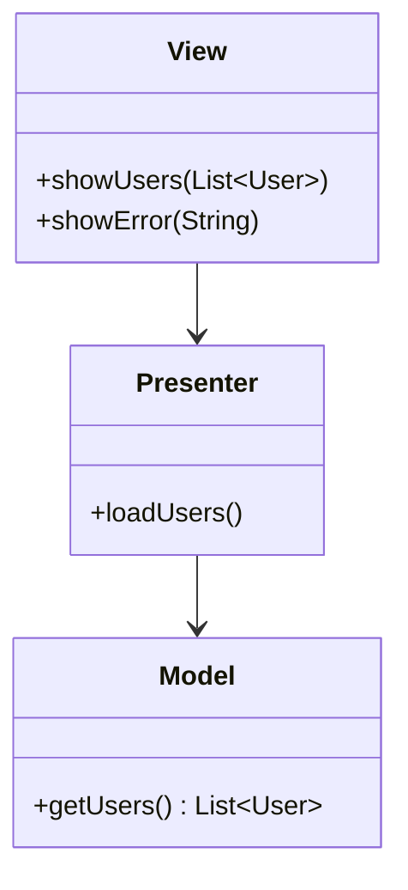
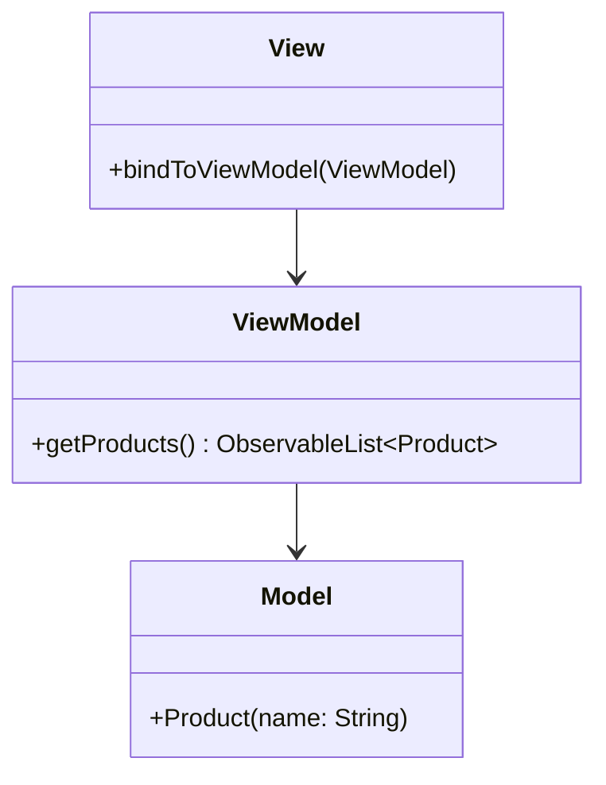

## 7.4.3 Use Cases and Examples

In the realm of software architecture, the Model-View-Presenter (MVP) and Model-View-ViewModel (MVVM) patterns have emerged as powerful paradigms for structuring applications, particularly in Android and rich client applications like those built with JavaFX. These patterns not only promote a clear separation of concerns but also enhance testability, maintainability, and scalability of applications. In this section, we'll delve into practical use cases and examples of these patterns, focusing on their application in Android and JavaFX environments.

### MVP in Android App Development

#### Understanding MVP

The MVP pattern is an architectural pattern that separates an application into three interconnected components:

- **Model**: Manages the data and business logic of the application.
- **View**: Displays data to the user and sends user commands to the Presenter.
- **Presenter**: Acts as an intermediary between the View and the Model, handling all the presentation logic.

This separation allows for more modular code, making it easier to test and maintain.

#### MVP in Action: Android Example

Let's consider an Android application that displays a list of users fetched from a remote server. We'll implement this using the MVP pattern.

**Step 1: Define the Model**

The Model in our application will be responsible for fetching data from the server. We'll create a `UserRepository` class that handles data retrieval.

```java
public class UserRepository {
    public List<User> getUsers() {
        // Simulate fetching users from a remote server
        return Arrays.asList(new User("Alice"), new User("Bob"), new User("Charlie"));
    }
}
```

**Step 2: Define the View Interface**

The View interface will define the methods that the Presenter will call to update the UI.

```java
public interface UserView {
    void showUsers(List<User> users);
    void showError(String message);
}
```

**Step 3: Implement the Presenter**

The Presenter will interact with the Model to fetch data and update the View.

```java
public class UserPresenter {
    private UserView view;
    private UserRepository repository;

    public UserPresenter(UserView view, UserRepository repository) {
        this.view = view;
        this.repository = repository;
    }

    public void loadUsers() {
        try {
            List<User> users = repository.getUsers();
            view.showUsers(users);
        } catch (Exception e) {
            view.showError("Failed to load users");
        }
    }
}
```

**Step 4: Implement the View**

Finally, we'll implement the View in an Android Activity.

```java
public class UserActivity extends AppCompatActivity implements UserView {
    private UserPresenter presenter;

    @Override
    protected void onCreate(Bundle savedInstanceState) {
        super.onCreate(savedInstanceState);
        setContentView(R.layout.activity_user);

        UserRepository repository = new UserRepository();
        presenter = new UserPresenter(this, repository);
        presenter.loadUsers();
    }

    @Override
    public void showUsers(List<User> users) {
        // Update UI with user data
    }

    @Override
    public void showError(String message) {
        Toast.makeText(this, message, Toast.LENGTH_SHORT).show();
    }
}
```

#### Benefits of MVP in Android

- **Testability**: The separation of concerns allows for unit testing of the Presenter without the need for Android framework dependencies.
- **Maintainability**: Changes to the UI or business logic can be made independently, reducing the risk of introducing bugs.
- **Scalability**: As the application grows, new features can be added without affecting existing code.

#### Lessons Learned

- **Decoupling**: MVP enforces a strict separation between UI and business logic, which can initially seem cumbersome but pays off in the long run.
- **Communication**: Clear interfaces between components are crucial for maintaining the separation of concerns.

### MVVM in JavaFX Applications

#### Understanding MVVM

The MVVM pattern is similar to MVP but introduces a ViewModel component that handles the presentation logic and data binding. This pattern is particularly useful in environments that support data binding, such as JavaFX.

- **Model**: Represents the data and business logic.
- **View**: Defines the UI and binds to properties exposed by the ViewModel.
- **ViewModel**: Exposes data and commands to the View, often using observable properties.

#### MVVM in Action: JavaFX Example

Let's create a simple JavaFX application that displays a list of products. We'll implement this using the MVVM pattern.

**Step 1: Define the Model**

The Model will represent the product data.

```java
public class Product {
    private StringProperty name = new SimpleStringProperty();

    public Product(String name) {
        this.name.set(name);
    }

    public StringProperty nameProperty() {
        return name;
    }
}
```

**Step 2: Define the ViewModel**

The ViewModel will expose the product data to the View.

```java
public class ProductViewModel {
    private ObservableList<Product> products = FXCollections.observableArrayList();

    public ProductViewModel() {
        products.addAll(new Product("Laptop"), new Product("Smartphone"), new Product("Tablet"));
    }

    public ObservableList<Product> getProducts() {
        return products;
    }
}
```

**Step 3: Implement the View**

The View will bind to the properties exposed by the ViewModel.

```java
public class ProductView extends Application {
    @Override
    public void start(Stage primaryStage) {
        ProductViewModel viewModel = new ProductViewModel();

        ListView<Product> listView = new ListView<>(viewModel.getProducts());
        listView.setCellFactory(param -> new ListCell<>() {
            @Override
            protected void updateItem(Product product, boolean empty) {
                super.updateItem(product, empty);
                if (empty || product == null) {
                    setText(null);
                } else {
                    setText(product.nameProperty().get());
                }
            }
        });

        Scene scene = new Scene(new VBox(listView), 300, 250);
        primaryStage.setScene(scene);
        primaryStage.show();
    }

    public static void main(String[] args) {
        launch(args);
    }
}
```

#### Benefits of MVVM in JavaFX

- **Data Binding**: JavaFX's support for data binding allows for automatic UI updates when the underlying data changes.
- **Separation of Concerns**: Like MVP, MVVM separates the UI from the business logic, enhancing maintainability.
- **Testability**: The ViewModel can be tested independently of the UI, ensuring that business logic is correct.

#### Lessons Learned

- **Data Binding**: Leveraging JavaFX's data binding capabilities can significantly reduce boilerplate code and improve responsiveness.
- **ViewModel Design**: Designing a ViewModel that effectively exposes data and commands is crucial for a successful MVVM implementation.

### Case Studies and Real-World Applications

#### Case Study 1: Android MVP in a Weather App

In a weather application, the MVP pattern was used to separate the UI from the logic that fetches weather data from an API. The Presenter handled API calls and parsed the response, while the View displayed the weather information. This separation allowed for easy testing of the Presenter and quick UI updates without affecting the data-fetching logic.

#### Case Study 2: JavaFX MVVM in a Financial Dashboard

A financial dashboard application used MVVM to manage complex data visualizations. The ViewModel exposed observable properties representing financial metrics, which were bound to various charts and tables in the View. This setup allowed for real-time updates as new data arrived, providing users with an interactive and responsive experience.

### Recommendations for Developers

- **Start Small**: When adopting MVP or MVVM, begin with a small feature or module to understand the pattern's nuances.
- **Leverage Frameworks**: Use libraries and frameworks that support these patterns, such as Android Architecture Components for MVP or JavaFX's data binding for MVVM.
- **Focus on Testability**: Design your Presenters and ViewModels with testability in mind, ensuring that business logic can be verified independently of the UI.
- **Iterate and Refine**: Continuously evaluate and refine your implementation as your application grows, adapting the pattern to fit your needs.

### Try It Yourself

To deepen your understanding of MVP and MVVM, try modifying the examples provided:

- **For MVP**: Add functionality to the Android example to allow users to add new users to the list. Implement this in the Presenter and update the View accordingly.
- **For MVVM**: Extend the JavaFX example to include a search feature that filters the list of products based on user input. Implement this in the ViewModel and bind the search input to the filter logic.

### Visualizing MVP and MVVM

To further illustrate the structure of MVP and MVVM, let's visualize these patterns using Mermaid.js diagrams.

#### MVP Structure



#### MVVM Structure



These diagrams highlight the relationships between components in each pattern, emphasizing the separation of concerns and the flow of data.

### Conclusion

The MVP and MVVM patterns offer robust solutions for structuring applications, particularly in environments like Android and JavaFX. By separating concerns and leveraging data binding, these patterns enhance testability, maintainability, and scalability. As you continue to explore these patterns, remember to adapt them to fit the unique needs of your projects, and don't hesitate to experiment and iterate on your implementations.

## Quiz Time!



### What is the primary role of the Presenter in the MVP pattern?

- [x] To act as an intermediary between the View and the Model
- [ ] To manage the application's data and business logic
- [ ] To display data to the user
- [ ] To handle user inputs and update the UI

> **Explanation:** The Presenter in the MVP pattern acts as an intermediary between the View and the Model, handling presentation logic and updating the View with data from the Model.

### In the MVVM pattern, what is the main advantage of using data binding?

- [x] Automatic UI updates when the underlying data changes
- [ ] Simplified business logic management
- [ ] Reduced need for a ViewModel
- [ ] Easier integration with third-party libraries

> **Explanation:** Data binding in MVVM allows for automatic UI updates when the underlying data changes, reducing boilerplate code and improving responsiveness.

### Which component in the MVVM pattern exposes data and commands to the View?

- [ ] Model
- [x] ViewModel
- [ ] View
- [ ] Presenter

> **Explanation:** The ViewModel in the MVVM pattern exposes data and commands to the View, allowing the View to bind to these properties.

### What is a key benefit of using the MVP pattern in Android development?

- [x] Enhanced testability of the Presenter without Android dependencies
- [ ] Simplified UI design
- [ ] Direct communication between Model and View
- [ ] Reduced need for data validation

> **Explanation:** MVP enhances testability by allowing the Presenter to be tested independently of Android framework dependencies.

### How does the MVVM pattern improve maintainability in JavaFX applications?

- [x] By separating the UI from business logic and using data binding
- [ ] By reducing the number of components needed
- [ ] By allowing direct manipulation of the Model by the View
- [ ] By simplifying the View's responsibilities

> **Explanation:** MVVM improves maintainability by separating the UI from business logic and leveraging data binding to keep the View updated.

### In the MVP pattern, which component is responsible for fetching data from a server?

- [ ] View
- [x] Model
- [ ] Presenter
- [ ] ViewModel

> **Explanation:** The Model in the MVP pattern is responsible for managing data and business logic, including fetching data from a server.

### What is a common use case for the MVVM pattern in JavaFX applications?

- [x] Managing complex data visualizations with real-time updates
- [ ] Simplifying network communication
- [ ] Directly manipulating UI components
- [ ] Handling low-level system operations

> **Explanation:** MVVM is commonly used in JavaFX applications to manage complex data visualizations with real-time updates through data binding.

### How can developers ensure testability in MVP and MVVM patterns?

- [x] By designing Presenters and ViewModels to be independent of the UI
- [ ] By minimizing the use of interfaces
- [ ] By integrating directly with the database
- [ ] By avoiding the use of data binding

> **Explanation:** Ensuring testability involves designing Presenters and ViewModels to be independent of the UI, allowing for isolated testing of business logic.

### Which pattern is particularly useful in environments that support data binding?

- [ ] MVP
- [x] MVVM
- [ ] MVC
- [ ] Singleton

> **Explanation:** MVVM is particularly useful in environments that support data binding, such as JavaFX, as it allows for automatic UI updates.

### True or False: In the MVP pattern, the View directly interacts with the Model.

- [ ] True
- [x] False

> **Explanation:** In the MVP pattern, the View does not directly interact with the Model. Instead, it communicates with the Presenter, which interacts with the Model.




