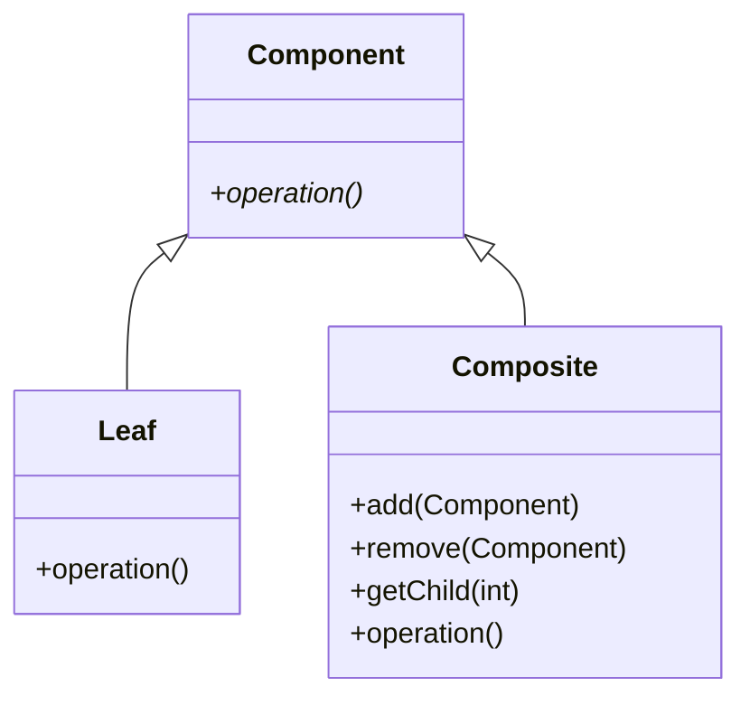

## 7.4.3 Managing Hierarchical Structures

### Introduction

In the realm of software design, managing hierarchical structures is a common challenge that developers face, especially when dealing with complex systems such as organizational charts, file systems, or UI components. The Composite pattern, a structural design pattern, provides a robust solution for handling such hierarchies by allowing individual objects and compositions of objects to be treated uniformly. This section delves into the intricacies of managing hierarchical structures using the Composite pattern in Java, offering insights into methods for adding, removing, and accessing child components, handling parent references, and traversing these structures efficiently.

### Understanding the Composite Pattern

#### Intent

The Composite pattern's primary intent is to "compose" objects into tree structures to represent part-whole hierarchies. It allows clients to treat individual objects and compositions of objects uniformly, simplifying client code and making it easier to manage complex hierarchies.

#### Structure



*Diagram: The Composite pattern structure, showing the Component interface, Leaf, and Composite classes.*

### Managing Hierarchical Structures

#### Adding, Removing, and Accessing Child Components

In a Composite pattern, managing child components involves implementing methods for adding, removing, and accessing these components. The `Composite` class typically maintains a collection of child components and provides methods to manipulate this collection.

```java
import java.util.ArrayList;
import java.util.List;

// Component interface
interface Component {
    void operation();
}

// Leaf class
class Leaf implements Component {
    @Override
    public void operation() {
        System.out.println("Leaf operation");
    }
}

// Composite class
class Composite implements Component {
    private List<Component> children = new ArrayList<>();

    public void add(Component component) {
        children.add(component);
    }

    public void remove(Component component) {
        children.remove(component);
    }

    public Component getChild(int index) {
        return children.get(index);
    }

    @Override
    public void operation() {
        for (Component child : children) {
            child.operation();
        }
    }
}
```

*Code Example: Basic implementation of the Composite pattern in Java.*

**Explanation**: In this example, the `Composite` class maintains a list of `Component` objects. The `add`, `remove`, and `getChild` methods allow manipulation of this list, while the `operation` method iterates over the children and calls their `operation` methods.

#### Design Considerations

##### Handling Parent References

When managing hierarchical structures, it is often necessary to maintain references to parent components. This can be useful for operations that require traversing up the hierarchy or for maintaining consistency across the structure.

```java
// Extended Component interface with parent reference
interface Component {
    void operation();
    void setParent(Component parent);
    Component getParent();
}

// Extended Composite class with parent handling
class Composite implements Component {
    private List<Component> children = new ArrayList<>();
    private Component parent;

    public void setParent(Component parent) {
        this.parent = parent;
    }

    public Component getParent() {
        return parent;
    }

    public void add(Component component) {
        children.add(component);
        component.setParent(this);
    }

    public void remove(Component component) {
        children.remove(component);
        component.setParent(null);
    }

    public Component getChild(int index) {
        return children.get(index);
    }

    @Override
    public void operation() {
        for (Component child : children) {
            child.operation();
        }
    }
}
```

*Code Example: Managing parent references in a Composite structure.*

**Explanation**: The `Component` interface now includes methods for setting and getting a parent reference. The `Composite` class updates these references when adding or removing child components.

##### Traversal Techniques

Traversing a hierarchical structure efficiently is crucial for operations such as searching, updating, or rendering. Common traversal techniques include depth-first and breadth-first traversal.

```java
// Depth-first traversal
public void depthFirstTraversal(Component component) {
    component.operation();
    if (component instanceof Composite) {
        Composite composite = (Composite) component;
        for (Component child : composite.children) {
            depthFirstTraversal(child);
        }
    }
}

// Breadth-first traversal
public void breadthFirstTraversal(Component root) {
    Queue<Component> queue = new LinkedList<>();
    queue.add(root);
    while (!queue.isEmpty()) {
        Component component = queue.poll();
        component.operation();
        if (component instanceof Composite) {
            Composite composite = (Composite) component;
            queue.addAll(composite.children);
        }
    }
}
```

*Code Example: Implementing depth-first and breadth-first traversal in a Composite structure.*

**Explanation**: The `depthFirstTraversal` method recursively visits each node, while the `breadthFirstTraversal` method uses a queue to visit nodes level by level.

### Practical Applications

#### Organizational Structures

In an organizational structure, each employee can be represented as a `Leaf`, while departments or teams can be represented as `Composite` objects. This allows for operations such as calculating total salaries or generating reports to be performed uniformly across the hierarchy.

```java
// Employee class as a Leaf
class Employee implements Component {
    private String name;
    private double salary;

    public Employee(String name, double salary) {
        this.name = name;
        this.salary = salary;
    }

    @Override
    public void operation() {
        System.out.println("Employee: " + name + ", Salary: " + salary);
    }
}

// Department class as a Composite
class Department extends Composite {
    private String name;

    public Department(String name) {
        this.name = name;
    }

    @Override
    public void operation() {
        System.out.println("Department: " + name);
        super.operation();
    }
}
```

*Code Example: Representing an organizational structure using the Composite pattern.*

**Explanation**: The `Employee` class represents individual employees, while the `Department` class represents groups of employees, allowing for hierarchical operations.

#### File Directories

File systems are another common example of hierarchical structures. Files can be represented as `Leaf` objects, while directories can be `Composite` objects containing files and other directories.

```java
// File class as a Leaf
class File implements Component {
    private String name;

    public File(String name) {
        this.name = name;
    }

    @Override
    public void operation() {
        System.out.println("File: " + name);
    }
}

// Directory class as a Composite
class Directory extends Composite {
    private String name;

    public Directory(String name) {
        this.name = name;
    }

    @Override
    public void operation() {
        System.out.println("Directory: " + name);
        super.operation();
    }
}
```

*Code Example: Representing a file directory structure using the Composite pattern.*

**Explanation**: The `File` class represents individual files, while the `Directory` class represents folders that can contain files and other directories.

### Performance and Resource Management

When managing hierarchical structures, performance and resource management are critical considerations. The Composite pattern can introduce overhead due to the recursive nature of operations and the need to maintain references between components.

#### Performance Considerations

- **Lazy Loading**: Consider using lazy loading techniques to defer the creation or loading of child components until they are needed, reducing initial load times and memory usage.
- **Caching**: Implement caching strategies to store results of expensive operations, such as calculating aggregate values, to avoid redundant computations.

#### Resource Management

- **Memory Management**: Be mindful of memory usage, especially in large hierarchies. Use weak references or other memory management techniques to prevent memory leaks.
- **Concurrency**: Ensure thread safety when accessing or modifying the hierarchy, particularly in multi-threaded environments. Use synchronization or concurrent data structures as needed.

### Conclusion

The Composite pattern is a powerful tool for managing hierarchical structures in Java, providing a unified interface for handling individual and composite objects. By understanding and implementing techniques for adding, removing, and accessing child components, handling parent references, and traversing hierarchies, developers can create robust and efficient systems. Whether dealing with organizational structures, file directories, or other complex hierarchies, the Composite pattern offers a flexible and scalable solution.

### Key Takeaways

- The Composite pattern simplifies the management of hierarchical structures by treating individual and composite objects uniformly.
- Implement methods for adding, removing, and accessing child components to manage hierarchies effectively.
- Consider design aspects such as parent references and traversal techniques to enhance functionality and performance.
- Apply the Composite pattern to real-world scenarios like organizational structures and file directories for practical benefits.
- Address performance and resource management considerations to optimize system efficiency.

### Encouragement for Further Exploration

Consider how the Composite pattern can be applied to other hierarchical structures in your projects. Experiment with different traversal techniques and performance optimizations to tailor the pattern to your specific needs.

### Quiz: Test Your Knowledge on Managing Hierarchical Structures with the Composite Pattern



### What is the primary intent of the Composite pattern?

- [x] To compose objects into tree structures to represent part-whole hierarchies.
- [ ] To separate the construction of a complex object from its representation.
- [ ] To define a family of algorithms and make them interchangeable.
- [ ] To provide a way to access the elements of an aggregate object sequentially.

> **Explanation:** The Composite pattern's primary intent is to compose objects into tree structures to represent part-whole hierarchies, allowing clients to treat individual objects and compositions of objects uniformly.

### Which method is typically used to add a child component in a Composite pattern?

- [x] add(Component component)
- [ ] remove(Component component)
- [ ] getChild(int index)
- [ ] operation()

> **Explanation:** The `add(Component component)` method is used to add a child component to a composite object in the Composite pattern.

### How can parent references be managed in a Composite structure?

- [x] By implementing setParent and getParent methods in the Component interface.
- [ ] By using a static variable to store the parent reference.
- [ ] By creating a separate ParentManager class.
- [ ] By using reflection to access parent fields.

> **Explanation:** Parent references can be managed by implementing `setParent` and `getParent` methods in the `Component` interface, allowing components to maintain references to their parents.

### What is a common use case for the Composite pattern?

- [x] File directories
- [ ] Singleton objects
- [ ] Database connections
- [ ] Network protocols

> **Explanation:** File directories are a common use case for the Composite pattern, where files are represented as leaves and directories as composites.

### Which traversal technique uses a queue to visit nodes level by level?

- [x] Breadth-first traversal
- [ ] Depth-first traversal
- [ ] Pre-order traversal
- [ ] Post-order traversal

> **Explanation:** Breadth-first traversal uses a queue to visit nodes level by level, starting from the root and moving horizontally across the hierarchy.

### What is a potential drawback of the Composite pattern?

- [x] It can introduce overhead due to recursive operations.
- [ ] It cannot handle dynamic hierarchies.
- [ ] It requires a fixed number of child components.
- [ ] It is not compatible with object-oriented programming.

> **Explanation:** The Composite pattern can introduce overhead due to the recursive nature of operations, especially in large hierarchies.

### How can memory usage be optimized in a Composite structure?

- [x] By using weak references or other memory management techniques.
- [ ] By increasing the heap size.
- [ ] By using static variables for all components.
- [ ] By avoiding the use of interfaces.

> **Explanation:** Memory usage can be optimized by using weak references or other memory management techniques to prevent memory leaks in a Composite structure.

### What is the benefit of using lazy loading in a Composite pattern?

- [x] It reduces initial load times and memory usage.
- [ ] It increases the speed of recursive operations.
- [ ] It simplifies the implementation of the pattern.
- [ ] It ensures thread safety in multi-threaded environments.

> **Explanation:** Lazy loading reduces initial load times and memory usage by deferring the creation or loading of child components until they are needed.

### Which of the following is NOT a component of the Composite pattern?

- [x] Singleton
- [ ] Leaf
- [ ] Composite
- [ ] Component

> **Explanation:** The Singleton is not a component of the Composite pattern. The pattern consists of `Leaf`, `Composite`, and `Component`.

### True or False: The Composite pattern allows clients to treat individual objects and compositions of objects uniformly.

- [x] True
- [ ] False

> **Explanation:** True. The Composite pattern allows clients to treat individual objects and compositions of objects uniformly, simplifying client code and management of hierarchies.



By mastering the Composite pattern and its application to hierarchical structures, developers can enhance their ability to design and implement complex systems efficiently and effectively.
