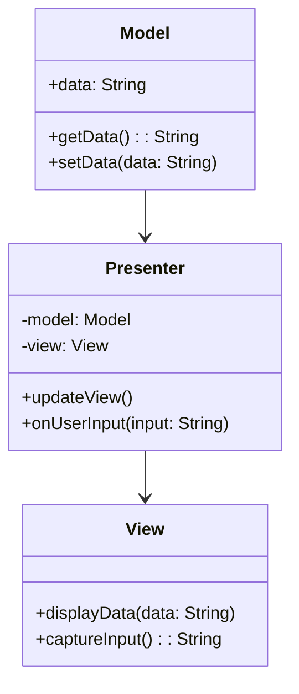
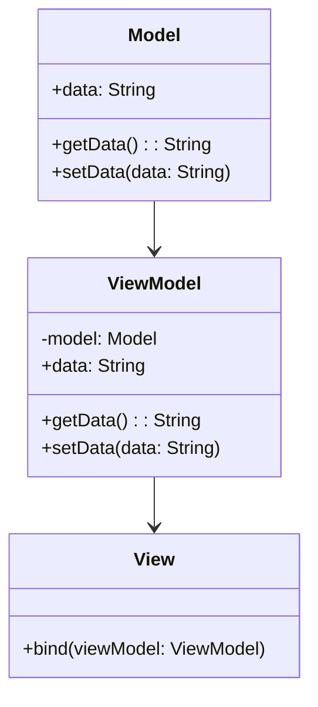

## 7.4 Model-View-Presenter (MVP) and MVVM Patterns

In the realm of software architecture, the Model-View-Presenter (MVP) and Model-View-ViewModel (MVVM) patterns are two powerful design paradigms that extend the traditional Model-View-Controller (MVC) pattern. They are particularly useful in scenarios where the separation of concerns and testability are paramount. In this section, we will delve into the intricacies of MVP and MVVM, explore their differences from MVC, and discuss their respective advantages and challenges.

### Introduction to MVP and MVVM

#### Model-View-Presenter (MVP)

The MVP pattern is a derivative of the MVC pattern that focuses on improving the separation of concerns by introducing a Presenter component. In MVP, the Presenter acts as an intermediary between the View and the Model, handling all the presentation logic. This separation allows for more testable and maintainable code, as the Presenter can be tested independently of the View.

**Key Components of MVP:**

- **Model**: Represents the data and business logic of the application. It is responsible for retrieving, storing, and processing data.
- **View**: Displays the data to the user and captures user interactions. It is typically a UI component.
- **Presenter**: Acts as a mediator between the Model and the View. It retrieves data from the Model and formats it for display in the View. It also handles user input and updates the Model accordingly.

#### Model-View-ViewModel (MVVM)

The MVVM pattern is another evolution of MVC, primarily used in applications with rich user interfaces. It introduces the ViewModel as an abstraction of the View, which facilitates data binding and separation of UI logic from business logic. MVVM is particularly popular in frameworks that support data binding, such as JavaFX.

**Key Components of MVVM:**

- **Model**: Similar to MVP, it represents the data and business logic.
- **View**: The UI component that displays data and captures user interactions.
- **ViewModel**: An abstraction of the View that exposes data and commands to the View. It handles the presentation logic and facilitates data binding between the Model and the View.

### Differences Between MVP, MVVM, and MVC

While MVP and MVVM are both derivatives of MVC, they offer distinct advantages and cater to different application needs.

#### MVP vs. MVC

- **Separation of Concerns**: MVP provides a clearer separation of concerns by isolating the presentation logic in the Presenter, whereas MVC often results in the View and Controller being tightly coupled.
- **Testability**: MVP enhances testability as the Presenter can be tested independently of the View, unlike MVC where the Controller often requires the View for testing.
- **Complexity**: MVP can introduce additional complexity due to the need for a Presenter, but this is often outweighed by the benefits of improved testability and maintainability.

#### MVVM vs. MVC

- **Data Binding**: MVVM excels in scenarios where data binding is supported, allowing for automatic synchronization between the View and the ViewModel. MVC does not inherently support data binding.
- **View Logic**: MVVM abstracts the View logic into the ViewModel, reducing the complexity of the View and enhancing testability.
- **Framework Support**: MVVM is particularly suited for frameworks that support data binding, such as JavaFX, whereas MVC is more generic and can be used in a variety of contexts.

#### MVP vs. MVVM

- **Data Binding**: MVVM leverages data binding to synchronize the View and ViewModel, whereas MVP relies on manual updates between the View and Presenter.
- **Complexity**: MVVM can be more complex to implement due to the need for data binding infrastructure, but it offers a more streamlined approach to UI updates.
- **Use Cases**: MVP is often preferred in scenarios where data binding is not available or necessary, while MVVM is ideal for applications with complex UI interactions.

### Benefits and Challenges of MVP and MVVM

#### Benefits of MVP

- **Improved Testability**: By isolating the presentation logic in the Presenter, MVP enhances the testability of the application.
- **Clear Separation of Concerns**: MVP provides a clear separation between the UI and business logic, making the codebase more maintainable.
- **Flexibility**: The Presenter can be reused across different Views, promoting code reuse.

#### Challenges of MVP

- **Increased Complexity**: Introducing a Presenter adds complexity to the architecture, which can be challenging to manage in large applications.
- **Boilerplate Code**: MVP often requires additional boilerplate code to manage the interactions between the View and Presenter.

#### Benefits of MVVM

- **Data Binding**: MVVM leverages data binding to automatically synchronize the View and ViewModel, reducing the need for manual updates.
- **Enhanced Testability**: The ViewModel can be tested independently of the View, improving the testability of the application.
- **Separation of UI Logic**: MVVM abstracts the UI logic into the ViewModel, simplifying the View and enhancing maintainability.

#### Challenges of MVVM

- **Data Binding Complexity**: Implementing data binding can be complex and may require additional infrastructure.
- **Learning Curve**: MVVM introduces new concepts such as data binding and ViewModel, which can have a steep learning curve for developers unfamiliar with the pattern.

### Diagrams Illustrating MVP and MVVM

To better understand the structure of MVP and MVVM, let's visualize these patterns using diagrams.

#### MVP Structure



**Diagram Description**: The MVP structure consists of three main components: Model, View, and Presenter. The Presenter interacts with both the Model and the View, serving as a mediator that updates the View based on changes in the Model and vice versa.

#### MVVM Structure



**Diagram Description**: The MVVM structure introduces the ViewModel, which acts as an abstraction of the View. The ViewModel binds to the View, facilitating automatic synchronization of data between the Model and the View.

### Implementing MVP in Java

Let's explore how to implement the MVP pattern in Java with a simple example. We'll create a basic application that displays and updates a user's profile information.

#### Step 1: Define the Model

The Model represents the data and business logic of the application. In this example, we'll create a `UserProfile` class.

```java
public class UserProfile {
    private String name;
    private String email;

    public UserProfile(String name, String email) {
        this.name = name;
        this.email = email;
    }

    public String getName() {
        return name;
    }

    public void setName(String name) {
        this.name = name;
    }

    public String getEmail() {
        return email;
    }

    public void setEmail(String email) {
        this.email = email;
    }
}
```

#### Step 2: Define the View Interface

The View interface defines the methods that the Presenter will use to interact with the View. In this example, we'll create a `UserProfileView` interface.

```java
public interface UserProfileView {
    void displayUserProfile(String name, String email);
    String getUserInput();
}
```

#### Step 3: Implement the Presenter

The Presenter handles the presentation logic and mediates between the Model and the View. In this example, we'll create a `UserProfilePresenter` class.

```java
public class UserProfilePresenter {
    private UserProfile model;
    private UserProfileView view;

    public UserProfilePresenter(UserProfile model, UserProfileView view) {
        this.model = model;
        this.view = view;
    }

    public void updateView() {
        view.displayUserProfile(model.getName(), model.getEmail());
    }

    public void onUserInput(String name, String email) {
        model.setName(name);
        model.setEmail(email);
        updateView();
    }
}
```

#### Step 4: Implement the View

The View displays the data and captures user interactions. In this example, we'll create a simple console-based implementation of the `UserProfileView`.

```java
import java.util.Scanner;

public class ConsoleUserProfileView implements UserProfileView {
    private Scanner scanner = new Scanner(System.in);

    @Override
    public void displayUserProfile(String name, String email) {
        System.out.println("User Profile:");
        System.out.println("Name: " + name);
        System.out.println("Email: " + email);
    }

    @Override
    public String getUserInput() {
        System.out.print("Enter new name: ");
        String name = scanner.nextLine();
        System.out.print("Enter new email: ");
        String email = scanner.nextLine();
        return name + "," + email;
    }
}
```

#### Step 5: Putting It All Together

Finally, we'll create a main class to tie everything together and demonstrate the MVP pattern in action.

```java
public class Main {
    public static void main(String[] args) {
        UserProfile model = new UserProfile("John Doe", "john.doe@example.com");
        UserProfileView view = new ConsoleUserProfileView();
        UserProfilePresenter presenter = new UserProfilePresenter(model, view);

        presenter.updateView();

        String[] input = view.getUserInput().split(",");
        presenter.onUserInput(input[0], input[1]);
    }
}
```

### Implementing MVVM in Java

Now, let's explore how to implement the MVVM pattern in Java using a simple example. We'll create an application that displays and updates a product's details.

#### Step 1: Define the Model

The Model represents the data and business logic. In this example, we'll create a `Product` class.

```java
public class Product {
    private String name;
    private double price;

    public Product(String name, double price) {
        this.name = name;
        this.price = price;
    }

    public String getName() {
        return name;
    }

    public void setName(String name) {
        this.name = name;
    }

    public double getPrice() {
        return price;
    }

    public void setPrice(double price) {
        this.price = price;
    }
}
```

#### Step 2: Define the ViewModel

The ViewModel acts as an abstraction of the View, exposing data and commands. In this example, we'll create a `ProductViewModel` class.

```java
public class ProductViewModel {
    private Product model;

    public ProductViewModel(Product model) {
        this.model = model;
    }

    public String getName() {
        return model.getName();
    }

    public void setName(String name) {
        model.setName(name);
    }

    public double getPrice() {
        return model.getPrice();
    }

    public void setPrice(double price) {
        model.setPrice(price);
    }
}
```

#### Step 3: Implement the View

The View displays the data and captures user interactions. In this example, we'll create a simple console-based implementation.

```java
import java.util.Scanner;

public class ConsoleProductView {
    private ProductViewModel viewModel;
    private Scanner scanner = new Scanner(System.in);

    public ConsoleProductView(ProductViewModel viewModel) {
        this.viewModel = viewModel;
    }

    public void displayProductDetails() {
        System.out.println("Product Details:");
        System.out.println("Name: " + viewModel.getName());
        System.out.println("Price: $" + viewModel.getPrice());
    }

    public void updateProductDetails() {
        System.out.print("Enter new name: ");
        String name = scanner.nextLine();
        System.out.print("Enter new price: ");
        double price = scanner.nextDouble();
        viewModel.setName(name);
        viewModel.setPrice(price);
    }
}
```

#### Step 4: Putting It All Together

Finally, we'll create a main class to demonstrate the MVVM pattern in action.

```java
public class Main {
    public static void main(String[] args) {
        Product model = new Product("Laptop", 999.99);
        ProductViewModel viewModel = new ProductViewModel(model);
        ConsoleProductView view = new ConsoleProductView(viewModel);

        view.displayProductDetails();
        view.updateProductDetails();
        view.displayProductDetails();
    }
}
```

### Try It Yourself

Now that we've explored the MVP and MVVM patterns, it's time to experiment with the code examples. Try modifying the code to add new features or change the behavior. For example, you could:

- Add validation logic to the Presenter or ViewModel to ensure that user input is valid.
- Implement a graphical user interface (GUI) for the View using JavaFX or Swing.
- Extend the Model to include additional fields and update the View and Presenter/ViewModel accordingly.

### Knowledge Check

Before we wrap up, let's review some key concepts:

- **MVP and MVVM** are both variations of the MVC pattern, designed to improve separation of concerns and testability.
- **MVP** introduces a Presenter to handle presentation logic, while **MVVM** uses a ViewModel to facilitate data binding.
- **Data Binding** is a key feature of MVVM, allowing for automatic synchronization between the View and ViewModel.
- **Testability** is enhanced in both patterns, as the Presenter and ViewModel can be tested independently of the View.

### Conclusion

The MVP and MVVM patterns offer powerful solutions for designing maintainable and testable applications. By understanding the differences between these patterns and their respective benefits and challenges, you can make informed decisions about which pattern to use in your projects. Remember, the choice of pattern depends on the specific requirements of your application and the tools and frameworks available.

## Quiz Time!



### What is the primary role of the Presenter in the MVP pattern?

- [x] To mediate between the Model and the View
- [ ] To manage database connections
- [ ] To handle user authentication
- [ ] To render the user interface

> **Explanation:** The Presenter in the MVP pattern acts as a mediator between the Model and the View, handling all presentation logic.

### In the MVVM pattern, what is the primary function of the ViewModel?

- [x] To act as an abstraction of the View and facilitate data binding
- [ ] To store user credentials securely
- [ ] To handle network requests
- [ ] To manage application configuration

> **Explanation:** The ViewModel in MVVM acts as an abstraction of the View, facilitating data binding and exposing data and commands to the View.

### Which pattern is particularly well-suited for frameworks that support data binding?

- [ ] MVP
- [x] MVVM
- [ ] MVC
- [ ] Singleton

> **Explanation:** MVVM is particularly well-suited for frameworks that support data binding, allowing for automatic synchronization between the View and ViewModel.

### What is a key advantage of using MVP over MVC?

- [x] Improved testability due to the separation of presentation logic
- [ ] Reduced code complexity
- [ ] Enhanced security features
- [ ] Faster database access

> **Explanation:** MVP improves testability by isolating the presentation logic in the Presenter, allowing it to be tested independently of the View.

### What is a common challenge associated with the MVVM pattern?

- [x] Complexity of implementing data binding
- [ ] Lack of framework support
- [ ] Poor testability
- [ ] Limited scalability

> **Explanation:** A common challenge with MVVM is the complexity of implementing data binding, which may require additional infrastructure.

### In MVP, which component is responsible for displaying data to the user?

- [ ] Model
- [x] View
- [ ] Presenter
- [ ] ViewModel

> **Explanation:** In MVP, the View is responsible for displaying data to the user and capturing user interactions.

### Which pattern introduces the ViewModel component?

- [ ] MVC
- [ ] MVP
- [x] MVVM
- [ ] Singleton

> **Explanation:** The MVVM pattern introduces the ViewModel component, which acts as an abstraction of the View.

### What is a benefit of using MVVM in applications with complex UI interactions?

- [x] Enhanced separation of UI logic and business logic
- [ ] Simplified database management
- [ ] Improved network performance
- [ ] Reduced memory usage

> **Explanation:** MVVM enhances the separation of UI logic and business logic, making it ideal for applications with complex UI interactions.

### Which pattern is more suitable for applications without data binding support?

- [x] MVP
- [ ] MVVM
- [ ] MVC
- [ ] Singleton

> **Explanation:** MVP is more suitable for applications without data binding support, as it relies on manual updates between the View and Presenter.

### True or False: The ViewModel in MVVM directly updates the View.

- [ ] True
- [x] False

> **Explanation:** False. The ViewModel in MVVM does not directly update the View; instead, it exposes data and commands that the View binds to.


