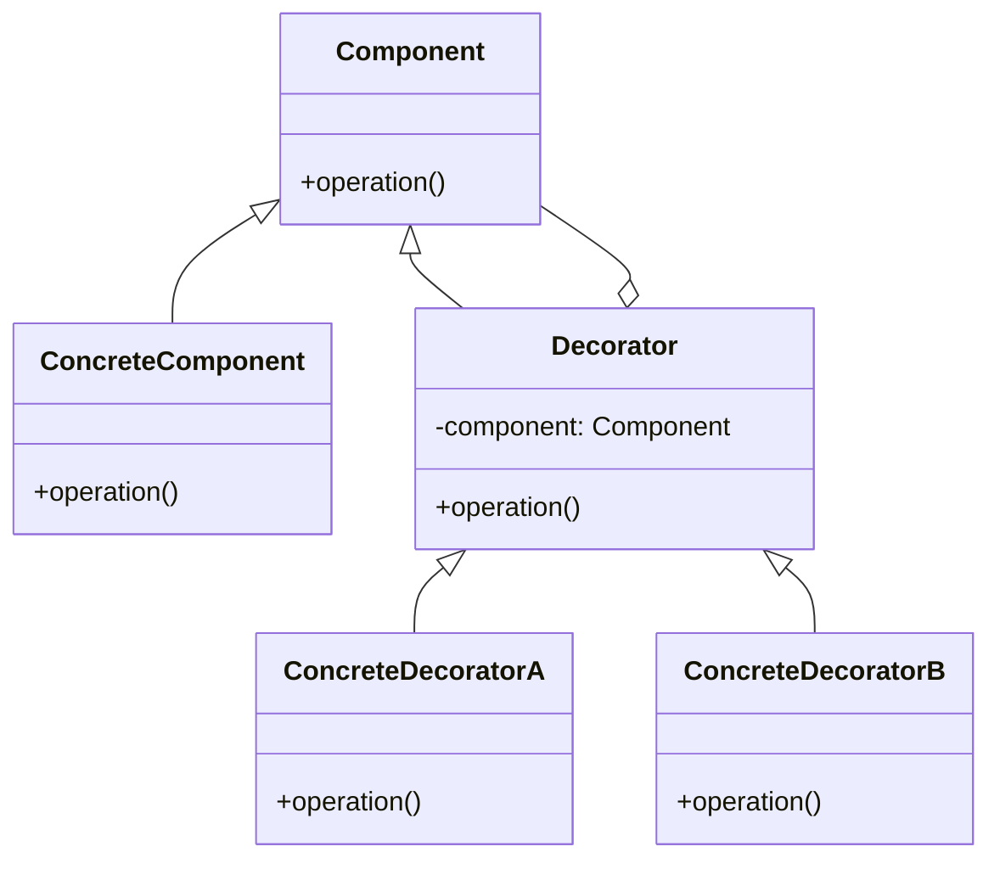

## 7.5.1 Implementing Decorator in Java

The Decorator pattern is a structural design pattern that allows behavior to be added to individual objects, either statically or dynamically, without affecting the behavior of other objects from the same class. This pattern is particularly useful when you want to add responsibilities to objects without modifying their code, adhering to the Open/Closed Principle.

### Intent

The primary intent of the Decorator pattern is to provide a flexible alternative to subclassing for extending functionality. By wrapping an object with a series of decorators, you can add new behaviors or responsibilities at runtime. This approach promotes composition over inheritance, allowing for more modular and maintainable code.

### Benefits

- **Flexibility**: Decorators can be combined in various ways to achieve different behaviors.
- **Reusability**: Common functionalities can be extracted into decorators and reused across different components.
- **Adherence to SOLID Principles**: Specifically, the Open/Closed Principle, as classes are open for extension but closed for modification.

### Components of the Decorator Pattern

The Decorator pattern consists of several key components:

1. **Component**: This is the interface or abstract class defining the operations that can be dynamically added to objects.
2. **ConcreteComponent**: This is the class that implements the Component interface. It is the object to which additional responsibilities can be attached.
3. **Decorator**: This is an abstract class that implements the Component interface and contains a reference to a Component object. It delegates operations to the component it decorates.
4. **ConcreteDecorator**: This class extends the Decorator class and adds additional responsibilities to the component.

### Class Diagram

Below is a class diagram illustrating the structure of the Decorator pattern:



**Diagram Explanation**: The `Component` interface is implemented by both `ConcreteComponent` and `Decorator`. The `Decorator` class holds a reference to a `Component` object and delegates the `operation()` method to it. `ConcreteDecoratorA` and `ConcreteDecoratorB` extend `Decorator` and add their own behavior.

### Java Code Example

Let's implement the Decorator pattern in Java to demonstrate how additional responsibilities can be dynamically added to objects.

```java
// Component interface
interface Coffee {
    String getDescription();
    double getCost();
}

// ConcreteComponent
class SimpleCoffee implements Coffee {
    @Override
    public String getDescription() {
        return "Simple Coffee";
    }

    @Override
    public double getCost() {
        return 5.0;
    }
}

// Decorator
abstract class CoffeeDecorator implements Coffee {
    protected Coffee decoratedCoffee;

    public CoffeeDecorator(Coffee coffee) {
        this.decoratedCoffee = coffee;
    }

    @Override
    public String getDescription() {
        return decoratedCoffee.getDescription();
    }

    @Override
    public double getCost() {
        return decoratedCoffee.getCost();
    }
}

// ConcreteDecoratorA
class MilkDecorator extends CoffeeDecorator {
    public MilkDecorator(Coffee coffee) {
        super(coffee);
    }

    @Override
    public String getDescription() {
        return decoratedCoffee.getDescription() + ", Milk";
    }

    @Override
    public double getCost() {
        return decoratedCoffee.getCost() + 1.5;
    }
}

// ConcreteDecoratorB
class SugarDecorator extends CoffeeDecorator {
    public SugarDecorator(Coffee coffee) {
        super(coffee);
    }

    @Override
    public String getDescription() {
        return decoratedCoffee.getDescription() + ", Sugar";
    }

    @Override
    public double getCost() {
        return decoratedCoffee.getCost() + 0.5;
    }
}

// Client code
public class CoffeeShop {
    public static void main(String[] args) {
        Coffee coffee = new SimpleCoffee();
        System.out.println(coffee.getDescription() + " $" + coffee.getCost());

        coffee = new MilkDecorator(coffee);
        System.out.println(coffee.getDescription() + " $" + coffee.getCost());

        coffee = new SugarDecorator(coffee);
        System.out.println(coffee.getDescription() + " $" + coffee.getCost());
    }
}
```

**Explanation**: In this example, `SimpleCoffee` is the `ConcreteComponent`, and `MilkDecorator` and `SugarDecorator` are `ConcreteDecorators` that add milk and sugar to the coffee, respectively. The `CoffeeDecorator` class is the `Decorator` that holds a reference to a `Coffee` object and delegates the `getDescription()` and `getCost()` methods to it.

### Wrapping Components with Decorators

To dynamically add behaviors, wrap the `ConcreteComponent` with one or more `ConcreteDecorators`. Each decorator adds its own behavior before or after delegating the call to the component it decorates. This allows for incremental addition of responsibilities.

### Transparency to the Client

The Decorator pattern ensures that the client code remains unaware of the added responsibilities. The client interacts with the `Component` interface, and the decorators seamlessly add behavior without altering the interface. This transparency is crucial for maintaining a clean and understandable codebase.

### Practical Applications

The Decorator pattern is widely used in GUI toolkits to add functionalities like borders, scroll bars, and shadows to windows or components. It is also used in I/O streams in Java, where different streams can be wrapped to add functionalities like buffering, compression, or encryption.

### Best Practices

- **Use Decorators for Optional Features**: When features are optional and can be combined in various ways, decorators provide a clean solution.
- **Avoid Overuse**: Excessive use of decorators can lead to complex and hard-to-understand code. Use them judiciously.
- **Ensure Interface Consistency**: All decorators should adhere to the component interface to ensure transparency.

### Common Pitfalls

- **Complexity**: Over-decorating can lead to a complex structure that is difficult to debug.
- **Performance Overhead**: Each layer of decoration adds a level of indirection, which can impact performance.

### Exercises

1. **Experiment with Different Decorators**: Modify the example to add more decorators, such as `VanillaDecorator` or `CaramelDecorator`.
2. **Implement a New Component**: Create a new `Component` implementation and apply existing decorators to it.
3. **Explore Java I/O Streams**: Investigate how Java's I/O streams use the Decorator pattern.

### Conclusion

The Decorator pattern is a powerful tool for adding responsibilities to objects dynamically. By understanding and implementing this pattern, developers can create flexible and maintainable systems that adhere to solid design principles.

## Test Your Knowledge: Java Decorator Pattern Quiz



### What is the primary intent of the Decorator pattern?

- [x] To add responsibilities to objects dynamically without affecting other objects.
- [ ] To create a new class hierarchy.
- [ ] To simplify object creation.
- [ ] To enforce a single responsibility principle.

> **Explanation:** The Decorator pattern allows for dynamic addition of responsibilities to objects without affecting other instances, promoting flexibility and adherence to the Open/Closed Principle.

### Which component in the Decorator pattern defines the interface for objects that can have responsibilities added to them?

- [x] Component
- [ ] ConcreteComponent
- [ ] Decorator
- [ ] ConcreteDecorator

> **Explanation:** The `Component` defines the interface for objects that can have responsibilities added to them, serving as the base for both concrete components and decorators.

### In the provided Java example, what is the role of `SimpleCoffee`?

- [x] ConcreteComponent
- [ ] Component
- [ ] Decorator
- [ ] ConcreteDecorator

> **Explanation:** `SimpleCoffee` is the `ConcreteComponent` that implements the `Component` interface and serves as the base object to which decorators can add responsibilities.

### How do decorators add new behavior to components?

- [x] By wrapping the component and adding behavior before or after delegating calls.
- [ ] By modifying the component's source code.
- [ ] By creating a new subclass of the component.
- [ ] By using reflection to alter the component's methods.

> **Explanation:** Decorators wrap the component and add behavior before or after delegating calls to the component, allowing for dynamic addition of responsibilities.

### Which of the following is a benefit of using the Decorator pattern?

- [x] Flexibility in combining behaviors
- [ ] Simplified class hierarchy
- [x] Reusability of common functionalities
- [ ] Improved performance

> **Explanation:** The Decorator pattern provides flexibility in combining behaviors and reusability of common functionalities, though it may introduce complexity and performance overhead.

### What is a common pitfall of using the Decorator pattern?

- [x] Complexity due to excessive decoration
- [ ] Inability to add new behaviors
- [ ] Lack of flexibility
- [ ] Violation of the Open/Closed Principle

> **Explanation:** Excessive decoration can lead to a complex structure that is difficult to debug, making it a common pitfall of the Decorator pattern.

### How does the Decorator pattern adhere to the Open/Closed Principle?

- [x] By allowing classes to be open for extension but closed for modification.
- [ ] By enforcing a single responsibility for each class.
- [x] By enabling dynamic addition of responsibilities without altering existing code.
- [ ] By simplifying object creation.

> **Explanation:** The Decorator pattern adheres to the Open/Closed Principle by allowing classes to be extended with new behaviors without modifying existing code, promoting flexibility and maintainability.

### In the Java example, what is the role of `MilkDecorator`?

- [x] ConcreteDecorator
- [ ] Component
- [ ] ConcreteComponent
- [ ] Decorator

> **Explanation:** `MilkDecorator` is a `ConcreteDecorator` that extends the `Decorator` class and adds additional responsibilities to the `Coffee` component.

### What is the primary advantage of using decorators over subclassing?

- [x] Dynamic addition of behaviors at runtime
- [ ] Simplified class hierarchy
- [ ] Improved performance
- [ ] Easier debugging

> **Explanation:** The primary advantage of using decorators over subclassing is the ability to dynamically add behaviors at runtime, providing greater flexibility and modularity.

### True or False: The Decorator pattern can be used to modify the interface of the component it decorates.

- [x] False
- [ ] True

> **Explanation:** The Decorator pattern does not modify the interface of the component it decorates; it adheres to the same interface, ensuring transparency to the client.



By mastering the Decorator pattern, Java developers can enhance their ability to create flexible, maintainable, and scalable software systems. This pattern is a testament to the power of composition over inheritance, offering a robust solution for dynamic behavior extension.
