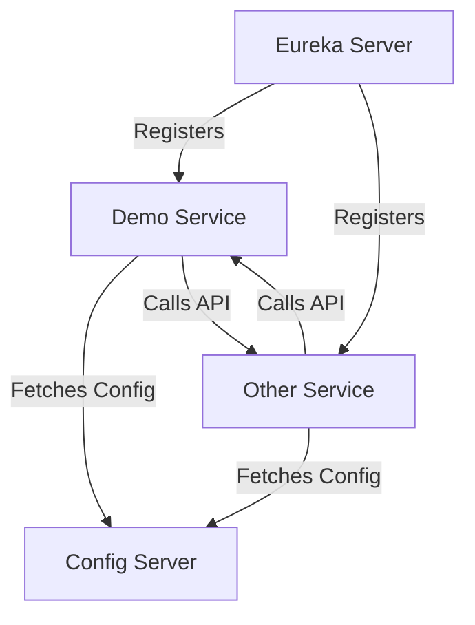

## 7.5.1 Implementing Microservices in Java

In today's rapidly evolving software landscape, microservices architecture has emerged as a powerful approach to building scalable and maintainable applications. Java, with its robust ecosystem and mature frameworks like Spring Boot and Spring Cloud, provides an excellent platform for developing microservices. In this section, we will explore how to implement microservices in Java, focusing on key concepts such as service discovery, configuration management, RESTful APIs, and inter-service communication. We'll also highlight best practices to ensure your microservices are resilient and efficient.

### Introduction to Microservices Architecture

Microservices architecture is a design pattern that structures an application as a collection of loosely coupled services. Each service is responsible for a specific business capability and can be developed, deployed, and scaled independently. This approach offers several advantages, including:

- **Scalability**: Services can be scaled independently based on demand.
- **Resilience**: Failure in one service does not affect the entire system.
- **Flexibility**: Different services can be developed using different technologies.
- **Faster Time-to-Market**: Teams can work on services concurrently, speeding up development.

### Setting Up Microservices Using Spring Boot

Spring Boot is a popular framework for building microservices in Java due to its ease of use and extensive ecosystem. It provides a range of features that simplify the development of standalone, production-grade applications.

#### Creating a Simple Microservice with Spring Boot

Let's start by creating a simple microservice using Spring Boot. We'll use Spring Initializr to bootstrap our project.

1. **Go to Spring Initializr**: Visit [start.spring.io](https://start.spring.io/).
2. **Configure the Project**:
   - Project: Maven Project
   - Language: Java
   - Spring Boot: 3.0.0 (or the latest version)
   - Group: `com.example`
   - Artifact: `demo-service`
   - Dependencies: Spring Web

3. **Generate the Project**: Click "Generate" to download the project as a ZIP file. Extract it to your preferred location.

4. **Open the Project**: Use your favorite IDE (e.g., IntelliJ IDEA, Eclipse) to open the project.

5. **Create a REST Controller**: In the `src/main/java/com/example/demoservice` directory, create a new Java class named `HelloController`.

```java
package com.example.demoservice;

import org.springframework.web.bind.annotation.GetMapping;
import org.springframework.web.bind.annotation.RestController;

@RestController
public class HelloController {

    @GetMapping("/hello")
    public String sayHello() {
        return "Hello, World!";
    }
}
```

6. **Run the Application**: Run the `DemoServiceApplication` class. Your microservice is now running and can be accessed at `http://localhost:8080/hello`.

### Service Discovery with Spring Cloud

In a microservices architecture, services need to discover and communicate with each other. Spring Cloud provides tools for service discovery, such as Netflix Eureka.

#### Setting Up Eureka Server

1. **Create a Eureka Server**: Use Spring Initializr to create a new project with the Eureka Server dependency.

2. **Add Eureka Server Dependency**: In `pom.xml`, add the following dependency:

```xml
<dependency>
    <groupId>org.springframework.cloud</groupId>
    <artifactId>spring-cloud-starter-netflix-eureka-server</artifactId>
</dependency>
```

3. **Enable Eureka Server**: In the main application class, add the `@EnableEurekaServer` annotation.

```java
package com.example.eurekaserver;

import org.springframework.boot.SpringApplication;
import org.springframework.boot.autoconfigure.SpringBootApplication;
import org.springframework.cloud.netflix.eureka.server.EnableEurekaServer;

@SpringBootApplication
@EnableEurekaServer
public class EurekaServerApplication {

    public static void main(String[] args) {
        SpringApplication.run(EurekaServerApplication.class, args);
    }
}
```

4. **Configure Eureka Server**: In `application.properties`, configure Eureka server settings.

```properties
server.port=8761
eureka.client.register-with-eureka=false
eureka.client.fetch-registry=false
```

5. **Run the Eureka Server**: Start the application. Access the Eureka dashboard at `http://localhost:8761`.

#### Registering a Service with Eureka

To register our `demo-service` with Eureka, add the Eureka Client dependency and configure it.

1. **Add Eureka Client Dependency**: In `demo-service`'s `pom.xml`, add:

```xml
<dependency>
    <groupId>org.springframework.cloud</groupId>
    <artifactId>spring-cloud-starter-netflix-eureka-client</artifactId>
</dependency>
```

2. **Configure Eureka Client**: In `application.properties`, add Eureka client settings.

```properties
spring.application.name=demo-service
eureka.client.service-url.defaultZone=http://localhost:8761/eureka/
```

3. **Run the Service**: Restart the `demo-service`. It should now be registered with Eureka and visible on the Eureka dashboard.

### Configuration Management with Spring Cloud Config

Microservices often require configuration management to handle different environments and externalize configuration properties. Spring Cloud Config provides a centralized configuration server.

#### Setting Up Spring Cloud Config Server

1. **Create a Config Server**: Use Spring Initializr to create a new project with the Config Server dependency.

2. **Add Config Server Dependency**: In `pom.xml`, add:

```xml
<dependency>
    <groupId>org.springframework.cloud</groupId>
    <artifactId>spring-cloud-config-server</artifactId>
</dependency>
```

3. **Enable Config Server**: In the main application class, add the `@EnableConfigServer` annotation.

```java
package com.example.configserver;

import org.springframework.boot.SpringApplication;
import org.springframework.boot.autoconfigure.SpringBootApplication;
import org.springframework.cloud.config.server.EnableConfigServer;

@SpringBootApplication
@EnableConfigServer
public class ConfigServerApplication {

    public static void main(String[] args) {
        SpringApplication.run(ConfigServerApplication.class, args);
    }
}
```

4. **Configure Config Server**: In `application.properties`, specify the location of the configuration files.

```properties
server.port=8888
spring.cloud.config.server.git.uri=https://github.com/your-repo/config-repo
```

5. **Run the Config Server**: Start the application. It will serve configuration files from the specified Git repository.

#### Using Spring Cloud Config Client

To use the Config Server in `demo-service`, add the Config Client dependency and configure it.

1. **Add Config Client Dependency**: In `demo-service`'s `pom.xml`, add:

```xml
<dependency>
    <groupId>org.springframework.cloud</groupId>
    <artifactId>spring-cloud-starter-config</artifactId>
</dependency>
```

2. **Configure Config Client**: In `bootstrap.properties`, specify the Config Server URL.

```properties
spring.application.name=demo-service
spring.cloud.config.uri=http://localhost:8888
```

3. **Access Configuration Properties**: Use `@Value` or `@ConfigurationProperties` to access configuration properties in your application.

```java
import org.springframework.beans.factory.annotation.Value;
import org.springframework.web.bind.annotation.GetMapping;
import org.springframework.web.bind.annotation.RestController;

@RestController
public class ConfigController {

    @Value("${example.property}")
    private String exampleProperty;

    @GetMapping("/config")
    public String getConfig() {
        return exampleProperty;
    }
}
```

### Inter-Service Communication with RESTful APIs

RESTful APIs are a common way for microservices to communicate. Spring Boot makes it easy to create RESTful services.

#### Creating RESTful APIs

1. **Define REST Endpoints**: Use `@RestController` and `@RequestMapping` annotations to define REST endpoints.

```java
@RestController
@RequestMapping("/api")
public class ApiController {

    @GetMapping("/data")
    public String getData() {
        return "Sample Data";
    }
}
```

2. **Consume REST APIs**: Use `RestTemplate` or `WebClient` to consume REST APIs from other services.

```java
import org.springframework.web.client.RestTemplate;

public class ApiService {

    private final RestTemplate restTemplate;

    public ApiService(RestTemplate restTemplate) {
        this.restTemplate = restTemplate;
    }

    public String fetchData() {
        return restTemplate.getForObject("http://other-service/api/data", String.class);
    }
}
```

#### Handling Inter-Service Communication

Spring Cloud provides tools like Feign for declarative REST client creation, simplifying inter-service communication.

1. **Add Feign Dependency**: In `pom.xml`, add:

```xml
<dependency>
    <groupId>org.springframework.cloud</groupId>
    <artifactId>spring-cloud-starter-openfeign</artifactId>
</dependency>
```

2. **Enable Feign Clients**: In the main application class, add the `@EnableFeignClients` annotation.

```java
import org.springframework.cloud.openfeign.EnableFeignClients;

@SpringBootApplication
@EnableFeignClients
public class DemoServiceApplication {
    // ...
}
```

3. **Define a Feign Client**: Create an interface with `@FeignClient` annotation.

```java
import org.springframework.cloud.openfeign.FeignClient;
import org.springframework.web.bind.annotation.GetMapping;

@FeignClient(name = "other-service")
public interface OtherServiceClient {

    @GetMapping("/api/data")
    String getData();
}
```

### Best Practices for Microservices Development in Java

1. **Design for Failure**: Implement circuit breakers using Spring Cloud Circuit Breaker to handle failures gracefully.
2. **Centralized Logging and Monitoring**: Use tools like ELK Stack or Prometheus and Grafana for monitoring and logging.
3. **Security**: Secure your microservices with Spring Security and OAuth2.
4. **Versioning**: Implement API versioning to manage changes without breaking clients.
5. **Testing**: Use unit tests, integration tests, and contract tests to ensure reliability.
6. **Continuous Integration and Deployment (CI/CD)**: Automate your build and deployment process using tools like Jenkins or GitLab CI/CD.

### Visualizing Microservices Architecture

To better understand the microservices architecture, let's visualize the components and their interactions using a Mermaid.js diagram.



**Diagram Description**: This diagram illustrates the interaction between microservices components. The `Demo Service` and `Other Service` register with the `Eureka Server` for service discovery. Both services fetch configuration from the `Config Server`. They communicate with each other via RESTful APIs.

### Try It Yourself

Now that we've covered the basics, try modifying the code examples to add new features or integrate additional Spring Cloud components. Experiment with different configurations and observe how they impact the behavior of your microservices.

### Knowledge Check

- What are the key benefits of using microservices architecture?
- How does Spring Boot facilitate the development of microservices?
- What role does Eureka play in a microservices architecture?
- How can Spring Cloud Config help manage configuration in microservices?
- Why is it important to design microservices for failure?

### Conclusion

Implementing microservices in Java using Spring Boot and Spring Cloud provides a powerful framework for building scalable, resilient, and maintainable applications. By leveraging service discovery, configuration management, and RESTful APIs, you can create a robust microservices architecture. Remember to follow best practices to ensure your microservices are secure, efficient, and easy to manage.

## Quiz Time!



### What is a primary advantage of microservices architecture?

- [x] Scalability
- [ ] Monolithic structure
- [ ] Tight coupling
- [ ] Single point of failure

> **Explanation:** Microservices architecture allows for independent scaling of services, enhancing scalability.

### Which Spring Boot feature simplifies the creation of standalone applications?

- [x] Spring Initializr
- [ ] Spring Security
- [ ] Spring Data
- [ ] Spring Batch

> **Explanation:** Spring Initializr provides a quick way to bootstrap a Spring Boot project.

### What is the role of Eureka in microservices?

- [x] Service discovery
- [ ] Configuration management
- [ ] Security
- [ ] Data persistence

> **Explanation:** Eureka is used for service discovery, allowing services to find each other.

### How does Spring Cloud Config help in microservices?

- [x] Centralized configuration management
- [ ] Load balancing
- [ ] Security
- [ ] Data storage

> **Explanation:** Spring Cloud Config provides a centralized way to manage configuration across microservices.

### Which tool is used for declarative REST client creation in Spring Cloud?

- [x] Feign
- [ ] RestTemplate
- [ ] WebClient
- [ ] Hibernate

> **Explanation:** Feign simplifies REST client creation by providing a declarative interface.

### What is a best practice for handling failures in microservices?

- [x] Implementing circuit breakers
- [ ] Ignoring errors
- [ ] Hardcoding retries
- [ ] Using synchronous calls

> **Explanation:** Circuit breakers help manage failures gracefully by preventing cascading failures.

### Which tool can be used for centralized logging in microservices?

- [x] ELK Stack
- [ ] MySQL
- [ ] Redis
- [ ] RabbitMQ

> **Explanation:** ELK Stack is commonly used for centralized logging and monitoring.

### What is a benefit of using Spring Security in microservices?

- [x] Enhanced security
- [ ] Faster performance
- [ ] Reduced code size
- [ ] Simplified configuration

> **Explanation:** Spring Security provides robust security features for microservices.

### Why is API versioning important in microservices?

- [x] To manage changes without breaking clients
- [ ] To increase performance
- [ ] To reduce code complexity
- [ ] To simplify deployment

> **Explanation:** API versioning allows for changes to be made without affecting existing clients.

### True or False: Microservices can be developed using different technologies.

- [x] True
- [ ] False

> **Explanation:** One of the advantages of microservices is the flexibility to use different technologies for different services.


