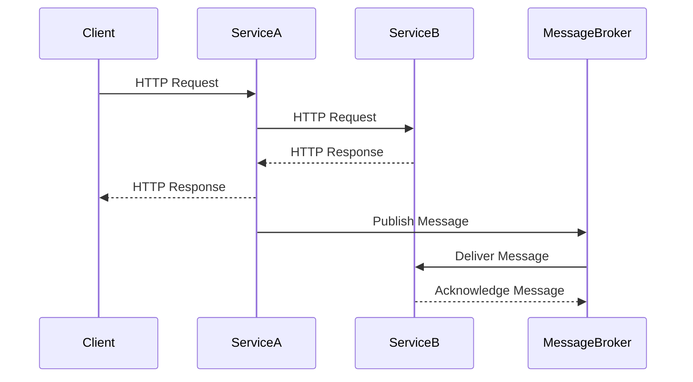

## 7.5.2 Service Communication

In the realm of microservices architecture, service communication is a critical aspect that dictates how different services interact with each other. This section delves into the two primary modes of service communication: synchronous and asynchronous. We will explore the use of RESTful APIs for synchronous communication and messaging systems like RabbitMQ and Kafka for asynchronous communication. We will also provide practical examples, discuss the considerations for choosing the right communication method, and address challenges such as handling network failures and ensuring data consistency.

### Understanding Service Communication

In microservices architecture, services are designed to be independently deployable and scalable components. However, they often need to interact to fulfill business requirements. Service communication can be broadly categorized into two types:

1. **Synchronous Communication**: This involves a direct request-response interaction between services, typically using HTTP-based protocols like REST.
2. **Asynchronous Communication**: This involves indirect communication through message brokers or queues, allowing services to operate independently and communicate without waiting for responses.

Let's explore these communication mechanisms in detail.

### Synchronous Communication with RESTful APIs

RESTful APIs are a popular choice for synchronous communication in microservices due to their simplicity and compatibility with HTTP. REST (Representational State Transfer) is an architectural style that uses standard HTTP methods like GET, POST, PUT, and DELETE to perform operations on resources.

#### Key Concepts of RESTful APIs

- **Statelessness**: Each request from a client contains all the information needed to process the request, ensuring that the server does not store any client context.
- **Resource-Based**: RESTful APIs expose resources (e.g., users, orders) that can be manipulated using standard HTTP methods.
- **Uniform Interface**: RESTful APIs provide a consistent interface, making it easier to understand and use.
- **Cacheability**: Responses can be cached to improve performance.

#### Implementing RESTful APIs in Java

Let's consider a simple example of a RESTful API for managing a product catalog. We'll use Spring Boot, a popular Java framework for building RESTful services.

```java
// Product.java - A simple entity representing a product
public class Product {
    private Long id;
    private String name;
    private Double price;

    // Getters and setters
}

// ProductController.java - RESTful controller for managing products
@RestController
@RequestMapping("/api/products")
public class ProductController {

    private final ProductService productService;

    @Autowired
    public ProductController(ProductService productService) {
        this.productService = productService;
    }

    @GetMapping
    public List<Product> getAllProducts() {
        return productService.getAllProducts();
    }

    @PostMapping
    public Product createProduct(@RequestBody Product product) {
        return productService.createProduct(product);
    }

    @GetMapping("/{id}")
    public Product getProductById(@PathVariable Long id) {
        return productService.getProductById(id);
    }

    @PutMapping("/{id}")
    public Product updateProduct(@PathVariable Long id, @RequestBody Product product) {
        return productService.updateProduct(id, product);
    }

    @DeleteMapping("/{id}")
    public void deleteProduct(@PathVariable Long id) {
        productService.deleteProduct(id);
    }
}
```

In this example, the `ProductController` class defines endpoints for CRUD operations on products. Each method corresponds to an HTTP method, providing a clear and intuitive interface for interacting with the product catalog.

#### Considerations for Synchronous Communication

- **Latency**: Synchronous communication can introduce latency as services wait for responses.
- **Coupling**: Direct communication can lead to tighter coupling between services.
- **Scalability**: High loads can impact performance, as each request requires a response.

### Asynchronous Communication with Messaging Systems

Asynchronous communication allows services to communicate without waiting for immediate responses. This is achieved through message brokers or queues, which decouple the sender and receiver.

#### Key Concepts of Messaging Systems

- **Decoupling**: Services communicate through messages, reducing direct dependencies.
- **Scalability**: Asynchronous communication can handle high loads by distributing messages across multiple consumers.
- **Reliability**: Messages can be persisted to ensure delivery even in the event of failures.

#### Implementing Asynchronous Communication with RabbitMQ

RabbitMQ is a widely used message broker that supports various messaging patterns. Let's implement a simple example where a service publishes messages to a queue, and another service consumes them.

```java
// ProducerService.java - Service for sending messages to RabbitMQ
@Service
public class ProducerService {

    private final RabbitTemplate rabbitTemplate;

    @Autowired
    public ProducerService(RabbitTemplate rabbitTemplate) {
        this.rabbitTemplate = rabbitTemplate;
    }

    public void sendMessage(String message) {
        rabbitTemplate.convertAndSend("exampleQueue", message);
    }
}

// ConsumerService.java - Service for receiving messages from RabbitMQ
@Service
public class ConsumerService {

    @RabbitListener(queues = "exampleQueue")
    public void receiveMessage(String message) {
        System.out.println("Received message: " + message);
    }
}
```

In this example, the `ProducerService` sends messages to a queue named `exampleQueue`, and the `ConsumerService` listens for messages on the same queue. This decouples the producer and consumer, allowing them to operate independently.

#### Implementing Asynchronous Communication with Kafka

Kafka is another popular messaging system, known for its high throughput and scalability. Let's implement a simple example using Kafka.

```java
// KafkaProducerService.java - Service for sending messages to Kafka
@Service
public class KafkaProducerService {

    private final KafkaTemplate<String, String> kafkaTemplate;

    @Autowired
    public KafkaProducerService(KafkaTemplate<String, String> kafkaTemplate) {
        this.kafkaTemplate = kafkaTemplate;
    }

    public void sendMessage(String message) {
        kafkaTemplate.send("exampleTopic", message);
    }
}

// KafkaConsumerService.java - Service for receiving messages from Kafka
@Service
public class KafkaConsumerService {

    @KafkaListener(topics = "exampleTopic", groupId = "exampleGroup")
    public void receiveMessage(String message) {
        System.out.println("Received message: " + message);
    }
}
```

In this example, the `KafkaProducerService` sends messages to a topic named `exampleTopic`, and the `KafkaConsumerService` listens for messages on the same topic. Kafka's partitioning and replication features enhance scalability and reliability.

#### Considerations for Asynchronous Communication

- **Complexity**: Asynchronous communication can introduce complexity in managing message flows and ensuring message ordering.
- **Consistency**: Ensuring data consistency across services can be challenging.
- **Error Handling**: Handling message failures and retries requires careful design.

### Choosing the Right Communication Method

When deciding between synchronous and asynchronous communication, consider the following factors:

- **Use Case Requirements**: Determine if immediate responses are necessary or if delayed processing is acceptable.
- **System Load**: Evaluate the expected load and choose a method that can handle it efficiently.
- **Service Coupling**: Consider the level of coupling between services and choose a method that aligns with your architectural goals.
- **Data Consistency**: Assess the importance of data consistency and choose a method that supports your consistency requirements.

### Handling Network Failures and Ensuring Data Consistency

Network failures and data consistency are common challenges in service communication. Here are some strategies to address these issues:

- **Retries and Timeouts**: Implement retries with exponential backoff and set appropriate timeouts to handle transient network failures.
- **Circuit Breakers**: Use circuit breakers to prevent cascading failures and provide fallback mechanisms.
- **Idempotency**: Design services to handle duplicate requests gracefully, ensuring that repeated operations produce the same result.
- **Distributed Transactions**: Use distributed transaction patterns like the Saga pattern to manage data consistency across services.

### Visualizing Service Communication

To better understand the flow of communication between services, let's visualize a typical interaction using a sequence diagram.



In this diagram, we see a combination of synchronous and asynchronous communication. The client interacts with Service A synchronously, while Service A and Service B communicate asynchronously through a message broker.

### Try It Yourself

To deepen your understanding, try modifying the provided code examples:

- **Experiment with Different HTTP Methods**: Add new endpoints to the RESTful API and explore different HTTP methods.
- **Implement Message Filtering**: Modify the messaging examples to filter messages based on specific criteria before processing.
- **Simulate Network Failures**: Introduce artificial delays or failures in the communication flow and implement strategies to handle them.

### Conclusion

Service communication is a fundamental aspect of microservices architecture. By understanding the strengths and limitations of synchronous and asynchronous communication, you can design systems that are robust, scalable, and maintainable. Remember to consider factors like latency, coupling, and consistency when choosing the appropriate communication method. As you continue to explore service communication, keep experimenting and refining your approach to build resilient and efficient microservices.

## Quiz Time!



### Which of the following is a key characteristic of RESTful APIs?

- [x] Statelessness
- [ ] Statefulness
- [ ] Synchronous communication only
- [ ] Asynchronous communication only

> **Explanation:** RESTful APIs are stateless, meaning each request contains all the information needed to process it.

### What is a primary benefit of using asynchronous communication in microservices?

- [x] Decoupling services
- [ ] Immediate response
- [ ] Increased latency
- [ ] Tight coupling

> **Explanation:** Asynchronous communication decouples services, allowing them to operate independently.

### Which messaging system is known for its high throughput and scalability?

- [x] Kafka
- [ ] RabbitMQ
- [ ] RESTful APIs
- [ ] HTTP

> **Explanation:** Kafka is known for its high throughput and scalability, making it suitable for handling large volumes of data.

### What is a common challenge when using asynchronous communication?

- [x] Ensuring data consistency
- [ ] Immediate response
- [ ] Statelessness
- [ ] Tight coupling

> **Explanation:** Ensuring data consistency across services is a common challenge with asynchronous communication.

### Which pattern can be used to manage data consistency across services in distributed transactions?

- [x] Saga pattern
- [ ] Singleton pattern
- [ ] Factory pattern
- [ ] Observer pattern

> **Explanation:** The Saga pattern is used to manage data consistency in distributed transactions across services.

### What is a strategy for handling transient network failures?

- [x] Implementing retries with exponential backoff
- [ ] Increasing timeout indefinitely
- [ ] Ignoring failures
- [ ] Removing retries

> **Explanation:** Implementing retries with exponential backoff is a strategy to handle transient network failures effectively.

### Which of the following is a benefit of using circuit breakers in service communication?

- [x] Preventing cascading failures
- [ ] Increasing latency
- [ ] Tight coupling
- [ ] Synchronous communication

> **Explanation:** Circuit breakers prevent cascading failures and provide fallback mechanisms to maintain system stability.

### What is the role of a message broker in asynchronous communication?

- [x] Decoupling sender and receiver
- [ ] Ensuring synchronous communication
- [ ] Increasing latency
- [ ] Tight coupling

> **Explanation:** A message broker decouples the sender and receiver, allowing them to communicate asynchronously.

### Which of the following is NOT a consideration when choosing a communication method?

- [ ] Use case requirements
- [ ] System load
- [ ] Service coupling
- [x] Programming language

> **Explanation:** Programming language is not a primary consideration when choosing a communication method; factors like use case requirements, system load, and service coupling are more relevant.

### True or False: RESTful APIs are only suitable for synchronous communication.

- [x] True
- [ ] False

> **Explanation:** RESTful APIs are typically used for synchronous communication, where a client waits for a response from the server.


