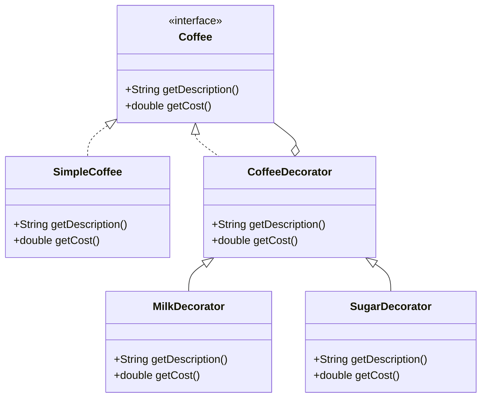

## 7.5.2 Interface-Based Decorators

### Introduction

In the realm of software design, the Decorator Pattern stands out as a powerful tool for extending the functionality of objects dynamically. The essence of this pattern lies in its ability to add responsibilities to objects without modifying their structure. A critical aspect of implementing the Decorator Pattern effectively in Java is the use of interfaces. This section delves into the concept of interface-based decorators, highlighting their significance in ensuring that decorators conform to the same interface as the components they decorate. This conformity is pivotal for achieving seamless interchangeability and flexible decoration.

### Understanding the Decorator Pattern

Before diving into interface-based decorators, it is essential to grasp the foundational concept of the Decorator Pattern. The pattern is a structural design pattern that allows behavior to be added to individual objects, either statically or dynamically, without affecting the behavior of other objects from the same class. This is achieved by creating a set of decorator classes that are used to wrap concrete components.

### The Role of Interfaces in Decorators

Interfaces play a crucial role in the Decorator Pattern by defining a contract that both the component and its decorators must adhere to. This contract ensures that decorators can be used interchangeably with the components they decorate, thereby maintaining the integrity of the system's architecture.

#### Importance of Interface Conformity

1. **Seamless Interchangeability**: By implementing the same interface, decorators and components can be interchanged without altering the client code. This interchangeability is vital for maintaining flexibility and scalability in software systems.

2. **Transparent Decoration**: Adherence to a common interface allows decorators to be layered transparently over components. Clients interact with the interface, oblivious to whether they are dealing with a plain component or a decorated one.

3. **Enhanced Flexibility**: Interface-based decorators facilitate the dynamic addition of responsibilities. New decorators can be introduced without modifying existing code, adhering to the Open/Closed Principle.

### Implementing Interface-Based Decorators in Java

To illustrate the implementation of interface-based decorators, consider a scenario where we have a `Coffee` interface representing a basic coffee beverage. We will create concrete implementations of this interface and then use decorators to add additional features such as milk, sugar, and whipped cream.

#### Step-by-Step Implementation

1. **Define the Component Interface**

   The `Coffee` interface defines the contract for all coffee beverages, including decorated ones.

   ```java
   public interface Coffee {
       String getDescription();
       double getCost();
   }
   ```

2. **Create Concrete Components**

   Implement the `Coffee` interface in concrete classes representing basic coffee types.

   ```java
   public class SimpleCoffee implements Coffee {
       @Override
       public String getDescription() {
           return "Simple Coffee";
       }

       @Override
       public double getCost() {
           return 5.0;
       }
   }
   ```

3. **Implement Decorator Classes**

   Each decorator class implements the `Coffee` interface and contains a reference to a `Coffee` object. This setup allows decorators to add new behavior while delegating existing behavior to the component.

   ```java
   public abstract class CoffeeDecorator implements Coffee {
       protected Coffee decoratedCoffee;

       public CoffeeDecorator(Coffee decoratedCoffee) {
           this.decoratedCoffee = decoratedCoffee;
       }

       @Override
       public String getDescription() {
           return decoratedCoffee.getDescription();
       }

       @Override
       public double getCost() {
           return decoratedCoffee.getCost();
       }
   }
   ```

4. **Create Concrete Decorators**

   Concrete decorators extend the `CoffeeDecorator` class and add new functionality.

   ```java
   public class MilkDecorator extends CoffeeDecorator {
       public MilkDecorator(Coffee decoratedCoffee) {
           super(decoratedCoffee);
       }

       @Override
       public String getDescription() {
           return decoratedCoffee.getDescription() + ", Milk";
       }

       @Override
       public double getCost() {
           return decoratedCoffee.getCost() + 1.5;
       }
   }

   public class SugarDecorator extends CoffeeDecorator {
       public SugarDecorator(Coffee decoratedCoffee) {
           super(decoratedCoffee);
       }

       @Override
       public String getDescription() {
           return decoratedCoffee.getDescription() + ", Sugar";
       }

       @Override
       public double getCost() {
           return decoratedCoffee.getCost() + 0.5;
       }
   }
   ```

5. **Demonstrate Usage**

   Use the decorators to dynamically add features to a coffee object.

   ```java
   public class CoffeeShop {
       public static void main(String[] args) {
           Coffee coffee = new SimpleCoffee();
           System.out.println(coffee.getDescription() + " $" + coffee.getCost());

           coffee = new MilkDecorator(coffee);
           System.out.println(coffee.getDescription() + " $" + coffee.getCost());

           coffee = new SugarDecorator(coffee);
           System.out.println(coffee.getDescription() + " $" + coffee.getCost());
       }
   }
   ```

   **Output:**
   ```
   Simple Coffee $5.0
   Simple Coffee, Milk $6.5
   Simple Coffee, Milk, Sugar $7.0
   ```

### Diagrammatic Representation

To better understand the structure of interface-based decorators, consider the following class diagram:



**Diagram Explanation**: This diagram illustrates the relationship between the `Coffee` interface, its concrete implementation (`SimpleCoffee`), and the decorators (`MilkDecorator`, `SugarDecorator`). The decorators extend `CoffeeDecorator`, which implements the `Coffee` interface, ensuring that all decorators conform to the same interface as the component.

### Practical Applications and Real-World Scenarios

Interface-based decorators are widely used in software systems where flexibility and scalability are paramount. Some practical applications include:

- **Graphical User Interfaces (GUIs)**: Decorators can be used to add features such as borders, scroll bars, and shadows to GUI components without altering their core functionality.

- **Stream Processing**: In Java's I/O library, streams are decorated with additional capabilities such as buffering, filtering, and compression.

- **Logging and Monitoring**: Decorators can be used to add logging and monitoring capabilities to existing classes without modifying their code.

### Historical Context and Evolution

The Decorator Pattern has its roots in the early days of object-oriented design, where the need for flexible and reusable code was paramount. Over time, the pattern has evolved to accommodate modern programming paradigms, including the use of interfaces and abstract classes to enhance flexibility and maintainability.

### Best Practices and Expert Tips

- **Adhere to the Interface**: Always ensure that decorators implement the same interface as the components they decorate. This adherence is crucial for maintaining the pattern's integrity.

- **Keep Decorators Lightweight**: Avoid adding too much complexity to decorators. They should focus on adding specific functionality without becoming bloated.

- **Consider Performance**: Be mindful of the performance implications of layering multiple decorators. Each layer introduces additional method calls, which can impact performance.

- **Use Composition Over Inheritance**: Favor composition over inheritance when implementing decorators. This approach enhances flexibility and reduces coupling.

### Common Pitfalls and How to Avoid Them

- **Overusing Decorators**: While decorators are powerful, overusing them can lead to complex and difficult-to-maintain code. Use them judiciously and only when necessary.

- **Ignoring Interface Conformity**: Failing to adhere to a common interface can lead to brittle and inflexible code. Always ensure that decorators conform to the same interface as the components.

### Exercises and Practice Problems

1. **Exercise 1**: Implement a decorator pattern for a `Pizza` interface, allowing for dynamic addition of toppings such as cheese, pepperoni, and olives.

2. **Exercise 2**: Modify the `Coffee` example to include a `WhippedCreamDecorator`. Ensure that the decorator adheres to the `Coffee` interface.

3. **Exercise 3**: Consider a scenario where you need to add caching capabilities to a data retrieval service. Design a decorator pattern to achieve this.

### Summary and Key Takeaways

Interface-based decorators are a powerful tool in the software architect's toolkit, enabling dynamic and flexible extension of object behavior. By adhering to a common interface, decorators ensure seamless interchangeability and transparent decoration, enhancing the scalability and maintainability of software systems. As with any design pattern, it is essential to use decorators judiciously, adhering to best practices and avoiding common pitfalls.

### Reflection

Consider how interface-based decorators can be applied to your current projects. Reflect on the potential benefits and challenges, and explore opportunities to enhance your software architecture using this pattern.

### Related Patterns

- **[Adapter Pattern]( "Adapter Pattern")**: Similar to decorators, adapters provide a way to work with incompatible interfaces, but they focus on interface conversion rather than behavior extension.

- **[Composite Pattern]( "Composite Pattern")**: While decorators add functionality, composites allow for the composition of objects into tree structures to represent part-whole hierarchies.

### Known Uses

- **Java I/O Streams**: The Java I/O library extensively uses decorators to add functionality to streams, such as buffering and filtering.

- **Spring Framework**: The Spring Framework uses decorators to add transactional behavior to methods, enhancing their functionality without modifying their code.

### Further Reading

- [Java Documentation](https://docs.oracle.com/en/java/)
- [Design Patterns: Elements of Reusable Object-Oriented Software](https://en.wikipedia.org/wiki/Design_Patterns) by Erich Gamma, Richard Helm, Ralph Johnson, and John Vlissides.

---

## Test Your Knowledge: Interface-Based Decorators Quiz



### What is the primary benefit of using interface-based decorators?

- [x] They ensure seamless interchangeability of components and decorators.
- [ ] They improve the performance of the application.
- [ ] They reduce the number of classes needed.
- [ ] They eliminate the need for interfaces.

> **Explanation:** Interface-based decorators ensure that both components and decorators adhere to the same interface, allowing them to be interchanged seamlessly.

### How do decorators add functionality to objects?

- [x] By wrapping the original object and adding new behavior.
- [ ] By modifying the original object's code.
- [ ] By inheriting from the original object's class.
- [ ] By creating a new object with the desired behavior.

> **Explanation:** Decorators wrap the original object, adding new behavior while delegating existing behavior to the component.

### Which principle does the Decorator Pattern adhere to by allowing new functionality to be added without modifying existing code?

- [x] Open/Closed Principle
- [ ] Single Responsibility Principle
- [ ] Liskov Substitution Principle
- [ ] Dependency Inversion Principle

> **Explanation:** The Decorator Pattern adheres to the Open/Closed Principle by allowing new functionality to be added without modifying existing code.

### What is a common use case for decorators in Java?

- [x] Enhancing I/O streams with additional capabilities.
- [ ] Implementing database connections.
- [ ] Managing user sessions.
- [ ] Handling exceptions.

> **Explanation:** Decorators are commonly used in Java to enhance I/O streams with additional capabilities such as buffering and filtering.

### What is the role of the CoffeeDecorator class in the provided example?

- [x] It acts as a base class for all concrete decorators.
- [ ] It provides the main functionality of the coffee.
- [ ] It defines the interface for coffee objects.
- [ ] It handles user input for coffee orders.

> **Explanation:** The CoffeeDecorator class acts as a base class for all concrete decorators, providing a common structure for adding new behavior.

### Why is it important for decorators to implement the same interface as the components they decorate?

- [x] To ensure that they can be used interchangeably with the components.
- [ ] To reduce the number of classes in the system.
- [ ] To improve the performance of the application.
- [ ] To simplify the code structure.

> **Explanation:** Implementing the same interface ensures that decorators can be used interchangeably with the components, maintaining system flexibility.

### What is a potential drawback of using too many decorators?

- [x] Increased complexity and reduced maintainability.
- [ ] Improved performance and scalability.
- [ ] Simplified code structure.
- [ ] Reduced number of classes.

> **Explanation:** Using too many decorators can increase complexity and reduce maintainability, making the code harder to understand and manage.

### How can decorators be used in a logging system?

- [x] By adding logging functionality to existing classes without modifying them.
- [ ] By creating a new logging class for each component.
- [ ] By modifying the original classes to include logging.
- [ ] By removing the need for logging altogether.

> **Explanation:** Decorators can add logging functionality to existing classes without modifying them, enhancing their behavior transparently.

### What is the primary focus of the Decorator Pattern?

- [x] Adding responsibilities to objects dynamically.
- [ ] Converting interfaces to be compatible.
- [ ] Managing object lifecycles.
- [ ] Simplifying complex algorithms.

> **Explanation:** The primary focus of the Decorator Pattern is to add responsibilities to objects dynamically, enhancing their functionality.

### True or False: The Decorator Pattern can be used to modify the interface of an object.

- [ ] True
- [x] False

> **Explanation:** The Decorator Pattern does not modify the interface of an object; it adds new behavior while maintaining the existing interface.



---
