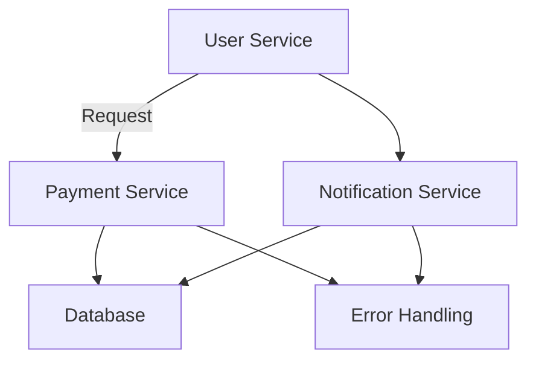
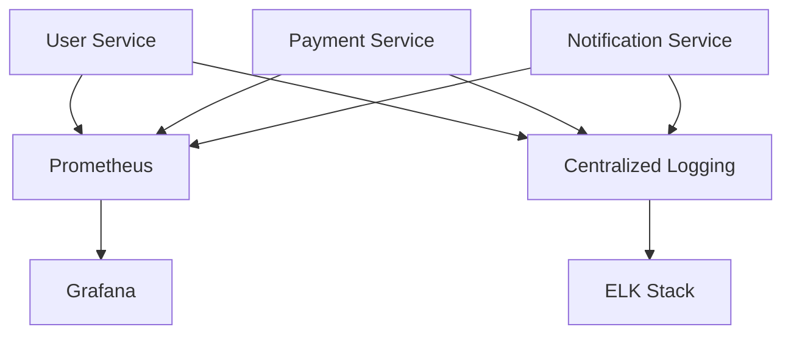

## 7.5.3 Advantages and Challenges

Microservices architecture has become a popular choice for building large-scale, complex applications. By breaking down applications into smaller, independent services, microservices offer numerous advantages. However, they also introduce certain challenges that need to be addressed to ensure successful implementation. In this section, we will explore the key advantages and challenges of microservices architecture, along with strategies to mitigate these challenges.

### Advantages of Microservices Architecture

#### Improved Scalability

One of the primary advantages of microservices architecture is improved scalability. Each microservice can be scaled independently based on its specific needs. This means that if a particular service experiences high demand, it can be scaled up without affecting other services. This is particularly beneficial for applications with varying loads across different components.

**Example:**

```java
// Example of scaling a microservice using Kubernetes
apiVersion: apps/v1
kind: Deployment
metadata:
  name: user-service
spec:
  replicas: 3
  selector:
    matchLabels:
      app: user-service
  template:
    metadata:
      labels:
        app: user-service
    spec:
      containers:
      - name: user-service
        image: user-service:latest
```

In the above example, the `user-service` microservice is scaled to three replicas using Kubernetes, allowing it to handle increased load.

#### Team Autonomy

Microservices architecture promotes team autonomy by allowing different teams to work on different services independently. Each team can choose the most suitable technology stack for their service, which can lead to increased productivity and innovation. This autonomy also enables faster development cycles as teams can work in parallel without being bottlenecked by dependencies on other teams.

#### Technology Diversity

Microservices allow for technology diversity, meaning that different services can be built using different programming languages, frameworks, or databases. This flexibility enables teams to choose the best tools for the job, rather than being constrained by a single technology stack. It also allows for gradual adoption of new technologies without the need for a complete system overhaul.

**Example:**

- **User Service**: Built with Java and Spring Boot.
- **Payment Service**: Implemented using Node.js and Express.
- **Notification Service**: Developed with Python and Flask.

This diversity allows each service to leverage the strengths of different technologies, optimizing performance and development efficiency.

#### Fault Isolation

In a microservices architecture, each service is isolated from the others. This means that if one service fails, it does not necessarily bring down the entire system. Fault isolation improves the overall resilience of the application, as failures can be contained and managed more effectively.

**Diagram: Fault Isolation in Microservices**



In this diagram, if the Payment Service encounters an error, it is handled independently without affecting the User or Notification Services.

### Challenges of Microservices Architecture

#### Distributed System Complexities

Microservices architecture introduces complexities associated with distributed systems. These include network latency, message serialization, and service discovery. Managing these complexities requires careful design and implementation of communication protocols and infrastructure.

**Strategies to Mitigate:**

- **Implement Service Mesh**: Use a service mesh like Istio to manage service-to-service communication, including load balancing, retries, and circuit breaking.
- **Use API Gateways**: Implement API gateways to handle requests from clients and route them to the appropriate services, simplifying client interactions with the system.

#### Data Management

Data management in microservices can be challenging due to the need for data consistency across distributed services. Each service typically has its own database, which can lead to data duplication and synchronization issues.

**Strategies to Mitigate:**

- **Event Sourcing**: Use event sourcing to capture changes to data as a sequence of events, ensuring consistency across services.
- **CQRS (Command Query Responsibility Segregation)**: Separate read and write operations to optimize data access and maintain consistency.

#### Debugging Difficulties

Debugging microservices can be more complex than monolithic applications due to the distributed nature of the architecture. Tracing the flow of a request across multiple services can be challenging.

**Strategies to Mitigate:**

- **Implement Observability**: Use observability tools like Prometheus and Grafana to monitor service performance and trace requests.
- **Centralized Logging**: Implement centralized logging solutions like ELK Stack (Elasticsearch, Logstash, Kibana) to aggregate logs from all services for easier debugging.

**Diagram: Observability in Microservices**



This diagram illustrates how observability and centralized logging can be implemented to monitor and debug microservices.

#### Deployment and DevOps Complexity

Deploying and managing microservices can be complex due to the need for continuous integration and deployment (CI/CD) pipelines, container orchestration, and infrastructure management.

**Strategies to Mitigate:**

- **Adopt DevOps Practices**: Implement DevOps practices to automate deployment and infrastructure management, ensuring consistency and reliability.
- **Use Container Orchestration**: Use container orchestration platforms like Kubernetes to manage service deployment, scaling, and operation.

#### Security Concerns

Microservices architecture can introduce security challenges due to increased attack surfaces and the need for secure communication between services.

**Strategies to Mitigate:**

- **Implement Security Best Practices**: Use security best practices such as mutual TLS for service communication, API authentication, and authorization.
- **Regular Security Audits**: Conduct regular security audits to identify and address vulnerabilities.

### Industry Insights and Common Pitfalls

#### Insights from Industry Experiences

- **Netflix**: Netflix successfully adopted microservices to handle its massive scale and improve service availability. They implemented a robust observability framework and open-sourced tools like Hystrix for fault tolerance.
- **Amazon**: Amazon's transition to microservices allowed them to scale their services independently and innovate rapidly. They emphasize the importance of strong DevOps practices and automation.

#### Common Pitfalls to Avoid

- **Over-Engineering**: Avoid over-engineering by starting small and gradually adopting microservices. Not every application needs to be a microservice.
- **Lack of Governance**: Establish clear governance and standards for service development to ensure consistency and avoid duplication.
- **Ignoring Cultural Change**: Recognize that adopting microservices requires a cultural shift towards DevOps and collaboration across teams.

### Conclusion

Microservices architecture offers significant advantages, including improved scalability, team autonomy, and technology diversity. However, it also presents challenges such as distributed system complexities, data management, and debugging difficulties. By implementing strategies like observability, robust DevOps practices, and security best practices, organizations can successfully navigate these challenges and reap the benefits of microservices.

Remember, this is just the beginning. As you progress, you'll build more complex and resilient systems. Keep experimenting, stay curious, and enjoy the journey!

## Quiz Time!



### What is one of the primary advantages of microservices architecture?

- [x] Improved scalability
- [ ] Reduced complexity
- [ ] Simplified debugging
- [ ] Decreased deployment time

> **Explanation:** Microservices architecture allows each service to be scaled independently, improving scalability.

### How can team autonomy be achieved in a microservices architecture?

- [x] By allowing different teams to work on different services independently
- [ ] By using a single technology stack for all services
- [ ] By centralizing all development efforts
- [ ] By reducing the number of services

> **Explanation:** Microservices architecture promotes team autonomy by allowing teams to work on different services independently and choose their technology stack.

### What is a common challenge associated with microservices architecture?

- [ ] Simplified data management
- [ ] Reduced network latency
- [x] Distributed system complexities
- [ ] Easier debugging

> **Explanation:** Microservices architecture introduces complexities associated with distributed systems, such as network latency and service discovery.

### Which strategy can help mitigate data management challenges in microservices?

- [ ] Using a single database for all services
- [x] Implementing event sourcing
- [ ] Reducing the number of services
- [ ] Centralizing data access

> **Explanation:** Event sourcing can help manage data consistency across distributed services by capturing changes as a sequence of events.

### How can debugging difficulties in microservices be addressed?

- [ ] By reducing the number of services
- [x] By implementing observability tools
- [ ] By using a single logging system
- [ ] By simplifying service interactions

> **Explanation:** Observability tools like Prometheus and Grafana can help monitor service performance and trace requests, making debugging easier.

### What is a key strategy for managing deployment complexity in microservices?

- [ ] Avoiding containerization
- [x] Adopting DevOps practices
- [ ] Using manual deployment processes
- [ ] Reducing the number of services

> **Explanation:** Adopting DevOps practices helps automate deployment and infrastructure management, reducing complexity.

### What is a common pitfall to avoid when adopting microservices?

- [x] Over-engineering
- [ ] Using diverse technology stacks
- [ ] Implementing robust DevOps practices
- [ ] Conducting regular security audits

> **Explanation:** Over-engineering can lead to unnecessary complexity. It's important to start small and gradually adopt microservices.

### How can security concerns in microservices be mitigated?

- [ ] By ignoring mutual TLS
- [x] By implementing security best practices
- [ ] By reducing the number of services
- [ ] By avoiding API authentication

> **Explanation:** Implementing security best practices, such as mutual TLS and API authentication, helps mitigate security concerns.

### What is a benefit of using technology diversity in microservices?

- [x] Allows teams to choose the best tools for the job
- [ ] Simplifies deployment processes
- [ ] Reduces the need for team autonomy
- [ ] Limits innovation

> **Explanation:** Technology diversity allows teams to choose the best tools for their specific service, optimizing performance and development efficiency.

### True or False: Microservices architecture requires a cultural shift towards DevOps and collaboration.

- [x] True
- [ ] False

> **Explanation:** Adopting microservices requires a cultural shift towards DevOps and collaboration across teams to ensure successful implementation.


