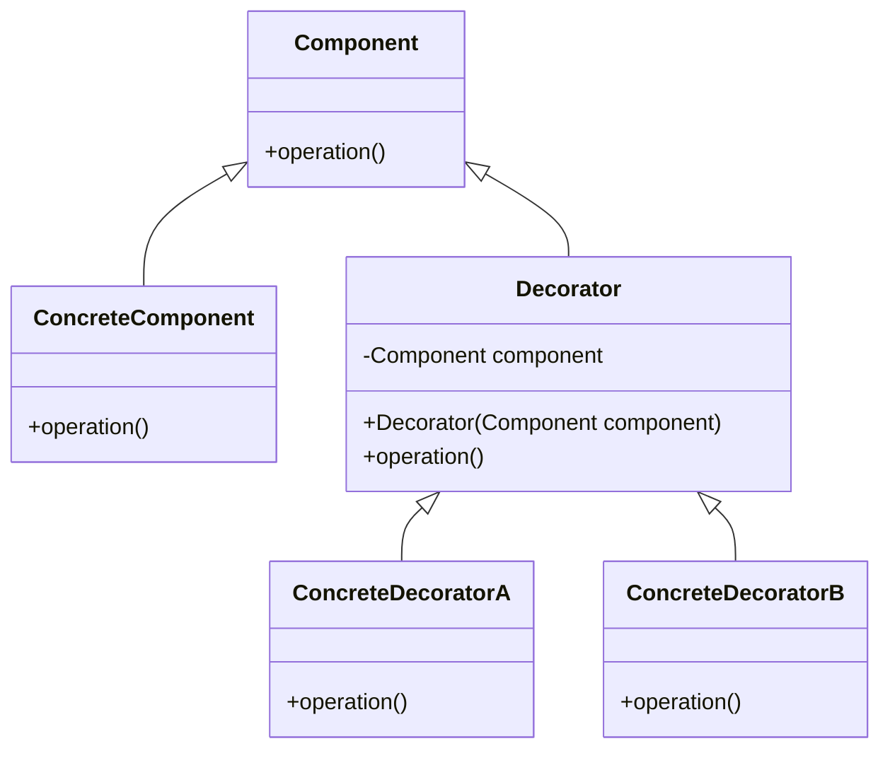

## 7.5.3 Chaining Decorators

The Decorator Pattern is a structural design pattern that allows behavior to be added to individual objects, either statically or dynamically, without affecting the behavior of other objects from the same class. This section delves into the concept of chaining decorators, which involves applying multiple decorators to a single object to compose complex behaviors.

### Intent

- **Description**: Chaining decorators allows developers to add multiple responsibilities to an object dynamically. This approach is particularly useful when you need to enhance or modify the behavior of objects at runtime without altering their structure.

### Motivation

In software development, there are often scenarios where an object needs to exhibit multiple behaviors or functionalities. For instance, consider a text editor application where text can be formatted in various ways, such as bold, italic, or underlined. Instead of creating a separate class for each combination of these styles, decorators can be chained to apply multiple styles to the text dynamically.

### Applicability

- **Guidelines**: Use chaining decorators when you need to:
  - Add multiple, independent responsibilities to an object.
  - Avoid subclassing for every possible combination of behaviors.
  - Enhance the flexibility and reusability of your code.

### Structure

The structure of chaining decorators involves a series of decorator classes that wrap the original object. Each decorator adds its own behavior before or after delegating the task to the next decorator in the chain.



**Caption**: The diagram illustrates the structure of the Decorator Pattern, where multiple decorators can be chained to enhance the functionality of a `ConcreteComponent`.

### Participants

- **Component**: Defines the interface for objects that can have responsibilities added to them dynamically.
- **ConcreteComponent**: The original object to which additional responsibilities can be added.
- **Decorator**: Maintains a reference to a `Component` object and defines an interface that conforms to `Component`'s interface.
- **ConcreteDecorator**: Adds responsibilities to the component.

### Collaborations

Decorators forward requests to their components and can perform additional actions before or after forwarding the request. When chaining decorators, each decorator wraps the previous one, forming a stack-like structure.

### Consequences

- **Benefits**:
  - Flexibility in adding responsibilities to objects.
  - Avoids an explosion of subclasses.
  - Enhances code reusability and maintainability.

- **Drawbacks**:
  - Complexity increases with the number of decorators.
  - Debugging can become challenging due to the layered structure.
  - Order of decorators can affect the final behavior.

### Implementation

#### Implementation Guidelines

1. **Define the Component Interface**: Create an interface that defines the operations that can be dynamically added.
2. **Create Concrete Components**: Implement the component interface with the core functionality.
3. **Develop Decorators**: Implement decorators that conform to the component interface and add additional behavior.
4. **Chain Decorators**: Instantiate decorators and wrap them around the concrete component in the desired order.

#### Sample Code Snippets

```java
// Component interface
interface Text {
    String format();
}

// ConcreteComponent
class PlainText implements Text {
    private String text;

    public PlainText(String text) {
        this.text = text;
    }

    @Override
    public String format() {
        return text;
    }
}

// Decorator
abstract class TextDecorator implements Text {
    protected Text text;

    public TextDecorator(Text text) {
        this.text = text;
    }

    @Override
    public String format() {
        return text.format();
    }
}

// ConcreteDecoratorA
class BoldText extends TextDecorator {
    public BoldText(Text text) {
        super(text);
    }

    @Override
    public String format() {
        return "<b>" + super.format() + "</b>";
    }
}

// ConcreteDecoratorB
class ItalicText extends TextDecorator {
    public ItalicText(Text text) {
        super(text);
    }

    @Override
    public String format() {
        return "<i>" + super.format() + "</i>";
    }
}

// Client code
public class DecoratorDemo {
    public static void main(String[] args) {
        Text text = new PlainText("Hello, World!");
        Text boldText = new BoldText(text);
        Text italicBoldText = new ItalicText(boldText);

        System.out.println(italicBoldText.format()); // Output: <i><b>Hello, World!</b></i>
    }
}
```

**Explanation**: The code demonstrates how to chain decorators in Java. The `PlainText` class implements the `Text` interface, and the `BoldText` and `ItalicText` classes are decorators that add bold and italic formatting, respectively. By chaining these decorators, the text is formatted with both styles.

#### Sample Use Cases

- **Text Formatting**: Applying multiple text styles in a word processor.
- **Stream Processing**: Enhancing input/output streams with additional capabilities like buffering, compression, or encryption.
- **UI Components**: Adding features like borders, scrollbars, or shadows to graphical components.

### Related Patterns

- **[Adapter Pattern]( "Adapter Pattern")**: While the Adapter Pattern changes the interface of an existing object, the Decorator Pattern enhances its behavior.
- **[Composite Pattern]( "Composite Pattern")**: Both patterns rely on recursive composition to organize objects, but the Composite Pattern focuses on tree structures.

### Known Uses

- **Java I/O Streams**: The Java I/O library uses decorators extensively to add functionality to streams, such as `BufferedInputStream` and `DataInputStream`.
- **Java Swing**: Decorators are used to add visual effects to components.

### Considerations for Chaining Decorators

- **Order Matters**: The sequence in which decorators are applied can significantly impact the final behavior. For instance, applying a compression decorator before an encryption decorator will yield different results than the reverse order.
- **Managing Complexity**: As the number of decorators increases, so does the complexity. Use clear naming conventions and documentation to manage this complexity.
- **Performance Implications**: Each decorator adds a layer of abstraction, which can affect performance. Consider the trade-offs between flexibility and efficiency.

### Exercises

1. **Experiment with Different Orders**: Modify the code example to apply decorators in different sequences and observe the changes in behavior.
2. **Create Custom Decorators**: Implement additional decorators, such as `UnderlineText`, and chain them with existing decorators.
3. **Performance Analysis**: Measure the performance impact of chaining multiple decorators and explore optimization strategies.

### Summary

Chaining decorators is a powerful technique in Java that allows developers to dynamically add multiple responsibilities to objects. By understanding the structure, participants, and collaborations involved in this pattern, developers can create flexible and maintainable code. However, it's essential to consider the order of decorators and manage the complexity that arises from chaining multiple decorators.

## Test Your Knowledge: Chaining Decorators in Java Quiz



### What is the primary benefit of chaining decorators?

- [x] It allows adding multiple responsibilities to an object dynamically.
- [ ] It simplifies the class hierarchy.
- [ ] It improves performance.
- [ ] It reduces code duplication.

> **Explanation:** Chaining decorators enables the dynamic addition of multiple responsibilities to an object without altering its structure.

### In the provided code example, what is the output of the `italicBoldText.format()` call?

- [x] `<i><b>Hello, World!</b></i>`
- [ ] `<b><i>Hello, World!</i></b>`
- [ ] `<b>Hello, World!</b>`
- [ ] `<i>Hello, World!</i>`

> **Explanation:** The decorators are applied in the order they are chained, resulting in italic text wrapped around bold text.

### Which pattern is most similar to the Decorator Pattern in terms of recursive composition?

- [ ] Adapter Pattern
- [x] Composite Pattern
- [ ] Singleton Pattern
- [ ] Factory Pattern

> **Explanation:** Both the Decorator and Composite Patterns rely on recursive composition to organize objects.

### What is a potential drawback of chaining too many decorators?

- [x] Increased complexity and potential performance issues.
- [ ] Reduced flexibility.
- [ ] Simplified debugging.
- [ ] Decreased code readability.

> **Explanation:** Chaining many decorators can lead to increased complexity and performance overhead due to multiple layers of abstraction.

### How can the order of decorators affect the final behavior?

- [x] Different orders can yield different results.
- [ ] The order does not matter.
- [ ] Only the first decorator affects the behavior.
- [ ] Only the last decorator affects the behavior.

> **Explanation:** The sequence in which decorators are applied can significantly impact the final behavior of the object.

### Which Java library extensively uses the Decorator Pattern?

- [x] Java I/O Streams
- [ ] Java Collections
- [ ] Java Concurrency
- [ ] Java Networking

> **Explanation:** The Java I/O library uses decorators to add functionality to streams.

### What is a common use case for chaining decorators?

- [x] Text formatting in word processors.
- [ ] Database connection pooling.
- [ ] Multithreading.
- [ ] Network communication.

> **Explanation:** Chaining decorators is commonly used for applying multiple text styles in word processors.

### What should be considered when managing complexity in decorator chains?

- [x] Use clear naming conventions and documentation.
- [ ] Avoid using decorators altogether.
- [ ] Limit the number of decorators to one.
- [ ] Use decorators only in test environments.

> **Explanation:** Clear naming conventions and documentation help manage the complexity of multiple decorators.

### Which pattern changes the interface of an existing object, unlike the Decorator Pattern?

- [x] Adapter Pattern
- [ ] Composite Pattern
- [ ] Singleton Pattern
- [ ] Factory Pattern

> **Explanation:** The Adapter Pattern changes the interface of an existing object, while the Decorator Pattern enhances its behavior.

### True or False: The Decorator Pattern can be used to add responsibilities to objects statically.

- [ ] True
- [x] False

> **Explanation:** The Decorator Pattern is primarily used to add responsibilities to objects dynamically at runtime.


