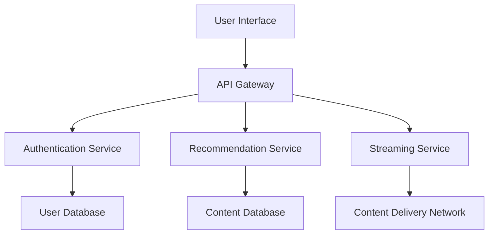
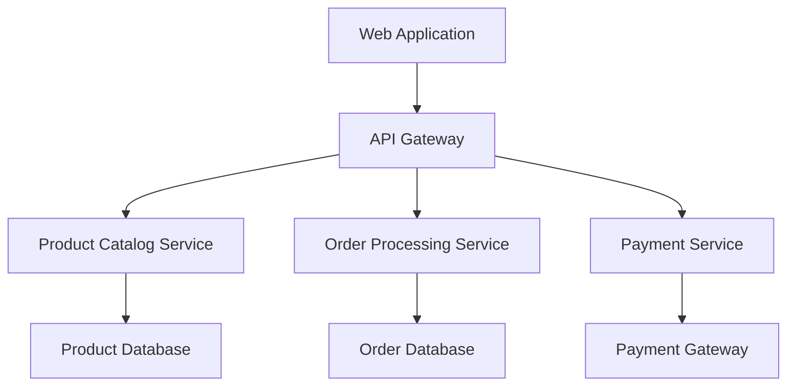

## 7.5.4 Use Cases and Examples

Microservices architecture has become a cornerstone for building scalable, resilient, and flexible large-scale distributed systems. In this section, we will delve into real-world examples where microservices have been successfully implemented, focusing on industry leaders like Netflix and Amazon. We will explore how microservices addressed specific business and technical needs, and highlight lessons learned and best practices from these examples.

### Introduction to Microservices Architecture

Microservices architecture is a design pattern where a system is divided into smaller, independent services that communicate over a network. Each service is focused on a specific business capability and can be developed, deployed, and scaled independently. This architecture contrasts with monolithic systems, where all components are tightly coupled and must be deployed together.

### Real-World Examples of Microservices Architecture

#### Netflix: A Pioneer in Microservices

Netflix is one of the earliest adopters of microservices architecture. The company transitioned from a monolithic application to a microservices-based architecture to improve scalability and reliability.

**Challenges Faced by Netflix:**
- **Scalability:** As Netflix's user base grew, the monolithic architecture struggled to handle increased load.
- **Reliability:** Outages in one part of the system could bring down the entire application.
- **Deployment Speed:** The monolithic architecture made it difficult to deploy new features quickly.

**Microservices Solution:**
Netflix decomposed its monolithic application into hundreds of microservices, each responsible for a specific function, such as user authentication, content recommendation, and video streaming.

**Key Benefits:**
- **Scalability:** Each microservice can be scaled independently, allowing Netflix to handle millions of concurrent users.
- **Resilience:** Failures in one service do not affect the entire system, improving overall reliability.
- **Faster Deployment:** Teams can deploy updates to individual services without affecting others, accelerating the release of new features.

**Architecture Diagram:**

**Lessons Learned:**
- **Decentralized Governance:** Empowering teams to own and manage their services fosters innovation and agility.
- **Observability:** Implementing robust monitoring and logging is crucial for managing a distributed system.
- **Resilience Engineering:** Techniques like circuit breakers and retries are essential for handling failures gracefully.

#### Amazon: Scaling E-Commerce with Microservices

Amazon's journey to microservices began as the company expanded its e-commerce platform to support a global customer base.

**Challenges Faced by Amazon:**
- **Complexity:** The monolithic architecture became increasingly complex and difficult to manage.
- **Performance:** High traffic during peak shopping seasons strained the system.
- **Flexibility:** Integrating new features and third-party services was cumbersome.

**Microservices Solution:**
Amazon restructured its architecture into microservices, each handling distinct business functions such as product catalog, order processing, and payment handling.

**Key Benefits:**
- **Improved Performance:** Microservices allowed Amazon to optimize resource allocation and improve response times.
- **Enhanced Flexibility:** New features and integrations could be added with minimal disruption.
- **Global Reach:** Services could be deployed in multiple regions, reducing latency for international users.

**Architecture Diagram:**

**Lessons Learned:**
- **Service Ownership:** Assigning ownership of services to specific teams ensures accountability and quality.
- **Continuous Deployment:** Automating deployment processes reduces the risk of errors and accelerates delivery.
- **Data Management:** Implementing strategies for data consistency and synchronization is critical in a distributed environment.

### Additional Use Cases

#### Spotify: Enhancing User Experience with Microservices

Spotify adopted microservices to deliver a seamless music streaming experience to millions of users.

**Challenges:**
- **User Personalization:** Delivering personalized playlists and recommendations required processing vast amounts of data.
- **Rapid Growth:** As Spotify's user base expanded, the system needed to scale efficiently.

**Microservices Solution:**
Spotify implemented microservices for various functions such as playlist management, user profiles, and music recommendations.

**Key Benefits:**
- **Scalability:** Services can be scaled independently to handle increased demand.
- **Personalization:** Microservices enable real-time data processing for personalized user experiences.

**Lessons Learned:**
- **Data-Driven Decisions:** Leveraging data analytics to inform service design and optimization.
- **Cross-Functional Teams:** Encouraging collaboration between development, operations, and data science teams.

#### Uber: Optimizing Ride-Sharing with Microservices

Uber's microservices architecture supports its complex ride-sharing platform, handling everything from ride requests to payment processing.

**Challenges:**
- **Real-Time Processing:** Managing real-time data for ride matching and navigation.
- **Global Operations:** Supporting a diverse range of services across different regions.

**Microservices Solution:**
Uber uses microservices for functions like ride matching, fare calculation, and driver management.

**Key Benefits:**
- **Real-Time Capabilities:** Microservices enable fast, efficient processing of real-time data.
- **Regional Adaptability:** Services can be tailored to meet the needs of different markets.

**Lessons Learned:**
- **Scalability and Resilience:** Designing services to handle high volumes of traffic and recover from failures.
- **Localization:** Adapting services to comply with regional regulations and preferences.

### Best Practices for Implementing Microservices

1. **Define Clear Boundaries:** Ensure each microservice has a well-defined scope and responsibility.
2. **Implement API Gateways:** Use API gateways to manage communication between services and external clients.
3. **Automate Testing and Deployment:** Use continuous integration and deployment pipelines to streamline development.
4. **Focus on Observability:** Implement monitoring, logging, and tracing to gain insights into system performance.
5. **Embrace DevOps Culture:** Foster collaboration between development and operations teams to improve efficiency.

### Try It Yourself

To experiment with microservices architecture, consider building a simple e-commerce application with separate services for user management, product catalog, and order processing. Use tools like Docker and Kubernetes to deploy and manage your services.

### Conclusion

Microservices architecture offers significant advantages for building scalable, resilient, and flexible systems. By examining real-world examples from companies like Netflix, Amazon, Spotify, and Uber, we can learn valuable lessons and best practices for implementing microservices in our own projects. Remember, the journey to microservices is iterative, and continuous improvement is key to success.

## Quiz Time!



### Which company is known as a pioneer in adopting microservices architecture?

- [x] Netflix
- [ ] Spotify
- [ ] Amazon
- [ ] Uber

> **Explanation:** Netflix is recognized as an early adopter of microservices architecture, transitioning from a monolithic system to improve scalability and reliability.

### What is a key benefit of microservices architecture?

- [x] Independent scalability of services
- [ ] Tightly coupled components
- [ ] Single deployment unit
- [ ] Centralized governance

> **Explanation:** Microservices architecture allows each service to be scaled independently, enhancing scalability and flexibility.

### How did Amazon benefit from using microservices?

- [x] Improved performance and flexibility
- [ ] Increased complexity
- [ ] Slower deployment
- [ ] Reduced global reach

> **Explanation:** Amazon's microservices architecture improved performance, flexibility, and global reach by allowing services to be optimized and deployed independently.

### What role does an API gateway play in microservices architecture?

- [x] Manages communication between services and clients
- [ ] Stores service data
- [ ] Acts as a database
- [ ] Provides user authentication

> **Explanation:** An API gateway manages communication between microservices and external clients, routing requests and responses.

### Which of the following is a lesson learned from Netflix's microservices implementation?

- [x] Decentralized governance fosters innovation
- [ ] Centralized control is essential
- [ ] Monolithic architecture is more scalable
- [ ] Observability is optional

> **Explanation:** Netflix learned that decentralized governance empowers teams and fosters innovation, while observability is crucial for managing distributed systems.

### What challenge did Spotify face that led to adopting microservices?

- [x] Delivering personalized user experiences
- [ ] Managing a small user base
- [ ] Simplifying a monolithic system
- [ ] Reducing data processing

> **Explanation:** Spotify adopted microservices to handle vast amounts of data for personalized user experiences and to scale efficiently.

### How does Uber benefit from microservices architecture?

- [x] Real-time data processing and regional adaptability
- [ ] Centralized service management
- [ ] Monolithic deployment
- [ ] Reduced localization

> **Explanation:** Uber's microservices architecture enables fast, efficient real-time data processing and allows services to be adapted for different regions.

### What is a best practice for implementing microservices?

- [x] Define clear boundaries for each service
- [ ] Use a single database for all services
- [ ] Avoid automation
- [ ] Centralize all service logic

> **Explanation:** Defining clear boundaries ensures each microservice has a specific responsibility, improving maintainability and scalability.

### Which tool can be used to manage microservices deployment?

- [x] Kubernetes
- [ ] SQL Server
- [ ] Microsoft Word
- [ ] Adobe Photoshop

> **Explanation:** Kubernetes is a tool used to deploy, manage, and scale containerized applications, including microservices.

### True or False: Microservices architecture is only suitable for large companies.

- [ ] True
- [x] False

> **Explanation:** Microservices architecture can benefit companies of all sizes by providing scalability, flexibility, and resilience, not just large enterprises.


