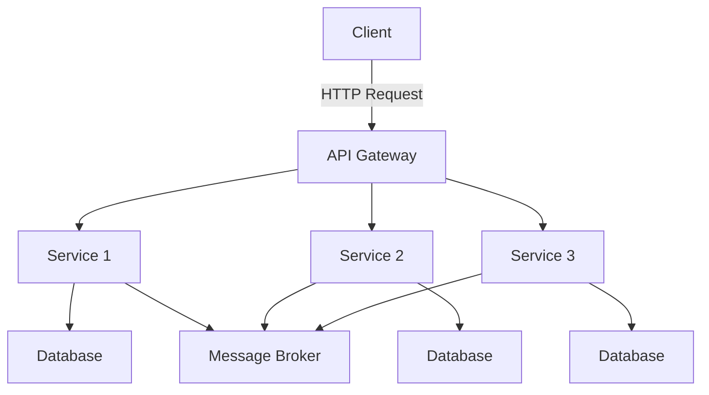

## 7.5 Microservices Architecture

Microservices architecture is an architectural style that structures an application as a collection of loosely coupled services. Each service is fine-grained and the protocols are lightweight. This approach enhances scalability, flexibility, and ease of deployment, making it a popular choice for modern software development.

### Introduction to Microservices Architecture

Microservices architecture is a way of designing software applications as suites of independently deployable services. Each service runs a unique process and communicates through a well-defined, lightweight mechanism, often an HTTP resource API. These services are built around business capabilities and independently deployable by fully automated deployment machinery.

#### Core Principles of Microservices

1. **Single Responsibility**: Each microservice is designed to perform a specific business function, adhering to the single responsibility principle.
2. **Independence**: Microservices are independently deployable and scalable, allowing teams to develop, test, and deploy services without affecting others.
3. **Decentralized Governance**: Emphasizes using the right tool for the job, allowing different services to be built with different technologies.
4. **Failure Isolation**: The failure of one service does not affect the entire system, enhancing resilience.
5. **Continuous Delivery**: Supports frequent and reliable releases of software by automating the integration and deployment processes.

### Microservices vs. Monolithic Architecture

To understand microservices, it's essential to compare them with monolithic architecture. In a monolithic architecture, all components of an application are tightly coupled and run as a single service. This approach can lead to challenges in scalability, flexibility, and deployment.

#### Differences between Microservices and Monolithic Architecture

- **Scalability**: Monolithic applications scale by replicating the entire application, while microservices can scale independently.
- **Flexibility**: Monolithic systems are rigid and require redeployment of the entire application for updates. Microservices allow independent updates.
- **Deployment**: Monolithic architectures often require downtime for deployment, whereas microservices support continuous deployment with minimal impact.
- **Technology Stack**: Monolithic applications are typically built using a single technology stack, while microservices can use multiple technologies.

### Benefits of Microservices Architecture

Microservices architecture offers numerous benefits that make it an attractive choice for modern software development.

#### Scalability

Microservices allow individual services to be scaled independently, enabling efficient resource utilization. This is particularly beneficial for applications with varying load patterns across different components.

#### Flexibility

By decoupling services, microservices architecture allows teams to choose the best technology stack for each service. This flexibility can lead to faster development cycles and innovation.

#### Ease of Deployment

Microservices support continuous integration and continuous deployment (CI/CD) practices, allowing for frequent and reliable software releases. This reduces time-to-market and enhances responsiveness to changing business needs.

#### Resilience

The independent nature of microservices means that the failure of one service does not necessarily impact others. This isolation enhances the overall resilience of the system.

#### Enhanced Collaboration

Microservices architecture aligns well with agile and DevOps practices, promoting collaboration between cross-functional teams. Teams can work on different services simultaneously, reducing bottlenecks and improving productivity.

### Challenges of Microservices Architecture

While microservices offer significant advantages, they also introduce challenges that must be addressed to ensure successful implementation.

#### Increased Complexity

Managing a distributed system with numerous services can be complex. It requires robust orchestration, monitoring, and management tools to handle service discovery, load balancing, and fault tolerance.

#### Data Management

Microservices architecture often involves distributed data management, which can complicate transactions and consistency. Implementing eventual consistency and managing distributed databases require careful planning.

#### Network Latency

Communication between microservices typically occurs over the network, introducing latency. Designing efficient communication protocols and optimizing network performance are crucial to minimize latency.

#### Security

Securing a microservices-based system involves protecting each service and the communication between them. This requires implementing authentication, authorization, and encryption mechanisms.

#### Deployment and Testing

Deploying and testing microservices can be challenging due to the need for coordination across multiple services. Automated testing and deployment pipelines are essential to manage these complexities.

### Microservices Ecosystem and Tools in Java

Java provides a rich ecosystem of tools and frameworks to support the development and management of microservices. Let's explore some of the key components.

#### Spring Boot and Spring Cloud

Spring Boot simplifies the creation of stand-alone, production-grade Spring-based applications. It provides a comprehensive set of features for building microservices, including embedded servers, configuration management, and monitoring.

Spring Cloud extends Spring Boot to provide tools for building distributed systems. It includes features like service discovery, circuit breakers, and distributed tracing.

#### Apache Kafka

Apache Kafka is a distributed event streaming platform that can be used to build real-time data pipelines and streaming applications. It is commonly used in microservices architectures for event-driven communication between services.

#### Docker and Kubernetes

Docker is a platform for developing, shipping, and running applications in containers. It enables consistent environments across development, testing, and production.

Kubernetes is an open-source container orchestration platform that automates the deployment, scaling, and management of containerized applications. It is widely used to manage microservices in production environments.

#### Netflix OSS

Netflix OSS provides a set of libraries and tools for building resilient microservices. Key components include Eureka for service discovery, Hystrix for fault tolerance, and Zuul for API gateway functionality.

#### Prometheus and Grafana

Prometheus is an open-source monitoring and alerting toolkit, while Grafana provides visualization capabilities. Together, they offer a powerful solution for monitoring and managing microservices.

### Implementing Microservices in Java

Let's explore a simple example of implementing a microservice in Java using Spring Boot. We'll create a basic service that manages a list of products.

```java
// Product.java
package com.example.microservices.product;

import javax.persistence.Entity;
import javax.persistence.GeneratedValue;
import javax.persistence.GenerationType;
import javax.persistence.Id;

@Entity
public class Product {
    @Id
    @GeneratedValue(strategy = GenerationType.AUTO)
    private Long id;
    private String name;
    private double price;

    // Getters and setters
}
```

```java
// ProductRepository.java
package com.example.microservices.product;

import org.springframework.data.jpa.repository.JpaRepository;

public interface ProductRepository extends JpaRepository<Product, Long> {
}
```

```java
// ProductService.java
package com.example.microservices.product;

import org.springframework.beans.factory.annotation.Autowired;
import org.springframework.stereotype.Service;

import java.util.List;

@Service
public class ProductService {
    @Autowired
    private ProductRepository productRepository;

    public List<Product> getAllProducts() {
        return productRepository.findAll();
    }

    public Product getProductById(Long id) {
        return productRepository.findById(id).orElse(null);
    }

    public Product saveProduct(Product product) {
        return productRepository.save(product);
    }

    public void deleteProduct(Long id) {
        productRepository.deleteById(id);
    }
}
```

```java
// ProductController.java
package com.example.microservices.product;

import org.springframework.beans.factory.annotation.Autowired;
import org.springframework.web.bind.annotation.*;

import java.util.List;

@RestController
@RequestMapping("/products")
public class ProductController {
    @Autowired
    private ProductService productService;

    @GetMapping
    public List<Product> getAllProducts() {
        return productService.getAllProducts();
    }

    @GetMapping("/{id}")
    public Product getProductById(@PathVariable Long id) {
        return productService.getProductById(id);
    }

    @PostMapping
    public Product createProduct(@RequestBody Product product) {
        return productService.saveProduct(product);
    }

    @DeleteMapping("/{id}")
    public void deleteProduct(@PathVariable Long id) {
        productService.deleteProduct(id);
    }
}
```

This example demonstrates a simple microservice for managing products, including CRUD operations. The service is built using Spring Boot, with JPA for data persistence.

### Try It Yourself

Experiment with the code by adding new features, such as:

- Implementing validation for product data.
- Adding a search endpoint to find products by name.
- Integrating with a message broker like Kafka for event-driven communication.

### Visualizing Microservices Architecture

Below is a diagram illustrating the interaction between different components in a microservices architecture.



**Diagram Description**: This diagram shows a client interacting with an API Gateway, which routes requests to various microservices. Each service interacts with its own database and communicates with a message broker for event-driven processing.

### Knowledge Check

- Explain the core principles of microservices architecture.
- Discuss the differences between microservices and monolithic architecture.
- List the benefits and challenges of microservices architecture.
- Describe the role of Spring Boot and Spring Cloud in building microservices.
- Explain how Docker and Kubernetes support microservices deployment.

### Embrace the Journey

Remember, adopting microservices architecture is a journey that involves continuous learning and adaptation. As you explore this architectural style, you'll discover new ways to enhance scalability, flexibility, and resilience in your applications. Keep experimenting, stay curious, and enjoy the journey!

## Quiz Time!



### What is a core principle of microservices architecture?

- [x] Single Responsibility
- [ ] Tight Coupling
- [ ] Centralized Governance
- [ ] Monolithic Deployment

> **Explanation:** Single Responsibility is a core principle of microservices, ensuring each service performs a specific business function.

### How do microservices differ from monolithic architecture in terms of scalability?

- [x] Microservices can scale independently.
- [ ] Monolithic applications scale more efficiently.
- [ ] Microservices require the entire application to scale.
- [ ] Monolithic applications cannot scale.

> **Explanation:** Microservices allow individual services to be scaled independently, unlike monolithic applications that require scaling the entire application.

### What is a benefit of microservices architecture?

- [x] Enhanced Collaboration
- [ ] Increased Complexity
- [ ] Network Latency
- [ ] Security Challenges

> **Explanation:** Microservices architecture promotes enhanced collaboration by allowing cross-functional teams to work on different services simultaneously.

### Which Java framework simplifies the creation of microservices?

- [x] Spring Boot
- [ ] Apache Kafka
- [ ] Docker
- [ ] Kubernetes

> **Explanation:** Spring Boot simplifies the creation of microservices by providing a comprehensive set of features for building stand-alone, production-grade applications.

### What is a challenge of microservices architecture?

- [x] Increased Complexity
- [ ] Ease of Deployment
- [ ] Flexibility
- [ ] Scalability

> **Explanation:** Microservices architecture introduces increased complexity due to the need to manage a distributed system with numerous services.

### Which tool is used for container orchestration in microservices?

- [x] Kubernetes
- [ ] Spring Cloud
- [ ] Prometheus
- [ ] Netflix OSS

> **Explanation:** Kubernetes is an open-source container orchestration platform that automates the deployment, scaling, and management of containerized applications.

### What role does Apache Kafka play in microservices architecture?

- [x] Event-Driven Communication
- [ ] Service Discovery
- [ ] Fault Tolerance
- [ ] API Gateway

> **Explanation:** Apache Kafka is commonly used in microservices architectures for event-driven communication between services.

### Which component of Netflix OSS provides service discovery?

- [x] Eureka
- [ ] Hystrix
- [ ] Zuul
- [ ] Ribbon

> **Explanation:** Eureka is a component of Netflix OSS that provides service discovery functionality.

### What is the purpose of Docker in microservices architecture?

- [x] Containerization
- [ ] Monitoring
- [ ] Circuit Breaking
- [ ] Service Discovery

> **Explanation:** Docker is a platform for developing, shipping, and running applications in containers, enabling consistent environments across development, testing, and production.

### True or False: Microservices architecture supports continuous integration and continuous deployment practices.

- [x] True
- [ ] False

> **Explanation:** Microservices architecture supports continuous integration and continuous deployment (CI/CD) practices, allowing for frequent and reliable software releases.


