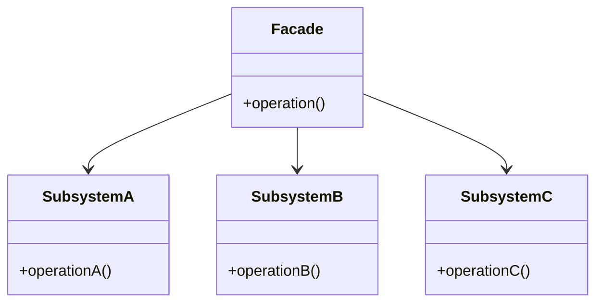

## 7.6.1 Implementing Facade in Java

The Facade pattern is a structural design pattern that provides a simplified interface to a complex subsystem. It is particularly useful in software architecture for reducing dependencies and promoting loose coupling between clients and subsystems. This section delves into the implementation of the Facade pattern in Java, illustrating its advantages and practical applications.

### Intent of the Facade Pattern

The primary intent of the Facade pattern is to offer a unified interface to a set of interfaces in a subsystem, thereby making the subsystem easier to use. By doing so, it abstracts the complexities of the subsystem and provides a more straightforward interface for the client.

### Advantages of the Facade Pattern

- **Simplification**: The Facade pattern simplifies the interaction between the client and the subsystem by providing a single entry point.
- **Loose Coupling**: It reduces the dependencies of the client on the subsystem, promoting loose coupling and enhancing maintainability.
- **Improved Readability**: By hiding the complexities of the subsystem, the Facade pattern improves the readability and usability of the code.
- **Flexibility**: It allows the subsystem to evolve independently without affecting the client code.

### Simplifying Client Interaction with Complex Subsystems

In complex systems, clients often need to interact with multiple components of a subsystem. This interaction can become cumbersome and error-prone due to the intricacies involved. The Facade pattern addresses this issue by providing a higher-level interface that encapsulates the subsystem's complexity.

### UML Diagram Representation

Below is a UML diagram illustrating the structure of the Facade pattern:



**Diagram Explanation**: The `Facade` class provides a simplified interface to the `SubsystemA`, `SubsystemB`, and `SubsystemC` classes. The client interacts with the `Facade` rather than directly with the subsystems.

### Java Code Example: Creating a Facade over a Subsystem

Let's consider a scenario where we have a complex subsystem responsible for managing a home theater system. The subsystem includes components such as an amplifier, a DVD player, and a projector. The Facade pattern can be used to simplify the interaction with these components.

#### Subsystem Classes

```java
// Subsystem class for Amplifier
class Amplifier {
    public void on() {
        System.out.println("Amplifier is on.");
    }

    public void setVolume(int level) {
        System.out.println("Amplifier volume set to " + level);
    }
}

// Subsystem class for DVD Player
class DVDPlayer {
    public void on() {
        System.out.println("DVD Player is on.");
    }

    public void play(String movie) {
        System.out.println("Playing movie: " + movie);
    }
}

// Subsystem class for Projector
class Projector {
    public void on() {
        System.out.println("Projector is on.");
    }

    public void wideScreenMode() {
        System.out.println("Projector in widescreen mode.");
    }
}
```

#### Facade Class

```java
// Facade class for Home Theater
class HomeTheaterFacade {
    private Amplifier amp;
    private DVDPlayer dvd;
    private Projector projector;

    public HomeTheaterFacade(Amplifier amp, DVDPlayer dvd, Projector projector) {
        this.amp = amp;
        this.dvd = dvd;
        this.projector = projector;
    }

    public void watchMovie(String movie) {
        System.out.println("Get ready to watch a movie...");
        projector.on();
        projector.wideScreenMode();
        amp.on();
        amp.setVolume(5);
        dvd.on();
        dvd.play(movie);
    }
}
```

#### Client Code

```java
public class HomeTheaterTestDrive {
    public static void main(String[] args) {
        Amplifier amp = new Amplifier();
        DVDPlayer dvd = new DVDPlayer();
        Projector projector = new Projector();

        HomeTheaterFacade homeTheater = new HomeTheaterFacade(amp, dvd, projector);
        homeTheater.watchMovie("Inception");
    }
}
```

**Explanation**: In this example, the `HomeTheaterFacade` class provides a simplified interface for the client to interact with the home theater system. The client only needs to call the `watchMovie` method, and the facade handles the complexities of turning on the components and setting them up.

### Promoting Loose Coupling

The Facade pattern promotes loose coupling by decoupling the client from the subsystem. The client interacts with the facade, which in turn interacts with the subsystem components. This separation allows the subsystem to change without affecting the client code, as long as the facade interface remains consistent.

### Practical Applications and Real-World Scenarios

The Facade pattern is widely used in various real-world scenarios, such as:

- **Library Management Systems**: Simplifying interactions with complex library databases.
- **E-commerce Platforms**: Providing a unified interface for managing orders, payments, and inventory.
- **Game Development**: Abstracting complex game engine functionalities for easier use by game developers.

### Conclusion

The Facade pattern is a powerful tool in the software architect's toolkit, offering a way to manage complexity and promote maintainability. By providing a simplified interface to complex subsystems, it enhances the usability and flexibility of the system.

### Exercises

1. Modify the `HomeTheaterFacade` to include additional components like a `StreamingPlayer` and a `Lights` system.
2. Implement a facade for a banking system that includes subsystems for account management, transaction processing, and customer service.

### Key Takeaways

- The Facade pattern simplifies client interactions with complex subsystems.
- It promotes loose coupling by decoupling the client from the subsystem.
- The pattern is widely applicable in various domains, enhancing system maintainability and flexibility.

### References and Further Reading

- [Oracle Java Documentation](https://docs.oracle.com/en/java/)
- [Design Patterns: Elements of Reusable Object-Oriented Software](https://en.wikipedia.org/wiki/Design_Patterns)

## Test Your Knowledge: Facade Pattern in Java Quiz



### What is the primary intent of the Facade pattern?

- [x] To provide a unified interface to a set of interfaces in a subsystem.
- [ ] To create a new interface for each subsystem component.
- [ ] To increase the complexity of the subsystem.
- [ ] To directly expose subsystem interfaces to the client.

> **Explanation:** The Facade pattern aims to simplify the interaction with a subsystem by providing a unified interface.

### How does the Facade pattern promote loose coupling?

- [x] By decoupling the client from the subsystem.
- [ ] By increasing the number of dependencies.
- [ ] By exposing all subsystem interfaces to the client.
- [ ] By making the client dependent on the subsystem's internal structure.

> **Explanation:** The Facade pattern promotes loose coupling by providing a single interface that interacts with the subsystem, reducing the client's dependency on the subsystem's internal structure.

### Which of the following is a benefit of using the Facade pattern?

- [x] Simplification of client interaction with complex subsystems.
- [ ] Increased complexity of the client code.
- [ ] Direct access to all subsystem components.
- [ ] Tight coupling between client and subsystem.

> **Explanation:** The Facade pattern simplifies client interaction by providing a unified interface, reducing complexity and promoting loose coupling.

### In the provided Java example, which class acts as the Facade?

- [x] HomeTheaterFacade
- [ ] Amplifier
- [ ] DVDPlayer
- [ ] Projector

> **Explanation:** The `HomeTheaterFacade` class provides a simplified interface for interacting with the home theater subsystem.

### What is a common use case for the Facade pattern?

- [x] Simplifying interactions with complex systems like library management or e-commerce platforms.
- [ ] Increasing the complexity of a simple system.
- [ ] Directly exposing all subsystem interfaces to the client.
- [ ] Creating multiple interfaces for each subsystem component.

> **Explanation:** The Facade pattern is commonly used to simplify interactions with complex systems by providing a unified interface.

### Which of the following is NOT an advantage of the Facade pattern?

- [ ] Simplification of client interaction.
- [ ] Loose coupling between client and subsystem.
- [x] Increased complexity of the subsystem.
- [ ] Improved readability of the code.

> **Explanation:** The Facade pattern aims to simplify and improve readability, not increase complexity.

### How does the Facade pattern affect the subsystem's flexibility?

- [x] It allows the subsystem to evolve independently without affecting the client code.
- [ ] It makes the subsystem rigid and difficult to change.
- [ ] It requires the client to change whenever the subsystem changes.
- [ ] It exposes all internal details of the subsystem to the client.

> **Explanation:** The Facade pattern allows the subsystem to change independently as long as the facade interface remains consistent, enhancing flexibility.

### What is the role of the Facade class in the pattern?

- [x] To provide a simplified interface to the subsystem.
- [ ] To increase the complexity of the subsystem.
- [ ] To expose all subsystem interfaces to the client.
- [ ] To tightly couple the client and subsystem.

> **Explanation:** The Facade class provides a simplified interface, hiding the complexities of the subsystem from the client.

### Which of the following is a potential drawback of the Facade pattern?

- [ ] Simplification of client interaction.
- [ ] Loose coupling between client and subsystem.
- [x] Over-simplification that may limit access to advanced features.
- [ ] Improved readability of the code.

> **Explanation:** While the Facade pattern simplifies interaction, it may also limit access to advanced features of the subsystem.

### True or False: The Facade pattern is only applicable to object-oriented programming languages.

- [ ] True
- [x] False

> **Explanation:** The Facade pattern can be applied in various programming paradigms, not just object-oriented languages.


