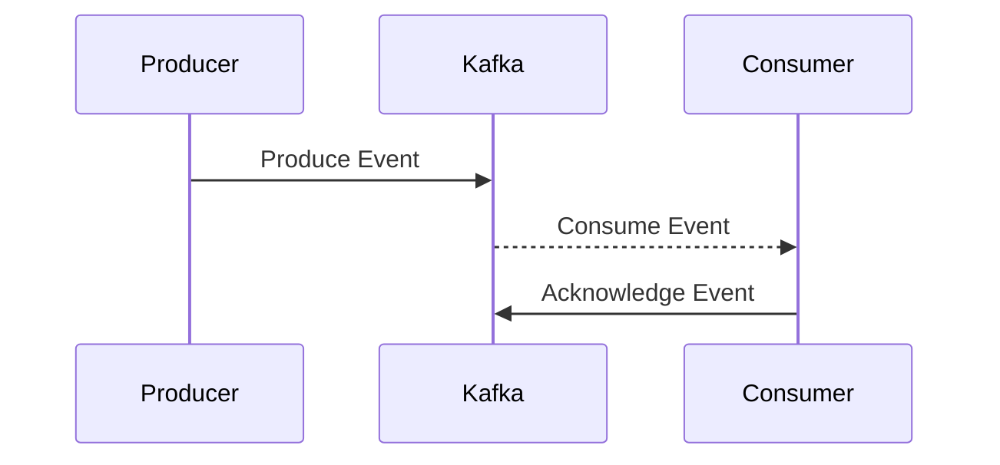

## 7.6.1 Implementing Event-Driven Systems in Java

In the world of modern software development, event-driven architectures have become a cornerstone for building scalable and responsive systems. At the heart of these architectures are messaging systems like Apache Kafka, which facilitate the flow of information between different components of an application. In this section, we'll explore how to implement event-driven systems in Java using Apache Kafka, covering setup, event production and consumption, and advanced patterns such as event sourcing and Command Query Responsibility Segregation (CQRS).

### Introduction to Messaging Systems

Messaging systems are integral to event-driven architectures. They act as intermediaries that enable different parts of a system to communicate asynchronously. This decoupling allows systems to be more flexible and scalable, as components can evolve independently without direct dependencies on each other.

#### Key Benefits of Messaging Systems

- **Decoupling**: By using a messaging system, components do not need to know about each other's existence. They only need to know how to send and receive messages.
- **Scalability**: Messaging systems can handle a large volume of messages, allowing systems to scale horizontally.
- **Reliability**: They often provide mechanisms for ensuring message delivery, such as retries and acknowledgments.
- **Flexibility**: New components can be added to the system without disrupting existing ones.

### Setting Up Apache Kafka with Java

Apache Kafka is a distributed event streaming platform capable of handling trillions of events a day. It's widely used for building real-time data pipelines and streaming applications.

#### Installing Apache Kafka

1. **Download Kafka**: Obtain the latest version of Kafka from the [official Apache Kafka website](https://kafka.apache.org/downloads).
2. **Extract the Archive**: Unzip the downloaded file to a directory of your choice.
3. **Start Zookeeper**: Kafka requires Zookeeper to manage its cluster. Start it using the following command:
   ```bash
   bin/zookeeper-server-start.sh config/zookeeper.properties
   ```
4. **Start Kafka Server**: Once Zookeeper is running, start the Kafka server:
   ```bash
   bin/kafka-server-start.sh config/server.properties
   ```

#### Setting Up a Java Project

To interact with Kafka from Java, you'll need to set up a Java project with the necessary dependencies.

1. **Create a Maven or Gradle Project**: Use your preferred build tool to create a new Java project.
2. **Add Kafka Dependencies**: Include the Kafka client library in your `pom.xml` (for Maven) or `build.gradle` (for Gradle).

   **Maven:**
   ```xml
   <dependency>
       <groupId>org.apache.kafka</groupId>
       <artifactId>kafka-clients</artifactId>
       <version>3.0.0</version>
   </dependency>
   ```

   **Gradle:**
   ```groovy
   implementation 'org.apache.kafka:kafka-clients:3.0.0'
   ```

### Producing and Consuming Events

With Kafka set up and your Java project ready, let's dive into producing and consuming events.

#### Producing Events

A Kafka producer is responsible for publishing messages to a Kafka topic. Here's a simple example of a Kafka producer in Java:

```java
import org.apache.kafka.clients.producer.KafkaProducer;
import org.apache.kafka.clients.producer.ProducerRecord;
import org.apache.kafka.clients.producer.RecordMetadata;
import org.apache.kafka.clients.producer.Callback;
import java.util.Properties;

public class SimpleProducer {
    public static void main(String[] args) {
        Properties props = new Properties();
        props.put("bootstrap.servers", "localhost:9092");
        props.put("key.serializer", "org.apache.kafka.common.serialization.StringSerializer");
        props.put("value.serializer", "org.apache.kafka.common.serialization.StringSerializer");

        KafkaProducer<String, String> producer = new KafkaProducer<>(props);

        ProducerRecord<String, String> record = new ProducerRecord<>("my-topic", "key", "value");

        producer.send(record, new Callback() {
            public void onCompletion(RecordMetadata metadata, Exception e) {
                if (e != null) {
                    e.printStackTrace();
                } else {
                    System.out.printf("Sent message to topic %s partition %d with offset %d%n",
                            metadata.topic(), metadata.partition(), metadata.offset());
                }
            }
        });

        producer.close();
    }
}
```

**Key Points:**
- **Properties Configuration**: The producer requires configuration properties, such as the Kafka broker address and serializers for the key and value.
- **ProducerRecord**: Represents the message to be sent, including the topic, key, and value.
- **Callback**: Provides feedback on the success or failure of the send operation.

#### Consuming Events

A Kafka consumer subscribes to one or more topics and processes the messages. Here's an example of a Kafka consumer in Java:

```java
import org.apache.kafka.clients.consumer.ConsumerRecord;
import org.apache.kafka.clients.consumer.ConsumerRecords;
import org.apache.kafka.clients.consumer.KafkaConsumer;
import java.util.Collections;
import java.util.Properties;

public class SimpleConsumer {
    public static void main(String[] args) {
        Properties props = new Properties();
        props.put("bootstrap.servers", "localhost:9092");
        props.put("group.id", "test-group");
        props.put("key.deserializer", "org.apache.kafka.common.serialization.StringDeserializer");
        props.put("value.deserializer", "org.apache.kafka.common.serialization.StringDeserializer");

        KafkaConsumer<String, String> consumer = new KafkaConsumer<>(props);
        consumer.subscribe(Collections.singletonList("my-topic"));

        while (true) {
            ConsumerRecords<String, String> records = consumer.poll(100);
            for (ConsumerRecord<String, String> record : records) {
                System.out.printf("Received message: key = %s, value = %s, from partition = %d%n",
                        record.key(), record.value(), record.partition());
            }
        }
    }
}
```

**Key Points:**
- **Properties Configuration**: Similar to the producer, the consumer requires configuration properties, including the group ID and deserializers.
- **Subscription**: The consumer subscribes to topics using `subscribe()`.
- **Polling**: The consumer polls for new messages in a loop.

### Advanced Patterns: Event Sourcing and CQRS

Event-driven systems often leverage advanced patterns like event sourcing and CQRS to manage state and operations efficiently.

#### Event Sourcing

Event sourcing is a pattern where state changes are captured as a sequence of events. Instead of storing the current state, you store the sequence of events that led to it. This provides a complete audit trail and allows for easy state reconstruction.

**Implementation Steps:**
1. **Capture Events**: Every change to the application state is captured as an event.
2. **Store Events**: Events are stored in an event store, which can be a Kafka topic.
3. **Reconstruct State**: The current state is reconstructed by replaying events.

**Code Example:**

```java
// Event class
public class OrderCreatedEvent {
    private final String orderId;
    private final String product;

    public OrderCreatedEvent(String orderId, String product) {
        this.orderId = orderId;
        this.product = product;
    }

    // Getters
}

// Event producer
public class EventProducer {
    private final KafkaProducer<String, OrderCreatedEvent> producer;

    public EventProducer(Properties props) {
        this.producer = new KafkaProducer<>(props);
    }

    public void produceEvent(String topic, OrderCreatedEvent event) {
        ProducerRecord<String, OrderCreatedEvent> record = new ProducerRecord<>(topic, event.getOrderId(), event);
        producer.send(record);
    }
}
```

**Benefits of Event Sourcing:**
- **Auditability**: Complete history of changes.
- **Reproducibility**: Ability to reconstruct past states.
- **Scalability**: Efficient handling of high-volume transactions.

#### Command Query Responsibility Segregation (CQRS)

CQRS is a pattern that separates read and write operations into different models. This allows for optimized handling of commands (writes) and queries (reads).

**Implementation Steps:**
1. **Command Model**: Handles write operations, often using event sourcing.
2. **Query Model**: Handles read operations, optimized for fast queries.
3. **Synchronization**: Ensure the query model is updated based on events from the command model.

**Code Example:**

```java
// Command handler
public class OrderCommandHandler {
    private final EventProducer eventProducer;

    public OrderCommandHandler(EventProducer eventProducer) {
        this.eventProducer = eventProducer;
    }

    public void handleCreateOrder(String orderId, String product) {
        OrderCreatedEvent event = new OrderCreatedEvent(orderId, product);
        eventProducer.produceEvent("order-events", event);
    }
}

// Query handler
public class OrderQueryHandler {
    private final Map<String, Order> orderStore = new HashMap<>();

    public Order getOrder(String orderId) {
        return orderStore.get(orderId);
    }

    public void updateOrderStore(OrderCreatedEvent event) {
        orderStore.put(event.getOrderId(), new Order(event.getOrderId(), event.getProduct()));
    }
}
```

**Benefits of CQRS:**
- **Scalability**: Optimized for separate scaling of reads and writes.
- **Performance**: Tailored models for specific operations.
- **Flexibility**: Easier to adapt to changing requirements.

### Ensuring Message Delivery and Processing Guarantees

In event-driven systems, ensuring reliable message delivery and processing is crucial. Kafka provides several mechanisms to achieve this.

#### Delivery Guarantees

1. **At Most Once**: Messages may be lost but are never redelivered.
2. **At Least Once**: Messages are never lost but may be redelivered.
3. **Exactly Once**: Messages are delivered exactly once, with no duplicates.

**Configuring Delivery Guarantees:**

- **Producer Acknowledgments**: Configure the producer to wait for acknowledgments from brokers.
  ```java
  props.put("acks", "all"); // Ensures all replicas acknowledge
  ```

- **Consumer Offsets**: Manage consumer offsets to control message acknowledgment.
  ```java
  props.put("enable.auto.commit", "false"); // Manual offset management
  ```

#### Processing Guarantees

- **Idempotency**: Ensure that processing a message multiple times has the same effect as processing it once.
- **Transactions**: Use Kafka's transactional APIs to ensure atomicity in message processing.

**Transactional Producer Example:**

```java
props.put("transactional.id", "my-transactional-id");
KafkaProducer<String, String> producer = new KafkaProducer<>(props);
producer.initTransactions();

try {
    producer.beginTransaction();
    producer.send(new ProducerRecord<>("topic", "key", "value"));
    producer.commitTransaction();
} catch (Exception e) {
    producer.abortTransaction();
}
```

### Visualizing Event-Driven Architecture

To better understand the flow of events in an event-driven system, let's visualize the architecture using a sequence diagram.



**Diagram Explanation:**
- **Producer**: Sends events to Kafka.
- **Kafka**: Acts as the intermediary, storing and forwarding events.
- **Consumer**: Receives and processes events, then acknowledges receipt.

### Try It Yourself

To deepen your understanding, try modifying the code examples:

1. **Change Topics**: Experiment with different topic names and observe the behavior.
2. **Add More Events**: Extend the event classes to include additional data fields.
3. **Implement CQRS**: Create a more complex CQRS setup with multiple command and query handlers.

### Knowledge Check

- **What are the benefits of using a messaging system in an event-driven architecture?**
- **How does Kafka ensure message delivery guarantees?**
- **What are the key differences between event sourcing and CQRS?**

### Summary

Implementing event-driven systems in Java using Apache Kafka provides a robust framework for building scalable and responsive applications. By leveraging messaging systems, developers can decouple components, ensure reliable message delivery, and utilize advanced patterns like event sourcing and CQRS. As you continue to explore event-driven architectures, remember to experiment with different configurations and patterns to find the best fit for your application's needs.

## Quiz Time!



### What is the primary role of a messaging system in an event-driven architecture?

- [x] To decouple components and facilitate asynchronous communication
- [ ] To synchronize components and ensure real-time processing
- [ ] To store data persistently across the system
- [ ] To provide a user interface for event management

> **Explanation:** Messaging systems decouple components by allowing them to communicate asynchronously, which is essential for scalability and flexibility.

### Which command is used to start the Kafka server?

- [ ] bin/zookeeper-server-start.sh config/zookeeper.properties
- [x] bin/kafka-server-start.sh config/server.properties
- [ ] bin/kafka-server-stop.sh config/server.properties
- [ ] bin/kafka-server-restart.sh config/server.properties

> **Explanation:** The command `bin/kafka-server-start.sh config/server.properties` is used to start the Kafka server, while Zookeeper is started separately.

### In Kafka, what is a ProducerRecord?

- [x] A message to be sent, including the topic, key, and value
- [ ] A record of all messages produced by a producer
- [ ] A log of consumer activities
- [ ] A configuration file for producers

> **Explanation:** A `ProducerRecord` represents a message that includes the topic, key, and value to be sent by the producer.

### What is the purpose of the `acks` configuration in Kafka producers?

- [x] To configure the level of acknowledgment required from brokers
- [ ] To specify the number of retries for message delivery
- [ ] To set the timeout for message delivery
- [ ] To determine the partitioning strategy for messages

> **Explanation:** The `acks` configuration determines how many broker acknowledgments are required before considering a message as successfully sent.

### Which pattern involves capturing state changes as a sequence of events?

- [x] Event Sourcing
- [ ] CQRS
- [ ] Observer
- [ ] Singleton

> **Explanation:** Event sourcing captures state changes as a sequence of events, allowing for complete audit trails and state reconstruction.

### What does CQRS stand for?

- [x] Command Query Responsibility Segregation
- [ ] Command Queue Routing System
- [ ] Centralized Query Response System
- [ ] Concurrent Query and Response Segmentation

> **Explanation:** CQRS stands for Command Query Responsibility Segregation, a pattern that separates read and write operations into different models.

### How can Kafka ensure exactly-once message delivery?

- [x] By using transactional APIs and idempotent producers
- [ ] By increasing the number of replicas
- [ ] By enabling auto-commit for consumers
- [ ] By using a single broker for message delivery

> **Explanation:** Kafka ensures exactly-once delivery through transactional APIs and idempotent producers, which prevent duplicates.

### What is a key benefit of using the CQRS pattern?

- [x] It allows for separate scaling of read and write operations
- [ ] It simplifies the codebase by merging read and write logic
- [ ] It reduces the need for message brokers
- [ ] It enhances the security of the system

> **Explanation:** CQRS allows for separate scaling of read and write operations, optimizing performance and flexibility.

### Which of the following is NOT a delivery guarantee provided by Kafka?

- [ ] At Most Once
- [ ] At Least Once
- [ ] Exactly Once
- [x] Real-Time Once

> **Explanation:** Kafka provides at most once, at least once, and exactly once delivery guarantees, but not "real-time once."

### True or False: In an event-driven system, components are tightly coupled.

- [ ] True
- [x] False

> **Explanation:** In an event-driven system, components are loosely coupled, allowing for independent evolution and scalability.



Remember, this is just the beginning. As you progress, you'll build more complex and interactive systems. Keep experimenting, stay curious, and enjoy the journey!
