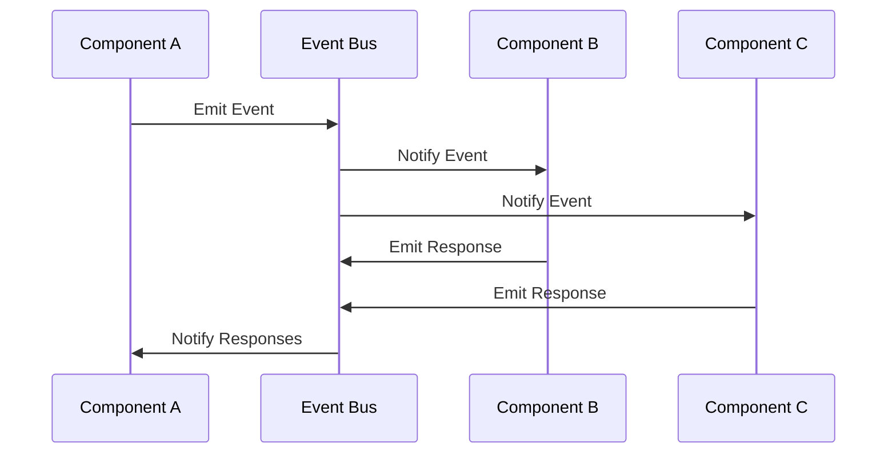

## 7.6.2 Asynchronous Communication

In today's fast-paced digital world, the demand for responsive and scalable applications has never been higher. Asynchronous communication plays a pivotal role in meeting these demands by decoupling components, allowing them to operate independently and efficiently. In this section, we will delve into the importance of asynchronous communication, explore how events facilitate this decoupling, and provide practical examples of implementing asynchronous workflows in Java. Additionally, we will address challenges such as eventual consistency and error handling, and suggest strategies for monitoring and debugging asynchronous systems.

### Importance of Asynchronous Communication

Asynchronous communication is crucial in modern applications for several reasons:

1. **Scalability**: By decoupling components, asynchronous communication allows systems to scale more easily. Each component can be scaled independently based on its load and performance requirements.

2. **Responsiveness**: Applications can remain responsive to users by offloading long-running tasks to background processes, thus improving user experience.

3. **Fault Tolerance**: Asynchronous systems can be designed to handle failures gracefully, retrying operations or rerouting tasks as needed without impacting the entire system.

4. **Resource Efficiency**: By not blocking threads waiting for responses, asynchronous communication makes more efficient use of system resources.

5. **Flexibility**: Components can be developed and deployed independently, allowing for greater flexibility in system design and maintenance.

### How Events Enable Component Independence

Events are the backbone of asynchronous communication, enabling components to operate independently. In an event-driven architecture, components communicate by emitting and responding to events. This decouples the sender and receiver, allowing them to evolve independently.

#### Event-Driven Architecture

In an event-driven architecture, components interact through events. An event is a message that signifies a change in state or an occurrence of interest. Components can emit events and subscribe to events emitted by others. This architecture promotes loose coupling, as components do not need to know about each other directly.

**Mermaid Diagram: Event-Driven Architecture**



### Implementing Asynchronous Workflows in Java

Java provides several tools and frameworks to implement asynchronous communication. Let's explore some common approaches:

#### Using Java's CompletableFuture

`CompletableFuture` is a powerful tool for asynchronous programming in Java. It allows you to write non-blocking code by representing a future result of an asynchronous computation.

**Example: Asynchronous Task with CompletableFuture**

```java
import java.util.concurrent.CompletableFuture;

public class AsyncExample {
    public static void main(String[] args) {
        // Start an asynchronous task
        CompletableFuture<Void> future = CompletableFuture.runAsync(() -> {
            // Simulate a long-running task
            try {
                Thread.sleep(2000);
                System.out.println("Task completed!");
            } catch (InterruptedException e) {
                e.printStackTrace();
            }
        });

        // Continue with other tasks
        System.out.println("Doing other work...");

        // Wait for the asynchronous task to complete
        future.join();
    }
}
```

In this example, the `CompletableFuture.runAsync` method is used to execute a task asynchronously. The main thread continues executing other work while the task runs in the background.

#### Event-Driven Frameworks

Java frameworks like Spring and Akka provide robust support for event-driven architectures. These frameworks offer tools for managing events, asynchronous processing, and system scalability.

**Example: Asynchronous Event Handling with Spring**

Spring's `@Async` annotation can be used to execute methods asynchronously.

```java
import org.springframework.scheduling.annotation.Async;
import org.springframework.stereotype.Service;

@Service
public class EventService {

    @Async
    public void handleEvent(String event) {
        System.out.println("Handling event: " + event);
        // Simulate processing
        try {
            Thread.sleep(1000);
        } catch (InterruptedException e) {
            e.printStackTrace();
        }
        System.out.println("Event handled: " + event);
    }
}
```

In this example, the `handleEvent` method is executed asynchronously whenever it is called, allowing the application to continue processing other tasks.

### Challenges in Asynchronous Communication

While asynchronous communication offers many benefits, it also introduces challenges that must be addressed:

#### Eventual Consistency

In asynchronous systems, data consistency can become a challenge. Since operations are not performed in a strict sequence, there may be temporary inconsistencies. Eventual consistency is a model where the system guarantees that, given enough time, all updates will propagate and the system will become consistent.

**Strategies for Managing Eventual Consistency:**

- **Use Idempotent Operations**: Ensure that operations can be applied multiple times without changing the result beyond the initial application.
- **Implement Retries with Backoff**: Automatically retry failed operations with increasing delays to handle transient failures.
- **Use Distributed Transactions**: In some cases, distributed transactions can ensure consistency across components.

#### Error Handling

Error handling in asynchronous systems can be complex, as errors may occur at different stages of processing.

**Strategies for Error Handling:**

- **Centralized Error Logging**: Use a centralized logging system to capture and analyze errors across components.
- **Fallback Mechanisms**: Implement fallback mechanisms to provide alternative responses or actions when errors occur.
- **Circuit Breakers**: Use circuit breakers to prevent cascading failures by temporarily halting requests to a failing component.

### Monitoring and Debugging Asynchronous Systems

Monitoring and debugging asynchronous systems require specialized tools and strategies:

#### Monitoring Tools

- **Distributed Tracing**: Tools like Zipkin and Jaeger can trace requests across distributed systems, providing visibility into asynchronous workflows.
- **Metrics and Alerts**: Use monitoring tools like Prometheus and Grafana to collect metrics and set up alerts for unusual behavior.

#### Debugging Strategies

- **Log Correlation**: Use correlation IDs to trace related log entries across components.
- **Replay Mechanisms**: Implement mechanisms to replay events for debugging and testing purposes.
- **Simulate Failures**: Use tools to simulate failures and test the system's resilience and error handling.

### Try It Yourself

To deepen your understanding of asynchronous communication, try modifying the provided code examples:

1. **Enhance the CompletableFuture Example**: Add additional asynchronous tasks and chain them using `thenApply` or `thenCompose` methods.

2. **Experiment with Spring's @Async**: Create a Spring Boot application and use the `@Async` annotation to execute multiple methods asynchronously. Observe how the application behaves with different configurations.

3. **Implement a Simple Event Bus**: Create a basic event bus in Java that allows components to emit and subscribe to events. Experiment with different event types and handlers.

### Embrace the Journey

Remember, mastering asynchronous communication is a journey. As you progress, you'll build more resilient and scalable systems. Keep experimenting, stay curious, and enjoy the journey!

### References and Links

- [Java CompletableFuture Documentation](https://docs.oracle.com/javase/8/docs/api/java/util/concurrent/CompletableFuture.html)
- [Spring Asynchronous Execution](https://docs.spring.io/spring-framework/docs/current/reference/html/integration.html#scheduling-annotation-support-async)
- [Event-Driven Architecture on AWS](https://aws.amazon.com/event-driven-architecture/)
- [Distributed Tracing with Zipkin](https://zipkin.io/)

## Quiz Time!



### What is the primary benefit of asynchronous communication in modern applications?

- [x] Scalability and responsiveness
- [ ] Increased complexity
- [ ] Synchronous processing
- [ ] Reduced performance

> **Explanation:** Asynchronous communication enhances scalability and responsiveness by allowing components to operate independently and efficiently.

### How do events enable component independence in an event-driven architecture?

- [x] By decoupling senders and receivers
- [ ] By tightly coupling components
- [ ] By requiring synchronous communication
- [ ] By eliminating the need for communication

> **Explanation:** Events decouple senders and receivers, allowing components to operate independently in an event-driven architecture.

### Which Java class is commonly used for asynchronous programming?

- [x] CompletableFuture
- [ ] Thread
- [ ] ExecutorService
- [ ] FutureTask

> **Explanation:** `CompletableFuture` is a powerful class for asynchronous programming in Java, allowing non-blocking code execution.

### What is eventual consistency?

- [x] A model where the system becomes consistent over time
- [ ] A model where the system is always consistent
- [ ] A model where consistency is never achieved
- [ ] A model where consistency is immediate

> **Explanation:** Eventual consistency is a model where the system guarantees that, given enough time, all updates will propagate and the system will become consistent.

### What is a common strategy for error handling in asynchronous systems?

- [x] Centralized error logging and circuit breakers
- [ ] Ignoring errors
- [ ] Synchronous error handling
- [ ] Immediate retries without delay

> **Explanation:** Centralized error logging and circuit breakers are common strategies for handling errors in asynchronous systems.

### Which tool is used for distributed tracing in asynchronous systems?

- [x] Zipkin
- [ ] Prometheus
- [ ] Grafana
- [ ] Jenkins

> **Explanation:** Zipkin is a tool used for distributed tracing, providing visibility into asynchronous workflows across distributed systems.

### What is a fallback mechanism?

- [x] An alternative response or action when errors occur
- [ ] A primary response to all requests
- [ ] A method to ignore errors
- [ ] A way to increase system complexity

> **Explanation:** A fallback mechanism provides an alternative response or action when errors occur, enhancing system resilience.

### How can you simulate failures in an asynchronous system?

- [x] Use tools to simulate failures and test resilience
- [ ] Ignore potential failures
- [ ] Only test in production
- [ ] Avoid testing failures

> **Explanation:** Simulating failures using tools allows you to test the system's resilience and error handling capabilities.

### What is the purpose of using correlation IDs in log correlation?

- [x] To trace related log entries across components
- [ ] To increase log file size
- [ ] To hide log entries
- [ ] To reduce logging

> **Explanation:** Correlation IDs help trace related log entries across components, aiding in debugging and monitoring.

### Asynchronous communication is essential for building scalable and responsive applications.

- [x] True
- [ ] False

> **Explanation:** True. Asynchronous communication allows components to operate independently, enhancing scalability and responsiveness.


