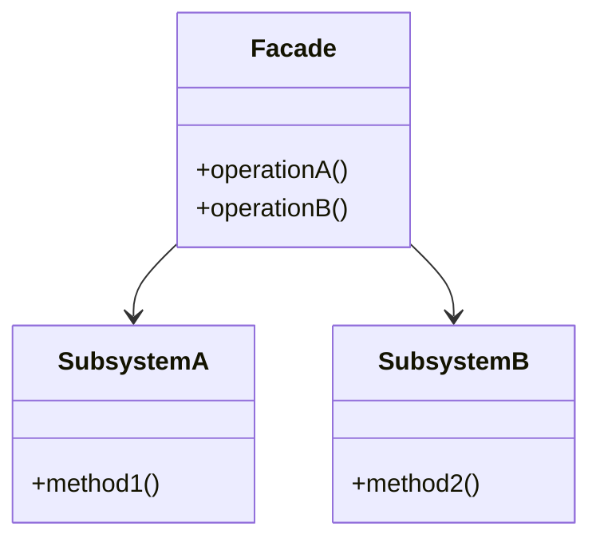
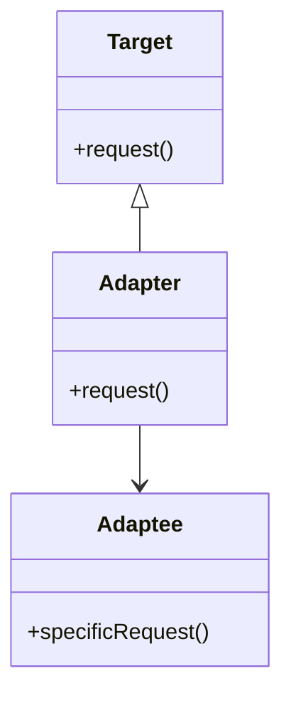

## 7.6.3 Facade vs. Adapter Pattern

In the realm of software design patterns, both the **Facade** and **Adapter** patterns play crucial roles in managing and simplifying complex systems. While they share the common goal of providing a simpler interface to a set of functionalities, their purposes and implementations differ significantly. This section delves into the nuances of each pattern, providing clarity on when and how to use them effectively in Java applications.

### Understanding the Facade Pattern

#### Intent

The **Facade Pattern** is a structural design pattern that provides a simplified interface to a complex subsystem. It is particularly useful when dealing with intricate libraries or frameworks, where the goal is to offer a more user-friendly interface without altering the underlying code.

#### Motivation

Imagine a scenario where a developer needs to interact with a complex library for multimedia processing. The library might have numerous classes and methods, each requiring specific configurations. By implementing a Facade, the developer can encapsulate these complexities and expose only the necessary functionalities, making the library easier to use.

#### Structure



*Diagram: The Facade pattern structure, showing how the Facade interacts with multiple subsystems.*

#### Participants

- **Facade**: The class that provides a simplified interface to the complex subsystem.
- **Subsystem Classes**: The classes that perform the actual work. The Facade delegates client requests to these classes.

#### Implementation

Consider a multimedia library with various subsystems for audio, video, and image processing. The Facade pattern can be used to create a simple interface for common tasks like playing a video or processing an image.

```java
// Subsystem classes
class AudioSystem {
    public void loadAudio(String file) {
        System.out.println("Loading audio file: " + file);
    }
    public void playAudio() {
        System.out.println("Playing audio...");
    }
}

class VideoSystem {
    public void loadVideo(String file) {
        System.out.println("Loading video file: " + file);
    }
    public void playVideo() {
        System.out.println("Playing video...");
    }
}

// Facade class
class MediaFacade {
    private AudioSystem audioSystem;
    private VideoSystem videoSystem;

    public MediaFacade() {
        this.audioSystem = new AudioSystem();
        this.videoSystem = new VideoSystem();
    }

    public void playMedia(String audioFile, String videoFile) {
        audioSystem.loadAudio(audioFile);
        audioSystem.playAudio();
        videoSystem.loadVideo(videoFile);
        videoSystem.playVideo();
    }
}

// Client code
public class FacadePatternDemo {
    public static void main(String[] args) {
        MediaFacade mediaFacade = new MediaFacade();
        mediaFacade.playMedia("song.mp3", "movie.mp4");
    }
}
```

*Explanation: The `MediaFacade` class simplifies the interaction with the `AudioSystem` and `VideoSystem` classes, providing a single method `playMedia` to handle both audio and video playback.*

### Understanding the Adapter Pattern

#### Intent

The **Adapter Pattern** is another structural design pattern that allows incompatible interfaces to work together. It acts as a bridge between two incompatible interfaces, enabling them to communicate effectively.

#### Motivation

Consider a scenario where a developer needs to integrate a new payment gateway into an existing e-commerce platform. The new gateway's API is different from the current system's expected interface. By using an Adapter, the developer can convert the new API's interface into a compatible format without modifying the existing code.

#### Structure



*Diagram: The Adapter pattern structure, illustrating how the Adapter converts the interface of the Adaptee into a Target interface.*

#### Participants

- **Target**: The interface expected by the client.
- **Adapter**: The class that implements the Target interface and translates requests to the Adaptee.
- **Adaptee**: The existing interface that needs adapting.

#### Implementation

Let's consider an example where a new payment gateway needs to be integrated into an existing system.

```java
// Existing payment interface
interface PaymentProcessor {
    void processPayment(double amount);
}

// New payment gateway with a different interface
class NewPaymentGateway {
    public void makePayment(double amount) {
        System.out.println("Processing payment of $" + amount + " through new gateway.");
    }
}

// Adapter class
class PaymentAdapter implements PaymentProcessor {
    private NewPaymentGateway newGateway;

    public PaymentAdapter(NewPaymentGateway newGateway) {
        this.newGateway = newGateway;
    }

    @Override
    public void processPayment(double amount) {
        newGateway.makePayment(amount);
    }
}

// Client code
public class AdapterPatternDemo {
    public static void main(String[] args) {
        NewPaymentGateway newGateway = new NewPaymentGateway();
        PaymentProcessor paymentProcessor = new PaymentAdapter(newGateway);
        paymentProcessor.processPayment(100.0);
    }
}
```

*Explanation: The `PaymentAdapter` class adapts the `NewPaymentGateway` to the `PaymentProcessor` interface, allowing the new gateway to be used seamlessly within the existing system.*

### Comparing Facade and Adapter Patterns

#### Key Differences

- **Purpose**: The primary difference lies in their intent. The Facade pattern simplifies a complex system by providing a unified interface, while the Adapter pattern makes two incompatible interfaces compatible.
- **Use Case**: Use the Facade pattern when you want to simplify interactions with a complex subsystem. Use the Adapter pattern when you need to integrate a new component with an existing system that has a different interface.
- **Implementation**: Facades often involve creating a new interface that aggregates multiple subsystems, whereas Adapters focus on converting one interface to another.

#### Practical Applications

- **Facade Pattern**: Ideal for creating a simplified interface for complex libraries or frameworks, such as a database connection manager or a multimedia processing library.
- **Adapter Pattern**: Useful for integrating third-party libraries or APIs with existing systems, such as adapting a new logging framework to work with an existing logging interface.

#### Interplay Between Facade and Adapter

In some cases, a Facade may internally use Adapters to achieve its goal. For instance, a Facade might simplify a complex system by using Adapters to integrate various components with different interfaces.

### Conclusion

Both the Facade and Adapter patterns are invaluable tools in a developer's toolkit, each serving distinct purposes. By understanding their differences and applications, developers can make informed decisions on which pattern to use in various scenarios, ultimately leading to more robust and maintainable software designs.

### Exercises

1. **Implement a Facade**: Create a Facade for a complex library you are familiar with, simplifying its interface for common tasks.
2. **Create an Adapter**: Identify a third-party library with an incompatible interface and create an Adapter to integrate it with your existing system.
3. **Combine Patterns**: Design a system where a Facade uses multiple Adapters to manage different components with varying interfaces.

### Key Takeaways

- The Facade pattern simplifies complex systems by providing a unified interface.
- The Adapter pattern enables compatibility between incompatible interfaces.
- Both patterns enhance code maintainability and flexibility.
- Understanding when to use each pattern is crucial for effective software design.

## Test Your Knowledge: Facade vs. Adapter Pattern Quiz



### What is the primary purpose of the Facade pattern?

- [x] To simplify a complex subsystem by providing a unified interface.
- [ ] To make incompatible interfaces compatible.
- [ ] To enhance performance.
- [ ] To increase security.

> **Explanation:** The Facade pattern is designed to provide a simplified interface to a complex subsystem, making it easier to use.

### When should you use the Adapter pattern?

- [x] When you need to integrate a new component with an existing system that has a different interface.
- [ ] When you want to simplify a complex subsystem.
- [ ] When you need to enhance security.
- [ ] When you want to improve performance.

> **Explanation:** The Adapter pattern is used to make two incompatible interfaces work together, allowing for seamless integration of new components.

### How does the Facade pattern differ from the Adapter pattern?

- [x] The Facade pattern simplifies a complex system, while the Adapter pattern makes incompatible interfaces compatible.
- [ ] The Facade pattern enhances performance, while the Adapter pattern increases security.
- [ ] The Facade pattern is used for security, while the Adapter pattern is used for performance.
- [ ] The Facade pattern is for compatibility, while the Adapter pattern is for simplification.

> **Explanation:** The Facade pattern focuses on simplifying complex systems, whereas the Adapter pattern is about making interfaces compatible.

### Can a Facade use Adapters internally?

- [x] Yes
- [ ] No

> **Explanation:** A Facade can use Adapters internally to manage different components with varying interfaces, providing a unified interface to the client.

### Which pattern would you use to integrate a third-party library with a different interface?

- [x] Adapter Pattern
- [ ] Facade Pattern
- [ ] Singleton Pattern
- [ ] Observer Pattern

> **Explanation:** The Adapter pattern is ideal for integrating third-party libraries with different interfaces, allowing them to work with existing systems.

### What is a common use case for the Facade pattern?

- [x] Simplifying interactions with a complex library or framework.
- [ ] Integrating a new component with an existing system.
- [ ] Enhancing security.
- [ ] Improving performance.

> **Explanation:** The Facade pattern is commonly used to simplify interactions with complex libraries or frameworks by providing a unified interface.

### Which pattern focuses on converting one interface to another?

- [x] Adapter Pattern
- [ ] Facade Pattern
- [ ] Singleton Pattern
- [ ] Observer Pattern

> **Explanation:** The Adapter pattern focuses on converting one interface to another, enabling compatibility between different systems.

### What is the role of the Adapter in the Adapter pattern?

- [x] To implement the Target interface and translate requests to the Adaptee.
- [ ] To simplify a complex subsystem.
- [ ] To enhance performance.
- [ ] To increase security.

> **Explanation:** The Adapter implements the Target interface and translates client requests to the Adaptee, enabling compatibility.

### Can the Adapter pattern be used to simplify a complex system?

- [ ] Yes
- [x] No

> **Explanation:** The Adapter pattern is not intended to simplify complex systems; it is used to make incompatible interfaces compatible.

### True or False: The Facade pattern is used to make incompatible interfaces compatible.

- [ ] True
- [x] False

> **Explanation:** False. The Facade pattern is used to simplify complex systems, not to make incompatible interfaces compatible.



By mastering the Facade and Adapter patterns, Java developers and software architects can create more efficient, maintainable, and adaptable systems. Understanding these patterns' distinct purposes and applications is essential for effective software design and architecture.
