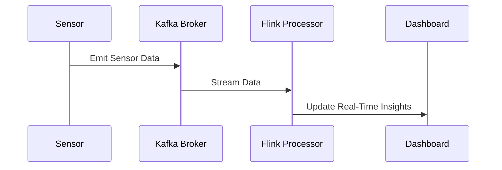

## 7.6.3 Use Cases and Examples

In the rapidly evolving landscape of software development, Event-Driven Architecture (EDA) has emerged as a powerful paradigm for building systems that are scalable, responsive, and capable of handling high-throughput data streams. This section delves into practical applications of EDA, particularly in real-time data processing and Internet of Things (IoT) applications. We will explore how EDA addresses the challenges of modern software systems, providing insights into implementation details and the benefits it offers.

### Understanding Event-Driven Architecture

Before diving into specific use cases, let's briefly revisit the core concepts of Event-Driven Architecture. EDA is a software architecture paradigm that revolves around the production, detection, consumption, and reaction to events. An event can be defined as a significant change in state or an occurrence that is of interest to the system. In EDA, components communicate by emitting and responding to events, leading to a decoupled and flexible system design.

#### Key Components of EDA

1. **Event Producers**: These are components or services that generate events. In an IoT system, sensors can act as event producers by emitting data readings.

2. **Event Consumers**: These components listen for events and react accordingly. For instance, an analytics service might consume sensor data to perform real-time analysis.

3. **Event Channels**: These are the pathways through which events are transmitted from producers to consumers. Message brokers like Apache Kafka or RabbitMQ are often used as event channels.

4. **Event Processors**: These components process the events, which may involve filtering, aggregating, or transforming the data.

5. **Event Sinks**: These are the endpoints where processed events are stored or further acted upon, such as databases or dashboards.

### Use Case 1: Real-Time Analytics Platforms

Real-time analytics platforms are a quintessential example of EDA in action. These platforms are designed to process and analyze data as it is generated, providing immediate insights and enabling quick decision-making.

#### Implementation Details

- **Data Ingestion**: Events are ingested from various sources such as web applications, mobile apps, or IoT devices. This is typically handled by an event streaming platform like Apache Kafka, which can manage high-throughput data streams.

- **Stream Processing**: Once ingested, the data is processed in real-time using stream processing frameworks such as Apache Flink or Apache Storm. These frameworks allow for complex event processing, including filtering, aggregation, and enrichment.

- **Data Storage and Visualization**: Processed data is stored in a database optimized for real-time analytics, such as Apache Druid or Elasticsearch. Visualization tools like Grafana or Kibana can then be used to create dashboards that provide real-time insights.

#### Benefits Observed

- **Scalability**: EDA enables systems to scale horizontally by adding more event consumers or processors as needed, without disrupting the existing architecture.

- **Responsiveness**: By processing data in real-time, analytics platforms can provide immediate feedback and insights, which is crucial for applications like fraud detection or monitoring critical infrastructure.

- **Flexibility**: The decoupled nature of EDA allows for easy integration of new data sources or analytics capabilities without significant changes to the system.

#### Challenges Addressed

- **Data Consistency**: Ensuring data consistency across distributed components can be challenging. Techniques such as event sourcing and CQRS (Command Query Responsibility Segregation) are often employed to address this.

- **Latency**: Minimizing latency is critical in real-time systems. Optimizing event processing pipelines and using in-memory data stores can help reduce latency.

### Use Case 2: IoT Sensor Data Processing

The Internet of Things (IoT) is another domain where EDA shines. IoT systems often involve a vast number of devices generating continuous streams of data that need to be processed and acted upon in real-time.

#### Implementation Details

- **Event Generation**: IoT devices, such as sensors or smart appliances, generate events based on changes in their environment. These events are transmitted over protocols like MQTT or CoAP to an IoT gateway.

- **Event Aggregation and Processing**: The IoT gateway aggregates events from multiple devices and forwards them to an event processing platform. This platform can perform operations such as anomaly detection, pattern recognition, or predictive analytics.

- **Actionable Insights and Control**: Processed events can trigger actions, such as sending alerts, adjusting device settings, or updating dashboards. This feedback loop is essential for applications like smart home automation or industrial monitoring.

#### Benefits Observed

- **Real-Time Decision Making**: EDA enables IoT systems to make decisions in real-time, such as adjusting the temperature in a smart building based on occupancy data.

- **Scalability and Resilience**: IoT systems can scale to accommodate millions of devices by distributing event processing across multiple nodes. The decoupled nature of EDA also enhances system resilience, as failures in one component do not affect others.

- **Interoperability**: EDA facilitates interoperability between heterogeneous devices and systems, allowing for seamless integration and communication.

#### Challenges Addressed

- **Security**: Ensuring the security of IoT devices and data is paramount. EDA can incorporate security measures such as encryption and authentication at the event channel level.

- **Data Volume and Velocity**: IoT systems generate massive volumes of data at high velocity. EDA helps manage this by distributing processing tasks and using scalable storage solutions.

### Code Example: Real-Time Analytics with Apache Kafka and Flink

Let's explore a code example that demonstrates how EDA can be implemented for real-time analytics using Apache Kafka and Apache Flink.

```java
import org.apache.flink.api.common.functions.MapFunction;
import org.apache.flink.streaming.api.datastream.DataStream;
import org.apache.flink.streaming.api.environment.StreamExecutionEnvironment;
import org.apache.flink.streaming.connectors.kafka.FlinkKafkaConsumer;
import org.apache.flink.streaming.util.serialization.SimpleStringSchema;

import java.util.Properties;

public class RealTimeAnalytics {

    public static void main(String[] args) throws Exception {
        // Set up the execution environment
        StreamExecutionEnvironment env = StreamExecutionEnvironment.getExecutionEnvironment();

        // Configure Kafka consumer properties
        Properties properties = new Properties();
        properties.setProperty("bootstrap.servers", "localhost:9092");
        properties.setProperty("group.id", "flink-consumer-group");

        // Create a Kafka consumer
        FlinkKafkaConsumer<String> kafkaConsumer = new FlinkKafkaConsumer<>(
                "sensor-data",
                new SimpleStringSchema(),
                properties
        );

        // Add the consumer as a source to the Flink job
        DataStream<String> stream = env.addSource(kafkaConsumer);

        // Process the stream: parse JSON and extract temperature
        DataStream<Double> temperatures = stream.map(new MapFunction<String, Double>() {
            @Override
            public Double map(String value) throws Exception {
                // Assume the input is a JSON string with a "temperature" field
                // For simplicity, we'll just parse it manually
                String tempStr = value.split(",")[1].split(":")[1];
                return Double.parseDouble(tempStr);
            }
        });

        // Print the processed temperatures
        temperatures.print();

        // Execute the Flink job
        env.execute("Real-Time Analytics with Flink");
    }
}
```

In this example, we set up a Flink job that consumes sensor data from a Kafka topic named "sensor-data". The data is processed in real-time to extract temperature readings, which are then printed to the console. This simple example illustrates the power of EDA in handling continuous data streams efficiently.

### Visualizing Event-Driven Architecture

To better understand how components interact in an event-driven system, let's visualize the architecture using a sequence diagram.



**Diagram Description**: This sequence diagram illustrates the flow of events in a real-time analytics platform. Sensors emit data to a Kafka broker, which streams the data to a Flink processor. The processor updates a dashboard with real-time insights.

### Try It Yourself

To deepen your understanding of EDA, try modifying the code example to include additional processing steps, such as filtering out temperature readings below a certain threshold or aggregating data over time windows. Experiment with different Kafka topics and Flink operators to see how they affect the system's behavior.

### Use Case 3: Financial Services and Fraud Detection

In the financial sector, EDA is leveraged for real-time fraud detection and transaction monitoring. Financial institutions need to process vast amounts of transaction data to identify suspicious activities promptly.

#### Implementation Details

- **Event Generation**: Transactions are treated as events, with each transaction generating an event that is sent to a processing system.

- **Real-Time Processing**: Machine learning models or rule-based systems are used to analyze transaction events in real-time, identifying patterns indicative of fraud.

- **Automated Responses**: Upon detecting a suspicious transaction, the system can automatically trigger actions such as alerting a human operator, blocking the transaction, or requesting additional verification.

#### Benefits Observed

- **Proactive Fraud Prevention**: By detecting fraudulent activities in real-time, financial institutions can prevent losses and protect customer accounts.

- **Regulatory Compliance**: EDA helps institutions comply with regulations that require timely reporting and monitoring of transactions.

- **Improved Customer Experience**: Quick detection and resolution of fraudulent activities enhance customer trust and satisfaction.

#### Challenges Addressed

- **Data Privacy**: Ensuring the privacy and security of sensitive financial data is critical. EDA systems must implement robust encryption and access controls.

- **Scalability**: Financial systems must handle high transaction volumes, especially during peak times. EDA's scalability ensures consistent performance.

### Use Case 4: Smart Cities and Infrastructure Monitoring

Smart cities leverage EDA to monitor and manage infrastructure, such as traffic systems, utilities, and public safety services.

#### Implementation Details

- **Event Sources**: Sensors and IoT devices deployed across the city generate events related to traffic flow, energy consumption, air quality, etc.

- **Centralized Processing**: A central event processing hub aggregates and analyzes data from various sources, providing a holistic view of city operations.

- **Automated Control**: Based on the analysis, the system can automatically adjust traffic signals, optimize energy distribution, or dispatch emergency services.

#### Benefits Observed

- **Efficient Resource Management**: EDA enables cities to optimize resource usage, reducing waste and improving service delivery.

- **Enhanced Public Safety**: Real-time monitoring and automated responses enhance the safety and security of citizens.

- **Sustainability**: By optimizing energy consumption and reducing emissions, EDA contributes to sustainable urban development.

#### Challenges Addressed

- **Interoperability**: Integrating diverse systems and devices from different vendors requires a flexible and interoperable architecture.

- **Data Overload**: Managing and processing the massive volumes of data generated by a smart city can be challenging. EDA helps by distributing processing tasks and prioritizing critical events.

### Conclusion

Event-Driven Architecture is a versatile and powerful approach to building systems that require real-time processing, scalability, and flexibility. Its applications span various domains, from real-time analytics and IoT to financial services and smart cities. By embracing EDA, organizations can enhance their responsiveness, improve decision-making, and drive innovation.

### Key Takeaways

- **Scalability and Responsiveness**: EDA enables systems to scale horizontally and respond to events in real-time, making it ideal for high-throughput applications.

- **Decoupled Architecture**: The decoupled nature of EDA allows for flexibility and ease of integration, accommodating changes and new requirements with minimal disruption.

- **Real-World Applications**: EDA is widely used in real-time analytics, IoT, financial services, and smart city initiatives, demonstrating its versatility and effectiveness.

- **Implementation Challenges**: While EDA offers numerous benefits, it also presents challenges such as ensuring data consistency, managing security, and handling data volume and velocity.

### Further Reading

For those interested in exploring EDA further, consider the following resources:

- [Apache Kafka Documentation](https://kafka.apache.org/documentation/)
- [Apache Flink Documentation](https://flink.apache.org/documentation.html)
- [Event-Driven Architecture: Concepts and Patterns](https://martinfowler.com/articles/201701-event-driven.html)

## Quiz Time!



### What is a key benefit of using Event-Driven Architecture in real-time analytics platforms?

- [x] Scalability and responsiveness
- [ ] Reduced complexity in system design
- [ ] Elimination of data redundancy
- [ ] Simplified user interfaces

> **Explanation:** Event-Driven Architecture allows systems to scale and respond to events in real-time, making them ideal for high-throughput applications like real-time analytics platforms.


### Which component in an Event-Driven Architecture is responsible for transmitting events from producers to consumers?

- [ ] Event Processor
- [x] Event Channel
- [ ] Event Sink
- [ ] Event Consumer

> **Explanation:** Event Channels are the pathways through which events are transmitted from producers to consumers, often implemented using message brokers like Kafka.


### In the context of IoT, what role do sensors typically play in an Event-Driven Architecture?

- [ ] Event Consumer
- [x] Event Producer
- [ ] Event Processor
- [ ] Event Sink

> **Explanation:** Sensors act as Event Producers by generating data readings that are emitted as events to the system.


### What is a common challenge addressed by Event-Driven Architecture in IoT systems?

- [ ] Simplifying user interfaces
- [ ] Reducing software development time
- [x] Managing data volume and velocity
- [ ] Enhancing graphical rendering

> **Explanation:** IoT systems generate massive volumes of data at high velocity, and EDA helps manage this by distributing processing tasks and using scalable storage solutions.


### Which of the following is a benefit of using Event-Driven Architecture in financial services?

- [ ] Increased manual intervention
- [ ] Slower transaction processing
- [ ] Reduced regulatory compliance
- [x] Proactive fraud prevention

> **Explanation:** EDA enables real-time fraud detection and transaction monitoring, allowing financial institutions to prevent fraudulent activities proactively.


### What is a typical use case for Event-Driven Architecture in smart cities?

- [ ] Manual traffic signal control
- [x] Automated infrastructure monitoring
- [ ] Static energy distribution
- [ ] Paper-based public safety services

> **Explanation:** Smart cities use EDA for automated monitoring and management of infrastructure, such as traffic systems and utilities, enhancing efficiency and service delivery.


### How does Event-Driven Architecture enhance interoperability in IoT systems?

- [ ] By centralizing all data processing
- [ ] By reducing the number of devices
- [x] By facilitating communication between heterogeneous devices
- [ ] By eliminating the need for protocols

> **Explanation:** EDA facilitates interoperability by allowing seamless integration and communication between diverse devices and systems in IoT environments.


### What is a common tool used for stream processing in real-time analytics platforms?

- [ ] Apache Hadoop
- [x] Apache Flink
- [ ] MySQL
- [ ] Redis

> **Explanation:** Apache Flink is a stream processing framework commonly used in real-time analytics platforms to handle continuous data streams efficiently.


### Which protocol is often used for transmitting IoT events to an IoT gateway?

- [ ] HTTP
- [ ] FTP
- [x] MQTT
- [ ] SMTP

> **Explanation:** MQTT is a lightweight messaging protocol commonly used for transmitting IoT events due to its efficiency and low overhead.


### True or False: Event-Driven Architecture is only suitable for small-scale applications.

- [ ] True
- [x] False

> **Explanation:** Event-Driven Architecture is highly suitable for large-scale applications, as it supports scalability and can handle high-throughput data streams effectively.


