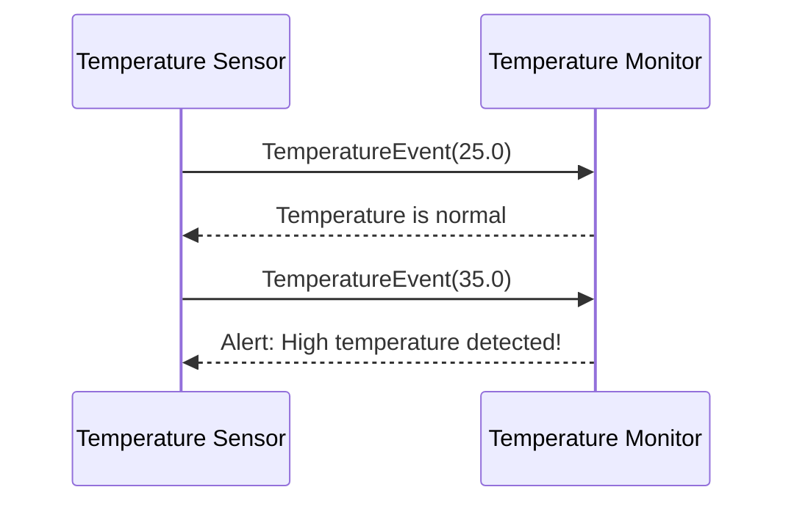

## 7.6 Event-Driven Architecture

In the realm of software design, Event-Driven Architecture (EDA) stands as a transformative approach that enhances the responsiveness and scalability of applications. By shifting the focus from traditional request-response paradigms to an event-centric model, EDA facilitates the creation of systems that are more adaptable to dynamic environments. This section delves into the core concepts of Event-Driven Architecture, its components, and the benefits it offers, particularly in Java applications.

### Understanding Event-Driven Architecture

**Event-Driven Architecture** is a software design pattern in which the flow of the program is determined by events. These events can be changes in state, user actions, or messages from other programs. The architecture is built around the production, detection, and consumption of events, allowing for a more flexible and decoupled system design.

#### Core Concepts of Event-Driven Architecture

1. **Events**: At the heart of EDA are events, which are significant changes in state or conditions that the system needs to respond to. Events can be anything from a user clicking a button to a sensor detecting a temperature change.

2. **Event Producers**: These are components or services that generate events. In a Java application, an event producer might be a user interface component, a microservice, or an external system.

3. **Event Consumers**: These are components that listen for and process events. They can perform actions based on the events they receive, such as updating a database or triggering a workflow.

4. **Event Bus**: This is the communication backbone that routes events from producers to consumers. It can be implemented using message brokers like Apache Kafka, RabbitMQ, or Java's own event handling mechanisms.

5. **Event Processing**: This involves handling events as they occur, which can include filtering, transforming, and aggregating events before they reach the consumers.

### Differentiating EDA from Traditional Architectures

Traditional architectures, such as the request-response model, rely on synchronous communication where a client sends a request and waits for a response. This approach can lead to tight coupling between components and scalability issues as the system grows.

In contrast, EDA promotes **asynchronous communication**, where components operate independently and communicate through events. This decoupling allows for greater flexibility and scalability, as components can be added or modified without impacting the entire system.

### Benefits of Event-Driven Architecture

1. **Improved Responsiveness**: EDA enables systems to react to events in real-time, providing a more responsive user experience.

2. **Scalability**: By decoupling components, EDA allows systems to scale more easily. Components can be distributed across multiple servers or data centers, and new components can be added without disrupting existing functionality.

3. **Flexibility and Adaptability**: EDA supports dynamic system changes, making it easier to integrate new technologies or adapt to changing business requirements.

4. **Resilience**: With EDA, failures in one component do not necessarily affect others, enhancing the overall resilience of the system.

### Components of Event-Driven Architecture

#### Event Producers

Event producers are responsible for generating events. In Java, these can be implemented using various techniques, such as:

- **JavaBeans**: Using property change listeners to generate events when a property changes.
- **Servlets**: Generating events in response to HTTP requests.
- **Microservices**: Emitting events when a significant business action occurs.

#### Event Consumers

Event consumers listen for and process events. They can be implemented using:

- **Observer Pattern**: Java's built-in `Observer` and `Observable` classes allow objects to be notified of changes in other objects.
- **Message-Driven Beans**: In Java EE, these beans can consume messages from a queue or topic.
- **Reactive Streams**: Using libraries like RxJava to handle asynchronous data streams.

#### Event Bus

The event bus is a central component that routes events from producers to consumers. It can be implemented using:

- **Message Brokers**: Tools like Apache Kafka or RabbitMQ provide robust messaging capabilities.
- **Java Event Handling**: Using the `java.util.EventObject` and `java.util.EventListener` interfaces for custom event handling.

#### Event Processing

Event processing involves managing the flow of events through the system. This can include:

- **Event Filtering**: Ensuring only relevant events reach the consumers.
- **Event Transformation**: Modifying events to a suitable format for consumers.
- **Event Aggregation**: Combining multiple events into a single event for processing.

### Implementing Event-Driven Architecture in Java

Let's explore how to implement an Event-Driven Architecture in Java with a simple example. We'll create a system where a temperature sensor generates events, and a monitoring service consumes these events to trigger alerts.

#### Step 1: Define the Event

```java
// TemperatureEvent.java
public class TemperatureEvent extends java.util.EventObject {
    private final double temperature;

    public TemperatureEvent(Object source, double temperature) {
        super(source);
        this.temperature = temperature;
    }

    public double getTemperature() {
        return temperature;
    }
}
```

#### Step 2: Create the Event Producer

```java
// TemperatureSensor.java
import java.util.ArrayList;
import java.util.List;

public class TemperatureSensor {
    private final List<TemperatureListener> listeners = new ArrayList<>();

    public void addTemperatureListener(TemperatureListener listener) {
        listeners.add(listener);
    }

    public void removeTemperatureListener(TemperatureListener listener) {
        listeners.remove(listener);
    }

    public void detectTemperatureChange(double newTemperature) {
        TemperatureEvent event = new TemperatureEvent(this, newTemperature);
        for (TemperatureListener listener : listeners) {
            listener.temperatureChanged(event);
        }
    }
}
```

#### Step 3: Define the Event Consumer Interface

```java
// TemperatureListener.java
public interface TemperatureListener {
    void temperatureChanged(TemperatureEvent event);
}
```

#### Step 4: Implement the Event Consumer

```java
// TemperatureMonitor.java
public class TemperatureMonitor implements TemperatureListener {
    @Override
    public void temperatureChanged(TemperatureEvent event) {
        double temperature = event.getTemperature();
        if (temperature > 30.0) {
            System.out.println("Alert: High temperature detected! " + temperature);
        } else {
            System.out.println("Temperature is normal: " + temperature);
        }
    }
}
```

#### Step 5: Integrate the Components

```java
// Main.java
public class Main {
    public static void main(String[] args) {
        TemperatureSensor sensor = new TemperatureSensor();
        TemperatureMonitor monitor = new TemperatureMonitor();

        sensor.addTemperatureListener(monitor);

        // Simulate temperature changes
        sensor.detectTemperatureChange(25.0);
        sensor.detectTemperatureChange(35.0);
    }
}
```

### Visualizing Event-Driven Architecture

To better understand the flow of events in an Event-Driven Architecture, let's visualize the interaction between components using a sequence diagram.



### Try It Yourself

Experiment with the code by adding more sensors or monitors. Try implementing additional event consumers that perform different actions based on the temperature. For instance, you could add a `CoolingSystem` class that activates when the temperature exceeds a certain threshold.

### Event-Driven Architecture in Practice

In real-world applications, Event-Driven Architecture is often used in scenarios requiring high scalability and responsiveness. Some common use cases include:

- **Real-Time Analytics**: Processing streams of data in real-time for insights and decision-making.
- **IoT Applications**: Managing data from numerous sensors and devices.
- **Microservices Communication**: Enabling services to communicate asynchronously and independently.

### Knowledge Check

1. **What is the primary benefit of using Event-Driven Architecture?**
   - It allows for asynchronous communication, leading to more scalable and flexible systems.

2. **How does an event bus facilitate communication in EDA?**
   - It routes events from producers to consumers, decoupling the components.

3. **What role do event consumers play in EDA?**
   - They listen for and process events, performing actions based on the event data.

### References and Further Reading

- [Apache Kafka Documentation](https://kafka.apache.org/documentation/)
- [Java Message Service (JMS) Tutorial](https://docs.oracle.com/javaee/7/tutorial/jms-concepts.htm)
- [Reactive Streams in Java](https://www.reactive-streams.org/)

### Embrace the Journey

Remember, Event-Driven Architecture is not just about implementing a pattern; it's about embracing a mindset that values flexibility, scalability, and responsiveness. As you explore this architecture, keep experimenting, stay curious, and enjoy the journey!

## Quiz Time!



### What is the primary benefit of using Event-Driven Architecture?

- [x] It allows for asynchronous communication, leading to more scalable and flexible systems.
- [ ] It simplifies synchronous communication between components.
- [ ] It reduces the need for event consumers.
- [ ] It eliminates the need for event producers.

> **Explanation:** Event-Driven Architecture enables asynchronous communication, which decouples components and enhances scalability and flexibility.

### How does an event bus facilitate communication in EDA?

- [x] It routes events from producers to consumers, decoupling the components.
- [ ] It directly connects producers and consumers.
- [ ] It stores events permanently.
- [ ] It eliminates the need for event producers.

> **Explanation:** The event bus acts as a mediator, routing events from producers to consumers, thereby decoupling them.

### What role do event consumers play in EDA?

- [x] They listen for and process events, performing actions based on the event data.
- [ ] They generate events for producers.
- [ ] They store events for future use.
- [ ] They eliminate the need for event producers.

> **Explanation:** Event consumers are responsible for processing events and taking appropriate actions based on the event data.

### Which of the following is a component of Event-Driven Architecture?

- [x] Event Bus
- [ ] Request Handler
- [ ] Database Controller
- [ ] User Interface

> **Explanation:** The event bus is a key component of Event-Driven Architecture, facilitating communication between producers and consumers.

### What is a common use case for Event-Driven Architecture?

- [x] Real-Time Analytics
- [ ] Static Web Pages
- [ ] Batch Processing
- [ ] Single-Threaded Applications

> **Explanation:** Event-Driven Architecture is often used in real-time analytics to process data streams and provide insights.

### How does EDA differ from traditional request-response architectures?

- [x] EDA uses asynchronous communication, while traditional architectures use synchronous communication.
- [ ] EDA eliminates the need for event consumers.
- [ ] EDA simplifies synchronous communication.
- [ ] EDA requires more event producers.

> **Explanation:** EDA focuses on asynchronous communication, allowing components to operate independently, unlike traditional synchronous architectures.

### What is the role of an event producer in EDA?

- [x] To generate events based on changes in state or conditions.
- [ ] To consume events and perform actions.
- [ ] To store events for future use.
- [ ] To eliminate the need for event consumers.

> **Explanation:** Event producers generate events when there are changes in state or conditions, which are then processed by consumers.

### Which Java component can be used as an event consumer?

- [x] Message-Driven Beans
- [ ] JavaBeans
- [ ] Servlet
- [ ] JDBC

> **Explanation:** Message-Driven Beans in Java EE can consume messages from queues or topics, acting as event consumers.

### What is a benefit of using an event bus in EDA?

- [x] It decouples event producers and consumers, enhancing system flexibility.
- [ ] It directly connects producers and consumers.
- [ ] It stores events permanently.
- [ ] It eliminates the need for event producers.

> **Explanation:** The event bus decouples producers and consumers, allowing for greater flexibility and scalability in the system.

### True or False: Event-Driven Architecture is suitable for systems requiring high scalability and responsiveness.

- [x] True
- [ ] False

> **Explanation:** True. Event-Driven Architecture is ideal for systems that need to scale and respond quickly to changes, such as real-time analytics and IoT applications.


