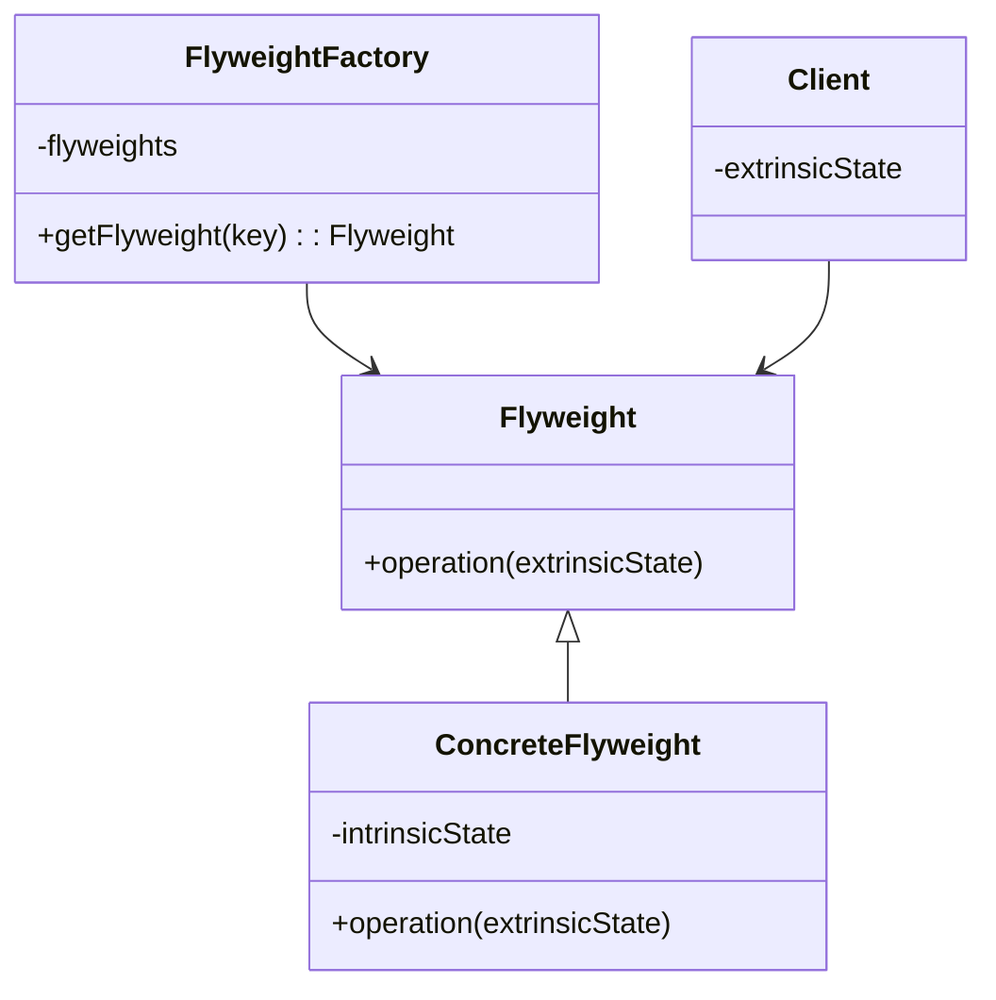

## 7.7.1 Implementing Flyweight in Java

The Flyweight pattern is a structural design pattern that focuses on minimizing memory usage by sharing as much data as possible with similar objects. This pattern is particularly useful when dealing with a large number of objects that share common data, allowing developers to optimize resource usage and improve application performance.

### Intent

The primary intent of the Flyweight pattern is to reduce the cost of creating and managing a large number of similar objects by sharing common parts of their state. This is achieved by separating the intrinsic state (shared) from the extrinsic state (unique to each object).

### Use Cases

- **Graphical User Interfaces (GUIs)**: When rendering a large number of similar graphical elements, such as icons or buttons, where the appearance is the same but the position or state may differ.
- **Text Editors**: Managing characters in a document where each character can share the same font and style information.
- **Game Development**: Managing a large number of similar game objects, such as trees or buildings in a virtual world.

### Intrinsic vs. Extrinsic State

- **Intrinsic State**: This is the shared part of the object that is invariant and can be stored in a flyweight object. For example, the font and style of a character in a text editor.
- **Extrinsic State**: This is the unique part of the object that is passed to the flyweight object when needed. For example, the position of a character in a document.

### Structure

The Flyweight pattern can be visualized using a UML class diagram:



**Diagram Explanation**: 
- **Flyweight**: Declares an interface through which flyweights can receive and act on extrinsic states.
- **ConcreteFlyweight**: Implements the Flyweight interface and stores intrinsic state.
- **FlyweightFactory**: Creates and manages flyweight objects, ensuring that flyweights are shared properly.
- **Client**: Maintains references to flyweights and computes or stores extrinsic states.

### Participants

- **Flyweight**: The interface or abstract class defining the operations that can be performed on flyweights.
- **ConcreteFlyweight**: Implements the Flyweight interface and adds storage for intrinsic state.
- **FlyweightFactory**: Manages flyweight objects and ensures that they are shared properly.
- **Client**: Maintains references to flyweights and computes or stores extrinsic states.

### Collaborations

- The client requests a flyweight from the factory, providing the necessary extrinsic state.
- The factory returns an existing flyweight or creates a new one if necessary.
- The client uses the flyweight, passing the extrinsic state to it.

### Consequences

- **Reduced Memory Usage**: By sharing common data, the Flyweight pattern significantly reduces memory consumption.
- **Increased Complexity**: The separation of intrinsic and extrinsic states can increase the complexity of the code.
- **Performance Overhead**: Managing shared objects and extrinsic states can introduce performance overhead.

### Implementation

#### Implementation Guidelines

1. **Identify Shared State**: Determine which parts of the object state can be shared and which are unique.
2. **Create Flyweight Interface**: Define an interface for flyweight objects that includes methods for handling extrinsic state.
3. **Implement Concrete Flyweights**: Implement the flyweight interface, storing intrinsic state.
4. **Develop Flyweight Factory**: Create a factory to manage and share flyweight objects.
5. **Manage Extrinsic State**: Ensure that the client manages extrinsic state and passes it to flyweight objects when needed.

#### Sample Code Snippets

Below is a Java implementation of the Flyweight pattern, demonstrating how to manage shared instances and client-supplied external state.

```java
// Flyweight interface
interface Flyweight {
    void operation(String extrinsicState);
}

// ConcreteFlyweight class
class ConcreteFlyweight implements Flyweight {
    private final String intrinsicState;

    public ConcreteFlyweight(String intrinsicState) {
        this.intrinsicState = intrinsicState;
    }

    @Override
    public void operation(String extrinsicState) {
        System.out.println("Intrinsic State: " + intrinsicState + ", Extrinsic State: " + extrinsicState);
    }
}

// FlyweightFactory class
class FlyweightFactory {
    private final Map<String, Flyweight> flyweights = new HashMap<>();

    public Flyweight getFlyweight(String key) {
        if (!flyweights.containsKey(key)) {
            flyweights.put(key, new ConcreteFlyweight(key));
        }
        return flyweights.get(key);
    }
}

// Client code
public class FlyweightPatternDemo {
    public static void main(String[] args) {
        FlyweightFactory factory = new FlyweightFactory();

        Flyweight flyweight1 = factory.getFlyweight("A");
        flyweight1.operation("First Call");

        Flyweight flyweight2 = factory.getFlyweight("B");
        flyweight2.operation("Second Call");

        Flyweight flyweight3 = factory.getFlyweight("A");
        flyweight3.operation("Third Call");

        // flyweight1 and flyweight3 are the same instance
        System.out.println("flyweight1 == flyweight3: " + (flyweight1 == flyweight3));
    }
}
```

**Explanation**: 
- The `Flyweight` interface defines the operation that uses extrinsic state.
- `ConcreteFlyweight` implements the `Flyweight` interface and stores intrinsic state.
- `FlyweightFactory` manages the creation and sharing of flyweight instances.
- The client code demonstrates how flyweights are shared and used with extrinsic state.

### Sample Use Cases

- **Text Rendering**: In a text editor, each character can be a flyweight, sharing font and style information while maintaining unique positions.
- **Game Development**: In a game, trees or buildings can be flyweights, sharing textures and models but having unique positions and states.

### Related Patterns

- **[6.6 Singleton Pattern]( "Singleton Pattern")**: The Flyweight pattern often uses the Singleton pattern to manage shared instances.
- **[7.5 Composite Pattern]( "Composite Pattern")**: Flyweight can be combined with Composite to implement shared leaf nodes.

### Known Uses

- **Java AWT**: The AWT uses flyweights for managing graphical elements like fonts.
- **String Pooling**: Java's String pooling mechanism is a form of the Flyweight pattern, where identical strings are shared to save memory.

### Best Practices

- **Identify Shared State Early**: Determine which parts of the object state can be shared to maximize memory savings.
- **Use with Caution**: The Flyweight pattern can increase complexity, so use it only when memory savings are significant.
- **Combine with Other Patterns**: Consider combining Flyweight with other patterns like Singleton for managing shared instances.

### Common Pitfalls

- **Over-Optimization**: Avoid using Flyweight for objects where memory savings are negligible.
- **Complex State Management**: Ensure that extrinsic state is managed effectively to avoid errors.

### Exercises

1. **Modify the Code**: Change the intrinsic state to include additional attributes and observe the impact on memory usage.
2. **Implement a New Use Case**: Use the Flyweight pattern to optimize a different scenario, such as managing a large number of network connections.

### Summary

The Flyweight pattern is a powerful tool for optimizing memory usage in applications that manage a large number of similar objects. By sharing common data and separating intrinsic and extrinsic states, developers can significantly reduce memory consumption and improve performance. However, careful consideration is needed to manage the increased complexity and ensure that the pattern is applied effectively.

## Test Your Knowledge: Flyweight Pattern in Java Quiz



### What is the primary goal of the Flyweight pattern?

- [x] To reduce memory usage by sharing common data among similar objects.
- [ ] To increase the speed of object creation.
- [ ] To simplify the code structure.
- [ ] To enhance security features.

> **Explanation:** The Flyweight pattern aims to minimize memory usage by sharing common parts of object data among many similar objects.

### Which state is shared among flyweight objects?

- [x] Intrinsic state
- [ ] Extrinsic state
- [ ] Both intrinsic and extrinsic states
- [ ] Neither intrinsic nor extrinsic states

> **Explanation:** Intrinsic state is the shared part of the object that is invariant and can be stored in a flyweight object.

### In the Flyweight pattern, what is the role of the FlyweightFactory?

- [x] To manage and share flyweight objects.
- [ ] To store extrinsic state.
- [ ] To create unique objects for each request.
- [ ] To handle user input.

> **Explanation:** The FlyweightFactory is responsible for creating and managing flyweight objects, ensuring that they are shared properly.

### What is an example of extrinsic state in a text editor using Flyweight?

- [x] The position of a character in the document.
- [ ] The font style of the text.
- [ ] The color of the text.
- [ ] The size of the text.

> **Explanation:** Extrinsic state is unique to each object and is passed to the flyweight object when needed, such as the position of a character in a document.

### Which design pattern is often used with Flyweight to manage shared instances?

- [x] Singleton Pattern
- [ ] Observer Pattern
- [ ] Strategy Pattern
- [ ] Decorator Pattern

> **Explanation:** The Singleton pattern is often used with Flyweight to manage shared instances and ensure that only one instance of a flyweight is created.

### What is a potential drawback of using the Flyweight pattern?

- [x] Increased complexity in managing extrinsic state.
- [ ] Reduced memory usage.
- [ ] Faster object creation.
- [ ] Simplified code structure.

> **Explanation:** The separation of intrinsic and extrinsic states can increase the complexity of the code, making it harder to manage.

### How can the Flyweight pattern be combined with the Composite pattern?

- [x] By implementing shared leaf nodes.
- [ ] By creating unique objects for each node.
- [ ] By simplifying the tree structure.
- [ ] By enhancing security features.

> **Explanation:** Flyweight can be combined with Composite to implement shared leaf nodes, optimizing memory usage in complex structures.

### What is a real-world example of the Flyweight pattern in Java?

- [x] Java's String pooling mechanism.
- [ ] Java's garbage collection.
- [ ] Java's exception handling.
- [ ] Java's threading model.

> **Explanation:** Java's String pooling mechanism is a form of the Flyweight pattern, where identical strings are shared to save memory.

### What should be considered when deciding to use the Flyweight pattern?

- [x] The potential memory savings and increased complexity.
- [ ] The speed of object creation.
- [ ] The simplicity of the code.
- [ ] The security features.

> **Explanation:** The Flyweight pattern should be used when memory savings are significant, but the increased complexity must also be considered.

### True or False: The Flyweight pattern is only useful for graphical applications.

- [ ] True
- [x] False

> **Explanation:** The Flyweight pattern is useful in various scenarios, not just graphical applications, wherever there is a need to manage a large number of similar objects efficiently.



By understanding and implementing the Flyweight pattern, Java developers can optimize memory usage and improve the performance of applications that manage a large number of similar objects. This pattern is a valuable tool in the arsenal of any software architect or experienced developer looking to create efficient and scalable systems.
