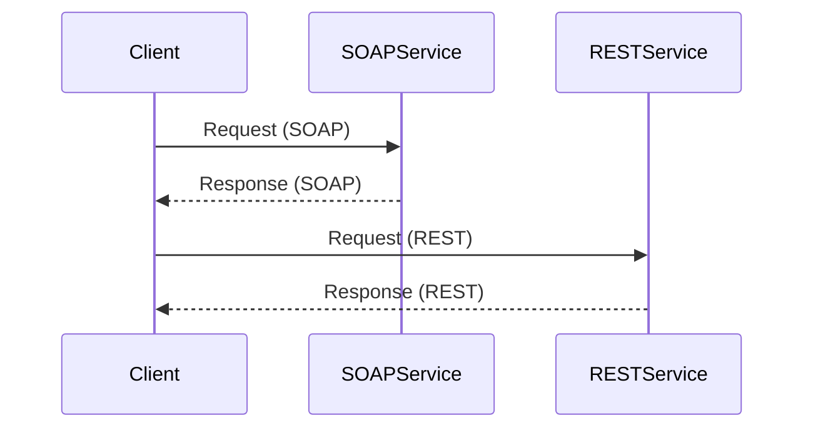

## 7.7.1 Implementing SOA in Java

Service-Oriented Architecture (SOA) is a design pattern where services are provided to other components by application components, through a communication protocol over a network. In Java, SOA is typically implemented using web services, which can be categorized into two main types: SOAP (Simple Object Access Protocol) and REST (Representational State Transfer) services. In this section, we will delve into the differences between these two types of web services, explore how to implement them in Java using JAX-WS for SOAP and JAX-RS or Spring Boot for RESTful services, and discuss best practices for designing service interfaces and contracts, as well as considerations for service versioning and backward compatibility.

### Understanding SOAP and RESTful Web Services

Before diving into implementation, it's crucial to understand the fundamental differences between SOAP and RESTful web services.

#### SOAP Web Services

SOAP is a protocol that defines a set of rules for structuring messages. It relies on XML for its message format and typically uses HTTP or SMTP for message negotiation and transmission. SOAP is known for its robustness and extensibility, offering features such as:

- **WS-Security**: Provides end-to-end security.
- **WS-ReliableMessaging**: Ensures message delivery.
- **WS-AtomicTransaction**: Supports distributed transactions.

SOAP is often used in enterprise environments where security, transactions, and reliability are critical.

#### RESTful Web Services

REST is an architectural style that uses HTTP for communication. It is based on stateless, client-server communication and emphasizes resources rather than operations. RESTful services are known for their simplicity and scalability, using standard HTTP methods such as GET, POST, PUT, DELETE, etc. RESTful services often return data in formats like JSON or XML.

REST is preferred for web-based applications due to its lightweight nature and ease of integration with web technologies.

### Implementing SOAP Services Using JAX-WS

Java API for XML Web Services (JAX-WS) is a Java API for creating SOAP-based web services. It simplifies the development of web services by providing annotations and tools for generating service interfaces and client stubs.

#### Setting Up a SOAP Service with JAX-WS

To implement a SOAP service using JAX-WS, follow these steps:

1. **Define the Service Endpoint Interface (SEI)**: This is a Java interface that declares the methods to be exposed as web services.

```java
import javax.jws.WebMethod;
import javax.jws.WebService;

@WebService
public interface CalculatorService {
    @WebMethod
    int add(int a, int b);

    @WebMethod
    int subtract(int a, int b);
}
```

2. **Implement the Service Endpoint Interface**: Create a class that implements the SEI.

```java
import javax.jws.WebService;

@WebService(endpointInterface = "com.example.CalculatorService")
public class CalculatorServiceImpl implements CalculatorService {
    @Override
    public int add(int a, int b) {
        return a + b;
    }

    @Override
    public int subtract(int a, int b) {
        return a - b;
    }
}
```

3. **Publish the Web Service**: Use the `Endpoint` class to publish the service.

```java
import javax.xml.ws.Endpoint;

public class CalculatorServicePublisher {
    public static void main(String[] args) {
        Endpoint.publish("http://localhost:8080/ws/calculator", new CalculatorServiceImpl());
        System.out.println("Service is published!");
    }
}
```

4. **Access the WSDL**: Once the service is published, you can access the WSDL at `http://localhost:8080/ws/calculator?wsdl`.

#### Consuming a SOAP Service

To consume a SOAP service, you can generate client stubs using the `wsimport` tool provided by JDK. This tool generates Java classes from a WSDL file.

```bash
wsimport -keep -s src -d bin http://localhost:8080/ws/calculator?wsdl
```

The generated classes can be used to invoke the web service methods.

```java
import com.example.CalculatorService;
import com.example.CalculatorServiceImplService;

public class CalculatorClient {
    public static void main(String[] args) {
        CalculatorServiceImplService service = new CalculatorServiceImplService();
        CalculatorService calculator = service.getCalculatorServiceImplPort();

        int result = calculator.add(5, 3);
        System.out.println("Result: " + result);
    }
}
```

### Implementing RESTful Services Using JAX-RS and Spring Boot

Java API for RESTful Web Services (JAX-RS) and Spring Boot are popular frameworks for creating RESTful services in Java.

#### Creating RESTful Services with JAX-RS

JAX-RS simplifies the development of RESTful services by using annotations to define resources and HTTP methods.

1. **Define a Resource Class**: Use annotations to map HTTP methods to Java methods.

```java
import javax.ws.rs.GET;
import javax.ws.rs.Path;
import javax.ws.rs.Produces;
import javax.ws.rs.core.MediaType;

@Path("/calculator")
public class CalculatorResource {

    @GET
    @Path("/add/{a}/{b}")
    @Produces(MediaType.APPLICATION_JSON)
    public int add(@PathParam("a") int a, @PathParam("b") int b) {
        return a + b;
    }
}
```

2. **Configure the Application**: Create a class that extends `Application` to configure the JAX-RS application.

```java
import javax.ws.rs.ApplicationPath;
import javax.ws.rs.core.Application;

@ApplicationPath("/api")
public class CalculatorApplication extends Application {
}
```

3. **Deploy the Application**: Package the application as a WAR file and deploy it to a servlet container like Tomcat or Jetty.

#### Creating RESTful Services with Spring Boot

Spring Boot simplifies RESTful service development by providing auto-configuration and embedded servers.

1. **Create a Spring Boot Application**: Use the `@SpringBootApplication` annotation to bootstrap the application.

```java
import org.springframework.boot.SpringApplication;
import org.springframework.boot.autoconfigure.SpringBootApplication;

@SpringBootApplication
public class CalculatorApplication {
    public static void main(String[] args) {
        SpringApplication.run(CalculatorApplication.class, args);
    }
}
```

2. **Define a REST Controller**: Use `@RestController` and `@RequestMapping` annotations to define endpoints.

```java
import org.springframework.web.bind.annotation.GetMapping;
import org.springframework.web.bind.annotation.PathVariable;
import org.springframework.web.bind.annotation.RestController;

@RestController
@RequestMapping("/calculator")
public class CalculatorController {

    @GetMapping("/add/{a}/{b}")
    public int add(@PathVariable int a, @PathVariable int b) {
        return a + b;
    }
}
```

3. **Run the Application**: Use the embedded server to run the application.

```bash
mvn spring-boot:run
```

### Best Practices for Designing Service Interfaces and Contracts

When designing service interfaces and contracts, consider the following best practices:

- **Use Clear and Consistent Naming**: Ensure that service names and operations are intuitive and consistent.
- **Design for Loose Coupling**: Services should be independent and loosely coupled to allow for flexibility and scalability.
- **Define Clear Contracts**: Use WSDL for SOAP and OpenAPI (formerly Swagger) for REST to define clear service contracts.
- **Version Your Services**: Implement versioning strategies to manage changes and ensure backward compatibility.
- **Handle Errors Gracefully**: Define standard error responses and use appropriate HTTP status codes in RESTful services.

### Considerations for Service Versioning and Backward Compatibility

Service versioning and backward compatibility are crucial for maintaining and evolving services without disrupting clients.

#### Versioning Strategies

- **URI Versioning**: Include the version number in the URI (e.g., `/api/v1/resource`).
- **Header Versioning**: Use custom headers to specify the version.
- **Content Negotiation**: Use the `Accept` header to negotiate the version.

#### Ensuring Backward Compatibility

- **Deprecate Gradually**: Announce deprecation of old versions and provide a transition period.
- **Maintain Old Versions**: Keep old versions available until clients have migrated.
- **Use Feature Toggles**: Enable or disable features based on version.

### Visualizing SOA Implementation

Below is a diagram illustrating the interaction between a client and a SOAP/RESTful service in a typical SOA implementation.



### Try It Yourself

To deepen your understanding, try modifying the code examples provided:

- **Extend the Calculator Service**: Add more operations like multiplication and division.
- **Implement Error Handling**: Add error handling for invalid inputs or operations.
- **Experiment with Versioning**: Implement a versioned API and observe how clients interact with different versions.

### Conclusion

Implementing SOA in Java using SOAP and RESTful web services provides a robust framework for building scalable and maintainable applications. By understanding the differences between SOAP and REST, and following best practices for service design, you can create services that are flexible, reliable, and easy to integrate. Remember to consider service versioning and backward compatibility to ensure a smooth evolution of your services.

## Quiz Time!



### What is a key feature of SOAP web services?

- [x] WS-Security
- [ ] Statelessness
- [ ] JSON support
- [ ] Simplicity

> **Explanation:** SOAP web services offer WS-Security for end-to-end security, which is a key feature for enterprise environments.

### Which HTTP method is typically used to retrieve data in RESTful services?

- [x] GET
- [ ] POST
- [ ] PUT
- [ ] DELETE

> **Explanation:** The GET method is used to retrieve data from a RESTful service.

### What annotation is used to define a JAX-WS service endpoint interface?

- [x] @WebService
- [ ] @RestController
- [ ] @Path
- [ ] @Service

> **Explanation:** The @WebService annotation is used to define a JAX-WS service endpoint interface.

### In Spring Boot, which annotation is used to define a REST controller?

- [x] @RestController
- [ ] @WebService
- [ ] @Path
- [ ] @Component

> **Explanation:** The @RestController annotation is used in Spring Boot to define a REST controller.

### What is a common strategy for versioning RESTful services?

- [x] URI Versioning
- [ ] SOAP Headers
- [ ] XML Namespaces
- [ ] JSON Schemas

> **Explanation:** URI Versioning is a common strategy for versioning RESTful services by including the version number in the URI.

### What tool is used to generate client stubs from a WSDL file in JAX-WS?

- [x] wsimport
- [ ] wsgen
- [ ] jaxrs-gen
- [ ] spring-gen

> **Explanation:** The wsimport tool is used to generate client stubs from a WSDL file in JAX-WS.

### Which annotation is used in JAX-RS to map a method to an HTTP GET request?

- [x] @GET
- [ ] @POST
- [ ] @PUT
- [ ] @DELETE

> **Explanation:** The @GET annotation is used in JAX-RS to map a method to an HTTP GET request.

### What is the primary data format used by SOAP?

- [x] XML
- [ ] JSON
- [ ] YAML
- [ ] CSV

> **Explanation:** SOAP primarily uses XML for its message format.

### What is a benefit of using RESTful services over SOAP?

- [x] Simplicity and scalability
- [ ] Built-in transaction support
- [ ] WS-Security
- [ ] XML-based messaging

> **Explanation:** RESTful services are known for their simplicity and scalability, making them suitable for web-based applications.

### True or False: SOAP services are typically stateless.

- [ ] True
- [x] False

> **Explanation:** SOAP services can maintain state, unlike RESTful services which are typically stateless.


