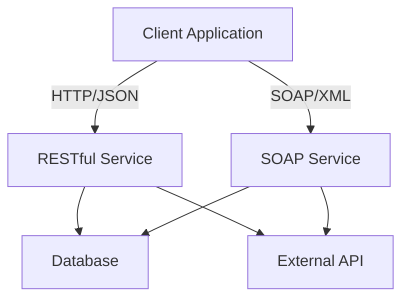

## 7.7.2 Interoperability and Reusability

In the realm of Service-Oriented Architecture (SOA), interoperability and reusability are pivotal concepts that ensure services can be effectively utilized across diverse platforms and applications. This section delves into the significance of these concepts, offering strategies to design services that are both interoperable and reusable.

### The Importance of Interoperability in SOA

Interoperability in SOA refers to the ability of services to interact seamlessly across different systems and platforms. This capability is crucial for several reasons:

- **Heterogeneous Environments**: Modern IT landscapes often consist of diverse systems, each with its own technology stack. Interoperability ensures that services can communicate across these varied environments without compatibility issues.
- **Business Agility**: By enabling seamless integration, interoperability allows businesses to adapt quickly to changing requirements, facilitating rapid deployment of new services and features.
- **Cost Efficiency**: Reducing the need for custom integration solutions lowers development and maintenance costs, making interoperability a cost-effective strategy.

### Strategies for Designing Platform-Agnostic Services

To achieve interoperability, services must be designed to be platform-agnostic. Here are some strategies to consider:

#### 1. Use Standard Protocols

Standard protocols like HTTP, HTTPS, and SOAP (Simple Object Access Protocol) are widely supported across platforms, making them ideal for service communication. REST (Representational State Transfer) is another popular architectural style that leverages HTTP, offering a lightweight alternative to SOAP.

#### 2. Employ Universal Data Formats

Using universal data formats such as XML (eXtensible Markup Language) and JSON (JavaScript Object Notation) ensures that data can be easily parsed and understood by different systems. These formats are human-readable and supported by most programming languages, enhancing interoperability.

#### 3. Define Clear Service Contracts

Service contracts define the interface and behavior of a service. By using standards like WSDL (Web Services Description Language) for SOAP services or Swagger/OpenAPI for RESTful services, you can create clear, machine-readable contracts that facilitate integration.

#### 4. Implement Loose Coupling

Loose coupling between services and clients allows for independent evolution. This can be achieved by abstracting service logic from the underlying platform and using interfaces to define service interactions.

### Using XML and JSON for Communication

XML and JSON are the de facto standards for data interchange in SOA due to their flexibility and ease of use. Let's explore how these formats contribute to interoperability:

#### XML (eXtensible Markup Language)

XML is a markup language that defines a set of rules for encoding documents in a format that is both human-readable and machine-readable. It is widely used for SOAP-based web services.

```xml
<person>
  <name>John Doe</name>
  <age>30</age>
  <email>john.doe@example.com</email>
</person>
```

- **Advantages**: XML is highly extensible, supports complex data structures, and is well-suited for document-centric data.
- **Disadvantages**: XML can be verbose, leading to larger message sizes compared to JSON.

#### JSON (JavaScript Object Notation)

JSON is a lightweight data interchange format that is easy for humans to read and write and easy for machines to parse and generate. It is commonly used in RESTful services.

```json
{
  "name": "John Doe",
  "age": 30,
  "email": "john.doe@example.com"
}
```

- **Advantages**: JSON is less verbose than XML, making it more efficient for data transmission. It is also natively supported by JavaScript, making it ideal for web applications.
- **Disadvantages**: JSON lacks support for comments and is less suitable for representing complex data structures.

### The Role of WSDL and Swagger/OpenAPI in Service Descriptions

Service descriptions are critical for defining how services can be consumed. WSDL and Swagger/OpenAPI are two prominent standards that facilitate this process:

#### WSDL (Web Services Description Language)

WSDL is an XML-based language used to describe the functionality offered by a web service. It provides a machine-readable description of how the service can be called, what parameters it expects, and what data structures it returns.

- **Structure**: A WSDL document typically includes definitions for data types, messages, operations, and bindings.
- **Usage**: WSDL is primarily used for SOAP-based services, enabling automatic generation of client-side code.

#### Swagger/OpenAPI

Swagger, now known as OpenAPI, is a specification for defining RESTful APIs. It provides a standard, language-agnostic interface to REST APIs, allowing both humans and computers to understand the capabilities of a service.

- **Structure**: An OpenAPI document includes paths, operations, parameters, responses, and security definitions.
- **Usage**: OpenAPI is widely used for RESTful services, supporting tools for documentation, client generation, and testing.

### Challenges in Achieving Reusability

While interoperability focuses on communication, reusability emphasizes the ability to use services across different contexts. Achieving reusability presents several challenges:

#### 1. Service Granularity

Determining the right level of granularity is crucial for reusability. Services that are too coarse-grained may be inflexible, while those that are too fine-grained can lead to excessive network overhead.

#### 2. Consistent Data Models

Inconsistent data models across services can hinder reusability. Establishing a common data model or using data transformation techniques can mitigate this issue.

#### 3. Versioning and Compatibility

As services evolve, maintaining backward compatibility is essential for reusability. Implementing versioning strategies ensures that changes do not break existing clients.

#### 4. Security and Access Control

Reusable services must implement robust security measures to prevent unauthorized access. This includes authentication, authorization, and encryption.

### Overcoming Reusability Challenges

To overcome these challenges, consider the following approaches:

- **Modular Design**: Design services as modular components that can be easily composed and reused.
- **Standardization**: Adopt industry standards for data formats, protocols, and service contracts.
- **Documentation**: Provide comprehensive documentation to facilitate understanding and integration.
- **Testing and Validation**: Implement rigorous testing and validation processes to ensure service reliability and compatibility.

### Code Examples

Let's explore some code examples to illustrate these concepts:

#### Example 1: Creating a RESTful Service with JSON

```java
import javax.ws.rs.*;
import javax.ws.rs.core.MediaType;
import javax.ws.rs.core.Response;

@Path("/person")
public class PersonService {

    @GET
    @Path("/{id}")
    @Produces(MediaType.APPLICATION_JSON)
    public Response getPerson(@PathParam("id") int id) {
        Person person = new Person(id, "John Doe", 30, "john.doe@example.com");
        return Response.ok(person).build();
    }
}

class Person {
    private int id;
    private String name;
    private int age;
    private String email;

    // Constructors, getters, and setters
}
```

- **Explanation**: This example demonstrates a simple RESTful service that returns a `Person` object in JSON format. The `@Path` annotation defines the service endpoint, and `@Produces` specifies the response media type.

#### Example 2: Defining a SOAP Service with WSDL

```xml
<definitions name="PersonService"
             targetNamespace="http://example.com/person"
             xmlns="http://schemas.xmlsoap.org/wsdl/"
             xmlns:soap="http://schemas.xmlsoap.org/wsdl/soap/"
             xmlns:tns="http://example.com/person"
             xmlns:xsd="http://www.w3.org/2001/XMLSchema">

    <message name="GetPersonRequest">
        <part name="id" type="xsd:int"/>
    </message>

    <message name="GetPersonResponse">
        <part name="person" type="tns:Person"/>
    </message>

    <portType name="PersonPortType">
        <operation name="GetPerson">
            <input message="tns:GetPersonRequest"/>
            <output message="tns:GetPersonResponse"/>
        </operation>
    </portType>

    <binding name="PersonBinding" type="tns:PersonPortType">
        <soap:binding style="rpc" transport="http://schemas.xmlsoap.org/soap/http"/>
        <operation name="GetPerson">
            <soap:operation soapAction="getPerson"/>
            <input>
                <soap:body use="literal"/>
            </input>
            <output>
                <soap:body use="literal"/>
            </output>
        </operation>
    </binding>

    <service name="PersonService">
        <port name="PersonPort" binding="tns:PersonBinding">
            <soap:address location="http://example.com/person"/>
        </port>
    </service>
</definitions>
```

- **Explanation**: This WSDL document defines a SOAP service for retrieving a `Person` object. It includes messages, port types, bindings, and a service definition.

### Visualizing Interoperability and Reusability

To better understand the concepts of interoperability and reusability, let's visualize a typical SOA environment:



- **Diagram Explanation**: This diagram illustrates a client application interacting with both RESTful and SOAP services. Both services access a shared database and external API, demonstrating interoperability and reusability.

### Try It Yourself

To deepen your understanding, try modifying the code examples:

- **RESTful Service**: Add a POST method to create a new `Person` object.
- **SOAP Service**: Extend the WSDL to include an operation for updating a `Person` object.

### References and Links

- [RESTful Web Services](https://restfulapi.net/)
- [SOAP Web Services](https://www.w3schools.com/xml/xml_soap.asp)
- [OpenAPI Specification](https://swagger.io/specification/)

### Knowledge Check

- **Question**: What are the advantages of using JSON over XML in RESTful services?
- **Exercise**: Implement a versioning strategy for the RESTful service example.

### Embrace the Journey

Remember, mastering interoperability and reusability in SOA is a journey. As you continue to explore these concepts, you'll gain the skills to design robust, flexible services that can thrive in diverse environments. Keep experimenting, stay curious, and enjoy the journey!

## Quiz Time!



### What is the primary goal of interoperability in SOA?

- [x] To enable seamless communication between different systems
- [ ] To ensure services are only used within a single platform
- [ ] To increase the complexity of service integration
- [ ] To limit the use of standard protocols

> **Explanation:** Interoperability aims to enable seamless communication between different systems, allowing services to work across various platforms.

### Which data format is known for being less verbose and more efficient for data transmission?

- [ ] XML
- [x] JSON
- [ ] CSV
- [ ] YAML

> **Explanation:** JSON is less verbose than XML, making it more efficient for data transmission, especially in web applications.

### What is the purpose of a service contract in SOA?

- [x] To define the interface and behavior of a service
- [ ] To restrict access to the service
- [ ] To increase the service's complexity
- [ ] To limit the service's functionality

> **Explanation:** A service contract defines the interface and behavior of a service, facilitating integration and interoperability.

### Which protocol is commonly used for RESTful services?

- [x] HTTP
- [ ] FTP
- [ ] SMTP
- [ ] SNMP

> **Explanation:** HTTP is the protocol commonly used for RESTful services, leveraging its methods for communication.

### What is a key challenge in achieving reusability in SOA?

- [x] Service granularity
- [ ] Lack of documentation
- [ ] Excessive standardization
- [ ] Overuse of comments

> **Explanation:** Service granularity is a key challenge in achieving reusability, as it affects the flexibility and efficiency of services.

### How can loose coupling be achieved in service design?

- [x] By abstracting service logic from the underlying platform
- [ ] By tightly integrating services with clients
- [ ] By using proprietary protocols
- [ ] By avoiding the use of interfaces

> **Explanation:** Loose coupling can be achieved by abstracting service logic from the underlying platform and using interfaces to define interactions.

### What is the role of WSDL in SOAP services?

- [x] To provide a machine-readable description of the service
- [ ] To encrypt the service data
- [ ] To limit the service's accessibility
- [ ] To increase the service's complexity

> **Explanation:** WSDL provides a machine-readable description of a SOAP service, detailing how it can be called and what it returns.

### Which of the following is a strategy for designing platform-agnostic services?

- [x] Using standard protocols
- [ ] Implementing proprietary solutions
- [ ] Increasing service complexity
- [ ] Reducing documentation

> **Explanation:** Using standard protocols is a strategy for designing platform-agnostic services, ensuring compatibility across different systems.

### What is a disadvantage of using XML for data interchange?

- [x] It can be verbose, leading to larger message sizes
- [ ] It is not human-readable
- [ ] It lacks support for complex data structures
- [ ] It is not supported by most programming languages

> **Explanation:** XML can be verbose, leading to larger message sizes compared to JSON, which is more efficient for data transmission.

### True or False: JSON is less suitable for representing complex data structures than XML.

- [x] True
- [ ] False

> **Explanation:** JSON is less suitable for representing complex data structures than XML, which supports more intricate hierarchies.


