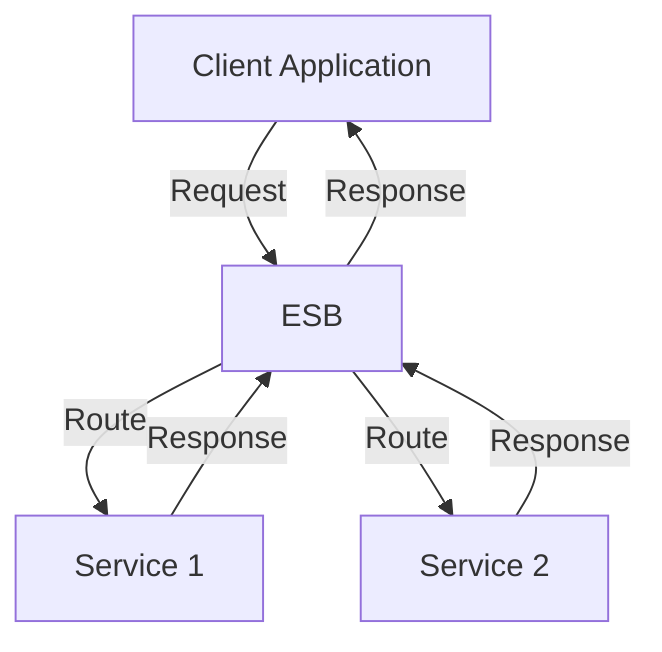

## 7.7.3 Use Cases and Examples

Service-Oriented Architecture (SOA) has become a cornerstone in modern enterprise systems, enabling organizations to integrate disparate systems and create modular, scalable architectures. In this section, we will delve into real-world use cases and examples of SOA, exploring how organizations leverage this architecture to achieve system integration, reduce costs, and enhance agility. We will also discuss the role of Enterprise Service Buses (ESBs) in SOA, provide diagrams to illustrate service interactions, and share best practices and lessons learned from these implementations.

### Understanding Service-Oriented Architecture (SOA)

Before diving into the use cases, let's briefly recap what SOA entails. SOA is a design pattern where services are provided to other components by application components, through a network. The principles of SOA include:

- **Interoperability**: Services can interact with each other regardless of the underlying technology.
- **Reusability**: Services are designed to be reused across different applications.
- **Loose Coupling**: Services maintain a relationship that minimizes dependencies.
- **Discoverability**: Services can be discovered and used by other components.

### Case Study 1: Financial Services Integration

#### Background

A global financial institution faced challenges in integrating its various legacy systems, which were developed over decades using different technologies. The lack of integration led to inefficiencies, increased maintenance costs, and slow response times to market changes.

#### SOA Implementation

The institution adopted SOA to create a unified platform that could integrate its disparate systems. They implemented an Enterprise Service Bus (ESB) to facilitate communication between services. The ESB acted as a middleware that handled message routing, transformation, and protocol conversion.

#### Benefits Achieved

- **Reduced Integration Costs**: By using SOA, the institution significantly reduced the cost of integrating new systems.
- **Increased Agility**: The ability to quickly adapt to market changes improved, as new services could be developed and deployed independently.
- **Enhanced Customer Experience**: Faster and more reliable services improved customer satisfaction.

#### Lessons Learned

- **Start Small**: Begin with a pilot project to demonstrate the benefits of SOA before scaling.
- **Invest in Governance**: Establish governance frameworks to manage services and ensure compliance with standards.

### Case Study 2: Healthcare System Modernization

#### Background

A national healthcare provider needed to modernize its IT infrastructure to improve patient care and comply with regulatory requirements. The existing systems were siloed, making it difficult to share patient information across departments.

#### SOA Implementation

The provider adopted SOA to create a patient-centric system that allowed seamless data exchange between departments. They used an ESB to integrate electronic health records (EHR), billing systems, and appointment scheduling.

#### Benefits Achieved

- **Improved Data Sharing**: Patient information became easily accessible across departments, improving care coordination.
- **Regulatory Compliance**: The new system complied with healthcare regulations, reducing the risk of penalties.
- **Scalability**: The modular nature of SOA allowed the provider to scale the system as needed.

#### Lessons Learned

- **Focus on Security**: Ensure that services are secure, especially when dealing with sensitive patient data.
- **Engage Stakeholders**: Involve all stakeholders in the design process to ensure the system meets their needs.

### Role of Enterprise Service Bus (ESB) in SOA

An ESB is a critical component in SOA implementations, acting as a communication backbone that connects services. It provides the following functionalities:

- **Message Routing**: Directs messages between services based on predefined rules.
- **Protocol Conversion**: Translates different communication protocols to ensure interoperability.
- **Message Transformation**: Converts message formats to match the requirements of different services.

#### Diagram: Service Interactions in an SOA Environment

Below is a diagram illustrating how an ESB facilitates service interactions within an SOA environment:

**Caption**: The diagram shows a client application sending a request to the ESB, which routes the request to the appropriate service. The services process the request and send a response back through the ESB to the client.

### Best Practices for SOA Implementation

1. **Define Clear Service Boundaries**: Clearly define the scope and responsibilities of each service to avoid overlap and ensure reusability.
2. **Implement Robust Security Measures**: Protect services from unauthorized access and ensure data integrity.
3. **Establish a Governance Framework**: Implement policies and procedures to manage the lifecycle of services.
4. **Monitor and Optimize Performance**: Continuously monitor service performance and make necessary optimizations to ensure efficiency.
5. **Encourage Reusability**: Design services with reusability in mind to maximize ROI.

### Case Study 3: Retail Industry Transformation

#### Background

A leading retail chain needed to integrate its online and offline sales channels to provide a seamless shopping experience for customers. The existing systems were not designed to support omnichannel operations.

#### SOA Implementation

The retailer implemented SOA to integrate its e-commerce platform, point-of-sale (POS) systems, and inventory management. An ESB was used to manage communication between these systems, ensuring real-time data synchronization.

#### Benefits Achieved

- **Seamless Customer Experience**: Customers could view real-time inventory levels and purchase products online or in-store.
- **Operational Efficiency**: The integration reduced manual data entry and improved inventory management.
- **Increased Sales**: The ability to offer a unified shopping experience led to increased sales and customer loyalty.

#### Lessons Learned

- **Prioritize Customer Experience**: Focus on delivering a seamless experience to customers across all channels.
- **Leverage Analytics**: Use data analytics to gain insights into customer behavior and optimize operations.

### Case Study 4: Telecommunications Network Integration

#### Background

A telecommunications company needed to integrate its billing, customer relationship management (CRM), and network management systems to improve service delivery and customer support.

#### SOA Implementation

The company adopted SOA to create a unified platform that integrated these systems. An ESB was used to facilitate communication and ensure data consistency across the network.

#### Benefits Achieved

- **Improved Service Delivery**: The integration enabled faster service provisioning and reduced downtime.
- **Enhanced Customer Support**: Customer service representatives had access to comprehensive customer information, improving support quality.
- **Cost Savings**: The company reduced operational costs by streamlining processes and eliminating redundant systems.

#### Lessons Learned

- **Ensure Data Consistency**: Implement mechanisms to ensure data consistency across integrated systems.
- **Plan for Scalability**: Design the architecture to accommodate future growth and changes in business requirements.

### Conclusion

Service-Oriented Architecture (SOA) offers significant benefits for organizations looking to integrate disparate systems and create modular, scalable architectures. By leveraging SOA, organizations can reduce integration costs, increase agility, and improve customer experiences. The use cases and examples presented in this section demonstrate the transformative impact of SOA across various industries. By following best practices and learning from real-world implementations, organizations can successfully adopt SOA to meet their integration and modernization goals.

## Quiz Time!



### What is a primary benefit of using SOA in enterprise systems?

- [x] Reduced integration costs
- [ ] Increased hardware costs
- [ ] Decreased system complexity
- [ ] Limited scalability

> **Explanation:** SOA helps reduce integration costs by enabling easier and more efficient integration of disparate systems.

### How does an Enterprise Service Bus (ESB) facilitate communication in an SOA environment?

- [x] By routing messages between services
- [ ] By storing data for long-term use
- [ ] By providing a user interface for services
- [ ] By generating reports for management

> **Explanation:** An ESB routes messages between services, ensuring that communication is efficient and reliable.

### Which of the following is a key principle of SOA?

- [x] Loose coupling
- [ ] Tight integration
- [ ] Centralized control
- [ ] Fixed architecture

> **Explanation:** Loose coupling is a key principle of SOA, allowing services to interact with minimal dependencies.

### In the healthcare case study, what was a major benefit of implementing SOA?

- [x] Improved data sharing
- [ ] Increased regulatory penalties
- [ ] Reduced patient care quality
- [ ] Decreased system security

> **Explanation:** SOA improved data sharing across departments, enhancing care coordination and patient outcomes.

### What role does an ESB play in message transformation?

- [x] Converts message formats to match service requirements
- [ ] Stores messages for future use
- [ ] Deletes unnecessary messages
- [ ] Encrypts all messages

> **Explanation:** An ESB converts message formats to ensure that services can communicate effectively despite differences in data formats.

### Which industry benefited from SOA by integrating online and offline sales channels?

- [x] Retail
- [ ] Healthcare
- [ ] Telecommunications
- [ ] Finance

> **Explanation:** The retail industry benefited from SOA by integrating online and offline sales channels, providing a seamless shopping experience.

### What is a best practice for SOA implementation?

- [x] Define clear service boundaries
- [ ] Use a single service for all operations
- [ ] Avoid using governance frameworks
- [ ] Implement services without security measures

> **Explanation:** Defining clear service boundaries is a best practice to ensure services are reusable and maintainable.

### How did SOA help the telecommunications company in the case study?

- [x] Improved service delivery and customer support
- [ ] Increased operational costs
- [ ] Reduced customer satisfaction
- [ ] Decreased service provisioning speed

> **Explanation:** SOA improved service delivery and customer support by integrating billing, CRM, and network management systems.

### What should organizations focus on when implementing SOA for customer-facing systems?

- [x] Prioritize customer experience
- [ ] Reduce customer interaction
- [ ] Limit service availability
- [ ] Increase system complexity

> **Explanation:** Organizations should prioritize customer experience to ensure that SOA implementations enhance customer satisfaction and loyalty.

### True or False: SOA implementations should avoid involving stakeholders in the design process.

- [ ] True
- [x] False

> **Explanation:** False. Involving stakeholders in the design process ensures that the SOA implementation meets the needs of all parties involved.


