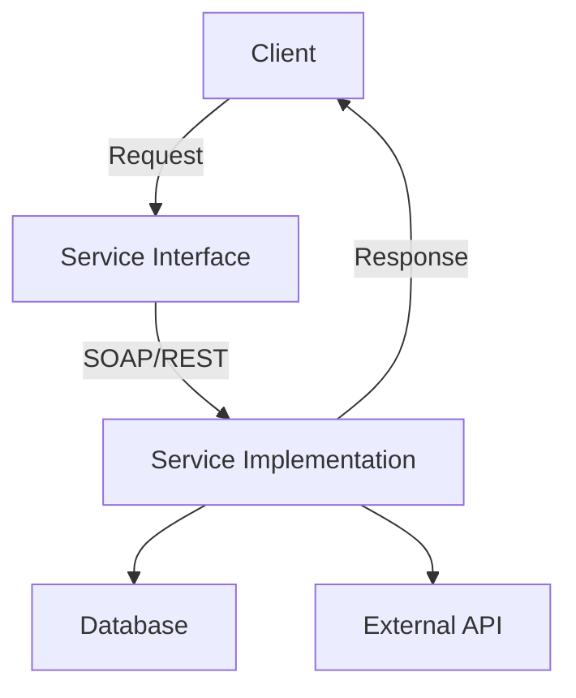

## 7.7 Service-Oriented Architecture (SOA)

Service-Oriented Architecture (SOA) is a design pattern that structures applications as a collection of interoperable and reusable services. It emphasizes the use of loosely coupled services to support the requirements of business processes and users. This architectural style is particularly beneficial for large-scale enterprise systems where flexibility, scalability, and integration are critical.

### Understanding SOA

At its core, SOA is about defining distinct services that can be independently developed, deployed, and maintained. Each service represents a business function and is accessible over a network. These services communicate with each other by exchanging data or coordinating activities.

#### Core Principles of SOA

1. **Loose Coupling**: Services maintain a relationship that minimizes dependencies, allowing them to evolve independently.
2. **Interoperability**: Services can work across different platforms and languages, facilitated by standardized communication protocols.
3. **Reusability**: Services are designed to be reused across different applications and business processes.
4. **Abstraction**: The internal logic of a service is hidden from the outside world, exposing only what is necessary through well-defined interfaces.
5. **Discoverability**: Services are designed to be easily discoverable and accessible through a service registry.

### Designing Reusable and Loosely Coupled Services

To achieve the goals of SOA, services must be designed with reusability and loose coupling in mind. This involves careful consideration of service interfaces, communication protocols, and data formats.

#### Service Design

- **Interface Definition**: Use WSDL (Web Services Description Language) or RESTful APIs to define service interfaces. This ensures that services can be accessed in a standardized manner.
- **Data Contracts**: Define data structures using XML Schema or JSON Schema to ensure consistent data exchange.
- **Service Granularity**: Balance the granularity of services to avoid overly complex or simplistic services. Each service should represent a meaningful business function.

#### Communication Protocols

- **SOAP (Simple Object Access Protocol)**: A protocol for exchanging structured information in web services, offering robust security and transaction capabilities.
- **REST (Representational State Transfer)**: An architectural style that uses HTTP requests to access and manipulate resources, known for its simplicity and scalability.

### Benefits of SOA

Implementing SOA can bring numerous advantages to an organization, particularly in terms of flexibility and integration.

#### Flexibility

SOA allows organizations to adapt quickly to changing business needs. Services can be modified, replaced, or reused without affecting the entire system, enabling rapid response to market changes.

#### Integration Capabilities

SOA facilitates seamless integration of disparate systems, both within and across organizational boundaries. By using standardized protocols, SOA enables different applications to communicate effectively, regardless of their underlying technology.

#### Scalability and Maintainability

The modular nature of SOA allows for easier scaling and maintenance. Services can be scaled independently based on demand, and maintenance can be performed on individual services without impacting the entire system.

### SOA vs. Microservices

While SOA and microservices share similarities, such as promoting modularity and reusability, they differ in their approach and implementation.

#### Similarities

- Both architectures emphasize the use of services to encapsulate business logic.
- They promote loose coupling and reusability of components.

#### Differences

- **Granularity**: Microservices are typically finer-grained than SOA services, focusing on a single business capability.
- **Communication**: SOA often relies on enterprise service buses (ESBs) for communication, while microservices use lightweight protocols like HTTP/REST.
- **Deployment**: Microservices are independently deployable, whereas SOA services may be part of a larger application suite.

### Standards and Protocols in SOA

SOA relies on a variety of standards and protocols to ensure interoperability and effective communication between services.

#### Web Services Standards

- **WSDL**: Describes the functionalities offered by a web service.
- **SOAP**: A protocol for exchanging information in web services.
- **UDDI (Universal Description, Discovery, and Integration)**: A directory for storing information about web services.

#### Security Standards

- **WS-Security**: Provides security for SOAP messages through encryption and digital signatures.
- **OAuth**: An open standard for access delegation, commonly used for token-based authentication.

### Implementing SOA in Java

Java provides a robust platform for implementing SOA, with numerous libraries and frameworks available to facilitate service creation and management.

#### Using Java EE for SOA

Java EE offers a comprehensive set of tools and APIs for building SOA-based applications, including:

- **JAX-WS (Java API for XML Web Services)**: Supports the creation of SOAP-based web services.
- **JAX-RS (Java API for RESTful Web Services)**: Facilitates the development of RESTful services.

#### Example: Creating a Simple SOA Service in Java

Let's create a basic SOA service using JAX-WS to demonstrate how services can be implemented in Java.

```java
// Service Interface
import javax.jws.WebService;

@WebService
public interface GreetingService {
    String sayHello(String name);
}

// Service Implementation
import javax.jws.WebService;

@WebService(endpointInterface = "com.example.GreetingService")
public class GreetingServiceImpl implements GreetingService {
    @Override
    public String sayHello(String name) {
        return "Hello, " + name + "!";
    }
}

// Publishing the Service
import javax.xml.ws.Endpoint;

public class ServicePublisher {
    public static void main(String[] args) {
        Endpoint.publish("http://localhost:8080/ws/greeting", new GreetingServiceImpl());
        System.out.println("Service is published!");
    }
}
```

In this example, we define a simple `GreetingService` interface and its implementation. The service is then published using the `Endpoint` class, making it accessible over HTTP.

### Visualizing SOA Architecture

To better understand the structure of SOA, let's visualize the architecture using a Mermaid.js diagram.



**Diagram Description**: This diagram illustrates the flow of a client request in an SOA architecture. The client interacts with the service interface, which communicates with the service implementation. The service may interact with a database or external APIs to fulfill the request.

### Try It Yourself

To deepen your understanding of SOA, try modifying the code example above:

- **Add a new method** to the `GreetingService` interface and implement it in `GreetingServiceImpl`.
- **Change the communication protocol** from SOAP to REST using JAX-RS.
- **Integrate a database** to store and retrieve greeting messages.

### References and Further Reading

- [Oracle Java EE](https://www.oracle.com/java/technologies/java-ee-glance.html)
- [W3C Web Services Architecture](https://www.w3.org/TR/ws-arch/)
- [OASIS SOA Reference Model](https://www.oasis-open.org/committees/soa-rm/)

### Knowledge Check

- What are the core principles of SOA?
- How does SOA differ from microservices?
- What are some common protocols used in SOA?

### Embrace the Journey

Remember, mastering SOA is a journey. As you continue to explore and implement SOA in your projects, you'll gain a deeper understanding of its benefits and challenges. Keep experimenting, stay curious, and enjoy the journey!

## Quiz Time!



### What is a core principle of SOA?

- [x] Loose coupling
- [ ] Tight integration
- [ ] Monolithic design
- [ ] Hard coding

> **Explanation:** Loose coupling allows services to be independent, promoting flexibility and reusability.


### Which protocol is commonly used in SOA for exchanging structured information?

- [x] SOAP
- [ ] FTP
- [ ] SMTP
- [ ] SSH

> **Explanation:** SOAP is a protocol used for exchanging structured information in web services.


### What is a key benefit of SOA?

- [x] Flexibility
- [ ] Complexity
- [ ] Inflexibility
- [ ] Monolithic architecture

> **Explanation:** SOA provides flexibility by allowing services to be modified or replaced independently.


### How does SOA differ from microservices in terms of communication?

- [x] SOA often uses ESBs, while microservices use lightweight protocols like HTTP/REST.
- [ ] SOA uses HTTP/REST, while microservices use ESBs.
- [ ] Both use the same communication methods.
- [ ] Neither uses communication protocols.

> **Explanation:** SOA often relies on enterprise service buses, whereas microservices use lightweight protocols.


### Which Java API is used for creating RESTful web services?

- [x] JAX-RS
- [ ] JAX-WS
- [ ] JDBC
- [ ] JMS

> **Explanation:** JAX-RS is the Java API for creating RESTful web services.


### What is the role of a service registry in SOA?

- [x] To store information about available services
- [ ] To execute services
- [ ] To compile services
- [ ] To encrypt services

> **Explanation:** A service registry stores information about available services, making them discoverable.


### What is a common standard for defining web service interfaces?

- [x] WSDL
- [ ] HTML
- [ ] CSS
- [ ] JSON

> **Explanation:** WSDL (Web Services Description Language) is used to define web service interfaces.


### Which of the following is a security standard used in SOA?

- [x] WS-Security
- [ ] SSL
- [ ] TLS
- [ ] HTTP

> **Explanation:** WS-Security provides security for SOAP messages through encryption and digital signatures.


### What is a primary goal of SOA?

- [x] Interoperability
- [ ] Isolation
- [ ] Monolithic design
- [ ] Hard coding

> **Explanation:** Interoperability allows services to work across different platforms and languages.


### True or False: SOA and microservices are identical in their approach and implementation.

- [ ] True
- [x] False

> **Explanation:** While SOA and microservices share similarities, they differ in granularity, communication methods, and deployment strategies.


