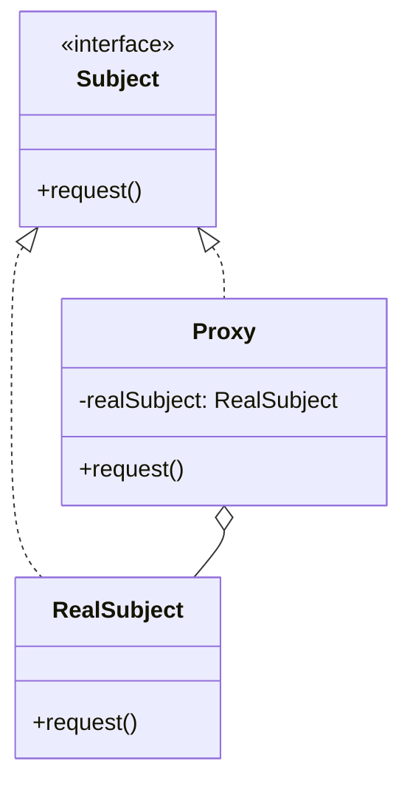

## 7.8.1 Implementing Proxy in Java

The Proxy pattern is a structural design pattern that acts as an intermediary for another object, providing a surrogate or placeholder to control access to it. This pattern is particularly useful in scenarios where direct access to an object is either undesirable or impractical. By using a proxy, you can add an additional layer of control, such as access control, lazy initialization, logging, or caching.

### Intent

- **Description**: The Proxy pattern is designed to provide a surrogate or placeholder for another object to control access to it. This can be useful for various reasons, such as controlling access to a resource-intensive object, adding security, or logging access.

### Also Known As

- **Alternate Names**: Surrogate

### Motivation

The Proxy pattern is essential in situations where an object is resource-intensive to create or requires protection from unauthorized access. For example, consider a scenario where you have a large image that takes time to load. Instead of loading the image immediately, a proxy can be used to load it only when it is needed, thus saving resources and improving performance.

### Applicability

- **Guidelines**: Use the Proxy pattern when:
  - You need to control access to an object.
  - You want to add additional functionality to an object without modifying its code.
  - You need to manage the lifecycle of an object, such as lazy initialization or caching.

### Structure



- **Caption**: The Proxy pattern structure, showing the relationship between `Subject`, `RealSubject`, and `Proxy`.

### Participants

- **Subject**: Defines the common interface for `RealSubject` and `Proxy` so that a `Proxy` can be used anywhere a `RealSubject` is expected.
- **RealSubject**: The actual object that the `Proxy` represents.
- **Proxy**: Maintains a reference to the `RealSubject` and controls access to it. It can perform additional actions before or after forwarding a request to the `RealSubject`.

### Collaborations

- **Interactions**: The `Proxy` receives client requests and forwards them to the `RealSubject` after performing any necessary pre-processing or access control checks.

### Consequences

- **Analysis**: The Proxy pattern provides a level of indirection to support controlled access, additional functionality, and resource management. However, it can introduce complexity and overhead, especially if not implemented carefully.

### Implementation

#### Implementation Guidelines

1. **Define the Subject Interface**: Create an interface that both the `RealSubject` and `Proxy` will implement.
2. **Implement the RealSubject**: Develop the actual object that performs the core functionality.
3. **Create the Proxy**: Implement the proxy class that controls access to the `RealSubject`.

#### Sample Code Snippets

Let's explore a simple example of the Proxy pattern in Java, where a proxy controls access to a resource-intensive object.

```java
// Subject interface
interface Image {
    void display();
}

// RealSubject class
class RealImage implements Image {
    private String fileName;

    public RealImage(String fileName) {
        this.fileName = fileName;
        loadFromDisk();
    }

    private void loadFromDisk() {
        System.out.println("Loading " + fileName);
    }

    @Override
    public void display() {
        System.out.println("Displaying " + fileName);
    }
}

// Proxy class
class ProxyImage implements Image {
    private RealImage realImage;
    private String fileName;

    public ProxyImage(String fileName) {
        this.fileName = fileName;
    }

    @Override
    public void display() {
        if (realImage == null) {
            realImage = new RealImage(fileName);
        }
        realImage.display();
    }
}

// Client code
public class ProxyPatternDemo {
    public static void main(String[] args) {
        Image image = new ProxyImage("test_10mb.jpg");

        // Image will be loaded from disk
        image.display();
        System.out.println("");

        // Image will not be loaded from disk
        image.display();
    }
}
```

- **Explanation**: In this example, the `ProxyImage` class acts as a proxy for the `RealImage` class. The `ProxyImage` controls access to the `RealImage` and ensures that the image is only loaded from disk when it is first displayed.

#### Sample Use Cases

- **Real-world Scenarios**: The Proxy pattern is commonly used in virtual proxies for lazy initialization, remote proxies for distributed systems, and protection proxies for access control.

### Related Patterns

- **Connections**: The Proxy pattern is related to the [Decorator Pattern]( "Decorator Pattern"), which also adds functionality to an object. However, the Proxy pattern focuses on controlling access, while the Decorator pattern focuses on adding behavior.

### Known Uses

- **Examples in Libraries or Frameworks**: The Java RMI (Remote Method Invocation) uses the Proxy pattern to represent remote objects locally.

### Types of Proxies

There are several types of proxies, each serving a different purpose:

1. **Virtual Proxy**: Controls access to a resource that is expensive to create.
2. **Remote Proxy**: Represents an object located in a different address space.
3. **Protection Proxy**: Controls access to the methods of an object based on access rights.
4. **Smart Proxy**: Provides additional functionality, such as reference counting or logging.

#### Virtual Proxy Example

A virtual proxy is used to defer the creation of an expensive object until it is needed.

```java
// Virtual Proxy example
class VirtualProxyImage implements Image {
    private RealImage realImage;
    private String fileName;

    public VirtualProxyImage(String fileName) {
        this.fileName = fileName;
    }

    @Override
    public void display() {
        if (realImage == null) {
            realImage = new RealImage(fileName);
        }
        realImage.display();
    }
}
```

#### Remote Proxy Example

A remote proxy is used to represent an object that resides in a different address space.

```java
// Remote Proxy example
interface RemoteService {
    void performOperation();
}

class RemoteServiceImpl implements RemoteService {
    @Override
    public void performOperation() {
        System.out.println("Performing operation on remote service");
    }
}

class RemoteProxy implements RemoteService {
    private RemoteServiceImpl remoteService;

    @Override
    public void performOperation() {
        if (remoteService == null) {
            remoteService = new RemoteServiceImpl();
        }
        remoteService.performOperation();
    }
}
```

#### Protection Proxy Example

A protection proxy is used to control access to an object based on access rights.

```java
// Protection Proxy example
interface Document {
    void displayContent();
}

class SecureDocument implements Document {
    private String content;

    public SecureDocument(String content) {
        this.content = content;
    }

    @Override
    public void displayContent() {
        System.out.println("Displaying document content: " + content);
    }
}

class ProtectionProxyDocument implements Document {
    private SecureDocument secureDocument;
    private String userRole;

    public ProtectionProxyDocument(String content, String userRole) {
        this.secureDocument = new SecureDocument(content);
        this.userRole = userRole;
    }

    @Override
    public void displayContent() {
        if ("ADMIN".equals(userRole)) {
            secureDocument.displayContent();
        } else {
            System.out.println("Access denied. Insufficient permissions.");
        }
    }
}
```

### Transparency to Clients

The Proxy pattern aims to be transparent to clients, meaning that clients should not be aware of whether they are dealing with a proxy or the real object. This transparency allows clients to interact with the proxy as if it were the real object, without needing to change their code.

### Best Practices

- **Use Proxies Wisely**: While proxies can add valuable functionality, they can also introduce complexity and overhead. Use them judiciously to avoid unnecessary performance impacts.
- **Ensure Transparency**: Strive to make proxies as transparent as possible to clients, so they do not need to be aware of the proxy's presence.
- **Consider Security**: When using protection proxies, ensure that access control is robust and secure.

### Common Pitfalls

- **Overusing Proxies**: Avoid using proxies when they are not necessary, as they can add unnecessary complexity.
- **Performance Overhead**: Be mindful of the performance overhead that proxies can introduce, especially in resource-intensive applications.

### Exercises

1. **Implement a Cache Proxy**: Create a proxy that caches the results of expensive operations to improve performance.
2. **Create a Logging Proxy**: Develop a proxy that logs all method calls to a real object for auditing purposes.

### Summary

The Proxy pattern is a powerful tool for controlling access to objects and adding additional functionality. By understanding and implementing this pattern, developers can create more flexible and efficient applications.

## Test Your Knowledge: Java Proxy Pattern Quiz



### What is the primary purpose of the Proxy pattern?

- [x] To control access to another object
- [ ] To add new behavior to an object
- [ ] To create a new instance of an object
- [ ] To manage object lifecycle

> **Explanation:** The Proxy pattern is used to control access to another object, often adding additional functionality like access control or lazy initialization.

### Which of the following is NOT a type of proxy?

- [ ] Virtual Proxy
- [ ] Remote Proxy
- [ ] Protection Proxy
- [x] Singleton Proxy

> **Explanation:** The Singleton Proxy is not a recognized type of proxy. The other options are valid types of proxies.

### In the Proxy pattern, what role does the `RealSubject` play?

- [x] It is the actual object that performs the core functionality.
- [ ] It is the interface that defines common operations.
- [ ] It is the object that controls access to the `Proxy`.
- [ ] It is the client that interacts with the `Proxy`.

> **Explanation:** The `RealSubject` is the actual object that performs the core functionality, while the `Proxy` controls access to it.

### How does a virtual proxy improve performance?

- [x] By deferring the creation of an expensive object until it is needed
- [ ] By caching all method calls
- [ ] By logging all operations
- [ ] By managing object lifecycle

> **Explanation:** A virtual proxy improves performance by deferring the creation of an expensive object until it is actually needed, thus saving resources.

### Which pattern is closely related to the Proxy pattern?

- [ ] Factory Pattern
- [x] Decorator Pattern
- [ ] Observer Pattern
- [ ] Strategy Pattern

> **Explanation:** The Decorator Pattern is closely related to the Proxy Pattern, as both involve adding functionality to an object. However, the Proxy Pattern focuses on controlling access.

### What is a common use case for a remote proxy?

- [x] Representing an object located in a different address space
- [ ] Adding logging to method calls
- [ ] Caching expensive operations
- [ ] Managing object lifecycle

> **Explanation:** A remote proxy is used to represent an object located in a different address space, often in distributed systems.

### What is a key benefit of using the Proxy pattern?

- [x] It provides controlled access to an object.
- [ ] It simplifies object creation.
- [ ] It enhances object performance.
- [ ] It reduces code complexity.

> **Explanation:** The Proxy pattern provides controlled access to an object, allowing for additional functionality like access control or lazy initialization.

### How can a protection proxy enhance security?

- [x] By controlling access to methods based on user roles
- [ ] By encrypting all data
- [ ] By logging all operations
- [ ] By managing object lifecycle

> **Explanation:** A protection proxy enhances security by controlling access to methods based on user roles or permissions.

### What is a potential drawback of using proxies?

- [x] They can introduce complexity and overhead.
- [ ] They simplify object creation.
- [ ] They enhance object performance.
- [ ] They reduce code complexity.

> **Explanation:** Proxies can introduce complexity and overhead, especially if not implemented carefully, which can impact performance.

### True or False: Clients should be aware of whether they are dealing with a proxy or the real object.

- [ ] True
- [x] False

> **Explanation:** Clients should not be aware of whether they are dealing with a proxy or the real object, as the Proxy pattern aims to be transparent to clients.


