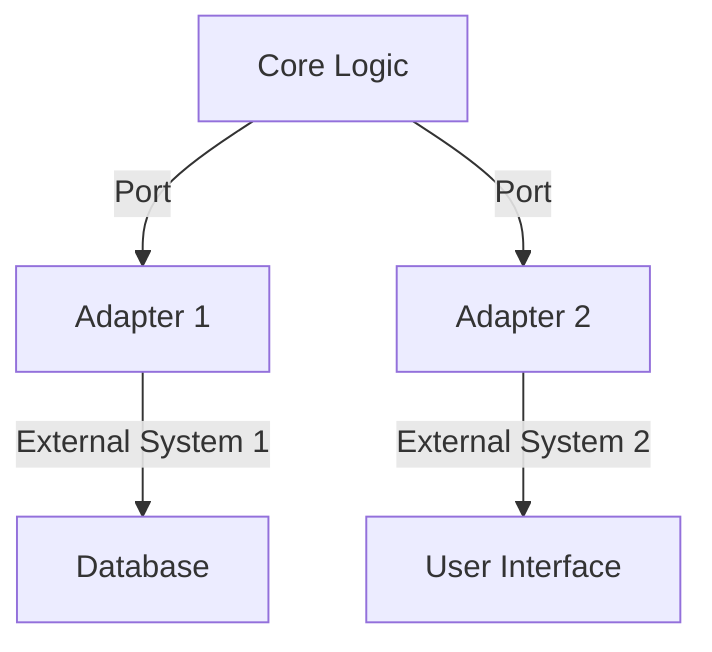

## 7.8.1 Implementing Hexagonal Architecture in Java

Hexagonal Architecture, also known as Ports and Adapters, is a design pattern that aims to create loosely coupled application components that can be easily connected to their software environment. This architecture pattern is particularly useful for achieving a high level of modularity and testability in software systems. In this section, we will delve into the implementation of Hexagonal Architecture in Java, providing step-by-step instructions, code examples, and best practices.

### Understanding Hexagonal Architecture

Hexagonal Architecture was introduced by Alistair Cockburn to address the challenges of creating systems that are adaptable to change. The core idea is to separate the business logic of an application from its external dependencies, such as databases, user interfaces, and external services. This separation is achieved through the use of ports and adapters.

- **Ports**: These are interfaces that define the points of interaction between the core application logic and the external world. They represent the application's capabilities and requirements.
- **Adapters**: These are implementations of the ports that handle the interaction with external systems. Adapters translate the external system's data and operations into a form that the core application logic can understand and vice versa.

### Key Benefits of Hexagonal Architecture

- **Isolation of Business Logic**: The core application logic is isolated from external dependencies, making it easier to test and maintain.
- **Flexibility**: New external systems can be integrated with minimal changes to the core logic.
- **Scalability**: The architecture supports scaling by allowing different parts of the system to be developed and deployed independently.

### Implementing Hexagonal Architecture in Java

Let's walk through the process of implementing Hexagonal Architecture in a Java application. We will use a simple example of a library management system to illustrate the concepts.

#### Step 1: Define the Core Domain Logic

The first step is to define the core domain logic of your application. This is the heart of your system, where the business rules and processes reside. In our library management system, the core logic might include operations like adding a book, borrowing a book, and returning a book.

```java
// Core domain logic
public class LibraryService {

    private final BookRepository bookRepository;

    public LibraryService(BookRepository bookRepository) {
        this.bookRepository = bookRepository;
    }

    public void addBook(Book book) {
        bookRepository.save(book);
    }

    public Book borrowBook(String title) {
        Book book = bookRepository.findByTitle(title);
        if (book != null && !book.isBorrowed()) {
            book.setBorrowed(true);
            bookRepository.save(book);
            return book;
        }
        return null;
    }

    public void returnBook(Book book) {
        book.setBorrowed(false);
        bookRepository.save(book);
    }
}
```

In this example, `LibraryService` is the core domain logic, and `BookRepository` is an interface that acts as a port.

#### Step 2: Define Ports as Interfaces

Ports are defined as interfaces that describe the operations that the core logic requires from or offers to the external world. In our example, `BookRepository` is a port that defines the operations related to book persistence.

```java
// Port interface
public interface BookRepository {
    void save(Book book);
    Book findByTitle(String title);
}
```

#### Step 3: Implement Adapters

Adapters implement the port interfaces and handle the interaction with external systems. In our example, we might have an adapter that interacts with a database to persist book information.

```java
// Adapter implementation
public class JpaBookRepository implements BookRepository {

    private final EntityManager entityManager;

    public JpaBookRepository(EntityManager entityManager) {
        this.entityManager = entityManager;
    }

    @Override
    public void save(Book book) {
        entityManager.persist(book);
    }

    @Override
    public Book findByTitle(String title) {
        return entityManager.createQuery("SELECT b FROM Book b WHERE b.title = :title", Book.class)
                .setParameter("title", title)
                .getSingleResult();
    }
}
```

In this example, `JpaBookRepository` is an adapter that uses JPA to interact with a database.

#### Step 4: Structure the Project

To reflect the architectural boundaries, it's important to structure the project in a way that separates the core logic from the adapters. A typical project structure might look like this:

```
src/main/java
├── com
│   └── example
│       ├── library
│       │   ├── core
│       │   │   ├── LibraryService.java
│       │   │   └── Book.java
│       │   ├── ports
│       │   │   └── BookRepository.java
│       │   └── adapters
│       │       └── JpaBookRepository.java
```

This structure clearly delineates the core logic, ports, and adapters, making it easier to manage dependencies and maintain the system.

#### Step 5: Manage Dependencies and Inversion of Control

One of the key considerations in Hexagonal Architecture is managing dependencies and ensuring that the core logic is not directly dependent on external systems. This is achieved through dependency inversion, where the high-level modules (core logic) are not dependent on low-level modules (adapters).

In Java, dependency inversion can be achieved using dependency injection frameworks like Spring. Here's how you might configure the `LibraryService` to use a `JpaBookRepository`:

```java
@Configuration
public class AppConfig {

    @Bean
    public EntityManager entityManager() {
        // Configure and return the EntityManager
    }

    @Bean
    public BookRepository bookRepository(EntityManager entityManager) {
        return new JpaBookRepository(entityManager);
    }

    @Bean
    public LibraryService libraryService(BookRepository bookRepository) {
        return new LibraryService(bookRepository);
    }
}
```

In this configuration, Spring manages the dependencies and injects the appropriate implementations at runtime.

### Visualizing Hexagonal Architecture

To better understand the structure of Hexagonal Architecture, let's visualize it using a diagram. This diagram illustrates the separation between the core logic, ports, and adapters.



**Diagram Description**: The diagram shows the core logic at the center, with ports connecting it to various adapters. Each adapter interacts with an external system, such as a database or user interface.

### Considerations for Implementing Hexagonal Architecture

- **Testability**: By isolating the core logic from external dependencies, you can easily test the core logic using mock implementations of the ports.
- **Modularity**: The architecture promotes modularity, allowing different parts of the system to be developed and deployed independently.
- **Scalability**: The architecture supports scaling by allowing new adapters to be added without affecting the core logic.
- **Flexibility**: The architecture allows for easy integration with new external systems by simply adding new adapters.

### Try It Yourself

To get hands-on experience with Hexagonal Architecture, try modifying the code examples provided. Here are a few suggestions:

- **Add a new adapter**: Implement a new adapter that interacts with a different type of database or a web service.
- **Extend the core logic**: Add new operations to the `LibraryService` and update the ports and adapters accordingly.
- **Test the core logic**: Write unit tests for the `LibraryService` using mock implementations of the `BookRepository`.

### Conclusion

Implementing Hexagonal Architecture in Java can greatly enhance the modularity, testability, and scalability of your applications. By defining clear boundaries between the core logic and external systems, you can create systems that are adaptable to change and easy to maintain. Remember, this is just the beginning. As you progress, you'll build more complex and robust applications. Keep experimenting, stay curious, and enjoy the journey!

## Quiz Time!



### What is the primary goal of Hexagonal Architecture?

- [x] To isolate business logic from external dependencies
- [ ] To increase the complexity of the system
- [ ] To make the system dependent on specific technologies
- [ ] To reduce the number of interfaces in the system

> **Explanation:** The primary goal of Hexagonal Architecture is to isolate business logic from external dependencies, making the system more modular and adaptable to change.

### In Hexagonal Architecture, what is a "port"?

- [x] An interface that defines interactions with external systems
- [ ] A class that implements business logic
- [ ] A database connection
- [ ] A user interface component

> **Explanation:** A port is an interface that defines the interactions between the core application logic and external systems.

### What role do adapters play in Hexagonal Architecture?

- [x] They implement ports to interact with external systems
- [ ] They define the core business logic
- [ ] They act as the main entry point for the application
- [ ] They store data in the database

> **Explanation:** Adapters implement ports to handle interactions with external systems, translating data and operations as needed.

### How does Hexagonal Architecture enhance testability?

- [x] By isolating core logic, allowing for easy testing with mock implementations
- [ ] By making the system more complex
- [ ] By reducing the number of test cases needed
- [ ] By eliminating the need for unit tests

> **Explanation:** Hexagonal Architecture enhances testability by isolating the core logic, allowing it to be tested independently using mock implementations of the ports.

### Which of the following is a benefit of using Hexagonal Architecture?

- [x] Flexibility to integrate new external systems
- [ ] Increased dependency on specific technologies
- [ ] Reduced modularity
- [ ] Decreased scalability

> **Explanation:** Hexagonal Architecture provides flexibility to integrate new external systems by adding new adapters without affecting the core logic.

### What is the purpose of dependency inversion in Hexagonal Architecture?

- [x] To ensure high-level modules are not dependent on low-level modules
- [ ] To increase the number of dependencies in the system
- [ ] To make the system more complex
- [ ] To reduce the number of interfaces

> **Explanation:** Dependency inversion ensures that high-level modules (core logic) are not dependent on low-level modules (adapters), promoting modularity and flexibility.

### How can dependency inversion be achieved in Java?

- [x] Using dependency injection frameworks like Spring
- [ ] By hardcoding dependencies in the application
- [ ] By eliminating all interfaces
- [ ] By using only static methods

> **Explanation:** Dependency inversion can be achieved in Java using dependency injection frameworks like Spring, which manage dependencies and inject appropriate implementations at runtime.

### What is the role of the `LibraryService` class in the example?

- [x] It represents the core domain logic of the application
- [ ] It acts as an adapter for external systems
- [ ] It defines the ports for the application
- [ ] It is responsible for database interactions

> **Explanation:** The `LibraryService` class represents the core domain logic of the application, containing the business rules and processes.

### Which of the following best describes a port in Hexagonal Architecture?

- [x] An interface that defines the application's capabilities and requirements
- [ ] A class that handles database interactions
- [ ] A component that renders the user interface
- [ ] A service that processes network requests

> **Explanation:** A port is an interface that defines the application's capabilities and requirements, serving as a point of interaction between the core logic and external systems.

### True or False: Hexagonal Architecture requires a specific technology stack to be implemented.

- [ ] True
- [x] False

> **Explanation:** False. Hexagonal Architecture is a design pattern that can be implemented using various technology stacks. It focuses on the separation of concerns and modularity rather than specific technologies.


