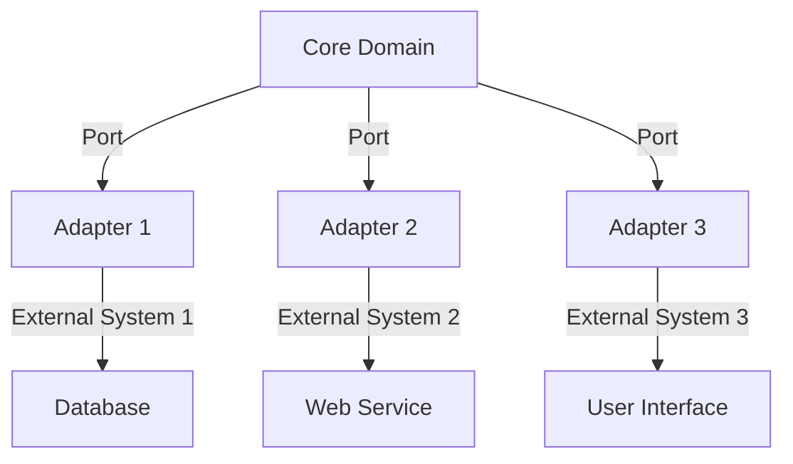

## 7.8.2 Enhancing Testability and Flexibility

In the ever-evolving landscape of software development, maintaining testability and flexibility is crucial for building robust systems. Hexagonal Architecture, also known as Ports and Adapters, offers a compelling approach to achieving these goals. By decoupling business logic from infrastructure components, this architectural style enhances the testability of your code and provides the flexibility to adapt to changing requirements and integrate with various external systems. In this section, we will explore how Hexagonal Architecture facilitates writing unit tests, discuss strategies for mocking or stubbing adapters, provide examples of improved flexibility, and highlight its support for continuous integration and deployment practices.

### Understanding Hexagonal Architecture

Hexagonal Architecture, introduced by Alistair Cockburn, is a design pattern that promotes the separation of concerns by organizing code into three main areas: the core domain (business logic), ports (interfaces), and adapters (implementations). This separation allows for clear boundaries between the business logic and the external systems it interacts with, such as databases, user interfaces, and external services.

#### Key Components of Hexagonal Architecture

1. **Core Domain**: This is the heart of your application, containing the business logic and rules. It is independent of any external systems and focuses solely on implementing the core functionality.

2. **Ports**: These are interfaces that define how the core domain interacts with the outside world. Ports serve as entry and exit points for data, allowing the core domain to remain agnostic of the specific implementations of external systems.

3. **Adapters**: Adapters are concrete implementations of the ports. They handle the communication between the core domain and external systems, such as databases, web services, or user interfaces.

### Enhancing Testability

One of the primary benefits of Hexagonal Architecture is the enhanced testability it provides. By decoupling the business logic from infrastructure components, you can write unit tests that focus solely on the core domain without being affected by external dependencies.

#### Writing Unit Tests for Business Logic

To write effective unit tests for your business logic, follow these steps:

- **Isolate the Core Domain**: Ensure that your business logic is isolated from external systems by interacting only through ports. This allows you to test the core domain independently.

- **Use Mocking and Stubbing**: Replace external dependencies with mock or stub implementations during testing. This ensures that your tests focus on the business logic and not on the behavior of external systems.

- **Test Business Rules**: Write tests that validate the business rules and logic within the core domain. Focus on edge cases and scenarios that are critical to the application's functionality.

Here's an example of a simple unit test for a core domain class in a Hexagonal Architecture setup:

```java
import org.junit.jupiter.api.Test;
import static org.mockito.Mockito.*;
import static org.junit.jupiter.api.Assertions.*;

class OrderServiceTest {

    @Test
    void testCalculateTotalPrice() {
        // Arrange
        OrderRepository mockRepository = mock(OrderRepository.class);
        OrderService orderService = new OrderService(mockRepository);
        Order order = new Order();
        order.addItem(new Item("Book", 10.0));
        order.addItem(new Item("Pen", 2.0));

        // Act
        double totalPrice = orderService.calculateTotalPrice(order);

        // Assert
        assertEquals(12.0, totalPrice);
    }
}
```

In this example, we use a mock `OrderRepository` to isolate the `OrderService` class and focus on testing the `calculateTotalPrice` method.

#### Strategies for Mocking or Stubbing Adapters

Mocking and stubbing are essential techniques for testing in Hexagonal Architecture. They allow you to replace real implementations of adapters with controlled, predictable behaviors during testing.

- **Mocking**: Use mocking frameworks like Mockito to create mock objects that simulate the behavior of real objects. Mocks are useful for verifying interactions and ensuring that certain methods are called with expected parameters.

- **Stubbing**: Stubs provide predefined responses to method calls. They are useful for setting up specific scenarios and testing how the core domain handles different inputs.

Here's an example of using Mockito to mock an adapter in a test:

```java
import org.junit.jupiter.api.Test;
import static org.mockito.Mockito.*;

class PaymentServiceTest {

    @Test
    void testProcessPayment() {
        // Arrange
        PaymentGateway mockGateway = mock(PaymentGateway.class);
        when(mockGateway.process(anyDouble())).thenReturn(true);

        PaymentService paymentService = new PaymentService(mockGateway);

        // Act
        boolean result = paymentService.processPayment(100.0);

        // Assert
        assertTrue(result);
        verify(mockGateway).process(100.0);
    }
}
```

In this test, we mock the `PaymentGateway` adapter and verify that the `process` method is called with the correct amount.

### Improving Flexibility

Hexagonal Architecture not only enhances testability but also improves flexibility by allowing you to swap out external systems with minimal impact on the core domain.

#### Swapping Out External Systems

The use of ports and adapters enables you to change the implementation of external systems without affecting the core domain. This flexibility is particularly useful when integrating with new technologies or replacing outdated systems.

- **Implement New Adapters**: When you need to integrate with a new external system, simply create a new adapter that implements the existing port interface. This keeps the core domain unchanged and ensures a smooth transition.

- **Switch Between Implementations**: You can easily switch between different implementations of the same port, such as using a mock adapter for testing and a real adapter for production.

Here's an example demonstrating how to swap out a database adapter:

```java
interface UserRepository {
    User findUserById(String userId);
}

class SqlUserRepository implements UserRepository {
    @Override
    public User findUserById(String userId) {
        // SQL database logic
    }
}

class NoSqlUserRepository implements UserRepository {
    @Override
    public User findUserById(String userId) {
        // NoSQL database logic
    }
}

// Usage
UserRepository userRepository = new SqlUserRepository();
// Switch to NoSQL
userRepository = new NoSqlUserRepository();
```

In this example, the `UserRepository` port allows for easy switching between SQL and NoSQL implementations.

#### Supporting Continuous Integration and Deployment

Hexagonal Architecture supports continuous integration and deployment (CI/CD) practices by promoting modularity and reducing dependencies. This architecture allows for:

- **Independent Development and Testing**: Teams can work on different adapters or the core domain independently, reducing bottlenecks and speeding up development.

- **Automated Testing**: The clear separation of concerns makes it easier to automate tests for different parts of the application, ensuring that changes do not introduce regressions.

- **Seamless Deployment**: With the ability to swap out adapters, you can deploy changes to external systems without affecting the core domain, minimizing downtime and risk.

### Visualizing Hexagonal Architecture

To better understand the structure of Hexagonal Architecture, let's visualize it using a Mermaid.js diagram:



In this diagram, the core domain interacts with various adapters through ports, which in turn communicate with different external systems.

### Try It Yourself

To deepen your understanding of Hexagonal Architecture, try modifying the code examples provided:

- **Experiment with Different Adapters**: Create additional adapters for the `UserRepository` interface, such as a file-based repository or a cloud-based repository. Test how easily you can switch between them.

- **Enhance Unit Tests**: Add more unit tests for the `OrderService` and `PaymentService` classes, focusing on edge cases and error handling.

- **Integrate with a New External System**: Implement a new adapter for an external system, such as a third-party payment gateway, and integrate it into the existing architecture.

### Knowledge Check

Before moving on, let's summarize the key takeaways from this section:

- Hexagonal Architecture decouples business logic from infrastructure components, enhancing testability and flexibility.
- Unit tests can focus solely on the core domain by using mocking and stubbing techniques.
- Ports and adapters allow for easy swapping of external systems, supporting continuous integration and deployment practices.

### References and Further Reading

For more information on Hexagonal Architecture and related topics, consider exploring the following resources:

- [Hexagonal Architecture by Alistair Cockburn](https://alistair.cockburn.us/hexagonal-architecture/)
- [Mockito Documentation](https://site.mockito.org/)
- [Continuous Integration and Continuous Deployment](https://www.atlassian.com/continuous-delivery/continuous-integration)

## Quiz Time!



### What is the primary benefit of Hexagonal Architecture?

- [x] It decouples business logic from infrastructure components.
- [ ] It increases the complexity of the codebase.
- [ ] It reduces the need for testing.
- [ ] It limits the flexibility of the application.

> **Explanation:** Hexagonal Architecture decouples business logic from infrastructure components, enhancing testability and flexibility.

### How does Hexagonal Architecture enhance testability?

- [x] By allowing unit tests to focus solely on the core domain.
- [ ] By eliminating the need for mocking and stubbing.
- [ ] By increasing the number of dependencies in the core domain.
- [ ] By making it difficult to write tests.

> **Explanation:** Hexagonal Architecture enhances testability by allowing unit tests to focus solely on the core domain, independent of external systems.

### What role do ports play in Hexagonal Architecture?

- [x] They define interfaces for interaction with external systems.
- [ ] They implement the business logic.
- [ ] They serve as concrete implementations of adapters.
- [ ] They limit the flexibility of the architecture.

> **Explanation:** Ports define interfaces for interaction with external systems, allowing the core domain to remain agnostic of specific implementations.

### How can adapters be tested in Hexagonal Architecture?

- [x] By using mocking and stubbing techniques.
- [ ] By directly testing the core domain.
- [ ] By avoiding any form of testing.
- [ ] By integrating them with external systems.

> **Explanation:** Adapters can be tested using mocking and stubbing techniques to simulate their behavior during testing.

### What is a key advantage of using ports and adapters?

- [x] They allow for easy swapping of external systems.
- [ ] They increase the complexity of the core domain.
- [ ] They reduce the need for continuous integration.
- [ ] They limit the ability to automate tests.

> **Explanation:** Ports and adapters allow for easy swapping of external systems, enhancing flexibility and adaptability.

### How does Hexagonal Architecture support CI/CD practices?

- [x] By promoting modularity and reducing dependencies.
- [ ] By increasing the complexity of deployment processes.
- [ ] By limiting the ability to automate tests.
- [ ] By making it difficult to integrate with external systems.

> **Explanation:** Hexagonal Architecture supports CI/CD practices by promoting modularity and reducing dependencies, allowing for seamless integration and deployment.

### What is the role of the core domain in Hexagonal Architecture?

- [x] It contains the business logic and rules.
- [ ] It handles communication with external systems.
- [ ] It defines interfaces for adapters.
- [ ] It limits the flexibility of the application.

> **Explanation:** The core domain contains the business logic and rules, independent of external systems.

### Which of the following is a strategy for testing adapters?

- [x] Using mocking frameworks like Mockito.
- [ ] Directly testing the core domain.
- [ ] Avoiding any form of testing.
- [ ] Integrating them with external systems.

> **Explanation:** Using mocking frameworks like Mockito is a strategy for testing adapters by simulating their behavior.

### How can Hexagonal Architecture improve flexibility?

- [x] By allowing the implementation of new adapters without affecting the core domain.
- [ ] By increasing the complexity of the core domain.
- [ ] By reducing the ability to swap external systems.
- [ ] By limiting the use of ports and adapters.

> **Explanation:** Hexagonal Architecture improves flexibility by allowing the implementation of new adapters without affecting the core domain.

### True or False: Hexagonal Architecture limits the ability to integrate with new technologies.

- [ ] True
- [x] False

> **Explanation:** False. Hexagonal Architecture enhances the ability to integrate with new technologies by decoupling the core domain from external systems.



Remember, this is just the beginning. As you progress, you'll build more complex and interactive systems using Hexagonal Architecture. Keep experimenting, stay curious, and enjoy the journey!
