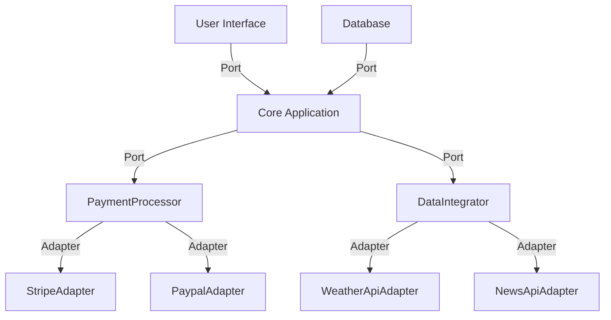

## 7.8.3 Use Cases and Examples

Hexagonal Architecture, also known as the Ports and Adapters pattern, is a powerful architectural style that promotes high modularity and adaptability. It allows applications to interact with external systems through well-defined interfaces, making them easier to maintain and evolve. In this section, we will explore real-world use cases and examples of Hexagonal Architecture, focusing on its application in payment processing systems and applications with multiple external integrations. We will also discuss challenges encountered during implementation and share insights into maintaining and evolving systems built with this architecture.

### Understanding Hexagonal Architecture

Before diving into the use cases, let's briefly revisit the core concepts of Hexagonal Architecture. This architectural style is characterized by its separation of an application's core logic from external concerns, such as user interfaces, databases, and other systems. It achieves this separation through the use of ports and adapters:

- **Ports**: These are interfaces that define how the core application interacts with the outside world. They represent the application's input and output boundaries.
- **Adapters**: These are implementations of the ports, responsible for translating external requests into a format the core application can understand and vice versa.

This separation allows the core application to remain agnostic to the specifics of external systems, making it easier to swap out or modify these systems without affecting the core logic.

### Use Case 1: Payment Processing Systems

Payment processing systems are a prime example of where Hexagonal Architecture can shine. These systems often need to interact with various external entities, such as banks, payment gateways, and fraud detection services. By using Hexagonal Architecture, we can create a system that is both flexible and robust.

#### Example: Building a Payment Processing System

Consider a payment processing system that needs to handle transactions from multiple payment gateways. Each gateway has its own API and requirements, which can change over time. By implementing Hexagonal Architecture, we can create a core application that processes payments without being tied to any specific gateway.

```java
// Port Interface for Payment Processing
public interface PaymentProcessor {
    boolean processPayment(PaymentRequest request);
}

// Core Application Logic
public class PaymentService {
    private final PaymentProcessor paymentProcessor;

    public PaymentService(PaymentProcessor paymentProcessor) {
        this.paymentProcessor = paymentProcessor;
    }

    public boolean processTransaction(PaymentRequest request) {
        // Business logic for processing payment
        return paymentProcessor.processPayment(request);
    }
}

// Adapter for a Specific Payment Gateway
public class StripePaymentAdapter implements PaymentProcessor {
    @Override
    public boolean processPayment(PaymentRequest request) {
        // Logic to interact with Stripe API
        return true; // Assume payment is successful
    }
}
```

In this example, the `PaymentProcessor` interface acts as a port, defining how the core application interacts with payment gateways. The `StripePaymentAdapter` is an adapter that implements this interface, allowing the core application to process payments through Stripe. If we need to add support for another gateway, we can simply create a new adapter without modifying the core logic.

#### Challenges and Solutions

One of the challenges in implementing Hexagonal Architecture in payment systems is managing the complexity of different payment gateways. Each gateway may have unique requirements, such as authentication methods or data formats. To address this, we can use a strategy pattern within the adapters to handle these variations.

```java
// Strategy Interface for Payment Gateway Authentication
public interface PaymentGatewayAuthStrategy {
    void authenticate();
}

// Concrete Strategy for Stripe Authentication
public class StripeAuthStrategy implements PaymentGatewayAuthStrategy {
    @Override
    public void authenticate() {
        // Stripe-specific authentication logic
    }
}

// Adapter with Strategy Pattern
public class StripePaymentAdapter implements PaymentProcessor {
    private final PaymentGatewayAuthStrategy authStrategy;

    public StripePaymentAdapter(PaymentGatewayAuthStrategy authStrategy) {
        this.authStrategy = authStrategy;
    }

    @Override
    public boolean processPayment(PaymentRequest request) {
        authStrategy.authenticate();
        // Logic to interact with Stripe API
        return true;
    }
}
```

By using the strategy pattern, we can encapsulate authentication logic within separate classes, making it easier to adapt to changes in gateway requirements.

### Use Case 2: Applications with Multiple External Integrations

Applications that need to integrate with multiple external systems, such as third-party APIs, databases, or messaging services, can greatly benefit from Hexagonal Architecture. This architecture allows developers to isolate the core application logic from the specifics of each integration, making it easier to manage and extend the system.

#### Example: Building an Integration Platform

Consider an integration platform that aggregates data from various third-party APIs and presents it to users through a unified interface. By using Hexagonal Architecture, we can create a system that is both flexible and maintainable.

```java
// Port Interface for Data Integration
public interface DataIntegrator {
    Data fetchData(String query);
}

// Core Application Logic
public class IntegrationService {
    private final DataIntegrator dataIntegrator;

    public IntegrationService(DataIntegrator dataIntegrator) {
        this.dataIntegrator = dataIntegrator;
    }

    public Data getData(String query) {
        // Business logic for fetching and processing data
        return dataIntegrator.fetchData(query);
    }
}

// Adapter for a Specific API
public class WeatherApiAdapter implements DataIntegrator {
    @Override
    public Data fetchData(String query) {
        // Logic to interact with Weather API
        return new Data(); // Assume data is fetched successfully
    }
}
```

In this example, the `DataIntegrator` interface acts as a port, defining how the core application interacts with external data sources. The `WeatherApiAdapter` is an adapter that implements this interface, allowing the core application to fetch data from a weather API. If we need to integrate with another API, we can create a new adapter without modifying the core logic.

#### Challenges and Solutions

One of the challenges in building integration platforms is handling the differences in data formats and protocols used by various APIs. To address this, we can use a facade pattern within the adapters to provide a consistent interface to the core application.

```java
// Facade for Consistent Data Format
public class WeatherApiFacade {
    public Data fetchData(String query) {
        // Logic to fetch and transform data into a consistent format
        return new Data();
    }
}

// Adapter with Facade Pattern
public class WeatherApiAdapter implements DataIntegrator {
    private final WeatherApiFacade facade;

    public WeatherApiAdapter(WeatherApiFacade facade) {
        this.facade = facade;
    }

    @Override
    public Data fetchData(String query) {
        return facade.fetchData(query);
    }
}
```

By using a facade, we can encapsulate the complexity of data transformation within a separate class, making it easier to adapt to changes in API formats.

### Case Study: E-commerce Platform

To illustrate the successful application of Hexagonal Architecture, let's consider a case study of an e-commerce platform. This platform needs to handle various operations, such as managing product catalogs, processing orders, and integrating with third-party services for payment and shipping.

#### Implementation

The e-commerce platform was built using Hexagonal Architecture to ensure high modularity and adaptability. The core application logic was separated from external concerns through well-defined ports and adapters.

- **Product Management**: The platform used ports to define how the core application interacts with the product catalog. Adapters were created for different data sources, such as databases and external APIs, allowing the platform to easily switch between them.
- **Order Processing**: The order processing logic was encapsulated within the core application, with ports defining how it interacts with payment and shipping services. Adapters were created for each service, allowing the platform to integrate with multiple providers.
- **User Interface**: The user interface was built as a separate module, interacting with the core application through ports. This separation allowed the platform to support multiple user interfaces, such as web and mobile apps, without modifying the core logic.

#### Challenges and Solutions

During the implementation, several challenges were encountered:

- **Complexity of Integrations**: Integrating with multiple third-party services introduced complexity in managing different protocols and data formats. This was addressed by using the facade pattern within adapters to provide a consistent interface to the core application.
- **Scalability**: As the platform grew, scalability became a concern. To address this, the platform was designed to support horizontal scaling, with each module able to run independently and communicate through well-defined interfaces.
- **Maintenance and Evolution**: Maintaining and evolving the platform required careful management of dependencies between modules. This was achieved by adhering to the principles of Hexagonal Architecture, ensuring that each module remained independent and easily replaceable.

### Insights into Maintenance and Evolution

Systems built with Hexagonal Architecture are inherently easier to maintain and evolve due to their modular design. Here are some insights into maintaining and evolving such systems:

- **Modularity**: The separation of core logic from external concerns allows developers to focus on individual modules without affecting the entire system. This makes it easier to update or replace modules as needed.
- **Testability**: The use of ports and adapters facilitates testing by allowing developers to mock external dependencies. This makes it easier to write unit tests for the core application logic.
- **Adaptability**: The architecture's adaptability allows systems to easily integrate with new technologies or services. This is particularly valuable in rapidly changing environments, where new requirements may arise frequently.
- **Documentation**: Maintaining clear documentation of the system's architecture and interfaces is crucial for ensuring that new developers can quickly understand and work with the system.

### Try It Yourself

To get hands-on experience with Hexagonal Architecture, try modifying the code examples provided:

- **Add a New Payment Gateway**: Create a new adapter for a different payment gateway and integrate it with the existing payment processing system.
- **Integrate Another API**: Create a new adapter for a different API and integrate it with the existing integration platform.
- **Experiment with Patterns**: Try using different design patterns, such as the facade or strategy pattern, within the adapters to handle variations in external systems.

### Visualizing Hexagonal Architecture

To better understand the structure of Hexagonal Architecture, let's visualize it using a Mermaid.js diagram.



**Diagram Description**: This diagram illustrates the core application surrounded by ports and adapters. The core interacts with external systems through ports, with adapters translating external requests into a format the core can understand.

### References and Links

For further reading on Hexagonal Architecture and its applications, consider the following resources:

- [Alistair Cockburn's Hexagonal Architecture](http://alistair.cockburn.us/Hexagonal+architecture)
- [Martin Fowler's Patterns of Enterprise Application Architecture](https://martinfowler.com/books/eaa.html)

### Knowledge Check

To reinforce your understanding of Hexagonal Architecture, consider the following questions:

- How does Hexagonal Architecture promote modularity and adaptability?
- What are the roles of ports and adapters in this architecture?
- How can design patterns like facade and strategy be used within adapters?

### Embrace the Journey

Remember, this is just the beginning. As you progress, you'll build more complex and adaptable systems using Hexagonal Architecture. Keep experimenting, stay curious, and enjoy the journey!

## Quiz Time!



### What is the primary goal of Hexagonal Architecture?

- [x] To separate core application logic from external concerns
- [ ] To increase the speed of application development
- [ ] To reduce the number of lines of code
- [ ] To eliminate the need for testing

> **Explanation:** Hexagonal Architecture aims to separate core application logic from external concerns, making the system more modular and adaptable.

### In Hexagonal Architecture, what is a "port"?

- [x] An interface that defines how the core application interacts with external systems
- [ ] A class that implements business logic
- [ ] A method that handles user input
- [ ] A database connection

> **Explanation:** A port is an interface that defines how the core application interacts with external systems, acting as a boundary for input and output.

### What is the role of an "adapter" in Hexagonal Architecture?

- [x] To implement ports and translate external requests into a format the core application can understand
- [ ] To store data in a database
- [ ] To manage user sessions
- [ ] To handle exceptions

> **Explanation:** An adapter implements ports and translates external requests into a format the core application can understand, allowing for flexible integration with external systems.

### Which design pattern can be used within adapters to handle variations in external systems?

- [x] Strategy Pattern
- [ ] Singleton Pattern
- [ ] Observer Pattern
- [ ] Factory Pattern

> **Explanation:** The Strategy Pattern can be used within adapters to handle variations in external systems, encapsulating different algorithms or behaviors.

### What challenge does the facade pattern address in Hexagonal Architecture?

- [x] Providing a consistent interface to the core application
- [ ] Reducing the number of classes
- [ ] Increasing the speed of data processing
- [ ] Handling user authentication

> **Explanation:** The facade pattern provides a consistent interface to the core application, simplifying interactions with complex external systems.

### How does Hexagonal Architecture facilitate testing?

- [x] By allowing developers to mock external dependencies through ports and adapters
- [ ] By reducing the number of test cases needed
- [ ] By eliminating the need for integration tests
- [ ] By using a single testing framework

> **Explanation:** Hexagonal Architecture facilitates testing by allowing developers to mock external dependencies through ports and adapters, making it easier to write unit tests.

### What is a common use case for Hexagonal Architecture?

- [x] Payment processing systems with multiple external integrations
- [ ] Single-user desktop applications
- [ ] Static websites
- [ ] Command-line utilities

> **Explanation:** Hexagonal Architecture is commonly used in payment processing systems with multiple external integrations, where modularity and adaptability are crucial.

### How does Hexagonal Architecture support scalability?

- [x] By allowing modules to run independently and communicate through well-defined interfaces
- [ ] By reducing the number of servers needed
- [ ] By eliminating network latency
- [ ] By compressing data

> **Explanation:** Hexagonal Architecture supports scalability by allowing modules to run independently and communicate through well-defined interfaces, enabling horizontal scaling.

### What is a key benefit of using Hexagonal Architecture in rapidly changing environments?

- [x] Adaptability to new technologies or services
- [ ] Reduced development costs
- [ ] Increased code complexity
- [ ] Faster compilation times

> **Explanation:** A key benefit of Hexagonal Architecture in rapidly changing environments is its adaptability to new technologies or services, allowing systems to evolve with changing requirements.

### True or False: Hexagonal Architecture eliminates the need for documentation.

- [ ] True
- [x] False

> **Explanation:** False. While Hexagonal Architecture promotes modularity and adaptability, maintaining clear documentation is crucial for ensuring that new developers can quickly understand and work with the system.


