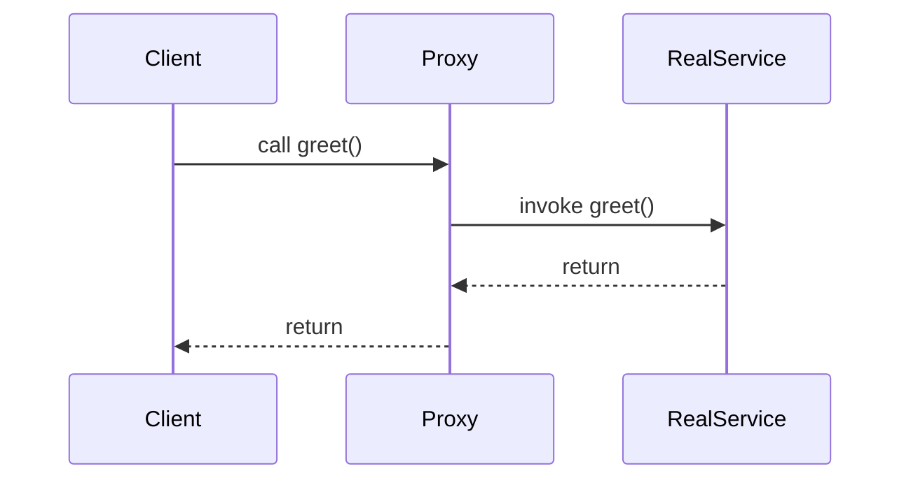

## 7.8.3 Dynamic Proxies in Java

Dynamic proxies in Java provide a powerful mechanism to create proxy instances at runtime, enabling developers to intercept method calls and add additional behavior without modifying the original code. This capability is particularly useful in scenarios such as logging, security checks, and implementing aspect-oriented programming (AOP). This section delves into the intricacies of dynamic proxies, illustrating their creation and use through practical examples.

### Understanding Dynamic Proxies

Dynamic proxies in Java are part of the `java.lang.reflect` package, which provides classes and interfaces for obtaining reflective information about classes and objects. The key components for creating dynamic proxies are:

- **`java.lang.reflect.Proxy`**: A class that provides static methods to create dynamic proxy instances.
- **`java.lang.reflect.InvocationHandler`**: An interface that must be implemented to define the behavior of the proxy instance.

#### How Dynamic Proxies Work

Dynamic proxies operate by creating a proxy instance that implements a specified list of interfaces. When a method is invoked on the proxy instance, the call is dispatched to the `invoke` method of the associated `InvocationHandler`. This allows developers to define custom behavior for method calls.

### Creating a Dynamic Proxy

To create a dynamic proxy, follow these steps:

1. **Define the Interface**: The proxy must implement one or more interfaces.
2. **Implement the InvocationHandler**: Define the behavior of the proxy by implementing the `InvocationHandler` interface.
3. **Create the Proxy Instance**: Use the `Proxy.newProxyInstance` method to create the proxy.

#### Code Example: Basic Dynamic Proxy

Below is a simple example demonstrating the creation of a dynamic proxy:

```java
import java.lang.reflect.InvocationHandler;
import java.lang.reflect.Method;
import java.lang.reflect.Proxy;

// Step 1: Define the interface
interface GreetingService {
    void greet(String name);
}

// Step 2: Implement the InvocationHandler
class GreetingInvocationHandler implements InvocationHandler {
    private final GreetingService original;

    public GreetingInvocationHandler(GreetingService original) {
        this.original = original;
    }

    @Override
    public Object invoke(Object proxy, Method method, Object[] args) throws Throwable {
        System.out.println("Before method call");
        Object result = method.invoke(original, args);
        System.out.println("After method call");
        return result;
    }
}

// Step 3: Create the proxy instance
public class DynamicProxyExample {
    public static void main(String[] args) {
        GreetingService originalService = new GreetingService() {
            @Override
            public void greet(String name) {
                System.out.println("Hello, " + name);
            }
        };

        GreetingService proxyInstance = (GreetingService) Proxy.newProxyInstance(
                originalService.getClass().getClassLoader(),
                new Class[]{GreetingService.class},
                new GreetingInvocationHandler(originalService)
        );

        proxyInstance.greet("World");
    }
}
```

**Explanation**: In this example, the `GreetingInvocationHandler` intercepts calls to the `greet` method, allowing additional behavior to be executed before and after the method call.

### Practical Applications of Dynamic Proxies

Dynamic proxies are versatile and can be used in various scenarios:

#### Method Interception

Dynamic proxies are ideal for intercepting method calls to add cross-cutting concerns such as logging, security, or transaction management.

#### Logging

By intercepting method calls, dynamic proxies can log method entry and exit points, arguments, and return values.

#### Aspect-Oriented Programming (AOP)

Dynamic proxies facilitate AOP by allowing developers to define aspects that can be applied to method calls, such as performance monitoring or exception handling.

### Limitations of Dynamic Proxies

While dynamic proxies are powerful, they have certain limitations:

- **Interface Requirement**: Dynamic proxies can only proxy interfaces, not concrete classes. This means that all methods to be proxied must be declared in an interface.
- **Performance Overhead**: The use of reflection can introduce performance overhead, making dynamic proxies less suitable for performance-critical applications.
- **Complexity**: Managing and debugging dynamic proxies can be complex, especially in large systems with many proxy instances.

### Advanced Use Cases

Dynamic proxies can be extended to more advanced use cases, such as:

#### Implementing Caching

Dynamic proxies can be used to implement caching mechanisms by intercepting method calls and returning cached results when appropriate.

#### Security Checks

Proxies can enforce security policies by checking permissions before allowing method execution.

### Alternative Implementations

Java provides other mechanisms for creating proxies, such as the `cglib` library, which allows for proxying concrete classes. However, `cglib` proxies are more complex and require additional dependencies.

### Visualizing Dynamic Proxies

To better understand the flow of dynamic proxies, consider the following sequence diagram:



**Caption**: This diagram illustrates the interaction between the client, proxy, and real service. The proxy intercepts the method call, delegates it to the real service, and then returns the result to the client.

### Best Practices for Using Dynamic Proxies

- **Interface Design**: Ensure that all methods to be proxied are declared in interfaces.
- **Performance Considerations**: Be mindful of the performance impact of using reflection.
- **Error Handling**: Implement robust error handling in the `InvocationHandler` to manage exceptions gracefully.

### Conclusion

Dynamic proxies in Java offer a flexible and powerful mechanism for adding behavior to method calls at runtime. By understanding their capabilities and limitations, developers can leverage dynamic proxies to implement cross-cutting concerns and enhance the modularity of their applications.

### References and Further Reading

- [Java Documentation](https://docs.oracle.com/en/java/)
- [Proxy Pattern](https://en.wikipedia.org/wiki/Proxy_pattern)
- [Aspect-Oriented Programming](https://en.wikipedia.org/wiki/Aspect-oriented_programming)

## Test Your Knowledge: Dynamic Proxies in Java Quiz



### What is the primary class used to create dynamic proxies in Java?

- [x] `java.lang.reflect.Proxy`
- [ ] `java.lang.reflect.Method`
- [ ] `java.lang.reflect.InvocationHandler`
- [ ] `java.lang.reflect.Constructor`

> **Explanation:** The `java.lang.reflect.Proxy` class provides static methods to create dynamic proxy instances.

### Which interface must be implemented to define the behavior of a dynamic proxy?

- [x] `InvocationHandler`
- [ ] `Runnable`
- [ ] `Callable`
- [ ] `Serializable`

> **Explanation:** The `InvocationHandler` interface must be implemented to define the behavior of the proxy instance.

### What is a limitation of dynamic proxies in Java?

- [x] They can only proxy interfaces.
- [ ] They can only proxy classes.
- [ ] They cannot intercept method calls.
- [ ] They do not support logging.

> **Explanation:** Dynamic proxies can only proxy interfaces, not concrete classes.

### In which package are dynamic proxies located?

- [x] `java.lang.reflect`
- [ ] `java.util`
- [ ] `java.io`
- [ ] `java.net`

> **Explanation:** Dynamic proxies are part of the `java.lang.reflect` package.

### What is a common use case for dynamic proxies?

- [x] Method interception
- [ ] File I/O operations
- [ ] Network communication
- [ ] GUI rendering

> **Explanation:** Dynamic proxies are commonly used for method interception to add additional behavior.

### Can dynamic proxies be used for logging purposes?

- [x] Yes
- [ ] No

> **Explanation:** Dynamic proxies can intercept method calls and add logging behavior.

### What is a benefit of using dynamic proxies?

- [x] They allow for runtime flexibility.
- [ ] They improve compile-time performance.
- [ ] They simplify GUI design.
- [ ] They enhance database connectivity.

> **Explanation:** Dynamic proxies provide runtime flexibility by allowing behavior to be added to method calls dynamically.

### Which of the following is NOT a use case for dynamic proxies?

- [ ] Logging
- [ ] Security checks
- [ ] Caching
- [x] GUI design

> **Explanation:** Dynamic proxies are not typically used for GUI design.

### What is a potential drawback of using dynamic proxies?

- [x] Performance overhead due to reflection
- [ ] Inability to proxy interfaces
- [ ] Lack of flexibility
- [ ] Limited to GUI applications

> **Explanation:** The use of reflection in dynamic proxies can introduce performance overhead.

### True or False: Dynamic proxies can be used to implement aspect-oriented programming.

- [x] True
- [ ] False

> **Explanation:** Dynamic proxies can be used to implement aspect-oriented programming by allowing cross-cutting concerns to be applied to method calls.


