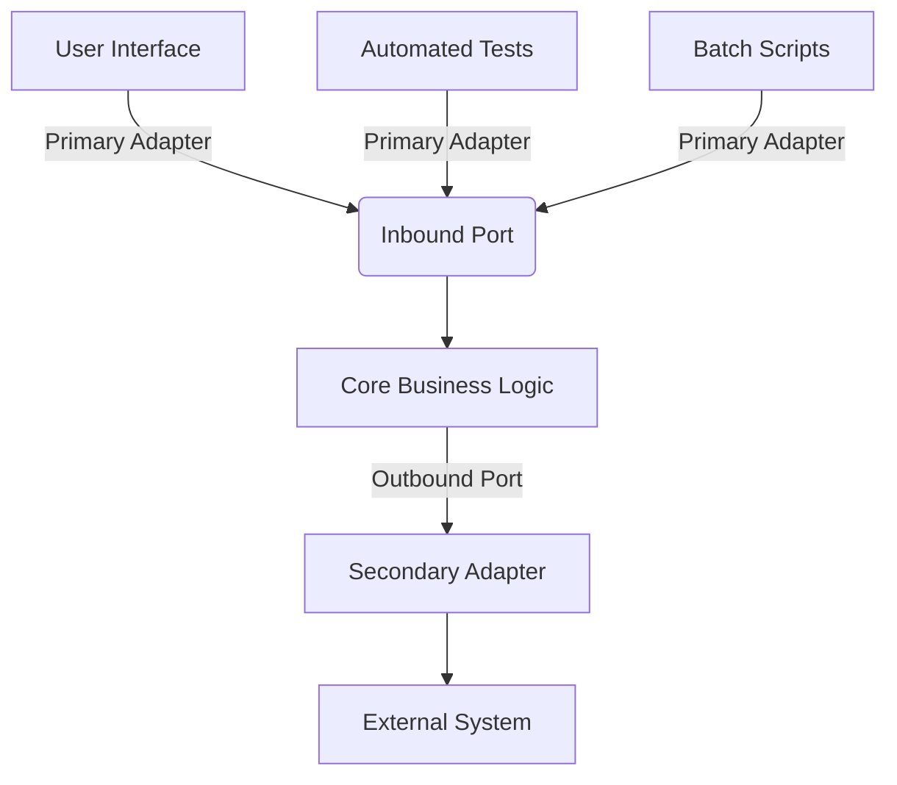

## 7.8 Hexagonal Architecture (Ports and Adapters)

In the realm of software architecture, the Hexagonal Architecture, also known as Ports and Adapters, offers a robust solution for creating maintainable and flexible systems. This architectural pattern is designed to isolate the core logic of an application from external factors, such as user interfaces, databases, and other services. By doing so, it enhances testability and adaptability to change, making it a preferred choice for modern software development.

### Understanding Hexagonal Architecture

Hexagonal Architecture was introduced by Alistair Cockburn in 2005. The primary intent of this architecture is to allow an application to be equally driven by users, programs, automated tests, or batch scripts, and to be developed and tested in isolation from its eventual runtime devices and databases.

#### The Core Concept

At its heart, Hexagonal Architecture revolves around the idea of separating the application into distinct layers, with a clear boundary between the business logic and the outside world. This is achieved through the use of **ports** and **adapters**:

- **Ports**: These are interfaces that define how the application interacts with the outside world. They represent the entry points and exit points of the application, allowing external systems to communicate with the core logic.
- **Adapters**: These are implementations of the ports. They act as intermediaries that translate requests from the outside world into a format that the core logic can understand and vice versa.

By using ports and adapters, the core business logic remains agnostic to the specifics of the external systems, which can be swapped or modified without affecting the core.

### Ports and Adapters: A Detailed Explanation

#### Ports

Ports are the interfaces that define the boundaries of the application. They are categorized into two types:

1. **Inbound Ports**: These ports represent the ways in which the application can be invoked. They define the operations that the application offers to the outside world. For example, a service interface that defines methods for processing orders in an e-commerce application.

2. **Outbound Ports**: These ports define how the application interacts with external systems. They represent the operations that the application requires from the outside world. For example, an interface for sending emails or accessing a database.

#### Adapters

Adapters are the concrete implementations of the ports. They are responsible for translating requests from the external systems into a format that the core logic can process. Adapters can be further divided into:

1. **Primary Adapters**: These implement the inbound ports and are responsible for handling incoming requests. They can be REST controllers, message listeners, or any other mechanism that receives input from the outside world.

2. **Secondary Adapters**: These implement the outbound ports and are responsible for interacting with external systems. They can be database repositories, external service clients, or any other mechanism that communicates with the outside world.

### Decoupling Business Logic from Infrastructure

One of the key benefits of Hexagonal Architecture is its ability to decouple business logic from infrastructure. By using ports and adapters, the core logic of the application is isolated from the specifics of the external systems. This decoupling offers several advantages:

- **Flexibility**: Since the core logic is independent of the external systems, it becomes easier to change or replace these systems without affecting the core. For example, switching from a relational database to a NoSQL database can be done by simply changing the adapter implementation.

- **Testability**: The core logic can be tested in isolation from the external systems. By using mock implementations of the ports, developers can write unit tests that focus solely on the business logic, without worrying about the complexities of the external systems.

- **Maintainability**: The separation of concerns makes the application easier to understand and maintain. Changes to the external systems do not affect the core logic, and vice versa.

### Diagram: Visualizing Hexagonal Architecture

To better understand the structure of Hexagonal Architecture, let's visualize it with a diagram:



**Diagram Description**: This diagram illustrates the flow of requests in a Hexagonal Architecture. The user interface, automated tests, and batch scripts interact with the core business logic through primary adapters and inbound ports. The core logic communicates with external systems through outbound ports and secondary adapters.

### Implementing Hexagonal Architecture in Java

Let's walk through a practical example of implementing Hexagonal Architecture in Java. We'll create a simple application that processes orders and sends notifications.

#### Step 1: Define the Core Business Logic

First, we'll define the core business logic, which is independent of any external systems.

```java
// Core Business Logic
public class OrderService {
    private final NotificationPort notificationPort;

    public OrderService(NotificationPort notificationPort) {
        this.notificationPort = notificationPort;
    }

    public void processOrder(Order order) {
        // Business logic for processing the order
        System.out.println("Processing order: " + order);

        // Send notification
        notificationPort.sendNotification("Order processed: " + order);
    }
}
```

#### Step 2: Define the Ports

Next, we'll define the ports that represent the boundaries of the application.

```java
// Inbound Port
public interface OrderPort {
    void processOrder(Order order);
}

// Outbound Port
public interface NotificationPort {
    void sendNotification(String message);
}
```

#### Step 3: Implement the Adapters

Now, we'll implement the adapters that translate requests to and from the core logic.

```java
// Primary Adapter
public class OrderController implements OrderPort {
    private final OrderService orderService;

    public OrderController(OrderService orderService) {
        this.orderService = orderService;
    }

    @Override
    public void processOrder(Order order) {
        orderService.processOrder(order);
    }
}

// Secondary Adapter
public class EmailNotificationAdapter implements NotificationPort {
    @Override
    public void sendNotification(String message) {
        // Logic to send email notification
        System.out.println("Sending email: " + message);
    }
}
```

#### Step 4: Assemble the Application

Finally, we'll assemble the application by wiring the components together.

```java
public class Application {
    public static void main(String[] args) {
        // Create the secondary adapter
        NotificationPort notificationPort = new EmailNotificationAdapter();

        // Create the core business logic
        OrderService orderService = new OrderService(notificationPort);

        // Create the primary adapter
        OrderPort orderPort = new OrderController(orderService);

        // Process an order
        Order order = new Order("123", "Product XYZ");
        orderPort.processOrder(order);
    }
}

class Order {
    private final String orderId;
    private final String productName;

    public Order(String orderId, String productName) {
        this.orderId = orderId;
        this.productName = productName;
    }

    @Override
    public String toString() {
        return "Order{" +
                "orderId='" + orderId + '\'' +
                ", productName='" + productName + '\'' +
                '}';
    }
}
```

### Benefits of Hexagonal Architecture

Hexagonal Architecture offers several benefits that make it an attractive choice for modern software development:

1. **Enhanced Testability**: By isolating the core logic from external systems, it becomes easier to write unit tests that focus solely on the business logic. Mock implementations of the ports can be used to simulate interactions with external systems.

2. **Increased Flexibility**: The decoupling of the core logic from the external systems allows for greater flexibility in adapting to changes. New external systems can be integrated by simply adding new adapters, without modifying the core logic.

3. **Improved Maintainability**: The separation of concerns makes the application easier to understand and maintain. Changes to the external systems do not affect the core logic, and vice versa.

4. **Adaptability to Change**: The architecture is designed to accommodate changes in the external systems. For example, switching from a REST API to a message queue can be done by changing the primary adapter, without affecting the core logic.

5. **Ease of Integration**: The use of ports and adapters makes it easier to integrate with external systems. New integrations can be added by implementing new adapters, without modifying the core logic.

### Try It Yourself

Now that we've explored the concepts and implementation of Hexagonal Architecture, it's time to try it yourself. Here are a few suggestions for modifications to the code examples:

- **Add a New Notification Adapter**: Implement a new adapter for sending SMS notifications and integrate it with the existing application.

- **Introduce a New Inbound Port**: Create a new inbound port for processing orders from a batch file and implement the corresponding adapter.

- **Enhance the Business Logic**: Add additional business logic to the `OrderService` class, such as validating the order or calculating the total price.

### Conclusion

Hexagonal Architecture, with its use of ports and adapters, offers a powerful solution for creating maintainable and flexible systems. By isolating the core logic from external systems, it enhances testability, flexibility, and maintainability, making it an ideal choice for modern software development. As you continue your journey in software architecture, consider adopting Hexagonal Architecture to build robust and adaptable applications.

## Quiz Time!



### What is the primary intent of Hexagonal Architecture?

- [x] To isolate the application core from external factors
- [ ] To enhance the speed of the application
- [ ] To reduce the number of classes in an application
- [ ] To increase the complexity of the application

> **Explanation:** The primary intent of Hexagonal Architecture is to isolate the application core from external factors, enhancing testability and flexibility.

### What are ports in Hexagonal Architecture?

- [x] Interfaces that define how the application interacts with the outside world
- [ ] Concrete implementations of the application logic
- [ ] Classes that handle user input
- [ ] Methods that process data

> **Explanation:** Ports are interfaces that define how the application interacts with the outside world, representing the entry and exit points of the application.

### What role do adapters play in Hexagonal Architecture?

- [x] They implement ports and translate requests between the core logic and external systems
- [ ] They define the core business logic of the application
- [ ] They are responsible for database interactions
- [ ] They are used for error handling

> **Explanation:** Adapters implement ports and translate requests between the core logic and external systems, acting as intermediaries.

### How does Hexagonal Architecture enhance testability?

- [x] By isolating the core logic from external systems, allowing for unit tests that focus solely on the business logic
- [ ] By reducing the number of classes in the application
- [ ] By increasing the complexity of the application
- [ ] By making the application run faster

> **Explanation:** Hexagonal Architecture enhances testability by isolating the core logic from external systems, allowing for unit tests that focus solely on the business logic.

### What is an inbound port in Hexagonal Architecture?

- [x] A port that represents the ways in which the application can be invoked
- [ ] A port that defines how the application interacts with external systems
- [ ] A port that handles database interactions
- [ ] A port that processes user input

> **Explanation:** An inbound port represents the ways in which the application can be invoked, defining the operations offered to the outside world.

### What is a secondary adapter in Hexagonal Architecture?

- [x] An adapter that implements outbound ports and interacts with external systems
- [ ] An adapter that handles user input
- [ ] An adapter that defines the core business logic
- [ ] An adapter that processes data

> **Explanation:** A secondary adapter implements outbound ports and interacts with external systems, translating requests from the core logic.

### How does Hexagonal Architecture improve maintainability?

- [x] By separating concerns, making the application easier to understand and maintain
- [ ] By reducing the number of classes in the application
- [ ] By increasing the complexity of the application
- [ ] By making the application run faster

> **Explanation:** Hexagonal Architecture improves maintainability by separating concerns, making the application easier to understand and maintain.

### What is the benefit of using ports and adapters in Hexagonal Architecture?

- [x] They allow for greater flexibility in adapting to changes
- [ ] They reduce the number of classes in the application
- [ ] They increase the complexity of the application
- [ ] They make the application run faster

> **Explanation:** Ports and adapters allow for greater flexibility in adapting to changes, as they decouple the core logic from external systems.

### What is a primary adapter in Hexagonal Architecture?

- [x] An adapter that implements inbound ports and handles incoming requests
- [ ] An adapter that defines the core business logic
- [ ] An adapter that interacts with external systems
- [ ] An adapter that processes data

> **Explanation:** A primary adapter implements inbound ports and handles incoming requests, translating them for the core logic.

### True or False: Hexagonal Architecture is also known as Ports and Adapters.

- [x] True
- [ ] False

> **Explanation:** True. Hexagonal Architecture is also known as Ports and Adapters, emphasizing the use of interfaces and implementations to isolate the core logic from external systems.


