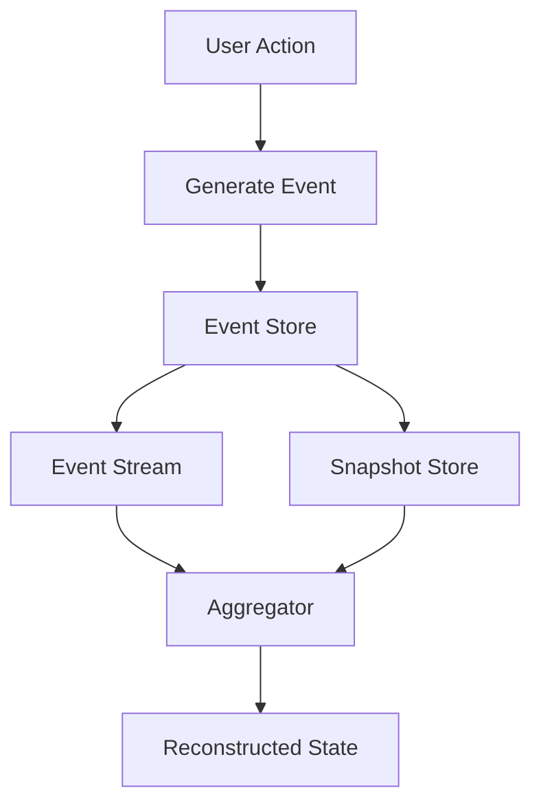

## 7.9.1 Implementing Event Sourcing in Java

Event Sourcing is a powerful architectural pattern that involves storing the state of a system as a sequence of events. These events represent changes to the system's state, and the current state can be reconstructed by replaying these events. This approach offers several benefits, including improved auditability, the ability to reconstruct past states, and enhanced scalability.

In this section, we will explore how to implement Event Sourcing in Java. We'll cover the creation of event classes, the implementation of an event store, the use of aggregators, and the reconstruction of application state from events. Additionally, we'll discuss the use of event streams and snapshots, as well as considerations for performance and storage.

### Understanding Event Sourcing

Before diving into the implementation, let's briefly understand the core concepts of Event Sourcing:

- **Event**: A record of a change to the system's state. Events are immutable and represent facts that have occurred.
- **Event Store**: A storage mechanism for persisting events. It acts as the source of truth for the system's state.
- **Aggregator**: An entity that processes events to maintain the current state of the system.
- **Snapshot**: A periodic capture of the system's state, used to optimize the process of state reconstruction.

### Setting Up Event Sourcing in Java

To implement Event Sourcing in Java, we'll follow these steps:

1. **Define Event Classes**: Create classes that represent different types of events.
2. **Implement an Event Store**: Develop a mechanism to persist and retrieve events.
3. **Create Aggregators**: Implement logic to process events and maintain the current state.
4. **Reconstruct State from Events**: Use events to rebuild the system's state.
5. **Utilize Event Streams and Snapshots**: Optimize state reconstruction using snapshots.

#### Defining Event Classes

Event classes are the building blocks of Event Sourcing. Each event class represents a specific change to the system's state. Let's define a simple event class in Java:

```java
public abstract class Event {
    private final String eventId;
    private final long timestamp;

    public Event(String eventId, long timestamp) {
        this.eventId = eventId;
        this.timestamp = timestamp;
    }

    public String getEventId() {
        return eventId;
    }

    public long getTimestamp() {
        return timestamp;
    }
}

public class AccountCreatedEvent extends Event {
    private final String accountId;
    private final String ownerName;

    public AccountCreatedEvent(String eventId, long timestamp, String accountId, String ownerName) {
        super(eventId, timestamp);
        this.accountId = accountId;
        this.ownerName = ownerName;
    }

    public String getAccountId() {
        return accountId;
    }

    public String getOwnerName() {
        return ownerName;
    }
}

public class MoneyDepositedEvent extends Event {
    private final String accountId;
    private final double amount;

    public MoneyDepositedEvent(String eventId, long timestamp, String accountId, double amount) {
        super(eventId, timestamp);
        this.accountId = accountId;
        this.amount = amount;
    }

    public String getAccountId() {
        return accountId;
    }

    public double getAmount() {
        return amount;
    }
}
```

In this example, we define a base `Event` class and two specific event types: `AccountCreatedEvent` and `MoneyDepositedEvent`. Each event contains relevant data and metadata, such as an event ID and timestamp.

#### Implementing an Event Store

The event store is responsible for persisting and retrieving events. It acts as the system's source of truth. Let's implement a simple in-memory event store in Java:

```java
import java.util.ArrayList;
import java.util.List;
import java.util.stream.Collectors;

public class InMemoryEventStore {
    private final List<Event> events = new ArrayList<>();

    public void saveEvent(Event event) {
        events.add(event);
    }

    public List<Event> getEventsForAccount(String accountId) {
        return events.stream()
                .filter(event -> event instanceof AccountCreatedEvent && ((AccountCreatedEvent) event).getAccountId().equals(accountId) ||
                                 event instanceof MoneyDepositedEvent && ((MoneyDepositedEvent) event).getAccountId().equals(accountId))
                .collect(Collectors.toList());
    }
}
```

This `InMemoryEventStore` class provides methods to save events and retrieve events related to a specific account. In a production environment, you would replace this with a more robust storage solution, such as a database.

#### Creating Aggregators

Aggregators process events to maintain the current state of the system. Let's create an aggregator for managing account balances:

```java
import java.util.List;

public class AccountAggregator {
    private double balance;

    public AccountAggregator() {
        this.balance = 0.0;
    }

    public void applyEvents(List<Event> events) {
        for (Event event : events) {
            if (event instanceof MoneyDepositedEvent) {
                apply((MoneyDepositedEvent) event);
            }
        }
    }

    private void apply(MoneyDepositedEvent event) {
        balance += event.getAmount();
    }

    public double getBalance() {
        return balance;
    }
}
```

The `AccountAggregator` class processes `MoneyDepositedEvent` events to update the account balance. It maintains the current state by applying each event in sequence.

#### Reconstructing State from Events

To reconstruct the state of the system, we replay the events stored in the event store. Here's how we can achieve this:

```java
public class AccountService {
    private final InMemoryEventStore eventStore;

    public AccountService(InMemoryEventStore eventStore) {
        this.eventStore = eventStore;
    }

    public double getAccountBalance(String accountId) {
        List<Event> events = eventStore.getEventsForAccount(accountId);
        AccountAggregator aggregator = new AccountAggregator();
        aggregator.applyEvents(events);
        return aggregator.getBalance();
    }
}
```

The `AccountService` class retrieves events for a specific account and uses the `AccountAggregator` to reconstruct the account balance.

#### Utilizing Event Streams and Snapshots

As the number of events grows, reconstructing the state by replaying all events can become inefficient. To address this, we can use snapshots to periodically capture the state of the system. This allows us to start replaying events from the last snapshot, reducing the number of events that need to be processed.

Here's an example of how to implement snapshots:

```java
public class Snapshot {
    private final String accountId;
    private final double balance;
    private final long timestamp;

    public Snapshot(String accountId, double balance, long timestamp) {
        this.accountId = accountId;
        this.balance = balance;
        this.timestamp = timestamp;
    }

    public String getAccountId() {
        return accountId;
    }

    public double getBalance() {
        return balance;
    }

    public long getTimestamp() {
        return timestamp;
    }
}

public class SnapshotStore {
    private final List<Snapshot> snapshots = new ArrayList<>();

    public void saveSnapshot(Snapshot snapshot) {
        snapshots.add(snapshot);
    }

    public Snapshot getLatestSnapshot(String accountId) {
        return snapshots.stream()
                .filter(snapshot -> snapshot.getAccountId().equals(accountId))
                .max((s1, s2) -> Long.compare(s1.getTimestamp(), s2.getTimestamp()))
                .orElse(null);
    }
}
```

In this implementation, the `SnapshotStore` class manages snapshots, allowing us to save and retrieve the latest snapshot for a specific account.

### Performance and Storage Considerations

When implementing Event Sourcing, it's important to consider performance and storage:

- **Event Store**: Choose a storage solution that can handle high write and read throughput. Consider using databases optimized for append-only operations, such as Apache Kafka or EventStoreDB.
- **Snapshots**: Determine an appropriate snapshot frequency based on the system's requirements. More frequent snapshots reduce the number of events that need to be replayed but increase storage requirements.
- **Event Streams**: Organize events into streams based on logical groupings, such as by account or entity type. This allows for efficient retrieval and processing of events.
- **Scalability**: Design the system to scale horizontally by partitioning event streams and distributing them across multiple nodes.

### Visualizing Event Sourcing Architecture

To better understand the flow of data in an Event Sourcing system, let's visualize the architecture using a Mermaid.js diagram:



**Diagram Description**: This flowchart illustrates the process of generating events from user actions, storing them in the event store, and using snapshots and event streams to reconstruct the system's state through aggregators.

### Try It Yourself

To deepen your understanding of Event Sourcing, try modifying the code examples provided:

- **Add New Event Types**: Create additional event classes to represent different types of changes, such as `MoneyWithdrawnEvent`.
- **Implement a Persistent Event Store**: Replace the in-memory event store with a database-backed implementation.
- **Optimize State Reconstruction**: Experiment with different snapshot frequencies and observe the impact on performance.

### References and Further Reading

For more information on Event Sourcing and related concepts, consider exploring the following resources:

- [Martin Fowler's article on Event Sourcing](https://martinfowler.com/eaaDev/EventSourcing.html)
- [Event Store Documentation](https://eventstore.com/docs/)
- [Apache Kafka Documentation](https://kafka.apache.org/documentation/)

### Key Takeaways

- Event Sourcing involves storing the state of a system as a sequence of events.
- Events are immutable records of changes to the system's state.
- An event store acts as the source of truth for the system's state.
- Aggregators process events to maintain the current state.
- Snapshots optimize state reconstruction by capturing the system's state periodically.

## Quiz Time!



### What is the primary purpose of Event Sourcing?

- [x] To store the state of a system as a sequence of events.
- [ ] To optimize database queries.
- [ ] To replace traditional databases.
- [ ] To enhance user interface design.

> **Explanation:** Event Sourcing involves storing the state of a system as a sequence of events, allowing for state reconstruction and auditability.

### Which class in the example is responsible for maintaining the current state of the system?

- [ ] Event
- [ ] InMemoryEventStore
- [x] AccountAggregator
- [ ] AccountService

> **Explanation:** The `AccountAggregator` class processes events to maintain the current state of the system.

### What is the role of a snapshot in Event Sourcing?

- [x] To periodically capture the system's state for optimized state reconstruction.
- [ ] To store user preferences.
- [ ] To replace event stores.
- [ ] To enhance security.

> **Explanation:** Snapshots capture the system's state periodically, reducing the number of events needed for state reconstruction.

### How can event streams be organized for efficient retrieval?

- [x] By logical groupings such as account or entity type.
- [ ] By random order.
- [ ] By event size.
- [ ] By user preference.

> **Explanation:** Organizing events into streams based on logical groupings allows for efficient retrieval and processing.

### What is a key consideration when choosing a storage solution for Event Sourcing?

- [x] High write and read throughput.
- [ ] Low cost.
- [ ] User-friendly interface.
- [ ] Colorful UI.

> **Explanation:** A storage solution with high write and read throughput is essential for handling the demands of Event Sourcing.

### What is a benefit of using Event Sourcing?

- [x] Improved auditability and ability to reconstruct past states.
- [ ] Reduced code complexity.
- [ ] Enhanced user interface design.
- [ ] Faster application startup.

> **Explanation:** Event Sourcing improves auditability and allows for the reconstruction of past states.

### Which of the following is NOT a component of Event Sourcing?

- [ ] Event
- [ ] Event Store
- [ ] Aggregator
- [x] User Interface

> **Explanation:** The User Interface is not a component of Event Sourcing, which focuses on events, event stores, and aggregators.

### What is the purpose of the `InMemoryEventStore` class?

- [x] To persist and retrieve events.
- [ ] To manage user sessions.
- [ ] To handle network requests.
- [ ] To optimize memory usage.

> **Explanation:** The `InMemoryEventStore` class is responsible for persisting and retrieving events.

### Which Java class is used to represent a specific change to the system's state?

- [x] Event
- [ ] Snapshot
- [ ] Aggregator
- [ ] Service

> **Explanation:** The `Event` class represents a specific change to the system's state.

### True or False: Event Sourcing can enhance scalability by partitioning event streams.

- [x] True
- [ ] False

> **Explanation:** Event Sourcing can enhance scalability by partitioning event streams and distributing them across multiple nodes.



Remember, this is just the beginning. As you progress, you'll build more complex and interactive systems using Event Sourcing. Keep experimenting, stay curious, and enjoy the journey!
