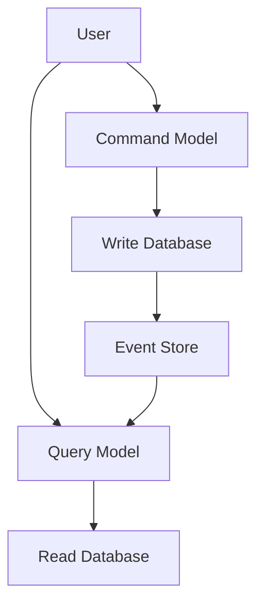

## 7.9.2 Command Query Responsibility Segregation (CQRS)

Command Query Responsibility Segregation (CQRS) is a powerful architectural pattern that separates read and write operations into distinct models. This separation allows for optimized performance and scalability, especially in complex systems where the demands on reading and writing data differ significantly. Let's delve into the principles of CQRS, its benefits, how it complements Event Sourcing, and the challenges it presents, particularly around data consistency.

### Understanding CQRS Principles

CQRS is based on the principle that commands (writes) and queries (reads) should be handled by separate models. This separation allows each model to be optimized for its specific purpose, leading to more efficient and scalable applications.

#### Key Concepts

- **Commands**: These are operations that change the state of the system. They are responsible for writing data and are typically handled by a command model.
- **Queries**: These are operations that retrieve data without modifying it. They are handled by a query model.
- **Separation of Concerns**: By splitting the responsibilities of commands and queries, each model can be independently optimized and scaled.

### Benefits of CQRS

Implementing CQRS offers several advantages:

1. **Scalability**: Each model can be scaled independently. For instance, if your application has a high read-to-write ratio, you can scale the query model without affecting the command model.
2. **Performance Optimization**: Queries can be optimized for read performance, while commands can focus on ensuring data integrity and consistency.
3. **Simplified Codebase**: By separating concerns, the codebase becomes more manageable and easier to understand.
4. **Flexibility**: Different storage technologies can be used for commands and queries, allowing for more flexibility in choosing the right tool for the job.

### CQRS and Event Sourcing

CQRS is often used in conjunction with Event Sourcing, a pattern where state changes are stored as a sequence of events. This combination allows for a complete audit trail of changes and can simplify the implementation of complex business logic.

#### How They Complement Each Other

- **Event Sourcing** provides a natural way to implement the command side of CQRS by storing each change as an event.
- **CQRS** allows the query side to be built using projections of these events, which can be optimized for read performance.

### Implementing CQRS in Java

Let's explore how to implement CQRS in Java with a practical example. We'll create a simple application that manages a library of books, where users can add, update, and query books.

#### Setting Up the Project

First, we'll set up a basic Java project with the necessary dependencies. We'll use Spring Boot to simplify the setup and management of our application.

```xml
<!-- pom.xml -->
<dependencies>
    <dependency>
        <groupId>org.springframework.boot</groupId>
        <artifactId>spring-boot-starter-web</artifactId>
    </dependency>
    <dependency>
        <groupId>org.springframework.boot</groupId>
        <artifactId>spring-boot-starter-data-jpa</artifactId>
    </dependency>
    <dependency>
        <groupId>com.h2database</groupId>
        <artifactId>h2</artifactId>
        <scope>runtime</scope>
    </dependency>
</dependencies>
```

#### Defining the Command Model

The command model will handle all write operations. We'll create a `BookCommandService` to manage these operations.

```java
// BookCommandService.java
@Service
public class BookCommandService {

    @Autowired
    private BookRepository bookRepository;

    public void addBook(Book book) {
        bookRepository.save(book);
    }

    public void updateBook(Long id, Book updatedBook) {
        Book book = bookRepository.findById(id).orElseThrow(() -> new BookNotFoundException(id));
        book.setTitle(updatedBook.getTitle());
        book.setAuthor(updatedBook.getAuthor());
        bookRepository.save(book);
    }
}
```

#### Defining the Query Model

The query model will handle all read operations. We'll create a `BookQueryService` to manage these operations.

```java
// BookQueryService.java
@Service
public class BookQueryService {

    @Autowired
    private BookRepository bookRepository;

    public List<Book> getAllBooks() {
        return bookRepository.findAll();
    }

    public Book getBookById(Long id) {
        return bookRepository.findById(id).orElseThrow(() -> new BookNotFoundException(id));
    }
}
```

#### Repository Interface

Both services use a common repository interface to interact with the database.

```java
// BookRepository.java
public interface BookRepository extends JpaRepository<Book, Long> {
}
```

#### Handling Commands and Queries

We can now create REST controllers to handle incoming requests for commands and queries.

```java
// BookCommandController.java
@RestController
@RequestMapping("/api/commands/books")
public class BookCommandController {

    @Autowired
    private BookCommandService bookCommandService;

    @PostMapping
    public ResponseEntity<Void> addBook(@RequestBody Book book) {
        bookCommandService.addBook(book);
        return ResponseEntity.status(HttpStatus.CREATED).build();
    }

    @PutMapping("/{id}")
    public ResponseEntity<Void> updateBook(@PathVariable Long id, @RequestBody Book book) {
        bookCommandService.updateBook(id, book);
        return ResponseEntity.ok().build();
    }
}
```

```java
// BookQueryController.java
@RestController
@RequestMapping("/api/queries/books")
public class BookQueryController {

    @Autowired
    private BookQueryService bookQueryService;

    @GetMapping
    public ResponseEntity<List<Book>> getAllBooks() {
        return ResponseEntity.ok(bookQueryService.getAllBooks());
    }

    @GetMapping("/{id}")
    public ResponseEntity<Book> getBookById(@PathVariable Long id) {
        return ResponseEntity.ok(bookQueryService.getBookById(id));
    }
}
```

### Challenges of CQRS

While CQRS offers many benefits, it also introduces challenges, particularly around data consistency.

#### Data Consistency

In a CQRS system, the command and query models can become out of sync. This is because commands update the write model, while queries read from a separate read model, which may be updated asynchronously.

- **Eventual Consistency**: This is a common approach where the system guarantees that the read model will eventually become consistent with the write model. However, there might be a delay.
- **Handling Inconsistencies**: Implement strategies to handle inconsistencies, such as using versioning or timestamps to manage stale data.

#### Complexity

Implementing CQRS can add complexity to your system. It requires careful design and consideration of how data flows through the system.

- **Increased Infrastructure**: You may need additional infrastructure to support separate models and ensure they are kept in sync.
- **Development Overhead**: More code and components to manage, which can increase development time and maintenance.

### Visualizing CQRS Architecture

To better understand the CQRS architecture, let's visualize the separation of command and query responsibilities.



**Diagram Explanation**: The diagram illustrates how users interact with the command and query models separately. Commands update the write database, which then updates the event store. The query model reads from the read database, which is updated based on events from the event store.

### Try It Yourself

To truly grasp CQRS, try modifying the code examples:

- **Add a new feature**: Implement a feature that allows users to delete books and observe how it affects both the command and query models.
- **Experiment with Event Sourcing**: Integrate Event Sourcing into the command model and see how it impacts the architecture and data flow.
- **Simulate Inconsistencies**: Introduce a delay in updating the read model and implement a strategy to handle stale data.

### References and Further Reading

- [Martin Fowler's CQRS](https://martinfowler.com/bliki/CQRS.html)
- [Microsoft's CQRS Journey](https://docs.microsoft.com/en-us/previous-versions/msp-n-p/jj554200(v=pandp.10))
- [Spring Boot Documentation](https://spring.io/projects/spring-boot)

### Knowledge Check

- **What is the primary benefit of separating command and query models in CQRS?**
- **How does CQRS complement Event Sourcing?**
- **What are the challenges of implementing CQRS in a distributed system?**

### Embrace the Journey

Remember, implementing CQRS is just the beginning. As you progress, you'll build more complex and scalable systems. Keep experimenting, stay curious, and enjoy the journey!

## Quiz Time!



### What is the primary benefit of CQRS?

- [x] Separation of read and write concerns
- [ ] Simplified database schema
- [ ] Reduced code complexity
- [ ] Enhanced security

> **Explanation:** CQRS separates read and write concerns, allowing each to be optimized independently.

### How does CQRS complement Event Sourcing?

- [x] By using events to update the read model
- [ ] By storing commands as events
- [ ] By reducing the number of queries
- [ ] By simplifying the command model

> **Explanation:** Event Sourcing stores events that can be used to update the read model in CQRS.

### What is a common challenge of CQRS?

- [x] Data consistency
- [ ] Code duplication
- [ ] Increased security risks
- [ ] Reduced performance

> **Explanation:** Ensuring data consistency between separate models is a common challenge in CQRS.

### In CQRS, what is the role of the command model?

- [x] To handle write operations
- [ ] To handle read operations
- [ ] To manage user authentication
- [ ] To optimize database queries

> **Explanation:** The command model is responsible for handling write operations.

### What is eventual consistency in CQRS?

- [x] The read model will eventually reflect the write model
- [ ] The write model will eventually reflect the read model
- [ ] Both models are always consistent
- [ ] Consistency is not a concern

> **Explanation:** Eventual consistency means the read model will eventually be updated to reflect changes in the write model.

### How can you handle inconsistencies in CQRS?

- [x] Using versioning or timestamps
- [ ] By ignoring them
- [ ] By merging models
- [ ] By simplifying queries

> **Explanation:** Versioning or timestamps can help manage and resolve inconsistencies.

### What is a potential drawback of CQRS?

- [x] Increased infrastructure complexity
- [ ] Reduced scalability
- [ ] Limited flexibility
- [ ] Lower performance

> **Explanation:** CQRS can lead to increased infrastructure complexity due to separate models.

### Which of the following is NOT a benefit of CQRS?

- [ ] Scalability
- [ ] Performance optimization
- [x] Simplified codebase
- [ ] Flexibility

> **Explanation:** While CQRS can simplify certain aspects, it generally adds complexity to the codebase.

### What is a key component of the query model in CQRS?

- [x] Optimized read operations
- [ ] Efficient write operations
- [ ] User authentication
- [ ] Command validation

> **Explanation:** The query model is optimized for read operations.

### True or False: CQRS always requires Event Sourcing.

- [ ] True
- [x] False

> **Explanation:** While CQRS and Event Sourcing complement each other, they can be implemented independently.


