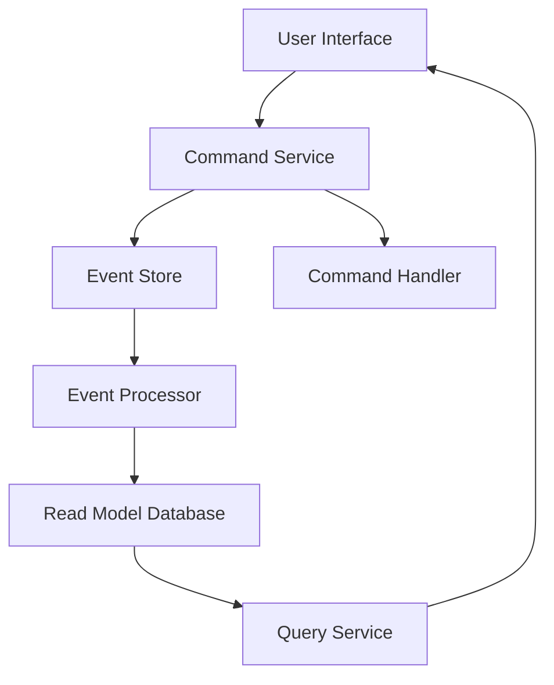
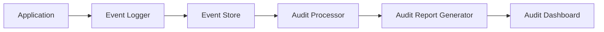

## 7.9.3 Use Cases and Examples

In this section, we delve into the practical applications of Event Sourcing and Command Query Responsibility Segregation (CQRS) in Java, focusing on their use in financial systems and audit trails. These patterns are particularly effective in scenarios requiring high throughput, scalability, and robust auditability. We will explore case studies, provide architectural diagrams, and include code snippets to illustrate implementations. Additionally, we will discuss lessons learned, best practices, and potential drawbacks with mitigation strategies.

### Understanding Event Sourcing and CQRS

Before diving into use cases, let's briefly recap the core concepts:

- **Event Sourcing**: This pattern involves storing the state of a system as a sequence of events. Instead of persisting the current state, each change is recorded as an event, allowing the system to reconstruct its state by replaying these events.

- **CQRS**: This pattern separates the command (write) and query (read) responsibilities into different models. This separation allows for optimized read and write operations, enhancing performance and scalability.

### Case Study: Banking Application

#### Problem Statement

In the banking sector, systems must handle a high volume of transactions while ensuring data integrity and providing detailed audit logs. Traditional database systems can struggle with these requirements due to the need for real-time updates and historical data tracking.

#### Solution: Event Sourcing and CQRS

By implementing Event Sourcing, each transaction (e.g., deposits, withdrawals) is stored as an immutable event. This approach ensures that the entire history of transactions is available for auditing purposes. CQRS further enhances the system by separating the transaction processing (commands) from the account balance queries (queries).

#### Architectural Overview

Below is a high-level architectural diagram illustrating the integration of Event Sourcing and CQRS in a banking application:



**Description**: This diagram shows how user interactions are processed through a command service, which records events in an event store. The event processor updates the read model database, which is queried by the query service to provide data back to the user interface.

#### Code Example: Implementing Event Sourcing

Let's explore a simplified Java implementation of Event Sourcing for a banking application:

```java
// Event class representing a bank transaction
public abstract class BankEvent {
    private final UUID transactionId;
    private final LocalDateTime timestamp;

    public BankEvent(UUID transactionId, LocalDateTime timestamp) {
        this.transactionId = transactionId;
        this.timestamp = timestamp;
    }

    public UUID getTransactionId() {
        return transactionId;
    }

    public LocalDateTime getTimestamp() {
        return timestamp;
    }
}

// Specific event for a deposit
public class DepositEvent extends BankEvent {
    private final double amount;

    public DepositEvent(UUID transactionId, LocalDateTime timestamp, double amount) {
        super(transactionId, timestamp);
        this.amount = amount;
    }

    public double getAmount() {
        return amount;
    }
}
```

**Explanation**: In this example, `BankEvent` is an abstract class representing a generic bank transaction. `DepositEvent` extends `BankEvent` to capture specific details of a deposit transaction.

#### Code Example: Implementing CQRS

For CQRS, we separate the command and query logic:

```java
// Command handler for processing transactions
public class TransactionCommandHandler {
    private final EventStore eventStore;

    public TransactionCommandHandler(EventStore eventStore) {
        this.eventStore = eventStore;
    }

    public void handleDeposit(UUID accountId, double amount) {
        DepositEvent event = new DepositEvent(UUID.randomUUID(), LocalDateTime.now(), amount);
        eventStore.store(event);
    }
}

// Query service for retrieving account balances
public class AccountQueryService {
    private final ReadModelDatabase readModelDatabase;

    public AccountQueryService(ReadModelDatabase readModelDatabase) {
        this.readModelDatabase = readModelDatabase;
    }

    public double getAccountBalance(UUID accountId) {
        return readModelDatabase.getBalance(accountId);
    }
}
```

**Explanation**: The `TransactionCommandHandler` processes deposit commands and stores events in the `EventStore`. The `AccountQueryService` retrieves account balances from the `ReadModelDatabase`, which is updated asynchronously by the event processor.

### Case Study: Audit Trail System

#### Problem Statement

Organizations often require detailed audit trails for compliance and regulatory purposes. Traditional logging mechanisms can be insufficient for capturing the full context and sequence of events leading to a particular state.

#### Solution: Event Sourcing

Event Sourcing provides a natural fit for audit trail systems by capturing every change as an event. This approach ensures that the entire history is preserved and can be replayed to understand how the current state was achieved.

#### Architectural Overview

Below is a diagram illustrating an audit trail system using Event Sourcing:



**Description**: This diagram shows how application events are logged and stored in an event store. The audit processor generates reports from these events, which are displayed on an audit dashboard.

#### Code Example: Implementing an Audit Trail

Here's a Java implementation for capturing and processing audit events:

```java
// Event class for audit logging
public class AuditEvent {
    private final String action;
    private final String user;
    private final LocalDateTime timestamp;

    public AuditEvent(String action, String user, LocalDateTime timestamp) {
        this.action = action;
        this.user = user;
        this.timestamp = timestamp;
    }

    public String getAction() {
        return action;
    }

    public String getUser() {
        return user;
    }

    public LocalDateTime getTimestamp() {
        return timestamp;
    }
}

// Audit processor for generating reports
public class AuditProcessor {
    private final EventStore eventStore;

    public AuditProcessor(EventStore eventStore) {
        this.eventStore = eventStore;
    }

    public List<AuditEvent> generateReport(LocalDateTime from, LocalDateTime to) {
        return eventStore.getEvents(from, to)
                         .stream()
                         .filter(event -> event instanceof AuditEvent)
                         .map(event -> (AuditEvent) event)
                         .collect(Collectors.toList());
    }
}
```

**Explanation**: `AuditEvent` captures details of user actions. `AuditProcessor` retrieves and filters events from the `EventStore` to generate audit reports.

### Lessons Learned and Best Practices

1. **Event Granularity**: Define events at an appropriate level of granularity. Too fine-grained events can lead to excessive storage and processing overhead, while too coarse-grained events can lose important details.

2. **Event Schema Evolution**: Plan for changes in event schemas over time. Use versioning strategies to handle schema evolution without disrupting existing data.

3. **Consistency Models**: Understand the trade-offs between eventual consistency and strong consistency. Event Sourcing naturally leads to eventual consistency, which may require additional mechanisms to ensure data accuracy.

4. **Scalability**: Leverage CQRS to scale read and write operations independently. This separation allows for optimized performance and resource allocation.

5. **Auditability**: Event Sourcing inherently provides a complete audit trail, making it easier to comply with regulatory requirements and perform forensic analysis.

### Potential Drawbacks and Mitigation Strategies

1. **Complexity**: Implementing Event Sourcing and CQRS can introduce complexity, especially in terms of event processing and consistency management. Mitigate this by using established frameworks and libraries that provide out-of-the-box support.

2. **Storage Requirements**: Storing every event can lead to significant storage requirements. Use data compression techniques and archive older events to manage storage costs.

3. **Latency**: The separation of command and query models can introduce latency in data availability. Use caching strategies and optimize event processing to minimize delays.

4. **Eventual Consistency**: While eventual consistency is a feature, it can also be a challenge in systems requiring immediate consistency. Implement compensating transactions and sagas to handle consistency issues.

### Try It Yourself

To deepen your understanding, try modifying the code examples to:

- Add new types of events (e.g., withdrawal, transfer) and implement corresponding command handlers.
- Enhance the audit trail system by adding filtering and sorting capabilities to the `AuditProcessor`.
- Experiment with different consistency models by introducing delays in event processing and observing the impact on the read model.

### Conclusion

Event Sourcing and CQRS are powerful patterns that address specific needs in systems requiring high throughput, scalability, and auditability. By understanding their use cases and potential challenges, you can effectively implement these patterns in your Java applications. Remember, this is just the beginning. As you progress, you'll discover more opportunities to apply these patterns and enhance your system's capabilities. Keep experimenting, stay curious, and enjoy the journey!

## Quiz Time!



### What is the primary benefit of using Event Sourcing in financial systems?

- [x] Provides a complete audit trail of all transactions.
- [ ] Reduces storage requirements by storing only the current state.
- [ ] Increases the speed of transaction processing.
- [ ] Simplifies the database schema.

> **Explanation:** Event Sourcing captures every change as an event, providing a complete audit trail, which is crucial for financial systems.

### How does CQRS enhance system performance?

- [x] By separating read and write operations, allowing for independent scaling.
- [ ] By combining read and write operations into a single model.
- [ ] By storing only the current state of the system.
- [ ] By reducing the number of database queries.

> **Explanation:** CQRS separates the command (write) and query (read) responsibilities, enabling independent scaling and optimization of each operation.

### What is a potential drawback of Event Sourcing?

- [x] Increased storage requirements due to storing all events.
- [ ] Difficulty in implementing audit trails.
- [ ] Inability to handle complex transactions.
- [ ] Lack of support for eventual consistency.

> **Explanation:** Event Sourcing requires storing every event, which can lead to increased storage requirements.

### Which pattern is naturally aligned with eventual consistency?

- [x] Event Sourcing
- [ ] Singleton
- [ ] Factory Method
- [ ] Adapter

> **Explanation:** Event Sourcing naturally leads to eventual consistency, as events are processed asynchronously.

### What strategy can mitigate the latency introduced by CQRS?

- [x] Caching strategies and optimized event processing.
- [ ] Increasing the frequency of event processing.
- [ ] Reducing the number of events stored.
- [ ] Combining command and query models.

> **Explanation:** Caching strategies and optimized event processing can help mitigate the latency introduced by the separation of command and query models in CQRS.

### What is a common use case for Event Sourcing?

- [x] Audit trails
- [ ] Real-time gaming
- [ ] Image processing
- [ ] Static website hosting

> **Explanation:** Event Sourcing is commonly used for audit trails, as it provides a complete history of changes.

### How can you handle changes in event schemas over time?

- [x] Use versioning strategies to manage schema evolution.
- [ ] Store only the latest version of each event.
- [ ] Avoid changing event schemas.
- [ ] Use a single schema for all events.

> **Explanation:** Versioning strategies allow for managing schema evolution without disrupting existing data.

### What is a key consideration when defining events in Event Sourcing?

- [x] Event granularity
- [ ] Event color
- [ ] Event size
- [ ] Event location

> **Explanation:** Defining events at an appropriate level of granularity is crucial to balance storage and processing overhead with detail retention.

### Which of the following is a lesson learned from implementing Event Sourcing and CQRS?

- [x] Plan for event schema evolution.
- [ ] Always use strong consistency models.
- [ ] Store only the current state of the system.
- [ ] Avoid using established frameworks.

> **Explanation:** Planning for event schema evolution is essential to handle changes over time without disrupting existing data.

### True or False: Event Sourcing and CQRS are only suitable for financial systems.

- [ ] True
- [x] False

> **Explanation:** While Event Sourcing and CQRS are highly effective in financial systems, they can be applied to various domains requiring auditability and scalability.


