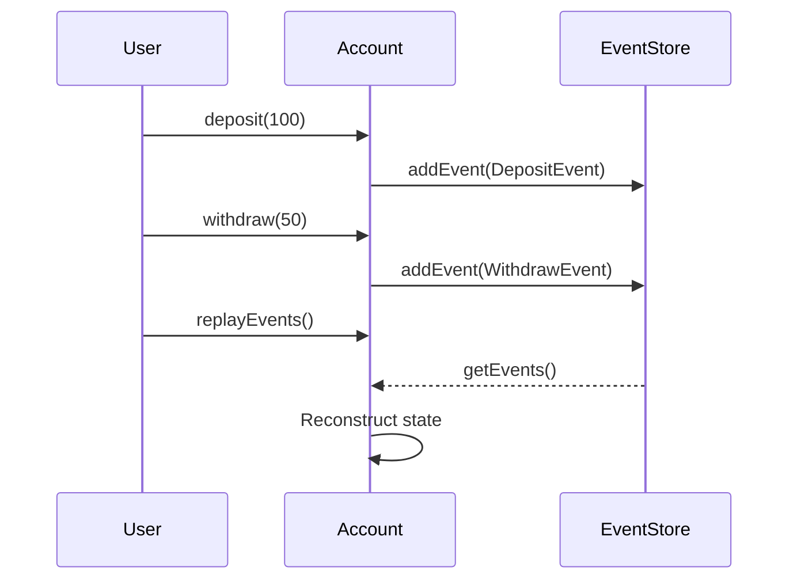
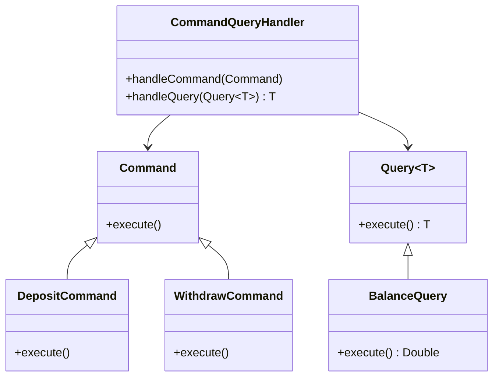

## 7.9 Event Sourcing and CQRS

In the realm of software architecture, Event Sourcing and Command Query Responsibility Segregation (CQRS) are two powerful patterns that can significantly enhance the scalability, performance, and auditability of applications. These patterns are particularly valuable in complex systems where maintaining data integrity and optimizing operations are paramount.

### Understanding Event Sourcing

**Event Sourcing** is an architectural pattern where all changes to the application state are stored as a sequence of events. Instead of persisting the current state of an entity, every change is recorded as an event. This allows the system to reconstruct the state of an entity at any point in time by replaying the events.

#### Key Concepts of Event Sourcing

- **Event Store**: A specialized database that stores events. Each event represents a state change and is immutable.
- **Event Replay**: The process of reapplying events to reconstruct the current state of an entity.
- **Event Sourcing Handler**: A component responsible for processing and storing events.

#### Benefits of Event Sourcing

- **Auditability**: Every change is recorded, providing a complete audit trail.
- **Scalability**: Events can be processed in parallel, improving performance.
- **Flexibility**: Allows for easy implementation of features like undo and replay.

#### Implementing Event Sourcing in Java

Let's explore a basic implementation of Event Sourcing in Java. We'll create a simple banking application where transactions are stored as events.

```java
// Event Interface
public interface Event {
    LocalDateTime getTimestamp();
}

// Deposit Event
public class DepositEvent implements Event {
    private final double amount;
    private final LocalDateTime timestamp;

    public DepositEvent(double amount) {
        this.amount = amount;
        this.timestamp = LocalDateTime.now();
    }

    public double getAmount() {
        return amount;
    }

    @Override
    public LocalDateTime getTimestamp() {
        return timestamp;
    }
}

// Withdraw Event
public class WithdrawEvent implements Event {
    private final double amount;
    private final LocalDateTime timestamp;

    public WithdrawEvent(double amount) {
        this.amount = amount;
        this.timestamp = LocalDateTime.now();
    }

    public double getAmount() {
        return amount;
    }

    @Override
    public LocalDateTime getTimestamp() {
        return timestamp;
    }
}

// Event Store
public class EventStore {
    private final List<Event> events = new ArrayList<>();

    public void addEvent(Event event) {
        events.add(event);
    }

    public List<Event> getEvents() {
        return Collections.unmodifiableList(events);
    }
}

// Account Class
public class Account {
    private double balance;
    private final EventStore eventStore;

    public Account(EventStore eventStore) {
        this.eventStore = eventStore;
        this.balance = 0;
    }

    public void deposit(double amount) {
        DepositEvent event = new DepositEvent(amount);
        eventStore.addEvent(event);
        balance += amount;
    }

    public void withdraw(double amount) {
        if (balance >= amount) {
            WithdrawEvent event = new WithdrawEvent(amount);
            eventStore.addEvent(event);
            balance -= amount;
        } else {
            throw new IllegalArgumentException("Insufficient balance");
        }
    }

    public double getBalance() {
        return balance;
    }

    public void replayEvents() {
        balance = 0;
        for (Event event : eventStore.getEvents()) {
            if (event instanceof DepositEvent) {
                balance += ((DepositEvent) event).getAmount();
            } else if (event instanceof WithdrawEvent) {
                balance -= ((WithdrawEvent) event).getAmount();
            }
        }
    }
}
```

### Visualizing Event Sourcing

To better understand how Event Sourcing works, let's visualize the process of storing and replaying events.



### Understanding CQRS

**Command Query Responsibility Segregation (CQRS)** is a pattern that separates the read and write operations of a system. By splitting these responsibilities, CQRS allows for optimized data access and manipulation.

#### Key Concepts of CQRS

- **Command**: An operation that changes the state of the system.
- **Query**: An operation that retrieves data without modifying it.
- **Command Handler**: A component responsible for processing commands.
- **Query Handler**: A component responsible for processing queries.

#### Benefits of CQRS

- **Performance**: Optimizes read and write operations separately.
- **Scalability**: Allows for independent scaling of read and write models.
- **Flexibility**: Facilitates the use of different data models for reading and writing.

#### Implementing CQRS in Java

Let's implement a simple CQRS pattern in Java, continuing with our banking application example.

```java
// Command Interface
public interface Command {
    void execute();
}

// Deposit Command
public class DepositCommand implements Command {
    private final Account account;
    private final double amount;

    public DepositCommand(Account account, double amount) {
        this.account = account;
        this.amount = amount;
    }

    @Override
    public void execute() {
        account.deposit(amount);
    }
}

// Withdraw Command
public class WithdrawCommand implements Command {
    private final Account account;
    private final double amount;

    public WithdrawCommand(Account account, double amount) {
        this.account = account;
        this.amount = amount;
    }

    @Override
    public void execute() {
        account.withdraw(amount);
    }
}

// Query Interface
public interface Query<T> {
    T execute();
}

// Balance Query
public class BalanceQuery implements Query<Double> {
    private final Account account;

    public BalanceQuery(Account account) {
        this.account = account;
    }

    @Override
    public Double execute() {
        return account.getBalance();
    }
}

// Command and Query Handler
public class CommandQueryHandler {
    public void handleCommand(Command command) {
        command.execute();
    }

    public <T> T handleQuery(Query<T> query) {
        return query.execute();
    }
}
```

### Visualizing CQRS

The following diagram illustrates the separation of command and query responsibilities in CQRS.



### Integrating Event Sourcing and CQRS

Event Sourcing and CQRS can be combined to create a robust architecture that leverages the strengths of both patterns. By using Event Sourcing to store all changes as events and CQRS to separate read and write operations, we can build systems that are highly scalable, maintainable, and auditable.

#### How They Work Together

- **Event Sourcing** provides the mechanism to store every change as an event, ensuring a complete history of state changes.
- **CQRS** optimizes the system by separating the command (write) and query (read) responsibilities, allowing for different data models and storage mechanisms.

#### Benefits of Combining Event Sourcing and CQRS

- **Enhanced Auditability**: Every change is stored as an event, providing a complete audit trail.
- **Improved Scalability**: Read and write operations can be scaled independently.
- **Increased Flexibility**: Different data models can be used for reading and writing, optimizing performance.

### Practical Considerations

When implementing Event Sourcing and CQRS, there are several practical considerations to keep in mind:

- **Consistency**: Eventual consistency is often used, meaning that the read model may not be immediately updated after a write operation.
- **Complexity**: The architecture can become complex, requiring careful design and implementation.
- **Tooling**: Use frameworks and libraries that support Event Sourcing and CQRS to simplify development.

### Try It Yourself

To deepen your understanding of Event Sourcing and CQRS, try modifying the code examples provided:

- **Add a new event type**: Implement a `TransferEvent` that transfers funds between accounts.
- **Implement a new query**: Create a query that retrieves the transaction history of an account.
- **Optimize the event replay process**: Experiment with different strategies for replaying events to improve performance.

### Further Reading

For more information on Event Sourcing and CQRS, consider exploring the following resources:

- [Martin Fowler's article on Event Sourcing](https://martinfowler.com/eaaDev/EventSourcing.html)
- [CQRS documentation on Microsoft Docs](https://docs.microsoft.com/en-us/azure/architecture/patterns/cqrs)
- [Event Store documentation](https://eventstore.com/docs/)

### Conclusion

Event Sourcing and CQRS are powerful architectural patterns that can significantly enhance the scalability, performance, and auditability of applications. By storing all changes as events and separating read and write operations, these patterns provide a robust foundation for building complex systems.

Remember, this is just the beginning. As you progress, you'll build more complex and interactive systems. Keep experimenting, stay curious, and enjoy the journey!

## Quiz Time!



### What is the primary purpose of Event Sourcing?

- [x] To store all changes to application state as a sequence of events
- [ ] To separate read and write operations
- [ ] To optimize database queries
- [ ] To enhance user interface responsiveness

> **Explanation:** Event Sourcing focuses on storing all changes to application state as a sequence of events, allowing for a complete history of state changes.

### How does CQRS optimize operations?

- [x] By separating read and write operations
- [ ] By storing all changes as events
- [ ] By using a single database for all operations
- [ ] By caching frequently accessed data

> **Explanation:** CQRS separates read and write operations, allowing for optimized data access and manipulation.

### What is a key benefit of combining Event Sourcing and CQRS?

- [x] Enhanced auditability
- [ ] Reduced code complexity
- [ ] Immediate consistency
- [ ] Simplified data models

> **Explanation:** Combining Event Sourcing and CQRS enhances auditability by providing a complete history of state changes.

### In Event Sourcing, what is an Event Store?

- [x] A specialized database that stores events
- [ ] A component that processes commands
- [ ] A service that handles queries
- [ ] A tool for optimizing read operations

> **Explanation:** An Event Store is a specialized database that stores events, representing state changes.

### What is a common challenge when implementing Event Sourcing and CQRS?

- [x] Complexity in design and implementation
- [ ] Lack of scalability
- [ ] Inability to handle large datasets
- [ ] Difficulty in auditing changes

> **Explanation:** The architecture can become complex, requiring careful design and implementation.

### What does the Command Query Responsibility Segregation (CQRS) pattern separate?

- [x] Read and write operations
- [ ] Events and commands
- [ ] Data and logic
- [ ] Models and views

> **Explanation:** CQRS separates read and write operations to optimize data access and manipulation.

### What is the role of an Event Sourcing Handler?

- [x] To process and store events
- [ ] To execute commands
- [ ] To handle queries
- [ ] To manage user sessions

> **Explanation:** An Event Sourcing Handler is responsible for processing and storing events.

### Which of the following is a benefit of Event Sourcing?

- [x] Scalability
- [ ] Immediate consistency
- [ ] Simplified data models
- [ ] Reduced code complexity

> **Explanation:** Event Sourcing improves scalability by allowing events to be processed in parallel.

### What is a potential downside of using Event Sourcing and CQRS?

- [x] Increased complexity
- [ ] Lack of auditability
- [ ] Poor performance
- [ ] Limited scalability

> **Explanation:** The architecture can become complex, requiring careful design and implementation.

### True or False: Event Sourcing and CQRS can be used independently.

- [x] True
- [ ] False

> **Explanation:** Event Sourcing and CQRS are separate patterns that can be used independently, but they often complement each other when used together.


