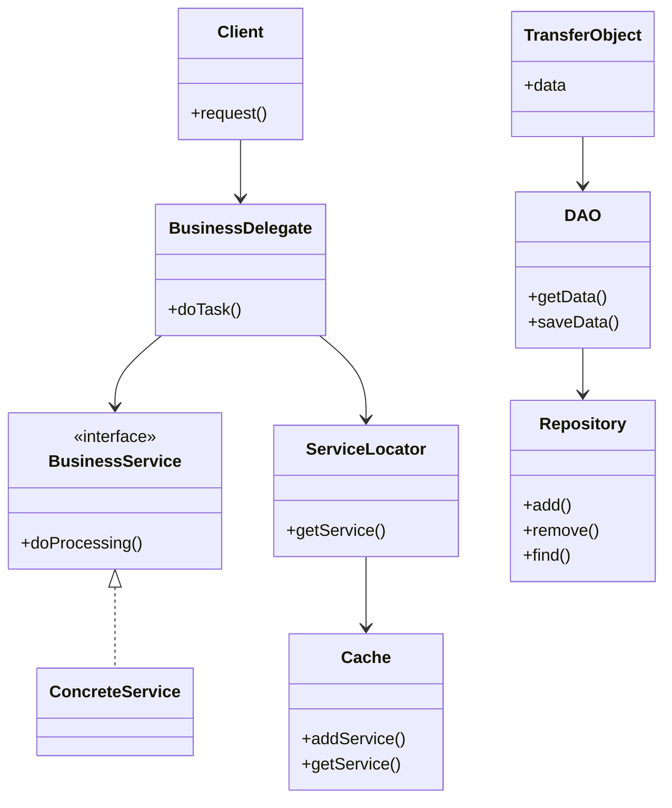

## 8.1 Introduction to Enterprise Patterns

In the realm of software engineering, enterprise design patterns play a pivotal role in shaping robust, scalable, and maintainable applications. As we delve into the world of enterprise patterns, we aim to equip you with the knowledge to tackle complex challenges inherent in large-scale software systems. Let's embark on this journey to understand how these patterns can transform your enterprise projects.

### What Are Enterprise Design Patterns?

Enterprise design patterns are specialized solutions tailored to address the unique challenges faced in enterprise-level software development. Unlike general design patterns, which focus on solving common software design problems, enterprise patterns are crafted to meet the demands of large-scale applications. These patterns provide a structured approach to handling issues such as scalability, maintainability, integration, and transaction management.

#### Key Differences from General Design Patterns

While general design patterns like Singleton or Observer are applicable across various domains, enterprise patterns are specifically designed for the complexities of enterprise environments. They often involve multiple layers of abstraction and are geared towards managing distributed systems, handling large volumes of data, and ensuring seamless integration with other enterprise systems.

### Challenges in Enterprise Application Development

Enterprise applications are characterized by their size, complexity, and the critical nature of their operations. Here are some of the unique challenges they present:

- **Scalability**: Enterprise applications must handle increasing loads efficiently. As user demand grows, the system should scale horizontally or vertically without compromising performance.
  
- **Maintainability**: With numerous components and dependencies, maintaining an enterprise application can be daunting. Code should be organized and modular to facilitate updates and bug fixes.

- **Integration**: Enterprise systems often need to integrate with other applications, databases, and services. Ensuring smooth communication between these components is crucial.

- **Transaction Management**: Handling transactions in a consistent and reliable manner is vital, especially in applications dealing with financial data or sensitive information.

### How Enterprise Patterns Address These Challenges

Enterprise patterns offer standardized solutions to these common problems, providing a blueprint for building scalable and maintainable systems. Let's explore how they achieve this:

- **Standardization**: By following established patterns, developers can create systems that adhere to industry standards, making them easier to understand and maintain.

- **Reusability**: Patterns promote code reuse, reducing redundancy and improving efficiency.

- **Modularity**: Enterprise patterns encourage the separation of concerns, leading to a more modular and flexible architecture.

- **Scalability and Performance**: Patterns like the Service Locator and Dependency Injection help manage resources efficiently, ensuring the application can scale as needed.

### Overview of Enterprise Patterns

In this section, we will cover several key enterprise patterns, each offering unique solutions to common challenges:

1. **Data Access Object (DAO) Pattern**: This pattern abstracts and encapsulates all access to the data source, providing a clean separation between the business logic and data access code.

2. **Repository Pattern**: Similar to DAO, the Repository Pattern focuses on mediating between the domain and data mapping layers, providing a more object-oriented approach.

3. **Dependency Injection and Inversion of Control**: These patterns decouple the creation of objects from their usage, enhancing testability and flexibility.

4. **Service Locator Pattern**: Offers a centralized registry for locating services, reducing the dependency overhead.

5. **Business Delegate Pattern**: Decouples the presentation layer from business services, simplifying the client-side code.

6. **Transfer Object (Value Object) Pattern**: Encapsulates data for transfer between layers, reducing the number of remote calls.

7. **Intercepting Filter Pattern**: Provides a mechanism for pre-processing and post-processing requests, useful for tasks like logging and authentication.

8. **Front Controller Pattern**: Centralizes request handling in web applications, improving navigation and control flow.

9. **Model-View-Controller (MVC) Pattern (Revisited)**: A classic pattern revisited with a focus on enterprise-scale applications, emphasizing separation of concerns.

### Benefits of Using Enterprise Patterns

The adoption of enterprise patterns brings numerous benefits:

- **Improved Architecture**: Patterns provide a solid foundation for building well-architected systems.

- **Code Reusability**: By reusing proven solutions, developers can focus on solving new problems rather than reinventing the wheel.

- **Easier Maintenance**: Patterns lead to cleaner, more organized code, making maintenance tasks simpler and less error-prone.

### Real-World Examples

Consider a large e-commerce platform that needs to handle thousands of transactions per second. By employing the DAO pattern, the platform can efficiently manage data access, ensuring that the business logic remains unaffected by changes in the database schema. Similarly, using the Service Locator pattern can streamline the process of accessing various services, such as payment gateways and inventory systems.

### Preparing for Detailed Exploration

As we proceed, each pattern will be explored in detail, with practical examples and code snippets to illustrate their application. We encourage you to think about how these patterns can be applied to your own projects, helping you solve complex problems and build robust enterprise applications.

### Embrace the Journey

Remember, mastering enterprise patterns is a journey. As you progress, you'll gain the skills to design and implement systems that are not only functional but also scalable and maintainable. Keep experimenting, stay curious, and enjoy the process of learning and applying these powerful tools in your software development endeavors.

## Visualizing Enterprise Patterns

To better understand how these patterns fit into the architecture of an enterprise application, let's visualize a typical enterprise system using a class diagram.

**Diagram Description**: This class diagram illustrates the interaction between various components in an enterprise application. The `Client` interacts with the `BusinessDelegate`, which in turn communicates with the `BusinessService`. The `ServiceLocator` helps in locating services, while the `Cache` stores service references. The `TransferObject` is used for data transfer, interacting with the `DAO` and `Repository` for data operations.

## Try It Yourself

To deepen your understanding, try modifying the code examples provided in the upcoming sections. Experiment with different configurations and see how they affect the application's behavior. This hands-on approach will reinforce your learning and help you grasp the nuances of each pattern.

## Quiz Time!



### What is the primary focus of enterprise design patterns?

- [x] Addressing challenges in large-scale application development
- [ ] Solving common software design problems
- [ ] Enhancing user interface design
- [ ] Improving algorithm efficiency

> **Explanation:** Enterprise design patterns are specifically tailored to address the unique challenges faced in large-scale application development, such as scalability and maintainability.

### How do enterprise patterns differ from general design patterns?

- [x] They are designed for the complexities of enterprise environments
- [ ] They focus on user interface design
- [ ] They are only applicable to small-scale applications
- [ ] They are less structured than general design patterns

> **Explanation:** Enterprise patterns are crafted to meet the demands of large-scale applications, involving multiple layers of abstraction and managing distributed systems.

### Which pattern provides a centralized registry for locating services?

- [ ] DAO Pattern
- [ ] Repository Pattern
- [x] Service Locator Pattern
- [ ] Business Delegate Pattern

> **Explanation:** The Service Locator Pattern offers a centralized registry for locating services, reducing the dependency overhead.

### What is a key benefit of using enterprise patterns?

- [x] Improved application architecture
- [ ] Increased complexity
- [ ] Reduced code readability
- [ ] Limited scalability

> **Explanation:** Enterprise patterns provide a solid foundation for building well-architected systems, improving code organization and maintainability.

### Which pattern encapsulates data for transfer between layers?

- [ ] Intercepting Filter Pattern
- [x] Transfer Object Pattern
- [ ] Front Controller Pattern
- [ ] MVC Pattern

> **Explanation:** The Transfer Object Pattern encapsulates data for transfer between layers, reducing the number of remote calls.

### What challenge does the DAO pattern address?

- [x] Abstracting and encapsulating data access
- [ ] Enhancing user interface design
- [ ] Improving algorithm efficiency
- [ ] Managing service dependencies

> **Explanation:** The DAO Pattern abstracts and encapsulates all access to the data source, providing a clean separation between business logic and data access code.

### How does the Business Delegate Pattern benefit enterprise applications?

- [x] It decouples the presentation layer from business services
- [ ] It enhances user interface design
- [ ] It reduces code readability
- [ ] It limits scalability

> **Explanation:** The Business Delegate Pattern decouples the presentation layer from business services, simplifying the client-side code and reducing coupling.

### Which pattern centralizes request handling in web applications?

- [ ] Transfer Object Pattern
- [ ] Intercepting Filter Pattern
- [x] Front Controller Pattern
- [ ] MVC Pattern

> **Explanation:** The Front Controller Pattern centralizes request handling in web applications, improving navigation and control flow.

### What is a common challenge in enterprise application development?

- [x] Scalability
- [ ] Enhancing user interface design
- [ ] Reducing code readability
- [ ] Limiting scalability

> **Explanation:** Scalability is a common challenge in enterprise application development, as systems must handle increasing loads efficiently.

### True or False: Enterprise patterns are only applicable to small-scale applications.

- [ ] True
- [x] False

> **Explanation:** False. Enterprise patterns are specifically designed for the complexities of large-scale applications, addressing challenges like scalability and maintainability.



As we conclude this introduction, remember that enterprise patterns are invaluable tools in your software development toolkit. They offer proven solutions to complex problems, enabling you to build robust, scalable, and maintainable applications. Keep exploring, experimenting, and applying these patterns to your projects, and you'll be well-equipped to tackle the challenges of enterprise-level software development.
