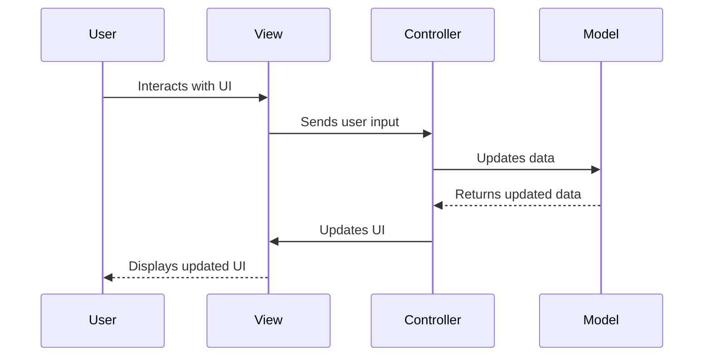

## 8.10.1 Advanced MVC Implementations

The Model-View-Controller (MVC) pattern is a cornerstone of modern software architecture, providing a structured approach to developing applications with clear separation of concerns. However, as applications grow in complexity, so do the interactions and workflows they must support. In this section, we will explore advanced strategies for implementing the MVC pattern in Java, focusing on managing complex interactions, workflows, and asynchronous operations.

### Managing Complex User Interactions

Complex user interactions often involve multiple steps or screens, requiring careful orchestration to ensure a seamless user experience. To manage these interactions effectively, consider the following strategies:

#### 1. Use of Application Controllers

Application Controllers, also known as orchestrators, are responsible for handling workflow logic that spans multiple views and controllers. By centralizing workflow logic, Application Controllers help maintain separation of concerns and reduce the complexity of individual controllers.

**Example: Implementing an Application Controller**

```java
public class ApplicationController {
    private Map<String, Command> commands = new HashMap<>();

    public ApplicationController() {
        commands.put("login", new LoginCommand());
        commands.put("register", new RegisterCommand());
        commands.put("checkout", new CheckoutCommand());
    }

    public void handleRequest(String action, HttpServletRequest request, HttpServletResponse response) {
        Command command = commands.get(action);
        if (command != null) {
            command.execute(request, response);
        } else {
            throw new IllegalArgumentException("No command found for action: " + action);
        }
    }
}
```

In this example, the `ApplicationController` manages different commands for various actions, delegating the execution to specific command objects.

#### 2. Implementing Workflow Logic

Workflow logic can be complex, involving conditional branching and state management. Use state machines or workflow engines to manage these complexities.

**Example: State Machine for User Registration**

```java
public class RegistrationStateMachine {
    private RegistrationState currentState;

    public RegistrationStateMachine() {
        currentState = new StartState();
    }

    public void nextState() {
        currentState = currentState.next();
    }

    public void executeCurrentState() {
        currentState.execute();
    }
}

interface RegistrationState {
    RegistrationState next();
    void execute();
}

class StartState implements RegistrationState {
    public RegistrationState next() {
        return new EmailVerificationState();
    }

    public void execute() {
        System.out.println("Starting registration process...");
    }
}

class EmailVerificationState implements RegistrationState {
    public RegistrationState next() {
        return new CompleteState();
    }

    public void execute() {
        System.out.println("Verifying email...");
    }
}

class CompleteState implements RegistrationState {
    public RegistrationState next() {
        return this; // End state
    }

    public void execute() {
        System.out.println("Registration complete.");
    }
}
```

This state machine manages the registration process, transitioning through different states as the process progresses.

### Validation, Error Handling, and Messaging

Implementing robust validation, error handling, and messaging is crucial for maintaining a responsive and user-friendly application.

#### 1. Validation

Validation should be performed both on the client-side and server-side to ensure data integrity and security.

**Example: Server-Side Validation in Java**

```java
public class UserValidator {
    public boolean validate(User user) {
        if (user.getUsername() == null || user.getUsername().isEmpty()) {
            throw new ValidationException("Username cannot be empty");
        }
        if (user.getPassword().length() < 8) {
            throw new ValidationException("Password must be at least 8 characters long");
        }
        return true;
    }
}
```

#### 2. Error Handling

Centralize error handling to provide consistent feedback to users and log errors for further analysis.

**Example: Global Exception Handler**

```java
@ControllerAdvice
public class GlobalExceptionHandler {
    @ExceptionHandler(ValidationException.class)
    public ResponseEntity<String> handleValidationException(ValidationException ex) {
        return new ResponseEntity<>(ex.getMessage(), HttpStatus.BAD_REQUEST);
    }

    @ExceptionHandler(Exception.class)
    public ResponseEntity<String> handleException(Exception ex) {
        return new ResponseEntity<>("An unexpected error occurred", HttpStatus.INTERNAL_SERVER_ERROR);
    }
}
```

#### 3. Messaging

Use messaging frameworks or libraries to handle communication between components, especially in distributed systems.

**Example: Using Spring's Messaging Framework**

```java
@EnableWebSocketMessageBroker
public class WebSocketConfig implements WebSocketMessageBrokerConfigurer {
    @Override
    public void configureMessageBroker(MessageBrokerRegistry config) {
        config.enableSimpleBroker("/topic");
        config.setApplicationDestinationPrefixes("/app");
    }

    @Override
    public void registerStompEndpoints(StompEndpointRegistry registry) {
        registry.addEndpoint("/gs-guide-websocket").withSockJS();
    }
}
```

### Handling Asynchronous Operations

Asynchronous operations, such as AJAX calls or WebSocket communications, are essential for creating responsive applications. Here's how to handle them within the MVC pattern:

#### 1. AJAX Calls

AJAX allows for asynchronous data exchange between the client and server, enabling dynamic updates without full page reloads.

**Example: AJAX Call in JavaScript**

```javascript
function fetchData() {
    fetch('/api/data')
        .then(response => response.json())
        .then(data => {
            console.log(data);
            // Update the UI with the fetched data
        })
        .catch(error => console.error('Error fetching data:', error));
}
```

#### 2. WebSocket Communications

WebSockets provide a full-duplex communication channel over a single TCP connection, ideal for real-time applications.

**Example: WebSocket Client in JavaScript**

```javascript
const socket = new WebSocket('ws://localhost:8080/gs-guide-websocket');

socket.onopen = function(event) {
    console.log('WebSocket is open now.');
    socket.send('Hello Server!');
};

socket.onmessage = function(event) {
    console.log('Message from server ', event.data);
};

socket.onclose = function(event) {
    console.log('WebSocket is closed now.');
};
```

### Best Practices for Maintaining Separation of Concerns

Maintaining separation of concerns is crucial for managing complexity in MVC applications. Here are some best practices:

1. **Decouple Business Logic from Controllers**: Use services or business logic layers to handle complex computations and data processing.

2. **Use Dependency Injection**: Leverage dependency injection frameworks like Spring to manage dependencies and enhance testability.

3. **Adopt Design Patterns**: Utilize design patterns such as Observer, Mediator, or Command to support advanced MVC implementations.

### Encouraging the Use of Design Patterns

Design patterns can greatly enhance the flexibility and maintainability of MVC applications. Here are some patterns to consider:

#### 1. Observer Pattern

The Observer pattern is useful for implementing event-driven architectures, where changes in one component need to be reflected in others.

**Example: Observer Pattern in Java**

```java
interface Observer {
    void update(String message);
}

class ConcreteObserver implements Observer {
    @Override
    public void update(String message) {
        System.out.println("Received message: " + message);
    }
}

class Subject {
    private List<Observer> observers = new ArrayList<>();

    public void addObserver(Observer observer) {
        observers.add(observer);
    }

    public void notifyObservers(String message) {
        for (Observer observer : observers) {
            observer.update(message);
        }
    }
}
```

#### 2. Mediator Pattern

The Mediator pattern helps manage complex interactions between multiple objects by centralizing communication.

**Example: Mediator Pattern in Java**

```java
interface Mediator {
    void notify(Component sender, String event);
}

class ConcreteMediator implements Mediator {
    private ComponentA componentA;
    private ComponentB componentB;

    public void setComponentA(ComponentA componentA) {
        this.componentA = componentA;
    }

    public void setComponentB(ComponentB componentB) {
        this.componentB = componentB;
    }

    @Override
    public void notify(Component sender, String event) {
        if (sender == componentA) {
            componentB.reactToEvent(event);
        } else if (sender == componentB) {
            componentA.reactToEvent(event);
        }
    }
}

class ComponentA {
    private Mediator mediator;

    public ComponentA(Mediator mediator) {
        this.mediator = mediator;
    }

    public void doSomething() {
        System.out.println("Component A does something");
        mediator.notify(this, "A did something");
    }

    public void reactToEvent(String event) {
        System.out.println("Component A reacts to event: " + event);
    }
}

class ComponentB {
    private Mediator mediator;

    public ComponentB(Mediator mediator) {
        this.mediator = mediator;
    }

    public void doSomething() {
        System.out.println("Component B does something");
        mediator.notify(this, "B did something");
    }

    public void reactToEvent(String event) {
        System.out.println("Component B reacts to event: " + event);
    }
}
```

#### 3. Command Pattern

The Command pattern encapsulates requests as objects, allowing for parameterization and queuing of requests.

**Example: Command Pattern in Java**

```java
interface Command {
    void execute();
}

class LightOnCommand implements Command {
    private Light light;

    public LightOnCommand(Light light) {
        this.light = light;
    }

    @Override
    public void execute() {
        light.turnOn();
    }
}

class Light {
    public void turnOn() {
        System.out.println("The light is on");
    }
}

class RemoteControl {
    private Command command;

    public void setCommand(Command command) {
        this.command = command;
    }

    public void pressButton() {
        command.execute();
    }
}
```

### Visualizing MVC Interactions

To better understand the flow of data and control in an MVC application, let's visualize the interactions using a sequence diagram.



This diagram illustrates the typical flow of interactions in an MVC application, highlighting the separation of concerns between the Model, View, and Controller components.

### Try It Yourself

Experiment with the provided code examples by modifying them to suit your needs. For instance, try adding new states to the `RegistrationStateMachine` or implement additional commands in the `ApplicationController`. This hands-on approach will deepen your understanding of advanced MVC implementations.

### Knowledge Check

- How can Application Controllers help manage complex workflows in MVC applications?
- What are the benefits of using state machines for workflow logic?
- How can the Observer pattern be applied in an MVC application?
- What role does the Mediator pattern play in managing interactions between components?
- How can AJAX and WebSocket communications be integrated into an MVC application?

### Embrace the Journey

Remember, mastering advanced MVC implementations is a journey. As you continue to explore and experiment with these concepts, you'll gain the skills needed to build robust and scalable applications. Keep pushing the boundaries, stay curious, and enjoy the process!

## Quiz Time!



### What is the main purpose of an Application Controller in an MVC application?

- [x] To centralize workflow logic that spans multiple views and controllers
- [ ] To handle database interactions directly
- [ ] To manage user authentication
- [ ] To render the user interface

> **Explanation:** An Application Controller centralizes workflow logic, allowing for better separation of concerns and reducing complexity in individual controllers.

### Which design pattern is useful for implementing event-driven architectures in MVC applications?

- [x] Observer Pattern
- [ ] Singleton Pattern
- [ ] Factory Pattern
- [ ] Prototype Pattern

> **Explanation:** The Observer Pattern is ideal for event-driven architectures, where changes in one component need to be reflected in others.

### How can AJAX calls improve the user experience in an MVC application?

- [x] By enabling dynamic updates without full page reloads
- [ ] By reducing the need for server-side validation
- [ ] By simplifying the database schema
- [ ] By increasing the number of HTTP requests

> **Explanation:** AJAX allows for asynchronous data exchange, enabling dynamic updates to the UI without requiring a full page reload.

### What is the role of a Mediator in an MVC application?

- [x] To centralize communication between multiple objects
- [ ] To handle user input directly
- [ ] To manage database transactions
- [ ] To render the user interface

> **Explanation:** The Mediator Pattern centralizes communication, reducing direct dependencies between components and managing complex interactions.

### In the Command Pattern, what is encapsulated as an object?

- [x] Requests
- [ ] Database connections
- [x] User sessions
- [ ] UI components

> **Explanation:** The Command Pattern encapsulates requests as objects, allowing for parameterization and queuing of requests.

### How can state machines be beneficial in managing workflow logic?

- [x] By providing a structured approach to state transitions
- [ ] By simplifying database queries
- [ ] By reducing the need for error handling
- [ ] By increasing the number of HTTP requests

> **Explanation:** State machines offer a structured approach to managing state transitions, which is beneficial for complex workflows.

### What is a key benefit of using Dependency Injection in MVC applications?

- [x] Enhanced testability and manageability of dependencies
- [ ] Faster database queries
- [x] Simplified user authentication
- [ ] Reduced HTTP requests

> **Explanation:** Dependency Injection enhances testability by managing dependencies, making it easier to test individual components in isolation.

### How does the Command Pattern improve flexibility in MVC applications?

- [x] By allowing requests to be parameterized and queued
- [ ] By reducing the need for server-side validation
- [ ] By simplifying the database schema
- [ ] By increasing the number of HTTP requests

> **Explanation:** The Command Pattern improves flexibility by encapsulating requests as objects, allowing for parameterization and queuing.

### What is the primary advantage of using WebSockets in an MVC application?

- [x] Full-duplex communication for real-time updates
- [ ] Simplified database interactions
- [ ] Reduced server load
- [ ] Enhanced security

> **Explanation:** WebSockets provide full-duplex communication, enabling real-time updates and interactions, which is advantageous for applications requiring immediate data exchange.

### True or False: The MVC pattern inherently supports asynchronous operations without additional patterns or frameworks.

- [ ] True
- [x] False

> **Explanation:** While MVC provides a structured approach to application development, handling asynchronous operations often requires additional patterns or frameworks, such as AJAX or WebSockets, to manage complexity effectively.


