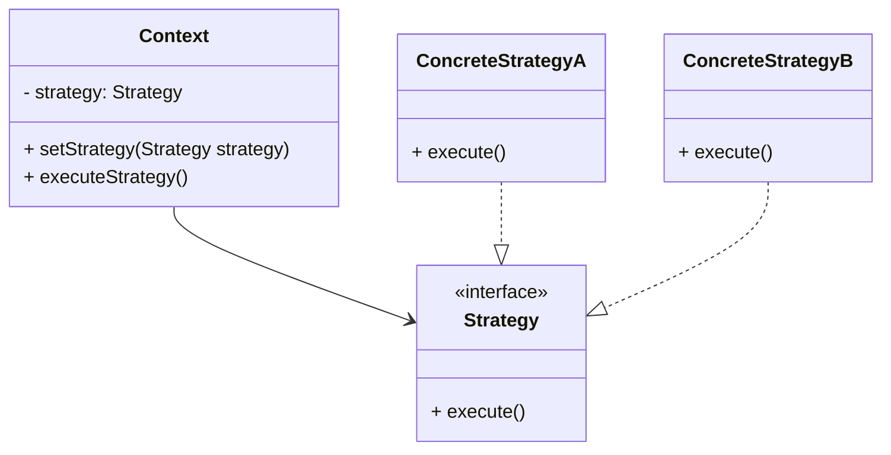

## 8.10.1 Implementing Strategy in Java

The Strategy Pattern is a behavioral design pattern that enables selecting an algorithm's behavior at runtime. It defines a family of algorithms, encapsulates each one, and makes them interchangeable. This pattern is particularly useful when you want to choose the algorithm to use based on the context in which it is applied.

### Intent

The primary intent of the Strategy Pattern is to define a set of algorithms, encapsulate each one, and make them interchangeable. This allows the algorithm to vary independently from clients that use it. The Strategy Pattern is beneficial when you have multiple algorithms for a specific task and want to switch between them seamlessly.

### Participants

In the Strategy Pattern, there are three main participants:

1. **Strategy**: An interface common to all supported algorithms. Context uses this interface to call the algorithm defined by a ConcreteStrategy.
2. **ConcreteStrategy**: A class that implements the Strategy interface and provides the implementation of the algorithm.
3. **Context**: Maintains a reference to a Strategy object and is configured with a ConcreteStrategy object. It may define an interface to allow Strategy to access its data.

### UML Diagram

Below is a UML diagram illustrating the relationships between the participants in the Strategy Pattern:



*Diagram Caption*: The UML diagram shows the Context class holding a reference to a Strategy interface, which is implemented by ConcreteStrategyA and ConcreteStrategyB.

### Implementation in Java

Let's implement the Strategy Pattern in Java with a practical example. Consider a scenario where we have different strategies for sorting a list of integers.

#### Step 1: Define the Strategy Interface

```java
// Strategy interface
public interface SortingStrategy {
    void sort(int[] numbers);
}
```

#### Step 2: Implement Concrete Strategies

```java
// ConcreteStrategyA: Bubble Sort
public class BubbleSortStrategy implements SortingStrategy {
    @Override
    public void sort(int[] numbers) {
        int n = numbers.length;
        for (int i = 0; i < n - 1; i++) {
            for (int j = 0; j < n - i - 1; j++) {
                if (numbers[j] > numbers[j + 1]) {
                    // Swap numbers[j] and numbers[j+1]
                    int temp = numbers[j];
                    numbers[j] = numbers[j + 1];
                    numbers[j + 1] = temp;
                }
            }
        }
        System.out.println("Sorted using Bubble Sort");
    }
}

// ConcreteStrategyB: Quick Sort
public class QuickSortStrategy implements SortingStrategy {
    @Override
    public void sort(int[] numbers) {
        quickSort(numbers, 0, numbers.length - 1);
        System.out.println("Sorted using Quick Sort");
    }

    private void quickSort(int[] arr, int low, int high) {
        if (low < high) {
            int pi = partition(arr, low, high);
            quickSort(arr, low, pi - 1);
            quickSort(arr, pi + 1, high);
        }
    }

    private int partition(int[] arr, int low, int high) {
        int pivot = arr[high];
        int i = (low - 1);
        for (int j = low; j < high; j++) {
            if (arr[j] <= pivot) {
                i++;
                int temp = arr[i];
                arr[i] = arr[j];
                arr[j] = temp;
            }
        }
        int temp = arr[i + 1];
        arr[i + 1] = arr[high];
        arr[high] = temp;
        return i + 1;
    }
}
```

#### Step 3: Create the Context Class

```java
// Context class
public class SortContext {
    private SortingStrategy strategy;

    public void setStrategy(SortingStrategy strategy) {
        this.strategy = strategy;
    }

    public void executeStrategy(int[] numbers) {
        strategy.sort(numbers);
    }
}
```

#### Step 4: Demonstrate the Strategy Pattern

```java
public class StrategyPatternDemo {
    public static void main(String[] args) {
        SortContext context = new SortContext();

        int[] numbers = {5, 2, 9, 1, 5, 6};

        // Using Bubble Sort
        context.setStrategy(new BubbleSortStrategy());
        context.executeStrategy(numbers);

        // Using Quick Sort
        context.setStrategy(new QuickSortStrategy());
        context.executeStrategy(numbers);
    }
}
```

### Explanation

In this example, the `SortingStrategy` interface defines the `sort` method. The `BubbleSortStrategy` and `QuickSortStrategy` classes implement this interface, providing different sorting algorithms. The `SortContext` class maintains a reference to a `SortingStrategy` and allows the strategy to be changed at runtime. The `StrategyPatternDemo` class demonstrates how to use the Strategy Pattern to switch between different sorting algorithms dynamically.

### Benefits of the Strategy Pattern

- **Promotes the Open/Closed Principle**: The Strategy Pattern allows new algorithms to be added without modifying existing code, adhering to the Open/Closed Principle.
- **Encapsulation of Algorithms**: Each algorithm is encapsulated in its own class, making it easy to switch between algorithms.
- **Flexibility**: The pattern provides flexibility in choosing algorithms at runtime.

### Real-World Scenarios

- **Payment Processing Systems**: Different payment methods (credit card, PayPal, etc.) can be implemented as different strategies.
- **Data Compression**: Various compression algorithms can be encapsulated as strategies.
- **Pathfinding Algorithms**: Different pathfinding strategies (e.g., A*, Dijkstra) can be implemented for navigation systems.

### Related Patterns

- **[State Pattern]( "State Pattern")**: Similar to the Strategy Pattern, but the state of the object changes the behavior.
- **[Decorator Pattern]( "Decorator Pattern")**: Allows behavior to be added to individual objects, without affecting the behavior of other objects from the same class.

### Known Uses

- **Java Collections Framework**: The `Comparator` interface in Java Collections is an example of the Strategy Pattern.
- **Spring Framework**: The `Resource` interface in Spring uses the Strategy Pattern to access different types of resources.

### Common Pitfalls

- **Overhead**: Introducing a strategy interface and multiple concrete strategies can add complexity and overhead.
- **Too Many Strategies**: Having too many strategies can make the system difficult to manage.

### Exercises

1. Implement a new sorting strategy using the Merge Sort algorithm and integrate it into the existing example.
2. Modify the `SortContext` class to allow multiple strategies to be applied sequentially.

### Key Takeaways

- The Strategy Pattern is a powerful tool for encapsulating algorithms and promoting flexibility.
- It adheres to the Open/Closed Principle, allowing new strategies to be added without modifying existing code.
- The pattern is widely used in real-world applications, from payment processing to data compression.

### Reflection

Consider how the Strategy Pattern can be applied to your projects. What algorithms could benefit from being encapsulated as strategies? How can you leverage the flexibility of the Strategy Pattern to improve your software design?

## Test Your Knowledge: Strategy Pattern in Java Quiz



### What is the primary intent of the Strategy Pattern?

- [x] To define a family of algorithms, encapsulate each one, and make them interchangeable.
- [ ] To create a single algorithm that can handle all scenarios.
- [ ] To optimize the performance of algorithms.
- [ ] To simplify the user interface of an application.

> **Explanation:** The Strategy Pattern's primary intent is to define a family of algorithms, encapsulate each one, and make them interchangeable, allowing the algorithm to vary independently from clients that use it.

### Which of the following is NOT a participant in the Strategy Pattern?

- [ ] Strategy
- [ ] ConcreteStrategy
- [x] Singleton
- [ ] Context

> **Explanation:** The participants in the Strategy Pattern are Strategy, ConcreteStrategy, and Context. Singleton is not a participant in this pattern.

### How does the Strategy Pattern promote the Open/Closed Principle?

- [x] By allowing new algorithms to be added without modifying existing code.
- [ ] By making all classes final.
- [ ] By using inheritance to extend functionality.
- [ ] By reducing the number of classes in the system.

> **Explanation:** The Strategy Pattern promotes the Open/Closed Principle by allowing new algorithms to be added without modifying existing code, as each algorithm is encapsulated in its own class.

### In the provided Java example, what is the role of the `SortContext` class?

- [x] It maintains a reference to a Strategy object and is configured with a ConcreteStrategy object.
- [ ] It implements the sorting algorithms.
- [ ] It defines the Strategy interface.
- [ ] It provides user input for sorting.

> **Explanation:** The `SortContext` class maintains a reference to a Strategy object and is configured with a ConcreteStrategy object, allowing it to execute the chosen strategy.

### Which real-world scenario is NOT an example of the Strategy Pattern?

- [ ] Payment processing systems
- [ ] Data compression
- [ ] Pathfinding algorithms
- [x] Singleton pattern implementation

> **Explanation:** The Singleton pattern is not an example of the Strategy Pattern. The Strategy Pattern is used in scenarios like payment processing, data compression, and pathfinding algorithms.

### What is a potential drawback of using the Strategy Pattern?

- [x] Introducing a strategy interface and multiple concrete strategies can add complexity and overhead.
- [ ] It makes the code less flexible.
- [ ] It violates the Open/Closed Principle.
- [ ] It reduces code reusability.

> **Explanation:** A potential drawback of the Strategy Pattern is that introducing a strategy interface and multiple concrete strategies can add complexity and overhead.

### How can the Strategy Pattern be applied in a payment processing system?

- [x] By implementing different payment methods as different strategies.
- [ ] By using a single class to handle all payment methods.
- [ ] By hardcoding payment methods into the application.
- [ ] By using inheritance to create payment methods.

> **Explanation:** In a payment processing system, the Strategy Pattern can be applied by implementing different payment methods as different strategies, allowing for flexibility and interchangeability.

### What is the role of the `ConcreteStrategy` in the Strategy Pattern?

- [x] It implements the Strategy interface and provides the implementation of the algorithm.
- [ ] It defines the Strategy interface.
- [ ] It maintains a reference to a Strategy object.
- [ ] It provides user input for the algorithm.

> **Explanation:** The `ConcreteStrategy` implements the Strategy interface and provides the implementation of the algorithm.

### Which Java framework uses the Strategy Pattern in its design?

- [x] Spring Framework
- [ ] Hibernate
- [ ] Apache Struts
- [ ] JavaFX

> **Explanation:** The Spring Framework uses the Strategy Pattern in its design, particularly in the `Resource` interface to access different types of resources.

### True or False: The Strategy Pattern can only be used with sorting algorithms.

- [x] False
- [ ] True

> **Explanation:** False. The Strategy Pattern can be used with any scenario where multiple algorithms are applicable, not just sorting algorithms.


