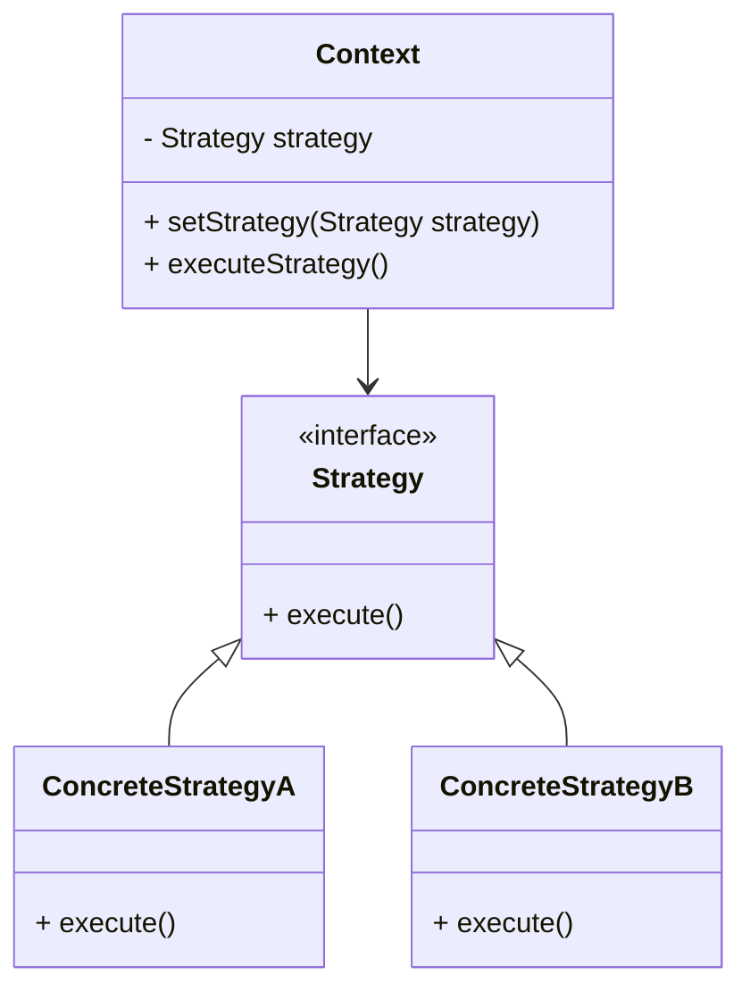

## 8.10.2 Functional Strategies with Lambdas

### Introduction

The Strategy Pattern is a behavioral design pattern that enables selecting an algorithm's behavior at runtime. Traditionally, this pattern involves defining a family of algorithms, encapsulating each one, and making them interchangeable. However, with the introduction of lambda expressions in Java 8, implementing the Strategy Pattern has become more streamlined and concise. This section explores how Java 8's lambda expressions can simplify the Strategy Pattern, enhancing code readability and reducing boilerplate.

### Understanding the Strategy Pattern

#### Intent

The Strategy Pattern allows the definition of a family of algorithms, encapsulating each one, and making them interchangeable. This pattern lets the algorithm vary independently from the clients that use it.

#### Structure



*Diagram: The structure of the Strategy Pattern showing the Context and Strategy interface with its concrete implementations.*

### Implementing Strategy Pattern with Lambdas

#### Traditional Approach

In the traditional approach, implementing the Strategy Pattern involves creating multiple classes that implement a common interface. Consider a simple example where we have different strategies for sorting a list.

```java
// Strategy Interface
interface SortingStrategy {
    void sort(int[] numbers);
}

// Concrete Strategy A
class BubbleSortStrategy implements SortingStrategy {
    @Override
    public void sort(int[] numbers) {
        // Implementation of bubble sort
    }
}

// Concrete Strategy B
class QuickSortStrategy implements SortingStrategy {
    @Override
    public void sort(int[] numbers) {
        // Implementation of quick sort
    }
}

// Context
class Sorter {
    private SortingStrategy strategy;

    public void setStrategy(SortingStrategy strategy) {
        this.strategy = strategy;
    }

    public void sort(int[] numbers) {
        strategy.sort(numbers);
    }
}
```

#### Simplifying with Lambdas

With Java 8, the Strategy Pattern can be simplified using lambda expressions, which are essentially anonymous functions that can be treated as instances of functional interfaces. A functional interface is an interface with a single abstract method, making it a perfect candidate for lambda expressions.

```java
// Functional Interface
@FunctionalInterface
interface SortingStrategy {
    void sort(int[] numbers);
}

// Context
class Sorter {
    private SortingStrategy strategy;

    public void setStrategy(SortingStrategy strategy) {
        this.strategy = strategy;
    }

    public void sort(int[] numbers) {
        strategy.sort(numbers);
    }
}

// Usage
public class StrategyPatternWithLambdas {
    public static void main(String[] args) {
        Sorter sorter = new Sorter();

        // Using lambda for bubble sort
        sorter.setStrategy((numbers) -> {
            // Bubble sort implementation
        });
        sorter.sort(new int[]{5, 3, 8, 1});

        // Using lambda for quick sort
        sorter.setStrategy((numbers) -> {
            // Quick sort implementation
        });
        sorter.sort(new int[]{5, 3, 8, 1});
    }
}
```

### Benefits of Using Lambdas

#### Reduced Boilerplate Code

Lambdas significantly reduce the amount of boilerplate code required to implement the Strategy Pattern. Instead of creating separate classes for each strategy, developers can define strategies inline using lambda expressions.

#### Enhanced Readability

Lambdas enhance code readability by allowing developers to focus on the logic rather than the structure. The strategy logic is defined where it is used, making the code easier to understand and maintain.

#### Improved Conciseness

By using lambdas, the Strategy Pattern implementation becomes more concise. This conciseness is particularly beneficial when dealing with simple strategies that do not require extensive logic.

### Limitations and Considerations

#### Complexity of Logic

While lambdas are excellent for simple strategies, they may not be suitable for complex logic. In such cases, traditional class-based implementations might be more appropriate to maintain clarity and separation of concerns.

#### Debugging Challenges

Debugging lambda expressions can be challenging, especially when errors occur within the lambda body. Developers should ensure that lambdas are used judiciously and that complex logic is well-documented.

#### Performance Considerations

While lambdas offer syntactic sugar, they may introduce performance overhead due to the creation of additional objects. Developers should profile their applications to ensure that lambda usage does not adversely affect performance.

### Practical Applications

#### Real-World Scenario: Payment Processing

Consider a payment processing system that supports multiple payment methods such as credit card, PayPal, and bank transfer. Using the Strategy Pattern with lambdas, each payment method can be implemented as a lambda expression.

```java
// Functional Interface for Payment Strategy
@FunctionalInterface
interface PaymentStrategy {
    void pay(double amount);
}

// Context
class PaymentProcessor {
    private PaymentStrategy strategy;

    public void setStrategy(PaymentStrategy strategy) {
        this.strategy = strategy;
    }

    public void processPayment(double amount) {
        strategy.pay(amount);
    }
}

// Usage
public class PaymentSystem {
    public static void main(String[] args) {
        PaymentProcessor processor = new PaymentProcessor();

        // Credit card payment
        processor.setStrategy(amount -> System.out.println("Paid " + amount + " using Credit Card"));
        processor.processPayment(100.0);

        // PayPal payment
        processor.setStrategy(amount -> System.out.println("Paid " + amount + " using PayPal"));
        processor.processPayment(200.0);

        // Bank transfer
        processor.setStrategy(amount -> System.out.println("Paid " + amount + " using Bank Transfer"));
        processor.processPayment(300.0);
    }
}
```

### Conclusion

The use of lambda expressions in implementing the Strategy Pattern offers significant advantages in terms of reducing boilerplate code, enhancing readability, and improving conciseness. However, developers should be mindful of the limitations and ensure that lambdas are used appropriately, especially in scenarios involving complex logic or performance-sensitive applications.

### Related Patterns

- **[8.10 Strategy Pattern]( "Strategy Pattern")**: Explore the traditional implementation of the Strategy Pattern.
- **[6.6 Singleton Pattern]( "Singleton Pattern")**: Learn about the Singleton Pattern and its applications.

### Further Reading

- Oracle Java Documentation: [Java Functional Interfaces](https://docs.oracle.com/javase/8/docs/api/java/util/function/package-summary.html)
- Microsoft: [Cloud Design Patterns](https://learn.microsoft.com/en-us/azure/architecture/patterns/)

## Test Your Knowledge: Functional Strategies with Lambdas Quiz



### What is the primary benefit of using lambdas in the Strategy Pattern?

- [x] They reduce boilerplate code.
- [ ] They increase performance.
- [ ] They enforce stricter type checking.
- [ ] They allow for dynamic method dispatch.

> **Explanation:** Lambdas reduce the amount of boilerplate code required, making the implementation more concise and readable.

### Which Java feature allows lambdas to be used in place of traditional strategy implementations?

- [x] Functional interfaces
- [ ] Abstract classes
- [ ] Static methods
- [ ] Anonymous classes

> **Explanation:** Lambdas can be used in place of traditional strategy implementations because they can be assigned to functional interfaces, which have a single abstract method.

### What is a potential drawback of using lambdas for complex strategies?

- [x] Debugging can be more challenging.
- [ ] They cannot be serialized.
- [ ] They require more memory.
- [ ] They are slower than traditional implementations.

> **Explanation:** Debugging lambda expressions can be more challenging, especially when errors occur within the lambda body.

### How do lambdas enhance code readability in the Strategy Pattern?

- [x] By allowing strategy logic to be defined inline
- [ ] By enforcing strict type checking
- [ ] By reducing the number of classes
- [ ] By increasing execution speed

> **Explanation:** Lambdas enhance code readability by allowing strategy logic to be defined inline, making the code easier to understand and maintain.

### In what scenario might traditional class-based strategy implementations be preferred over lambdas?

- [x] When the strategy logic is complex
- [ ] When performance is a concern
- [ ] When using Java versions prior to 8
- [ ] When dealing with large datasets

> **Explanation:** Traditional class-based implementations might be preferred when the strategy logic is complex, as they provide better separation of concerns and clarity.

### What is a functional interface in Java?

- [x] An interface with a single abstract method
- [ ] An interface with multiple abstract methods
- [ ] A class with a single method
- [ ] A class with multiple methods

> **Explanation:** A functional interface in Java is an interface with a single abstract method, making it suitable for lambda expressions.

### How do lambdas improve conciseness in the Strategy Pattern?

- [x] By allowing strategies to be defined inline without separate classes
- [ ] By enforcing stricter type checking
- [ ] By reducing memory usage
- [ ] By increasing execution speed

> **Explanation:** Lambdas improve conciseness by allowing strategies to be defined inline without the need for separate classes, reducing the amount of code.

### What should developers be mindful of when using lambdas in performance-sensitive applications?

- [x] Potential performance overhead due to object creation
- [ ] Increased memory usage
- [ ] Lack of type safety
- [ ] Difficulty in testing

> **Explanation:** Developers should be mindful of potential performance overhead due to the creation of additional objects when using lambdas.

### Which of the following is a real-world application of the Strategy Pattern with lambdas?

- [x] Payment processing with different payment methods
- [ ] Logging system with multiple log levels
- [ ] Database connection pooling
- [ ] User authentication

> **Explanation:** Payment processing with different payment methods is a real-world application of the Strategy Pattern with lambdas, where each payment method can be implemented as a lambda expression.

### True or False: Lambdas can only be used with interfaces that have multiple abstract methods.

- [ ] True
- [x] False

> **Explanation:** False. Lambdas can only be used with interfaces that have a single abstract method, known as functional interfaces.



---
