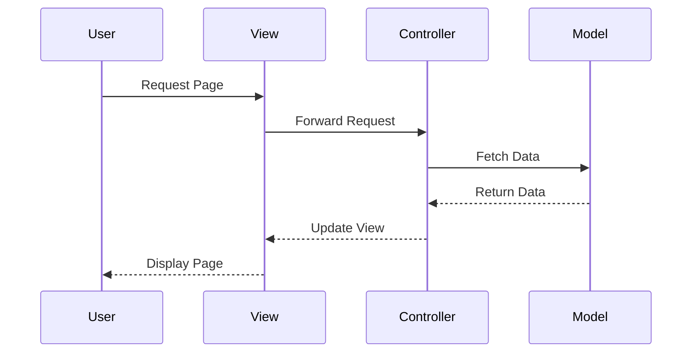

## 8.10.3 Use Cases and Examples

The Model-View-Controller (MVC) pattern is a cornerstone of modern web application development, particularly in Java. It separates concerns within an application, making it easier to manage, scale, and maintain. In this section, we will delve into practical use cases of the MVC pattern in large-scale web applications, such as e-commerce platforms, enterprise portals, and content management systems. We'll explore how MVC components interact, the benefits of using this pattern, and considerations for optimizing performance, security, and internationalization.

### Use Cases of MVC in Large-Scale Web Applications

#### 1. E-Commerce Platforms

E-commerce platforms are complex systems that require robust architecture to handle numerous transactions, user interactions, and data management tasks. The MVC pattern is ideal for such applications because it clearly delineates the responsibilities of different components:

- **Model**: Represents the data and business logic. For an e-commerce platform, this includes product catalogs, user accounts, and order processing.
- **View**: Handles the presentation layer, displaying product listings, shopping carts, and checkout pages to users.
- **Controller**: Manages user input and updates the model and view accordingly, such as processing payments or updating inventory.

**Code Example**: Let's consider a simplified Java implementation using Spring MVC for an e-commerce product catalog.

```java
// Model: Product.java
public class Product {
    private String id;
    private String name;
    private double price;

    // Getters and setters
}

// Controller: ProductController.java
@Controller
public class ProductController {
    @Autowired
    private ProductService productService;

    @GetMapping("/products")
    public String listProducts(Model model) {
        List<Product> products = productService.getAllProducts();
        model.addAttribute("products", products);
        return "productList";
    }
}

// View: productList.jsp
<%@ taglib uri="http://java.sun.com/jsp/jstl/core" prefix="c" %>
<html>
<body>
    <h2>Product List</h2>
    <ul>
        <c:forEach var="product" items="${products}">
            <li>${product.name} - $${product.price}</li>
        </c:forEach>
    </ul>
</body>
</html>
```

**Benefits**:
- **Maintainability**: Changes to the business logic or UI can be made independently.
- **Scalability**: The architecture can handle increased loads by distributing components across servers.
- **Team Collaboration**: Developers can work on different components simultaneously without conflicts.

#### 2. Enterprise Portals

Enterprise portals serve as a central hub for accessing various business applications and services. They often integrate with multiple backend systems and require a flexible architecture to accommodate diverse functionalities.

**Diagram**: Below is a simplified diagram illustrating the MVC interaction in an enterprise portal.



**Benefits**:
- **Integration**: MVC allows for seamless integration with various backend systems.
- **Security**: Controllers can implement security checks before processing requests.
- **Performance Optimization**: Caching strategies can be applied at different layers to improve response times.

#### 3. Content Management Systems (CMS)

CMS platforms manage digital content creation and modification, often supporting multiple users and roles. The MVC pattern supports these requirements by providing a structured way to handle content data, user interfaces, and interactions.

**Code Example**: A simple CMS page management feature using Spring MVC.

```java
// Model: Page.java
public class Page {
    private String title;
    private String content;

    // Getters and setters
}

// Controller: PageController.java
@Controller
public class PageController {
    @Autowired
    private PageService pageService;

    @GetMapping("/pages/{id}")
    public String viewPage(@PathVariable("id") String id, Model model) {
        Page page = pageService.getPageById(id);
        model.addAttribute("page", page);
        return "viewPage";
    }
}

// View: viewPage.jsp
<html>
<body>
    <h1>${page.title}</h1>
    <div>${page.content}</div>
</body>
</html>
```

**Benefits**:
- **Role Management**: Controllers can enforce role-based access to different parts of the CMS.
- **Internationalization**: Views can be easily adapted for different languages and locales.
- **Extensibility**: New features can be added with minimal changes to existing code.

### Considerations for MVC Applications

#### Performance Optimization

- **Caching**: Implement caching at the model or view level to reduce database load and improve response times.
- **Asynchronous Processing**: Use asynchronous controllers to handle long-running tasks without blocking user requests.
- **Load Balancing**: Distribute requests across multiple servers to handle high traffic.

#### Security

- **Input Validation**: Ensure all user inputs are validated in controllers to prevent injection attacks.
- **Authentication and Authorization**: Use frameworks like Spring Security to manage user authentication and access control.
- **Data Protection**: Encrypt sensitive data and use secure connections (HTTPS) to protect user information.

#### Internationalization

- **Resource Bundles**: Use Java's `ResourceBundle` class to manage localized resources and support multiple languages.
- **Character Encoding**: Ensure the application supports UTF-8 encoding to handle diverse character sets.
- **Locale-Specific Formatting**: Format dates, numbers, and currencies according to the user's locale.

### Leveraging MVC Patterns and Java EE Technologies

Java EE technologies provide a robust platform for building MVC applications. Frameworks like Spring MVC and Apache Struts offer comprehensive support for implementing the MVC pattern, including features for dependency injection, transaction management, and view rendering.

- **Spring MVC**: A popular framework that simplifies the development of web applications by providing a flexible and comprehensive MVC architecture.
- **Apache Struts**: An open-source framework that extends the Java Servlet API to encourage developers to adopt an MVC architecture.

### Additional Resources

- **Spring MVC Documentation**: [Spring MVC](https://spring.io/projects/spring-framework)
- **Apache Struts Documentation**: [Apache Struts](https://struts.apache.org/)
- **Java EE Documentation**: [Java EE](https://www.oracle.com/java/technologies/java-ee-glance.html)

### Try It Yourself

To deepen your understanding of the MVC pattern, try modifying the code examples provided:

- **Add a new feature**: Implement a search functionality in the e-commerce platform.
- **Enhance security**: Integrate Spring Security into the CMS example to manage user roles.
- **Optimize performance**: Implement caching in the enterprise portal example to improve load times.

Remember, this is just the beginning. As you progress, you'll build more complex and interactive web applications. Keep experimenting, stay curious, and enjoy the journey!

## Quiz Time!



### What is the primary benefit of using the MVC pattern in large-scale web applications?

- [x] Separation of concerns
- [ ] Faster development time
- [ ] Reduced server costs
- [ ] Increased code complexity

> **Explanation:** The MVC pattern separates concerns, making it easier to manage and maintain large-scale applications.

### In the MVC pattern, which component is responsible for handling user input and updating the model?

- [ ] Model
- [ ] View
- [x] Controller
- [ ] Service

> **Explanation:** The Controller handles user input and updates the model and view accordingly.

### Which Java framework is commonly used to implement the MVC pattern?

- [x] Spring MVC
- [ ] Hibernate
- [ ] Apache Kafka
- [ ] JUnit

> **Explanation:** Spring MVC is a popular framework for implementing the MVC pattern in Java applications.

### What is a key consideration for optimizing performance in MVC applications?

- [ ] Using more controllers
- [x] Implementing caching
- [ ] Reducing the number of models
- [ ] Increasing the number of views

> **Explanation:** Implementing caching can significantly improve the performance of MVC applications by reducing database load.

### How can internationalization be achieved in MVC applications?

- [x] Using resource bundles
- [ ] Hardcoding text in views
- [ ] Using only English text
- [ ] Ignoring locale differences

> **Explanation:** Resource bundles allow for the management of localized resources, supporting multiple languages.

### Which component in MVC is responsible for the presentation layer?

- [ ] Model
- [x] View
- [ ] Controller
- [ ] Service

> **Explanation:** The View component handles the presentation layer, displaying data to the user.

### What is a common security consideration in MVC applications?

- [x] Input validation
- [ ] Increasing server capacity
- [ ] Reducing the number of views
- [ ] Using more models

> **Explanation:** Input validation is crucial to prevent injection attacks and ensure application security.

### Which of the following is a benefit of using MVC in enterprise portals?

- [x] Seamless integration with backend systems
- [ ] Increased code complexity
- [ ] Faster development time
- [ ] Reduced server costs

> **Explanation:** MVC allows for seamless integration with various backend systems, making it ideal for enterprise portals.

### What is the role of the Model component in MVC?

- [x] Represents data and business logic
- [ ] Handles user input
- [ ] Manages the presentation layer
- [ ] Controls application flow

> **Explanation:** The Model component represents the data and business logic in an MVC application.

### True or False: The MVC pattern can help improve team collaboration by allowing developers to work on different components simultaneously.

- [x] True
- [ ] False

> **Explanation:** The separation of concerns in MVC allows developers to work on different components without conflicts, enhancing team collaboration.


