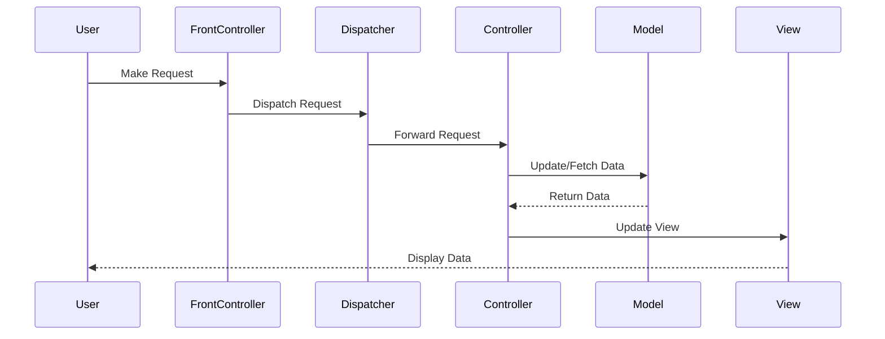

## 8.10 Model-View-Controller (MVC) Pattern (Revisited)

The Model-View-Controller (MVC) pattern is a foundational design pattern in software engineering, particularly in the development of user interfaces. It divides an application into three interconnected components: the Model, the View, and the Controller. This separation of concerns facilitates modular development and enhances the maintainability of applications. In this section, we will revisit the MVC pattern with a focus on its application in enterprise-scale applications, addressing the challenges and advanced strategies for handling complex interactions and workflows.

### Recap of the MVC Pattern

Before delving into the complexities of enterprise applications, let's briefly recap the core components of the MVC pattern:

- **Model**: The Model represents the data and the business logic of the application. It is responsible for managing the data, responding to requests for information, and updating itself when data changes. In enterprise applications, the Model often interacts with databases and external services.

- **View**: The View is the presentation layer of the application. It displays data to the user and sends user commands to the Controller. In enterprise applications, the View can be complex, involving multiple user interfaces and dynamic content rendering.

- **Controller**: The Controller acts as an intermediary between the Model and the View. It handles user input, processes it (often invoking changes in the Model), and updates the View accordingly. In large-scale applications, Controllers manage complex workflows and user interactions.

### MVC in Large-Scale Enterprise Applications

In small projects, the MVC pattern is straightforward, with each component having a clear and distinct role. However, in large-scale enterprise applications, the implementation of MVC becomes more intricate due to the following factors:

1. **Multiple Views**: Enterprise applications often have multiple views, each tailored for different user roles or devices. Managing these views and ensuring consistency across them can be challenging.

2. **Asynchronous Interactions**: Modern applications frequently involve asynchronous operations, such as AJAX calls or WebSocket communications. Handling these interactions within the MVC framework requires careful design to maintain responsiveness and data integrity.

3. **Integration with Backend Services**: Enterprise applications typically interact with various backend services, including databases, third-party APIs, and microservices. The Model must be designed to handle these integrations efficiently, often requiring complex data transformations and error handling.

4. **Complex Workflows**: Enterprise applications often involve complex user workflows that span multiple screens and involve conditional logic. Controllers must be designed to manage these workflows effectively, ensuring a seamless user experience.

### Advanced Concepts in MVC Implementations

To address the challenges of implementing MVC in enterprise applications, several advanced concepts and strategies can be employed:

#### Front Controller Integration

The Front Controller pattern is often used in conjunction with MVC to provide a centralized entry point for handling all requests. This pattern helps manage complex navigation and workflow by delegating requests to appropriate controllers based on predefined rules.

```java
public class FrontController {
    private Dispatcher dispatcher;

    public FrontController() {
        dispatcher = new Dispatcher();
    }

    private boolean isAuthenticUser() {
        System.out.println("User is authenticated successfully.");
        return true;
    }

    private void trackRequest(String request) {
        System.out.println("Page requested: " + request);
    }

    public void dispatchRequest(String request) {
        // Log each request
        trackRequest(request);
        // Authenticate the user
        if (isAuthenticUser()) {
            dispatcher.dispatch(request);
        }
    }
}

class Dispatcher {
    private HomeView homeView;
    private StudentView studentView;

    public Dispatcher() {
        homeView = new HomeView();
        studentView = new StudentView();
    }

    public void dispatch(String request) {
        if (request.equalsIgnoreCase("STUDENT")) {
            studentView.show();
        } else {
            homeView.show();
        }
    }
}

class HomeView {
    public void show() {
        System.out.println("Displaying Home Page");
    }
}

class StudentView {
    public void show() {
        System.out.println("Displaying Student Page");
    }
}
```

In this example, the `FrontController` class handles all incoming requests and delegates them to the appropriate view via the `Dispatcher`.

#### Application Controllers for Complex Navigation

Application Controllers are used to manage complex navigation and workflow logic. Unlike a typical Controller, which handles a single user interaction, an Application Controller manages a sequence of interactions, coordinating between multiple Controllers and Views.

```java
public class ApplicationController {
    private Map<String, Command> commands = new HashMap<>();

    public void addCommand(String commandName, Command command) {
        commands.put(commandName, command);
    }

    public void processRequest(String commandName) {
        Command command = commands.get(commandName);
        if (command != null) {
            command.execute();
        } else {
            System.out.println("Command not found.");
        }
    }
}

interface Command {
    void execute();
}

class LoginCommand implements Command {
    public void execute() {
        System.out.println("Executing login command...");
        // Logic for login
    }
}

class LogoutCommand implements Command {
    public void execute() {
        System.out.println("Executing logout command...");
        // Logic for logout
    }
}
```

Here, the `ApplicationController` manages different commands, such as login and logout, allowing for flexible and reusable workflow management.

#### Implementing Model Objects with Enterprise Services

In enterprise applications, Model objects often need to interact with databases and external services. This requires a robust design that can handle data persistence, validation, and transformation.

```java
public class UserModel {
    private String userId;
    private String userName;
    private String email;

    // Assume UserService is a service that interacts with a database
    private UserService userService;

    public UserModel(UserService userService) {
        this.userService = userService;
    }

    public void save() {
        userService.saveUser(this);
    }

    public void load(String userId) {
        UserModel user = userService.getUserById(userId);
        this.userId = user.userId;
        this.userName = user.userName;
        this.email = user.email;
    }

    // Getters and setters
}
```

In this example, the `UserModel` interacts with a `UserService` to persist and retrieve data, demonstrating how Models can be integrated with enterprise services.

### Visualizing Advanced MVC Architectures

To better understand the advanced MVC architectures used in enterprise applications, let's visualize the interactions between components using a sequence diagram.



This diagram illustrates the flow of a request from the user through the Front Controller, Dispatcher, Controller, Model, and finally to the View, highlighting the separation of concerns and the flow of data.

### Practical Implementation Strategies

When implementing the MVC pattern in enterprise applications, consider the following strategies:

1. **Modularize Components**: Break down the application into smaller, manageable modules. Each module should have its own MVC components, allowing for easier maintenance and scalability.

2. **Use Dependency Injection**: Leverage frameworks like Spring to manage dependencies between components. This enhances testability and decouples components from each other.

3. **Implement Caching**: Use caching strategies to improve performance, especially for data-intensive operations in the Model.

4. **Asynchronous Processing**: Utilize asynchronous processing for long-running tasks to keep the application responsive. This can be achieved using Java's concurrency features or frameworks like Spring Boot.

5. **Error Handling and Logging**: Implement robust error handling and logging mechanisms to track and resolve issues efficiently.

6. **Security Considerations**: Ensure that the application is secure by implementing authentication and authorization checks in the Controller and Model layers.

### Try It Yourself

To deepen your understanding of the MVC pattern in enterprise applications, try modifying the provided code examples:

- **Add a New Command**: Extend the `ApplicationController` by adding a new command, such as `RegisterCommand`, and implement the corresponding logic.
- **Integrate a Database**: Modify the `UserModel` to interact with a real database using JDBC or an ORM framework like Hibernate.
- **Enhance the Front Controller**: Add additional views and routes to the `FrontController` example, simulating a more complex navigation structure.

### Knowledge Check

As you explore the advanced concepts of the MVC pattern in enterprise applications, consider these questions:

- How does the Front Controller pattern enhance the MVC architecture in enterprise applications?
- What are the benefits of using Application Controllers for managing complex workflows?
- How can asynchronous processing be integrated into the MVC pattern to improve application responsiveness?

### Conclusion

The Model-View-Controller pattern remains a powerful tool for structuring applications, especially in the context of large-scale enterprise systems. By revisiting and adapting the MVC pattern to address the challenges of complex interactions and workflows, developers can create scalable, maintainable, and efficient applications. As you continue your journey in software development, remember to experiment with different patterns and strategies, adapting them to suit the unique needs of your projects.

## Quiz Time!



### What is the primary role of the Model in the MVC pattern?

- [x] To manage data and business logic
- [ ] To display data to the user
- [ ] To handle user input
- [ ] To manage user authentication

> **Explanation:** The Model is responsible for managing the data and business logic of the application.

### How does the Front Controller pattern benefit enterprise applications?

- [x] By providing a centralized entry point for handling requests
- [ ] By directly managing database connections
- [ ] By rendering the user interface
- [ ] By storing application configuration

> **Explanation:** The Front Controller pattern centralizes request handling, making it easier to manage navigation and workflows.

### What challenge does asynchronous interaction pose in MVC applications?

- [x] Maintaining data integrity and responsiveness
- [ ] Increasing the number of views
- [ ] Simplifying user input handling
- [ ] Directly accessing the database

> **Explanation:** Asynchronous interactions require careful design to maintain data integrity and ensure responsiveness.

### Which component in MVC is primarily responsible for user input handling?

- [ ] Model
- [ ] View
- [x] Controller
- [ ] Dispatcher

> **Explanation:** The Controller handles user input and processes it, often invoking changes in the Model.

### What is an Application Controller used for in MVC?

- [x] Managing complex navigation and workflows
- [ ] Rendering the user interface
- [ ] Directly accessing the database
- [ ] Storing user preferences

> **Explanation:** An Application Controller manages sequences of interactions, coordinating between multiple Controllers and Views.

### How can Models in enterprise applications efficiently handle data persistence?

- [x] By interacting with databases and external services
- [ ] By storing data in the View
- [ ] By directly modifying user input
- [ ] By managing user authentication

> **Explanation:** Models often interact with databases and external services to handle data persistence efficiently.

### What is a key benefit of using Dependency Injection in MVC applications?

- [x] Enhancing testability and decoupling components
- [ ] Simplifying user interface design
- [ ] Directly managing user input
- [ ] Rendering complex graphics

> **Explanation:** Dependency Injection enhances testability and decouples components, making the application more modular.

### Which strategy can improve performance in data-intensive operations in the Model?

- [x] Implementing caching strategies
- [ ] Increasing the number of Controllers
- [ ] Simplifying the user interface
- [ ] Directly accessing the database

> **Explanation:** Caching strategies can improve performance by reducing the need for repeated data retrieval operations.

### How can security be ensured in MVC applications?

- [x] By implementing authentication and authorization checks
- [ ] By increasing the number of Views
- [ ] By directly accessing the database
- [ ] By simplifying user input handling

> **Explanation:** Security can be ensured by implementing authentication and authorization checks in the Controller and Model layers.

### True or False: The MVC pattern is only suitable for small-scale applications.

- [ ] True
- [x] False

> **Explanation:** The MVC pattern is suitable for both small-scale and large-scale applications, especially when adapted to handle complex interactions and workflows.


