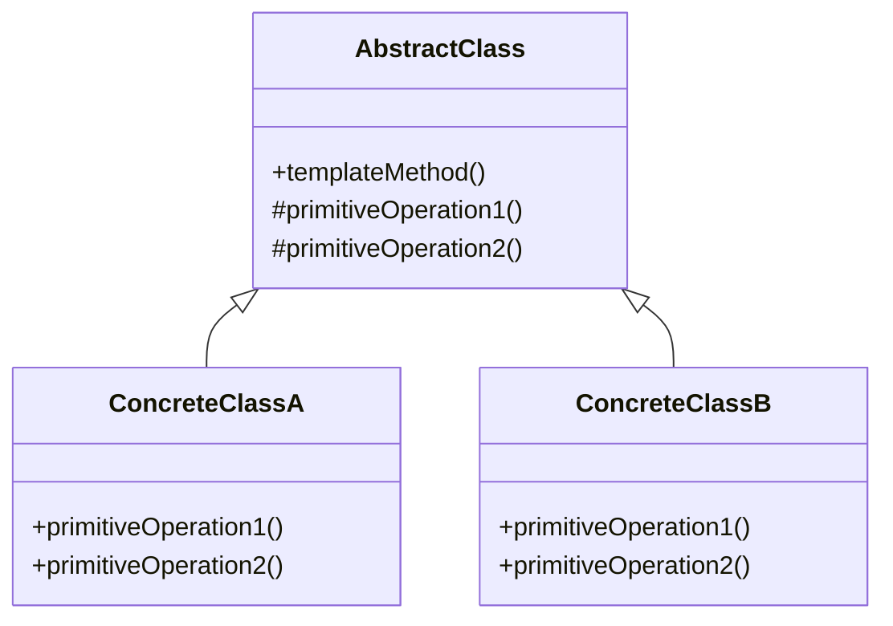

## 8.11.1 Implementing Template Method in Java

The Template Method pattern is a behavioral design pattern that defines the skeleton of an algorithm in a method, deferring some steps to subclasses. This pattern allows subclasses to redefine certain steps of an algorithm without changing its structure, promoting code reuse and consistency across different implementations.

### Intent

The primary intent of the Template Method pattern is to define the overall structure of an algorithm in a base class, while allowing subclasses to override specific steps of the algorithm. This pattern is particularly useful when you have multiple classes that share a similar algorithm but differ in some specific steps.

### Advantages

- **Code Reusability**: By defining the common algorithm structure in a base class, you can reuse the code across different subclasses.
- **Consistency**: Ensures that the algorithm's structure remains consistent across different implementations.
- **Flexibility**: Allows subclasses to implement specific steps of the algorithm, providing flexibility in behavior.
- **Ease of Maintenance**: Changes to the algorithm's structure are centralized in the base class, making maintenance easier.

### Participants

1. **AbstractClass**: Defines the template method and declares abstract methods representing the steps of the algorithm that must be implemented by subclasses.
2. **ConcreteClass**: Implements the abstract methods defined in the AbstractClass, providing specific behavior for the algorithm's steps.

### Structure

The Template Method pattern involves the following structure:



**Diagram Explanation**: The `AbstractClass` contains the `templateMethod()` which defines the skeleton of the algorithm. It calls abstract methods `primitiveOperation1()` and `primitiveOperation2()`, which are implemented by `ConcreteClassA` and `ConcreteClassB`.

### Implementation

#### AbstractClass

The `AbstractClass` defines the template method and declares abstract methods for the algorithm's steps.

```java
abstract class AbstractClass {
    // Template method defining the skeleton of the algorithm
    public final void templateMethod() {
        primitiveOperation1();
        primitiveOperation2();
        hook(); // Optional step
    }

    // Abstract methods to be implemented by subclasses
    protected abstract void primitiveOperation1();
    protected abstract void primitiveOperation2();

    // Hook method with a default implementation
    protected void hook() {
        // Default implementation (can be overridden)
    }
}
```

**Explanation**: The `templateMethod()` is marked as `final` to prevent subclasses from altering the algorithm's structure. The `hook()` method provides a default implementation that subclasses can override if needed.

#### ConcreteClass

The `ConcreteClass` provides specific implementations for the abstract methods defined in the `AbstractClass`.

```java
class ConcreteClassA extends AbstractClass {
    @Override
    protected void primitiveOperation1() {
        System.out.println("ConcreteClassA: Implementing primitiveOperation1");
    }

    @Override
    protected void primitiveOperation2() {
        System.out.println("ConcreteClassA: Implementing primitiveOperation2");
    }
}

class ConcreteClassB extends AbstractClass {
    @Override
    protected void primitiveOperation1() {
        System.out.println("ConcreteClassB: Implementing primitiveOperation1");
    }

    @Override
    protected void primitiveOperation2() {
        System.out.println("ConcreteClassB: Implementing primitiveOperation2");
    }

    @Override
    protected void hook() {
        System.out.println("ConcreteClassB: Overriding hook method");
    }
}
```

**Explanation**: `ConcreteClassA` and `ConcreteClassB` provide specific implementations for `primitiveOperation1()` and `primitiveOperation2()`. `ConcreteClassB` also overrides the `hook()` method to provide additional behavior.

### Enforcing Consistent Algorithm Structure

The Template Method pattern enforces a consistent algorithm structure by centralizing the algorithm's skeleton in the `AbstractClass`. Subclasses can only modify specific steps of the algorithm, ensuring that the overall structure remains unchanged. This approach promotes code reuse and consistency across different implementations.

### Sample Use Cases

- **Data Processing Pipelines**: Define a template for processing data, allowing different data sources to implement specific steps.
- **Game Development**: Implement game loops with a consistent structure, while allowing different games to define specific behaviors.
- **UI Frameworks**: Create a template for rendering UI components, enabling different components to implement specific rendering logic.

### Related Patterns

- **[Strategy Pattern]( "Strategy Pattern")**: While the Template Method pattern defines a fixed algorithm structure, the Strategy pattern allows the algorithm to be selected at runtime.
- **[Factory Method Pattern]( "Factory Method Pattern")**: Often used in conjunction with the Template Method pattern to create objects needed by the algorithm.

### Known Uses

- **Java's `java.util.AbstractList`**: Provides a skeletal implementation of the `List` interface, allowing subclasses to implement specific list operations.
- **Java's `javax.servlet.http.HttpServlet`**: Defines a template method for handling HTTP requests, with specific methods for handling GET, POST, etc.

### Best Practices

- **Use Hooks Wisely**: Provide default implementations for hook methods to allow subclasses to extend behavior without requiring them to override the method.
- **Limit Subclass Responsibilities**: Keep the template method's structure in the base class and limit the responsibilities of subclasses to implementing specific steps.
- **Avoid Overuse**: Use the Template Method pattern when you have a clear algorithm structure that can be shared across multiple subclasses.

### Common Pitfalls

- **Overcomplicating the Template**: Avoid adding too many steps to the template method, which can make it difficult for subclasses to implement.
- **Inflexible Design**: Ensure that the template method is flexible enough to accommodate different subclass implementations without requiring changes to the base class.

### Exercises

1. Implement a Template Method pattern for a document processing system that supports different document formats (e.g., PDF, Word).
2. Create a Template Method pattern for a payment processing system that handles different payment methods (e.g., credit card, PayPal).

### Conclusion

The Template Method pattern is a powerful tool for defining consistent algorithm structures while allowing flexibility in specific steps. By centralizing the algorithm's skeleton in a base class, you can promote code reuse, consistency, and ease of maintenance across different implementations.

## Test Your Knowledge: Template Method Pattern in Java Quiz



### What is the primary purpose of the Template Method pattern?

- [x] To define the skeleton of an algorithm in a base class and defer specific steps to subclasses.
- [ ] To allow multiple algorithms to be selected at runtime.
- [ ] To create objects needed by an algorithm.
- [ ] To encapsulate a request as an object.

> **Explanation:** The Template Method pattern defines the skeleton of an algorithm in a base class, allowing subclasses to implement specific steps.

### Which class defines the template method in the Template Method pattern?

- [x] AbstractClass
- [ ] ConcreteClass
- [ ] Interface
- [ ] SingletonClass

> **Explanation:** The `AbstractClass` defines the template method, which outlines the algorithm's structure.

### What is a hook method in the Template Method pattern?

- [x] A method with a default implementation that can be overridden by subclasses.
- [ ] A method that must be implemented by all subclasses.
- [ ] A method that defines the algorithm's structure.
- [ ] A method that creates objects needed by the algorithm.

> **Explanation:** A hook method provides a default implementation that subclasses can override to extend behavior.

### How does the Template Method pattern promote code reuse?

- [x] By centralizing the algorithm's structure in a base class.
- [ ] By allowing multiple algorithms to be selected at runtime.
- [ ] By encapsulating a request as an object.
- [ ] By creating objects needed by an algorithm.

> **Explanation:** The Template Method pattern centralizes the algorithm's structure in a base class, promoting code reuse across subclasses.

### Which of the following is a known use of the Template Method pattern in Java?

- [x] `java.util.AbstractList`
- [ ] `java.util.ArrayList`
- [ ] `java.util.HashMap`
- [ ] `java.util.LinkedList`

> **Explanation:** `java.util.AbstractList` provides a skeletal implementation of the `List` interface using the Template Method pattern.

### What is the role of the ConcreteClass in the Template Method pattern?

- [x] To implement the abstract methods defined in the AbstractClass.
- [ ] To define the template method.
- [ ] To encapsulate a request as an object.
- [ ] To create objects needed by an algorithm.

> **Explanation:** The `ConcreteClass` implements the abstract methods defined in the `AbstractClass`, providing specific behavior for the algorithm's steps.

### What is a common pitfall when using the Template Method pattern?

- [x] Overcomplicating the template method with too many steps.
- [ ] Allowing multiple algorithms to be selected at runtime.
- [ ] Encapsulating a request as an object.
- [ ] Creating objects needed by an algorithm.

> **Explanation:** Overcomplicating the template method with too many steps can make it difficult for subclasses to implement.

### How can the Template Method pattern enforce a consistent algorithm structure?

- [x] By centralizing the algorithm's skeleton in the base class.
- [ ] By allowing multiple algorithms to be selected at runtime.
- [ ] By encapsulating a request as an object.
- [ ] By creating objects needed by an algorithm.

> **Explanation:** The Template Method pattern enforces a consistent algorithm structure by centralizing the algorithm's skeleton in the base class.

### What is the benefit of using a final keyword in the template method?

- [x] It prevents subclasses from altering the algorithm's structure.
- [ ] It allows multiple algorithms to be selected at runtime.
- [ ] It encapsulates a request as an object.
- [ ] It creates objects needed by an algorithm.

> **Explanation:** The `final` keyword prevents subclasses from altering the algorithm's structure, ensuring consistency.

### True or False: The Template Method pattern is a creational design pattern.

- [ ] True
- [x] False

> **Explanation:** The Template Method pattern is a behavioral design pattern, not a creational one.



By mastering the Template Method pattern, Java developers can create flexible and reusable code, ensuring consistency and ease of maintenance across different implementations.
