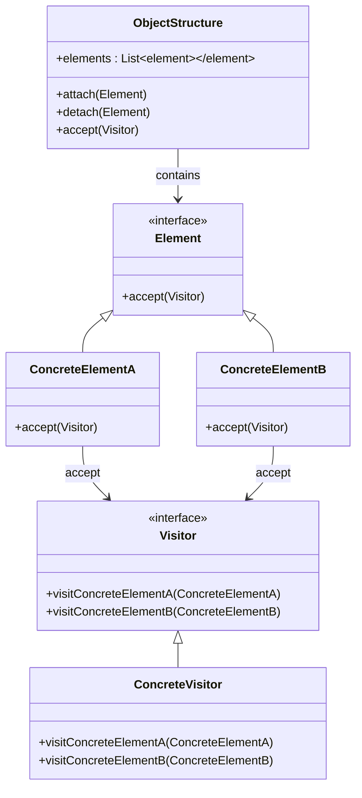

## 8.12.1 Implementing Visitor in Java

The Visitor pattern is a powerful behavioral design pattern that allows you to separate algorithms from the objects on which they operate. This separation enables you to add new operations without modifying the objects themselves, promoting flexibility and scalability in your codebase.

### Intent

The primary intent of the Visitor pattern is to define a new operation on a set of objects without changing the objects themselves. It achieves this by allowing you to add new operations to existing object structures without altering their classes. This is particularly useful when dealing with complex object structures where new functionality needs to be added frequently.

### Benefits

- **Separation of Concerns**: The Visitor pattern promotes a clear separation between the data structure and the operations performed on it.
- **Open/Closed Principle**: It adheres to the open/closed principle by allowing new operations to be added without modifying existing code.
- **Ease of Maintenance**: By centralizing operations in visitor classes, the pattern simplifies maintenance and enhances code readability.
- **Flexibility**: New operations can be added easily by creating new visitor classes.

### Participants

The Visitor pattern involves several key participants:

- **Visitor**: An interface or abstract class that declares a visit operation for each type of `ConcreteElement` in the object structure.
- **ConcreteVisitor**: Implements the operations defined in the `Visitor` interface for each type of `ConcreteElement`.
- **Element**: An interface or abstract class that declares an `accept` method, which takes a `Visitor` as an argument.
- **ConcreteElement**: Implements the `Element` interface and defines the `accept` method, which calls the appropriate visit method on the `Visitor`.
- **ObjectStructure**: A class that contains a collection of `Element` objects and provides a mechanism to iterate over them, typically allowing a `Visitor` to visit each element.

### Structure

The following UML diagram illustrates the relationships between the participants in the Visitor pattern:



**Diagram Explanation**: The diagram shows the `Visitor` interface with visit methods for each `ConcreteElement`. `ConcreteVisitor` implements these methods. `Element` interface is implemented by `ConcreteElementA` and `ConcreteElementB`, each having an `accept` method that takes a `Visitor`. `ObjectStructure` manages a collection of `Element` objects.

### Implementation

#### Implementation Guidelines

1. **Define the Visitor Interface**: Create an interface with a visit method for each type of `ConcreteElement`.
2. **Implement Concrete Visitors**: Create classes that implement the `Visitor` interface, providing specific implementations for each visit method.
3. **Define the Element Interface**: Create an interface with an `accept` method that takes a `Visitor`.
4. **Implement Concrete Elements**: Create classes that implement the `Element` interface, defining the `accept` method to call the appropriate visit method on the `Visitor`.
5. **Create the Object Structure**: Implement a class that holds a collection of `Element` objects and provides a method to accept a `Visitor`.

#### Sample Code Snippets

Below is a Java implementation of the Visitor pattern:

```java
// Visitor interface
interface Visitor {
    void visitConcreteElementA(ConcreteElementA element);
    void visitConcreteElementB(ConcreteElementB element);
}

// ConcreteVisitor class
class ConcreteVisitor implements Visitor {
    @Override
    public void visitConcreteElementA(ConcreteElementA element) {
        System.out.println("Visiting ConcreteElementA");
    }

    @Override
    public void visitConcreteElementB(ConcreteElementB element) {
        System.out.println("Visiting ConcreteElementB");
    }
}

// Element interface
interface Element {
    void accept(Visitor visitor);
}

// ConcreteElementA class
class ConcreteElementA implements Element {
    @Override
    public void accept(Visitor visitor) {
        visitor.visitConcreteElementA(this);
    }
}

// ConcreteElementB class
class ConcreteElementB implements Element {
    @Override
    public void accept(Visitor visitor) {
        visitor.visitConcreteElementB(this);
    }
}

// ObjectStructure class
class ObjectStructure {
    private List<Element> elements = new ArrayList<>();

    public void attach(Element element) {
        elements.add(element);
    }

    public void detach(Element element) {
        elements.remove(element);
    }

    public void accept(Visitor visitor) {
        for (Element element : elements) {
            element.accept(visitor);
        }
    }
}

// Client code
public class VisitorPatternDemo {
    public static void main(String[] args) {
        ObjectStructure objectStructure = new ObjectStructure();
        objectStructure.attach(new ConcreteElementA());
        objectStructure.attach(new ConcreteElementB());

        ConcreteVisitor visitor = new ConcreteVisitor();
        objectStructure.accept(visitor);
    }
}
```

**Code Explanation**: 
- The `Visitor` interface defines visit methods for `ConcreteElementA` and `ConcreteElementB`.
- `ConcreteVisitor` implements these methods, providing specific functionality for each element type.
- `Element` interface declares an `accept` method, which is implemented by `ConcreteElementA` and `ConcreteElementB`.
- `ObjectStructure` manages a collection of `Element` objects and allows a `Visitor` to visit each element.
- The `VisitorPatternDemo` class demonstrates how to use the Visitor pattern by creating an `ObjectStructure`, adding elements, and applying a `Visitor`.

### Sample Use Cases

- **Compilers**: The Visitor pattern is often used in compilers to perform operations on abstract syntax trees (ASTs), such as type checking or code generation.
- **Document Processing**: In document processing systems, the Visitor pattern can be used to apply operations like formatting or spell-checking to different parts of a document.
- **Graphics Rendering**: Graphics applications can use the Visitor pattern to perform operations like rendering or hit-testing on various graphical elements.

### Related Patterns

- **Composite Pattern**: The Visitor pattern is often used in conjunction with the [Composite Pattern]( "Composite Pattern") to perform operations on composite objects.
- **Interpreter Pattern**: The Visitor pattern can be used with the [Interpreter Pattern]( "Interpreter Pattern") to evaluate expressions in a language.

### Known Uses

- **Java AWT**: The AWT event model in Java uses a form of the Visitor pattern to handle events.
- **XML Processing**: Libraries like Apache Xerces use the Visitor pattern to traverse and manipulate XML documents.

### Consequences

- **Advantages**:
  - **Extensibility**: New operations can be added easily by creating new visitor classes.
  - **Separation of Concerns**: Operations are separated from the object structure, enhancing maintainability.

- **Disadvantages**:
  - **Complexity**: The pattern can introduce complexity, especially when dealing with a large number of element types.
  - **Double Dispatch**: The pattern relies on double dispatch, which can be less intuitive for developers unfamiliar with the concept.

### Exercises

1. **Modify the Visitor Pattern**: Extend the provided code example to include a new `ConcreteElementC` and a corresponding visit method in the `Visitor` interface. Implement a new `ConcreteVisitor` that handles this element.

2. **Experiment with Different Operations**: Create a new visitor that performs a different operation on the elements, such as calculating a sum or generating a report.

3. **Integrate with Other Patterns**: Combine the Visitor pattern with the Composite pattern to perform operations on a tree structure of elements.

### Key Takeaways

- The Visitor pattern is ideal for scenarios where new operations need to be added frequently to a set of objects.
- It promotes the open/closed principle by allowing new functionality to be added without modifying existing code.
- While powerful, the pattern can introduce complexity and requires careful design to manage multiple element types and visitors.

### Reflection

Consider how the Visitor pattern can be applied to your own projects. Are there scenarios where separating operations from object structures could enhance flexibility and maintainability? How might you leverage the pattern to accommodate future changes or extensions?

## Test Your Knowledge: Visitor Pattern in Java Quiz



### What is the primary intent of the Visitor pattern?

- [x] To define a new operation on a set of objects without changing the objects themselves.
- [ ] To encapsulate object creation in a separate class.
- [ ] To provide a way to access the elements of an aggregate object sequentially.
- [ ] To define a family of algorithms and make them interchangeable.

> **Explanation:** The Visitor pattern allows you to define new operations on objects without modifying their classes, promoting flexibility and adherence to the open/closed principle.

### Which participant in the Visitor pattern declares the visit operation?

- [x] Visitor
- [ ] ConcreteVisitor
- [ ] Element
- [ ] ConcreteElement

> **Explanation:** The `Visitor` interface or abstract class declares the visit operation for each type of `ConcreteElement`.

### How does the Visitor pattern adhere to the open/closed principle?

- [x] By allowing new operations to be added without modifying existing code.
- [ ] By encapsulating object creation in a separate class.
- [ ] By providing a way to access the elements of an aggregate object sequentially.
- [ ] By defining a family of algorithms and making them interchangeable.

> **Explanation:** The Visitor pattern allows new operations to be added by creating new visitor classes, without altering the existing object structure.

### What is a potential disadvantage of the Visitor pattern?

- [x] It can introduce complexity, especially with many element types.
- [ ] It makes it difficult to add new operations.
- [ ] It tightly couples operations with object structures.
- [ ] It is not suitable for object-oriented programming.

> **Explanation:** The Visitor pattern can become complex when dealing with a large number of element types and visitors, requiring careful design.

### In the Visitor pattern, what role does the ObjectStructure play?

- [x] It holds a collection of Element objects and allows a Visitor to visit each element.
- [ ] It defines the visit operation for each type of ConcreteElement.
- [ ] It implements the operations defined in the Visitor interface.
- [ ] It declares an accept method that takes a Visitor.

> **Explanation:** The `ObjectStructure` manages a collection of `Element` objects and provides a mechanism for a `Visitor` to visit each element.

### Which of the following is a real-world use case for the Visitor pattern?

- [x] Compilers performing operations on abstract syntax trees.
- [ ] Creating a new instance of an object.
- [ ] Accessing elements of an aggregate object sequentially.
- [ ] Defining a family of algorithms and making them interchangeable.

> **Explanation:** The Visitor pattern is commonly used in compilers to perform operations on abstract syntax trees, such as type checking or code generation.

### How does the Visitor pattern promote separation of concerns?

- [x] By separating operations from the object structure, enhancing maintainability.
- [ ] By encapsulating object creation in a separate class.
- [ ] By providing a way to access the elements of an aggregate object sequentially.
- [ ] By defining a family of algorithms and making them interchangeable.

> **Explanation:** The Visitor pattern separates operations from the object structure, allowing for centralized and maintainable code.

### What is double dispatch in the context of the Visitor pattern?

- [x] A technique that allows a function to be selected based on the runtime types of two objects.
- [ ] A method for encapsulating object creation.
- [ ] A way to access elements of an aggregate object sequentially.
- [ ] A technique for defining a family of algorithms and making them interchangeable.

> **Explanation:** Double dispatch is a technique used in the Visitor pattern to select a function based on the runtime types of both the visitor and the element.

### Which pattern is often used in conjunction with the Visitor pattern?

- [x] Composite Pattern
- [ ] Singleton Pattern
- [ ] Factory Pattern
- [ ] Strategy Pattern

> **Explanation:** The Visitor pattern is often used with the Composite pattern to perform operations on composite objects.

### True or False: The Visitor pattern is not suitable for object-oriented programming.

- [ ] True
- [x] False

> **Explanation:** The Visitor pattern is a behavioral design pattern used in object-oriented programming to separate algorithms from the objects on which they operate.



By mastering the Visitor pattern, Java developers and software architects can enhance the flexibility and maintainability of their applications, allowing for the seamless addition of new operations and functionality.
