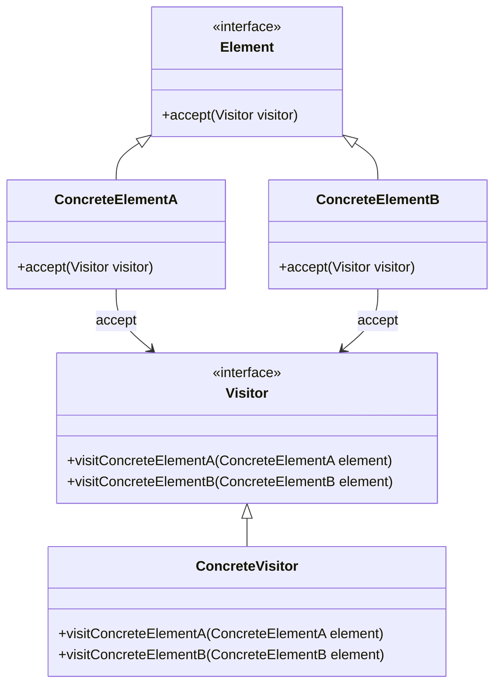

## 8.12.2 Double Dispatch Mechanism

### Introduction

In the realm of object-oriented programming, method dispatching is a fundamental concept that determines which method implementation is executed at runtime. Java, like many other object-oriented languages, primarily uses single dispatch, where the method to be executed is determined by the runtime type of the object on which the method is called. However, there are scenarios where decisions need to be made based on the runtime types of multiple objects. This is where the concept of **double dispatch** becomes invaluable, particularly within the context of the **Visitor Pattern**.

### Single Dispatch vs. Double Dispatch

#### Single Dispatch

Single dispatch is the default method resolution strategy in Java. It involves selecting the method to execute based on the runtime type of the object that is the target of the method call. This is straightforward and efficient but limited when interactions between multiple objects are involved.

```java
class Animal {
    void makeSound() {
        System.out.println("Some generic animal sound");
    }
}

class Dog extends Animal {
    @Override
    void makeSound() {
        System.out.println("Bark");
    }
}

public class SingleDispatchExample {
    public static void main(String[] args) {
        Animal myAnimal = new Dog();
        myAnimal.makeSound(); // Outputs: Bark
    }
}
```

In the above example, the method `makeSound()` is determined by the runtime type of `myAnimal`, which is `Dog`.

#### Double Dispatch

Double dispatch extends this concept by allowing method execution to be determined by the runtime types of two objects. This is particularly useful in scenarios where operations depend on the interaction between two distinct types.

### Achieving Double Dispatch with the Visitor Pattern

The **Visitor Pattern** is a design pattern that allows you to add further operations to objects without modifying them. It achieves double dispatch by using method overloading and a combination of visitor and element interfaces.

#### Structure of the Visitor Pattern

The Visitor Pattern involves two main components:

1. **Visitor Interface**: Declares a visit method for each type of element.
2. **Element Interface**: Declares an accept method that takes a visitor as an argument.



**Diagram Explanation**: This diagram illustrates the structure of the Visitor Pattern, showing the relationships between the Visitor, ConcreteVisitor, Element, and ConcreteElement classes.

#### Implementation

Let's walk through an implementation of the Visitor Pattern to achieve double dispatch.

```java
// Visitor interface
interface Visitor {
    void visitConcreteElementA(ConcreteElementA element);
    void visitConcreteElementB(ConcreteElementB element);
}

// Concrete Visitor
class ConcreteVisitor implements Visitor {
    @Override
    public void visitConcreteElementA(ConcreteElementA element) {
        System.out.println("Visiting ConcreteElementA");
    }

    @Override
    public void visitConcreteElementB(ConcreteElementB element) {
        System.out.println("Visiting ConcreteElementB");
    }
}

// Element interface
interface Element {
    void accept(Visitor visitor);
}

// Concrete Element A
class ConcreteElementA implements Element {
    @Override
    public void accept(Visitor visitor) {
        visitor.visitConcreteElementA(this);
    }
}

// Concrete Element B
class ConcreteElementB implements Element {
    @Override
    public void accept(Visitor visitor) {
        visitor.visitConcreteElementB(this);
    }
}

// Client code
public class VisitorPatternExample {
    public static void main(String[] args) {
        Element[] elements = {new ConcreteElementA(), new ConcreteElementB()};
        Visitor visitor = new ConcreteVisitor();

        for (Element element : elements) {
            element.accept(visitor);
        }
    }
}
```

**Code Explanation**: In this example, `ConcreteVisitor` implements the `Visitor` interface, providing specific implementations for visiting `ConcreteElementA` and `ConcreteElementB`. Each `ConcreteElement` class implements the `Element` interface, defining the `accept` method that takes a `Visitor` as an argument. This setup allows the visitor to perform operations based on the runtime type of both the visitor and the element, achieving double dispatch.

### Benefits of Double Dispatch

1. **Type-Safe Operations**: Double dispatch ensures that operations are executed in a type-safe manner, as the method to be executed is determined by the runtime types of both the visitor and the element.

2. **Separation of Concerns**: The Visitor Pattern separates algorithms from the objects on which they operate, promoting cleaner and more maintainable code.

3. **Extensibility**: New operations can be added without modifying existing element classes, adhering to the Open/Closed Principle.

4. **Flexibility**: The pattern provides flexibility in adding new operations or elements, making it easier to adapt to changing requirements.

### Practical Applications

The Visitor Pattern and double dispatch are particularly useful in scenarios such as:

- **Compilers**: Where different operations need to be performed on abstract syntax tree nodes.
- **Graphics Systems**: Where different rendering operations are applied to various graphical elements.
- **Financial Systems**: Where different calculations are performed on various financial instruments.

### Common Pitfalls and How to Avoid Them

1. **Complexity**: The Visitor Pattern can introduce complexity, especially with a large number of element types. Mitigate this by carefully designing the visitor interface and keeping the number of visit methods manageable.

2. **Circular Dependencies**: Avoid circular dependencies between visitors and elements by adhering to clear interface contracts and separation of concerns.

3. **Performance Overhead**: Double dispatch can introduce performance overhead due to additional method calls. Optimize by minimizing the number of visitor and element types when possible.

### Exercises and Practice Problems

1. **Exercise**: Implement a Visitor Pattern for a file system where different operations (e.g., compress, encrypt) are performed on files and directories.

2. **Practice Problem**: Extend the Visitor Pattern example to include a new element type and a new visitor operation.

### Key Takeaways

- Double dispatch allows method execution based on the runtime types of two objects, providing a powerful mechanism for type-safe operations.
- The Visitor Pattern is a common way to achieve double dispatch in Java, promoting separation of concerns and extensibility.
- While powerful, the pattern should be used judiciously to avoid unnecessary complexity and performance overhead.

### Reflection

Consider how you might apply the Visitor Pattern and double dispatch in your own projects. What scenarios could benefit from this approach, and how might it improve your code's maintainability and flexibility?

### Related Patterns

- **[8.12 Visitor Pattern]( "Visitor Pattern")**: Explore the broader context of the Visitor Pattern and its applications.
- **[6.6 Singleton Pattern]( "Singleton Pattern")**: Understand how the Singleton Pattern can be used in conjunction with the Visitor Pattern to manage visitor instances.

### Known Uses

- **Java AWT and Swing**: Utilize the Visitor Pattern for rendering and event handling.
- **ANTLR**: Uses the Visitor Pattern for traversing and processing parse trees.

### Further Reading

- Oracle Java Documentation: [Java Documentation](https://docs.oracle.com/en/java/)
- Microsoft: [Cloud Design Patterns](https://learn.microsoft.com/en-us/azure/architecture/patterns/)

---

## Test Your Knowledge: Double Dispatch and Visitor Pattern Quiz



### What is the primary benefit of double dispatch in Java?

- [x] It allows method execution based on the runtime types of two objects.
- [ ] It improves performance by reducing method calls.
- [ ] It simplifies code by reducing the number of classes.
- [ ] It allows for dynamic method resolution at compile time.

> **Explanation:** Double dispatch enables method execution based on the runtime types of both the visitor and the element, providing type-safe operations.

### How does the Visitor Pattern achieve double dispatch?

- [x] By using method overloading and a combination of visitor and element interfaces.
- [ ] By using inheritance and polymorphism.
- [ ] By using reflection to determine method calls.
- [ ] By using a single interface for all operations.

> **Explanation:** The Visitor Pattern uses method overloading and the accept method in elements to achieve double dispatch.

### Which of the following is a benefit of using the Visitor Pattern?

- [x] It separates algorithms from the objects on which they operate.
- [ ] It reduces the number of classes in a system.
- [ ] It eliminates the need for interfaces.
- [ ] It simplifies exception handling.

> **Explanation:** The Visitor Pattern promotes separation of concerns by separating algorithms from the objects they operate on.

### In the Visitor Pattern, what role does the accept method play?

- [x] It allows an element to accept a visitor and trigger the appropriate visit method.
- [ ] It initializes the visitor object.
- [ ] It performs the operation defined by the visitor.
- [ ] It registers the visitor with the element.

> **Explanation:** The accept method allows an element to accept a visitor and call the appropriate visit method based on the element's type.

### Which of the following scenarios is NOT a typical use case for the Visitor Pattern?

- [ ] Compilers
- [ ] Graphics Systems
- [ ] Financial Systems
- [x] Database Transactions

> **Explanation:** The Visitor Pattern is typically used in scenarios like compilers, graphics systems, and financial systems, but not commonly for database transactions.

### What is a potential drawback of using the Visitor Pattern?

- [x] It can introduce complexity with a large number of element types.
- [ ] It reduces code readability.
- [ ] It limits the number of operations that can be performed.
- [ ] It eliminates the need for polymorphism.

> **Explanation:** The Visitor Pattern can become complex with many element types, requiring careful design to manage complexity.

### How can performance overhead be minimized when using double dispatch?

- [x] By minimizing the number of visitor and element types.
- [ ] By using reflection to optimize method calls.
- [ ] By reducing the number of interfaces.
- [ ] By using static methods instead of instance methods.

> **Explanation:** Minimizing the number of visitor and element types can help reduce performance overhead associated with double dispatch.

### What is a common pitfall when implementing the Visitor Pattern?

- [x] Circular dependencies between visitors and elements.
- [ ] Overuse of inheritance.
- [ ] Lack of encapsulation.
- [ ] Excessive use of static methods.

> **Explanation:** Circular dependencies can occur if visitors and elements are not carefully designed to adhere to interface contracts.

### Which design principle does the Visitor Pattern adhere to?

- [x] Open/Closed Principle
- [ ] Single Responsibility Principle
- [ ] Dependency Inversion Principle
- [ ] Interface Segregation Principle

> **Explanation:** The Visitor Pattern adheres to the Open/Closed Principle by allowing new operations to be added without modifying existing element classes.

### True or False: The Visitor Pattern allows for adding new element types without modifying existing visitors.

- [ ] True
- [x] False

> **Explanation:** Adding new element types typically requires modifying existing visitors to handle the new types.



---
