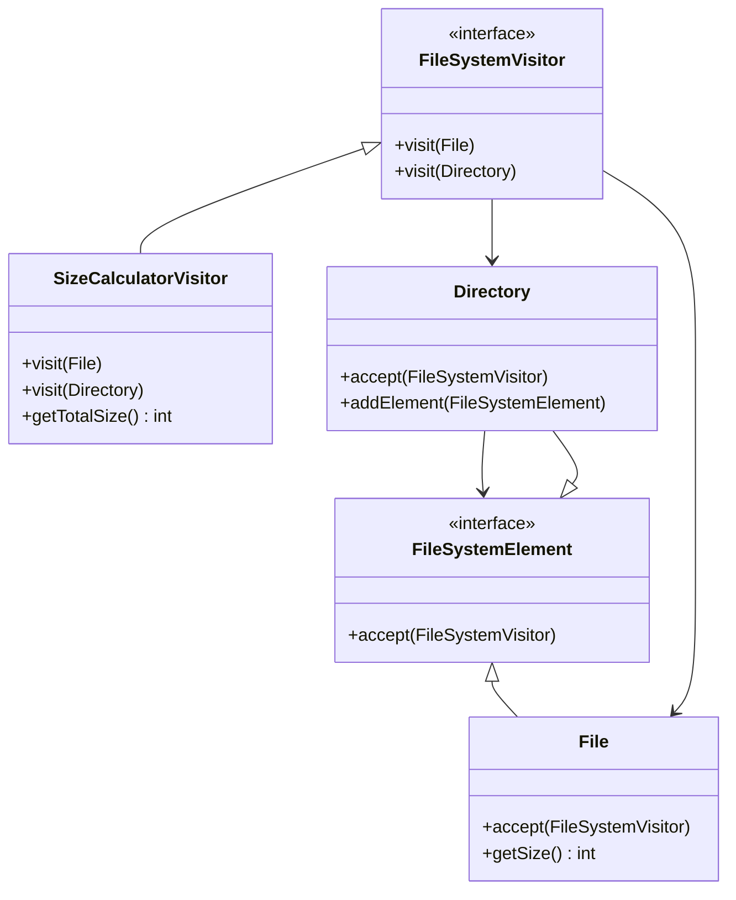

## 8.12.3 Extensibility with Visitors

The Visitor pattern is a powerful tool in the arsenal of a Java developer, particularly when it comes to enhancing the extensibility of software systems. By allowing new operations to be added without modifying the existing object structure, the Visitor pattern provides a flexible and scalable approach to software design. This section delves into how the Visitor pattern achieves this extensibility, the trade-offs involved, and the scenarios where it is most effective.

### Understanding the Visitor Pattern

The Visitor pattern is a behavioral design pattern that separates an algorithm from the object structure it operates on. This separation allows new operations to be added without altering the classes of the elements on which it operates. The pattern is particularly useful when the object structure is stable, but the operations performed on it are subject to change.

#### Key Concepts

- **Visitor**: An interface or abstract class that declares a visit operation for each type of element in the object structure.
- **Concrete Visitor**: Implements the operations defined in the Visitor interface for each element type.
- **Element**: An interface or abstract class that declares an accept method, which takes a visitor as an argument.
- **Concrete Element**: Implements the accept method, typically calling back the visitor's visit method.

### Extensibility with the Visitor Pattern

The primary advantage of the Visitor pattern is its ability to add new operations without modifying the existing element classes. This is achieved by introducing new visitor classes that implement the operations for each element type.

#### Adding New Operations

To add a new operation using the Visitor pattern, follow these steps:

1. **Define a New Visitor Interface**: Create a new visitor interface or class that extends the existing visitor interface, if necessary.
2. **Implement Concrete Visitors**: Implement the new operations in concrete visitor classes.
3. **Update Element Classes**: Ensure that all element classes have an accept method that takes the new visitor interface as an argument.

This approach allows developers to introduce new functionality without altering the existing element classes, thereby adhering to the Open/Closed Principle, which states that software entities should be open for extension but closed for modification.

#### Trade-offs and Considerations

While the Visitor pattern offers significant extensibility benefits, it also comes with trade-offs:

- **Difficulty in Adding New Element Types**: Adding new element types requires changes to all existing visitor classes, which can be cumbersome in large systems.
- **Complexity**: The pattern can introduce complexity, especially when dealing with a large number of element types and visitors.
- **Performance Overhead**: The pattern may introduce performance overhead due to the additional method calls involved in the visitor dispatch mechanism.

### Practical Applications

The Visitor pattern is most effective in scenarios where the object structure is stable, but the operations performed on it are subject to frequent changes. Some practical applications include:

- **Compilers**: In compilers, the abstract syntax tree (AST) is a stable structure, but the operations such as type checking, code generation, and optimization vary.
- **Document Processing**: In document processing systems, the document structure remains constant, but operations like rendering, printing, and exporting differ.
- **UI Component Frameworks**: In UI frameworks, the component hierarchy is stable, but operations like rendering, event handling, and layout management change frequently.

### Code Example

Consider a simple example of a file system where the structure of files and directories is stable, but operations like calculating size, printing details, and searching are subject to change.

```java
// Visitor interface
interface FileSystemVisitor {
    void visit(File file);
    void visit(Directory directory);
}

// Concrete Visitor for calculating size
class SizeCalculatorVisitor implements FileSystemVisitor {
    private int totalSize = 0;

    @Override
    public void visit(File file) {
        totalSize += file.getSize();
    }

    @Override
    public void visit(Directory directory) {
        // Calculate size for directory
    }

    public int getTotalSize() {
        return totalSize;
    }
}

// Element interface
interface FileSystemElement {
    void accept(FileSystemVisitor visitor);
}

// Concrete Element: File
class File implements FileSystemElement {
    private int size;

    public File(int size) {
        this.size = size;
    }

    public int getSize() {
        return size;
    }

    @Override
    public void accept(FileSystemVisitor visitor) {
        visitor.visit(this);
    }
}

// Concrete Element: Directory
class Directory implements FileSystemElement {
    private List<FileSystemElement> elements = new ArrayList<>();

    public void addElement(FileSystemElement element) {
        elements.add(element);
    }

    @Override
    public void accept(FileSystemVisitor visitor) {
        for (FileSystemElement element : elements) {
            element.accept(visitor);
        }
        visitor.visit(this);
    }
}

// Client code
public class VisitorPatternDemo {
    public static void main(String[] args) {
        File file1 = new File(100);
        File file2 = new File(200);
        Directory directory = new Directory();
        directory.addElement(file1);
        directory.addElement(file2);

        SizeCalculatorVisitor sizeCalculator = new SizeCalculatorVisitor();
        directory.accept(sizeCalculator);

        System.out.println("Total size: " + sizeCalculator.getTotalSize());
    }
}
```

### Explanation of the Code

- **Visitor Interface**: `FileSystemVisitor` defines visit methods for `File` and `Directory`.
- **Concrete Visitor**: `SizeCalculatorVisitor` calculates the total size of files and directories.
- **Element Interface**: `FileSystemElement` declares the `accept` method.
- **Concrete Elements**: `File` and `Directory` implement the `accept` method, allowing visitors to perform operations on them.

### Encouraging Experimentation

Developers are encouraged to experiment with the Visitor pattern by adding new operations, such as searching for a file or printing details, without modifying the existing element classes. This exercise will reinforce the understanding of how the Visitor pattern enhances extensibility.

### Alternative Implementations

In modern Java, the Visitor pattern can be implemented using Lambda expressions and functional interfaces to reduce boilerplate code. However, this approach may sacrifice some of the pattern's clarity and explicitness.

### Visualizing the Visitor Pattern

To better understand the structure and interactions of the Visitor pattern, consider the following class diagram:



**Diagram Explanation**: This class diagram illustrates the relationships between the `FileSystemVisitor`, `FileSystemElement`, and their concrete implementations. The `SizeCalculatorVisitor` is a concrete visitor that implements the operations for `File` and `Directory`.

### Scenarios for Effective Use

The Visitor pattern is most effective in the following scenarios:

- **Stable Object Structure**: When the object structure is unlikely to change, but operations on it are frequently updated.
- **Multiple Operations**: When multiple operations need to be performed on the object structure, and adding new operations should not require modifying existing classes.
- **Complex Hierarchies**: When dealing with complex object hierarchies where operations need to be applied uniformly across different types.

### Common Pitfalls and How to Avoid Them

- **Overuse**: Avoid using the Visitor pattern when the object structure is likely to change frequently, as this can lead to significant maintenance overhead.
- **Complexity**: Be mindful of the complexity introduced by the pattern, especially in large systems with many element types and visitors.
- **Performance**: Consider the performance implications of the pattern, particularly in performance-sensitive applications.

### Exercises and Practice Problems

1. **Exercise**: Implement a new visitor that searches for a specific file by name in the file system.
2. **Practice Problem**: Modify the existing code to include a visitor that prints the details of each file and directory.

### Key Takeaways

- The Visitor pattern enhances extensibility by allowing new operations to be added without modifying existing element classes.
- It is most effective in scenarios where the object structure is stable, but operations vary.
- Developers should be aware of the trade-offs, such as difficulty in adding new element types and potential complexity.

### Reflection

Consider how the Visitor pattern can be applied to your own projects. Are there scenarios where the object structure is stable, but operations change frequently? How can the Visitor pattern help manage these changes effectively?

## Test Your Knowledge: Extensibility with Visitor Pattern Quiz



### What is the primary advantage of the Visitor pattern in terms of extensibility?

- [x] It allows new operations to be added without modifying existing element classes.
- [ ] It simplifies the addition of new element types.
- [ ] It reduces the complexity of the object structure.
- [ ] It improves the performance of the system.

> **Explanation:** The Visitor pattern allows new operations to be added without modifying existing element classes, adhering to the Open/Closed Principle.

### Which of the following is a trade-off of using the Visitor pattern?

- [x] Difficulty in adding new element types.
- [ ] Increased performance.
- [ ] Simplified object structure.
- [ ] Reduced code complexity.

> **Explanation:** A trade-off of the Visitor pattern is the difficulty in adding new element types, as it requires changes to all existing visitor classes.

### In which scenario is the Visitor pattern most effective?

- [x] When the object structure is stable, but operations vary.
- [ ] When the object structure changes frequently.
- [ ] When there are few operations to perform.
- [ ] When performance is the primary concern.

> **Explanation:** The Visitor pattern is most effective when the object structure is stable, but operations vary, allowing for easy addition of new operations.

### What is the role of the accept method in the Visitor pattern?

- [x] It allows elements to accept a visitor and delegate operations to it.
- [ ] It defines the operations to be performed on the element.
- [ ] It modifies the element's state.
- [ ] It initializes the visitor.

> **Explanation:** The accept method allows elements to accept a visitor and delegate operations to it, enabling the Visitor pattern's extensibility.

### How can the Visitor pattern be implemented in modern Java?

- [x] Using Lambda expressions and functional interfaces.
- [ ] By modifying the element classes directly.
- [ ] By using reflection.
- [ ] By creating new element types.

> **Explanation:** In modern Java, the Visitor pattern can be implemented using Lambda expressions and functional interfaces to reduce boilerplate code.

### What is a potential performance concern with the Visitor pattern?

- [x] Additional method calls involved in the visitor dispatch mechanism.
- [ ] Increased memory usage.
- [ ] Slower compilation times.
- [ ] Reduced readability.

> **Explanation:** The Visitor pattern may introduce performance overhead due to the additional method calls involved in the visitor dispatch mechanism.

### Which of the following is NOT a component of the Visitor pattern?

- [ ] Visitor
- [ ] Concrete Visitor
- [x] Singleton
- [ ] Element

> **Explanation:** The Singleton is not a component of the Visitor pattern. The pattern consists of Visitor, Concrete Visitor, and Element.

### What is a common pitfall when using the Visitor pattern?

- [x] Overuse in scenarios where the object structure changes frequently.
- [ ] Underuse in performance-critical applications.
- [ ] Misuse in simple applications.
- [ ] Overuse in scenarios with few operations.

> **Explanation:** A common pitfall is overusing the Visitor pattern in scenarios where the object structure changes frequently, leading to maintenance overhead.

### How does the Visitor pattern adhere to the Open/Closed Principle?

- [x] By allowing new operations to be added without modifying existing classes.
- [ ] By simplifying the object structure.
- [ ] By reducing the number of classes.
- [ ] By improving performance.

> **Explanation:** The Visitor pattern adheres to the Open/Closed Principle by allowing new operations to be added without modifying existing classes.

### True or False: The Visitor pattern is ideal for scenarios where the object structure changes frequently.

- [ ] True
- [x] False

> **Explanation:** False. The Visitor pattern is not ideal for scenarios where the object structure changes frequently, as it can lead to significant maintenance overhead.


