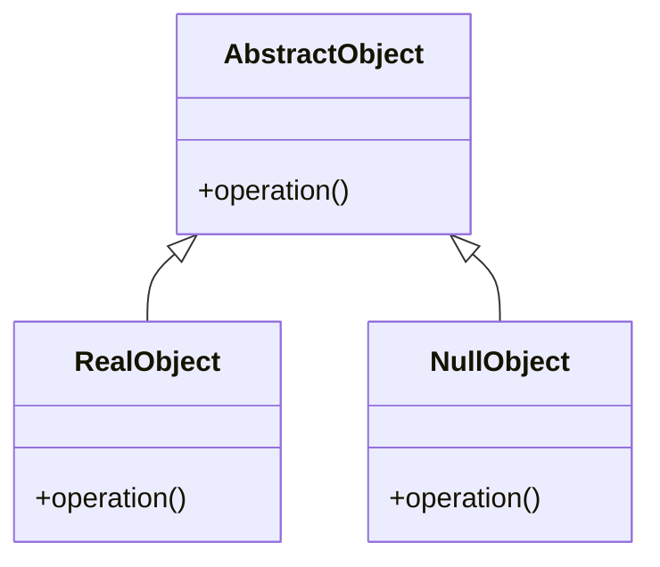

## 8.13.1 Implementing Null Object in Java

### Introduction

In the realm of software design, handling `null` references is a common challenge that can lead to errors and increased complexity. The **Null Object Pattern** offers a robust solution by providing a default object that represents "no object" and adheres to the expected interface. This pattern eliminates the need for null checks and prevents `NullPointerException`s, thereby enhancing code readability and reliability.

### Intent

The Null Object Pattern aims to encapsulate the absence of an object by providing a substitute that implements the same interface. This substitute, known as the "null object," provides default behavior, allowing the system to operate seamlessly without special handling for null cases.

### Advantages of the Null Object Pattern

- **Reduces Null Checks**: By using a null object, you eliminate the need for repetitive null checks throughout your code.
- **Prevents Errors**: Avoids `NullPointerException`s by ensuring that method calls on null objects are safe.
- **Simplifies Code**: Enhances code readability and maintainability by removing conditional logic related to null handling.
- **Provides Default Behavior**: Offers a consistent and predictable response when no real object is available.

### Historical Context

The Null Object Pattern has evolved as a response to the pervasive issue of null references in object-oriented programming. Tony Hoare, who introduced the concept of null references, famously referred to it as his "billion-dollar mistake." The Null Object Pattern emerged as a strategy to mitigate the risks associated with null references, providing a structured approach to handle the absence of an object.

### Applicability

Consider using the Null Object Pattern in scenarios where:

- You frequently encounter null references and want to avoid null checks.
- You need a default behavior when an object is not available.
- You aim to improve code readability and reduce complexity.

### Structure

The Null Object Pattern involves the following components:

- **Abstract Class or Interface**: Defines the contract for real and null objects.
- **Real Object**: Implements the interface with actual behavior.
- **Null Object**: Implements the interface with default or no-op behavior.



*Diagram: The structure of the Null Object Pattern, illustrating the relationship between the abstract class/interface, real object, and null object.*

### Participants

- **AbstractObject**: The interface or abstract class that defines the operations.
- **RealObject**: A concrete implementation of the AbstractObject that provides actual functionality.
- **NullObject**: A concrete implementation of the AbstractObject that provides default or no-op behavior.

### Collaborations

The RealObject and NullObject both implement the AbstractObject interface. The client code interacts with objects through this interface, allowing it to treat real and null objects uniformly.

### Consequences

- **Benefits**: Simplifies client code by eliminating null checks, reduces the risk of `NullPointerException`s, and provides a consistent interface for handling absent objects.
- **Drawbacks**: May introduce additional classes, potentially increasing the number of objects in the system.

### Implementation

#### Step-by-Step Implementation

1. **Define the Interface**: Create an interface that declares the operations to be performed.

    ```java
    public interface Animal {
        void makeSound();
    }
    ```

2. **Implement the Real Object**: Create a class that implements the interface with actual behavior.

    ```java
    public class Dog implements Animal {
        @Override
        public void makeSound() {
            System.out.println("Woof!");
        }
    }
    ```

3. **Implement the Null Object**: Create a class that implements the interface with default or no-op behavior.

    ```java
    public class NullAnimal implements Animal {
        @Override
        public void makeSound() {
            // Do nothing
        }
    }
    ```

4. **Use the Null Object**: In client code, use the null object instead of null references.

    ```java
    public class AnimalFactory {
        public static Animal getAnimal(String type) {
            if ("Dog".equalsIgnoreCase(type)) {
                return new Dog();
            }
            return new NullAnimal();
        }
    }

    public class Main {
        public static void main(String[] args) {
            Animal dog = AnimalFactory.getAnimal("Dog");
            Animal unknown = AnimalFactory.getAnimal("Cat");

            dog.makeSound(); // Outputs: Woof!
            unknown.makeSound(); // No output, no exception
        }
    }
    ```

#### Explanation

In this example, the `Animal` interface defines a method `makeSound()`. The `Dog` class provides a concrete implementation, while the `NullAnimal` class provides a no-op implementation. The `AnimalFactory` returns a `NullAnimal` when an unknown type is requested, ensuring that the client code can safely call `makeSound()` without checking for null.

### Sample Use Cases

- **Logging Systems**: Use a null logger that implements the logging interface but performs no operations, allowing the system to run without a configured logger.
- **UI Components**: In GUI applications, use null objects for optional components, preventing null checks and enabling default rendering behavior.
- **Data Access Layers**: Return a null object from data access methods when no data is found, avoiding null checks in business logic.

### Related Patterns

- **[6.6 Singleton Pattern]( "Singleton Pattern")**: The Null Object Pattern can be combined with the Singleton Pattern to ensure that only one instance of the null object exists.
- **[8.1 Strategy Pattern]( "Strategy Pattern")**: Both patterns define a family of algorithms or behaviors, but the Null Object Pattern specifically addresses the absence of an object.

### Known Uses

- **Java Collections Framework**: The `Collections.emptyList()`, `Collections.emptySet()`, and `Collections.emptyMap()` methods return immutable empty collections, which can be seen as null objects.
- **Apache Commons Logging**: Provides a `NoOpLog` implementation that acts as a null object for logging.

### Expert Tips and Best Practices

- **Use with Care**: While the Null Object Pattern simplifies code, it should be used judiciously to avoid unnecessary complexity from additional classes.
- **Combine with Factory Pattern**: Use a factory to encapsulate the creation of real and null objects, promoting encapsulation and separation of concerns.
- **Consider Performance**: In performance-critical applications, evaluate the overhead of additional method calls introduced by null objects.

### Common Pitfalls

- **Overuse**: Creating null objects for every possible null reference can lead to an explosion of classes and increased maintenance overhead.
- **Misleading Behavior**: Ensure that the behavior of null objects is well-documented to prevent confusion among developers who may expect different behavior.

### Exercises

1. **Modify the Code**: Extend the example by adding more animal types and corresponding null objects. Experiment with different behaviors for null objects.
2. **Implement a Null Logger**: Create a logging interface and implement a null logger that performs no operations. Integrate it into a simple application.
3. **Explore Java Libraries**: Investigate how the Null Object Pattern is used in popular Java libraries or frameworks. Identify the benefits and trade-offs in each case.

### Summary

The Null Object Pattern is a powerful tool for managing null references in Java applications. By providing a default object that adheres to the expected interface, this pattern eliminates the need for null checks, prevents `NullPointerException`s, and simplifies code. When implemented thoughtfully, the Null Object Pattern enhances code readability, reliability, and maintainability.

---

## Test Your Knowledge: Null Object Pattern in Java Quiz



### What is the primary benefit of using the Null Object Pattern?

- [x] It eliminates the need for null checks.
- [ ] It increases the number of classes.
- [ ] It provides complex behavior.
- [ ] It reduces memory usage.

> **Explanation:** The Null Object Pattern eliminates the need for null checks by providing a default object that adheres to the expected interface.

### Which of the following is a consequence of the Null Object Pattern?

- [x] Simplifies client code by removing null checks.
- [ ] Increases the risk of NullPointerExceptions.
- [ ] Complicates the code with additional conditional logic.
- [ ] Reduces the number of classes in the system.

> **Explanation:** The Null Object Pattern simplifies client code by removing null checks and providing a consistent interface for handling absent objects.

### In the Null Object Pattern, what role does the NullObject class play?

- [x] It provides default or no-op behavior.
- [ ] It implements complex algorithms.
- [ ] It throws exceptions for null references.
- [ ] It acts as a singleton.

> **Explanation:** The NullObject class provides default or no-op behavior, ensuring that method calls on null objects are safe.

### How does the Null Object Pattern prevent NullPointerExceptions?

- [x] By providing a default object that implements the expected interface.
- [ ] By using extensive null checks in the code.
- [ ] By throwing exceptions when null references are encountered.
- [ ] By using reflection to handle null references.

> **Explanation:** The Null Object Pattern prevents NullPointerExceptions by providing a default object that implements the expected interface, allowing method calls to be made safely.

### Which design pattern is often combined with the Null Object Pattern to ensure a single instance of the null object?

- [x] Singleton Pattern
- [ ] Factory Pattern
- [ ] Strategy Pattern
- [ ] Observer Pattern

> **Explanation:** The Singleton Pattern is often combined with the Null Object Pattern to ensure that only one instance of the null object exists.

### What is a potential drawback of the Null Object Pattern?

- [x] It may introduce additional classes, increasing system complexity.
- [ ] It increases the risk of NullPointerExceptions.
- [ ] It complicates the code with additional conditional logic.
- [ ] It reduces the number of classes in the system.

> **Explanation:** A potential drawback of the Null Object Pattern is that it may introduce additional classes, increasing system complexity.

### In which scenario is the Null Object Pattern most applicable?

- [x] When you frequently encounter null references and want to avoid null checks.
- [ ] When you need to implement complex algorithms.
- [ ] When you want to reduce the number of classes in the system.
- [ ] When you need to handle exceptions extensively.

> **Explanation:** The Null Object Pattern is most applicable when you frequently encounter null references and want to avoid null checks.

### What is the role of the AbstractObject in the Null Object Pattern?

- [x] It defines the contract for real and null objects.
- [ ] It implements complex algorithms.
- [ ] It throws exceptions for null references.
- [ ] It acts as a singleton.

> **Explanation:** The AbstractObject defines the contract for real and null objects, ensuring that both types of objects adhere to the same interface.

### How does the Null Object Pattern enhance code readability?

- [x] By eliminating null checks and providing a consistent interface.
- [ ] By increasing the number of classes.
- [ ] By providing complex behavior.
- [ ] By reducing memory usage.

> **Explanation:** The Null Object Pattern enhances code readability by eliminating null checks and providing a consistent interface for handling absent objects.

### True or False: The Null Object Pattern can be used to provide default behavior when an object is not available.

- [x] True
- [ ] False

> **Explanation:** True. The Null Object Pattern provides default behavior when an object is not available, allowing the system to operate seamlessly without special handling for null cases.



---
