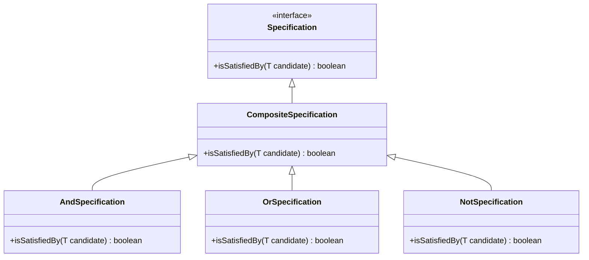

## 8.14.2 Composing Specifications

In the realm of software design, the Specification Pattern is a powerful tool for defining and managing complex business rules. This section delves into the art of composing specifications, enabling developers to create intricate and flexible rule sets using logical operators, the Composite pattern, and modern Java features like lambda expressions and functional interfaces. By mastering these techniques, developers can enhance code expressiveness and maintainability, ultimately leading to more robust and adaptable applications.

### Understanding the Specification Pattern

The Specification Pattern allows developers to encapsulate business rules in a reusable and combinable manner. Specifications are essentially predicates that determine whether an object satisfies certain criteria. This pattern is particularly useful in scenarios where business rules are complex and subject to frequent changes.

### Composing Specifications with Logical Operators

One of the key strengths of the Specification Pattern is its ability to compose simple specifications into more complex ones using logical operators such as AND, OR, and NOT. This composability is akin to building complex logical expressions in mathematics or programming.

#### Logical AND

The AND operator combines two specifications, resulting in a new specification that is satisfied only if both original specifications are satisfied.

```java
public class AndSpecification<T> implements Specification<T> {
    private Specification<T> spec1;
    private Specification<T> spec2;

    public AndSpecification(Specification<T> spec1, Specification<T> spec2) {
        this.spec1 = spec1;
        this.spec2 = spec2;
    }

    @Override
    public boolean isSatisfiedBy(T candidate) {
        return spec1.isSatisfiedBy(candidate) && spec2.isSatisfiedBy(candidate);
    }
}
```

#### Logical OR

The OR operator creates a specification that is satisfied if at least one of the original specifications is satisfied.

```java
public class OrSpecification<T> implements Specification<T> {
    private Specification<T> spec1;
    private Specification<T> spec2;

    public OrSpecification(Specification<T> spec1, Specification<T> spec2) {
        this.spec1 = spec1;
        this.spec2 = spec2;
    }

    @Override
    public boolean isSatisfiedBy(T candidate) {
        return spec1.isSatisfiedBy(candidate) || spec2.isSatisfiedBy(candidate);
    }
}
```

#### Logical NOT

The NOT operator inverts a specification, resulting in a specification that is satisfied if the original specification is not satisfied.

```java
public class NotSpecification<T> implements Specification<T> {
    private Specification<T> spec;

    public NotSpecification(Specification<T> spec) {
        this.spec = spec;
    }

    @Override
    public boolean isSatisfiedBy(T candidate) {
        return !spec.isSatisfiedBy(candidate);
    }
}
```

### Implementing the Composite Pattern

The Composite Pattern is a structural pattern that allows individual objects and compositions of objects to be treated uniformly. In the context of the Specification Pattern, it enables the creation of complex specifications by composing simpler ones.

#### Structure of the Composite Pattern



*Diagram Caption*: This diagram illustrates the structure of the Composite Pattern as applied to the Specification Pattern, showing how different specifications can be composed.

### Benefits of Composing Specifications

1. **Expressiveness**: Composing specifications using logical operators allows for the creation of expressive and readable business rules that closely resemble natural language.

2. **Maintainability**: By encapsulating business rules in specifications, changes to the rules can be made in isolation without affecting other parts of the codebase.

3. **Reusability**: Specifications can be reused across different parts of an application, reducing redundancy and promoting consistency.

### Leveraging Java's Functional Interfaces and Lambda Expressions

Java's functional programming features, such as lambda expressions and functional interfaces, can simplify the composition of specifications. By using these features, developers can create specifications in a more concise and declarative manner.

#### Using Functional Interfaces

Java's `Predicate` interface is a functional interface that can be used to define specifications. This approach leverages lambda expressions to create specifications on-the-fly.

```java
Predicate<String> isNotEmpty = s -> s != null && !s.isEmpty();
Predicate<String> isLongerThan5 = s -> s.length() > 5;

Predicate<String> complexSpecification = isNotEmpty.and(isLongerThan5);

boolean result = complexSpecification.test("HelloWorld");
```

#### Simplifying Composition with Lambdas

Lambda expressions can be used to create specifications without the need for explicit classes, making the code more concise and easier to read.

```java
Specification<String> isNotEmptySpec = candidate -> candidate != null && !candidate.isEmpty();
Specification<String> isLongerThan5Spec = candidate -> candidate.length() > 5;

Specification<String> complexSpec = new AndSpecification<>(isNotEmptySpec, isLongerThan5Spec);

boolean result = complexSpec.isSatisfiedBy("HelloWorld");
```

### Practical Applications and Real-World Scenarios

Composing specifications is particularly useful in domains such as e-commerce, where complex business rules govern product eligibility, discount applicability, and customer segmentation. By using the Specification Pattern, developers can encapsulate these rules in a flexible and maintainable manner.

#### Example: E-commerce Discount Rules

Consider an e-commerce platform where discounts are applied based on various criteria such as customer membership level, purchase history, and cart value. By composing specifications, these rules can be managed effectively.

```java
public class Customer {
    private boolean isPremiumMember;
    private double totalPurchases;

    // Getters and setters
}

Specification<Customer> isPremiumMember = customer -> customer.isPremiumMember();
Specification<Customer> hasSpentOver1000 = customer -> customer.getTotalPurchases() > 1000;

Specification<Customer> eligibleForDiscount = new AndSpecification<>(isPremiumMember, hasSpentOver1000);

Customer customer = new Customer();
customer.setPremiumMember(true);
customer.setTotalPurchases(1500);

boolean discountApplicable = eligibleForDiscount.isSatisfiedBy(customer);
```

### Best Practices and Expert Tips

- **Encapsulate Business Logic**: Use specifications to encapsulate business logic, making it easier to test and modify independently of other code.
- **Use Descriptive Names**: Name specifications descriptively to convey their purpose and improve code readability.
- **Leverage Functional Programming**: Utilize Java's functional programming features to simplify specification creation and composition.
- **Avoid Over-Complexity**: While composing specifications is powerful, avoid creating overly complex compositions that are difficult to understand and maintain.

### Common Pitfalls and How to Avoid Them

- **Overusing Specifications**: Not every business rule needs to be a specification. Use specifications judiciously to avoid unnecessary complexity.
- **Ignoring Performance**: Composing many specifications can lead to performance issues. Optimize specifications and consider caching results where appropriate.
- **Neglecting Testing**: Ensure that specifications are thoroughly tested, especially when they are composed into complex rules.

### Exercises and Practice Problems

1. **Exercise 1**: Create a specification for a product that is both in stock and has a rating above 4.0. Use logical operators to compose these specifications.

2. **Exercise 2**: Implement a specification for a customer who is eligible for a loyalty program based on their purchase history and membership duration.

3. **Exercise 3**: Refactor an existing set of business rules in your project to use the Specification Pattern. Evaluate the impact on code readability and maintainability.

### Summary and Key Takeaways

- The Specification Pattern is a powerful tool for managing complex business rules.
- Composing specifications using logical operators enhances code expressiveness and maintainability.
- The Composite Pattern facilitates the creation of complex specifications from simpler ones.
- Java's functional programming features can simplify specification creation and composition.
- Practical applications include e-commerce platforms, customer segmentation, and eligibility rules.

### Encouragement for Further Exploration

Consider how the Specification Pattern can be applied to other areas of your projects, such as validation, filtering, and authorization. Experiment with different compositions and explore the impact on your codebase's flexibility and maintainability.

---

## Test Your Knowledge: Composing Specifications in Java



### Which logical operator is used to create a specification that is satisfied only if both original specifications are satisfied?

- [x] AND
- [ ] OR
- [ ] NOT
- [ ] XOR

> **Explanation:** The AND operator combines two specifications, resulting in a new specification that is satisfied only if both original specifications are satisfied.

### What is the primary benefit of using the Composite Pattern with specifications?

- [x] It allows for the creation of complex specifications from simpler ones.
- [ ] It improves the performance of specifications.
- [ ] It reduces the number of specifications needed.
- [ ] It simplifies the implementation of specifications.

> **Explanation:** The Composite Pattern facilitates the creation of complex specifications by composing simpler ones, allowing for more flexible and maintainable business rules.

### How can Java's functional interfaces simplify the creation of specifications?

- [x] By allowing the use of lambda expressions to define specifications.
- [ ] By providing built-in specifications for common use cases.
- [ ] By eliminating the need for logical operators.
- [ ] By automatically optimizing specification performance.

> **Explanation:** Java's functional interfaces, such as `Predicate`, allow developers to use lambda expressions to define specifications concisely and declaratively.

### What is a common pitfall when composing specifications?

- [x] Overusing specifications and creating unnecessary complexity.
- [ ] Failing to use logical operators.
- [ ] Ignoring the Composite Pattern.
- [ ] Using too many lambda expressions.

> **Explanation:** Overusing specifications can lead to unnecessary complexity, making the code harder to understand and maintain.

### Which of the following is a best practice when using the Specification Pattern?

- [x] Encapsulate business logic in specifications for easier testing and modification.
- [ ] Use specifications for every business rule, regardless of complexity.
- [ ] Avoid using functional programming features with specifications.
- [ ] Name specifications based on their implementation details.

> **Explanation:** Encapsulating business logic in specifications allows for easier testing and modification, improving code maintainability.

### What is the role of the NOT operator in composing specifications?

- [x] It inverts a specification, resulting in a specification that is satisfied if the original specification is not satisfied.
- [ ] It combines two specifications into one.
- [ ] It checks if at least one of the specifications is satisfied.
- [ ] It optimizes the performance of specifications.

> **Explanation:** The NOT operator inverts a specification, creating a new specification that is satisfied if the original specification is not satisfied.

### How can specifications improve code maintainability?

- [x] By encapsulating business rules, allowing changes to be made in isolation.
- [ ] By reducing the number of classes in the codebase.
- [ ] By eliminating the need for unit tests.
- [ ] By automatically generating documentation.

> **Explanation:** Specifications encapsulate business rules, allowing changes to be made in isolation without affecting other parts of the codebase, thus improving maintainability.

### What is a practical application of the Specification Pattern in e-commerce?

- [x] Managing discount eligibility rules based on customer criteria.
- [ ] Automatically generating product descriptions.
- [ ] Optimizing database queries.
- [ ] Creating user interfaces.

> **Explanation:** The Specification Pattern is useful for managing complex discount eligibility rules based on various customer criteria in e-commerce platforms.

### Which Java feature allows for the creation of specifications without explicit classes?

- [x] Lambda expressions
- [ ] Annotations
- [ ] Reflection
- [ ] Generics

> **Explanation:** Lambda expressions allow for the creation of specifications without the need for explicit classes, making the code more concise.

### True or False: The Specification Pattern is only applicable to e-commerce applications.

- [x] False
- [ ] True

> **Explanation:** The Specification Pattern is applicable to a wide range of domains beyond e-commerce, including validation, filtering, and authorization.



---

By understanding and applying the techniques discussed in this section, developers can harness the full potential of the Specification Pattern to create flexible, maintainable, and expressive business rules in their Java applications.
