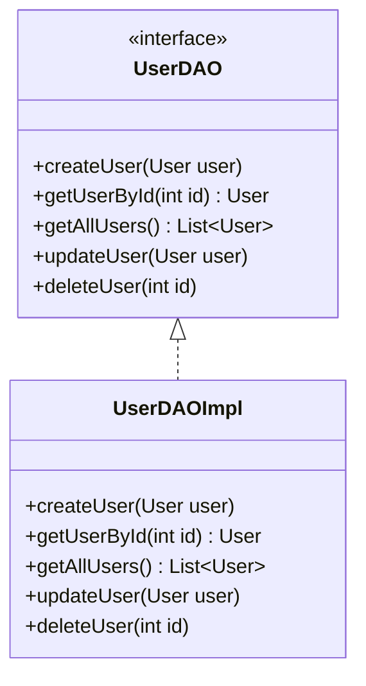

## 8.2.1 Implementing DAO in Java

The Data Access Object (DAO) pattern is a structural pattern that provides an abstract interface to some type of database or other persistence mechanism. By mapping application calls to the persistence layer, the DAO pattern provides some specific data operations without exposing details of the database. This pattern allows any data source to be changed without affecting the rest of the application.

### Understanding DAO Pattern

The DAO pattern separates the persistence logic from the business logic, providing a clear separation of concerns. This separation makes the code more maintainable and testable. The DAO pattern is particularly useful in Java applications where you need to access a database or any other persistent storage.

### Defining DAO Interfaces

To implement the DAO pattern, we start by defining interfaces that declare methods for CRUD operations (Create, Read, Update, Delete) on entities. These interfaces provide a contract that concrete DAO classes must fulfill.

#### Example: Defining a DAO Interface

Let's consider a simple `User` entity. We'll define a `UserDAO` interface that declares methods for CRUD operations.

```java
public interface UserDAO {
    void createUser(User user);
    User getUserById(int id);
    List<User> getAllUsers();
    void updateUser(User user);
    void deleteUser(int id);
}
```

In this interface, we define methods for creating, retrieving, updating, and deleting `User` objects. The use of interfaces allows us to define a contract that any concrete implementation must follow.

### Creating Concrete DAO Classes

Concrete DAO classes implement the DAO interfaces and contain the actual data access code. These classes interact with the database using JDBC or other data access technologies.

#### Example: Implementing a Concrete DAO Class

Let's implement a `UserDAOImpl` class that uses JDBC to interact with a database.

```java
import java.sql.*;
import java.util.ArrayList;
import java.util.List;

public class UserDAOImpl implements UserDAO {
    private static final String URL = "jdbc:mysql://localhost:3306/mydatabase";
    private static final String USER = "root";
    private static final String PASSWORD = "password";

    @Override
    public void createUser(User user) {
        String sql = "INSERT INTO users (name, email) VALUES (?, ?)";
        try (Connection connection = DriverManager.getConnection(URL, USER, PASSWORD);
             PreparedStatement statement = connection.prepareStatement(sql)) {
            statement.setString(1, user.getName());
            statement.setString(2, user.getEmail());
            statement.executeUpdate();
        } catch (SQLException e) {
            e.printStackTrace();
        }
    }

    @Override
    public User getUserById(int id) {
        String sql = "SELECT * FROM users WHERE id = ?";
        try (Connection connection = DriverManager.getConnection(URL, USER, PASSWORD);
             PreparedStatement statement = connection.prepareStatement(sql)) {
            statement.setInt(1, id);
            ResultSet resultSet = statement.executeQuery();
            if (resultSet.next()) {
                return new User(resultSet.getInt("id"), resultSet.getString("name"), resultSet.getString("email"));
            }
        } catch (SQLException e) {
            e.printStackTrace();
        }
        return null;
    }

    @Override
    public List<User> getAllUsers() {
        List<User> users = new ArrayList<>();
        String sql = "SELECT * FROM users";
        try (Connection connection = DriverManager.getConnection(URL, USER, PASSWORD);
             Statement statement = connection.createStatement();
             ResultSet resultSet = statement.executeQuery(sql)) {
            while (resultSet.next()) {
                users.add(new User(resultSet.getInt("id"), resultSet.getString("name"), resultSet.getString("email")));
            }
        } catch (SQLException e) {
            e.printStackTrace();
        }
        return users;
    }

    @Override
    public void updateUser(User user) {
        String sql = "UPDATE users SET name = ?, email = ? WHERE id = ?";
        try (Connection connection = DriverManager.getConnection(URL, USER, PASSWORD);
             PreparedStatement statement = connection.prepareStatement(sql)) {
            statement.setString(1, user.getName());
            statement.setString(2, user.getEmail());
            statement.setInt(3, user.getId());
            statement.executeUpdate();
        } catch (SQLException e) {
            e.printStackTrace();
        }
    }

    @Override
    public void deleteUser(int id) {
        String sql = "DELETE FROM users WHERE id = ?";
        try (Connection connection = DriverManager.getConnection(URL, USER, PASSWORD);
             PreparedStatement statement = connection.prepareStatement(sql)) {
            statement.setInt(1, id);
            statement.executeUpdate();
        } catch (SQLException e) {
            e.printStackTrace();
        }
    }
}
```

In this implementation, we use JDBC to connect to a MySQL database and perform CRUD operations on the `users` table. The use of `try-with-resources` ensures that database resources are properly closed, preventing resource leaks.

### Using Java Features for Flexible DAOs

Java's features, such as interfaces and generics, can be leveraged to create flexible and type-safe DAOs. By using generics, we can create a base DAO interface that can be reused for different entities.

#### Example: Generic DAO Interface

```java
public interface GenericDAO<T> {
    void create(T entity);
    T getById(int id);
    List<T> getAll();
    void update(T entity);
    void delete(int id);
}
```

This generic interface can be implemented for any entity type, providing a consistent API for data access operations.

### Managing Database Connections and Resources

Proper management of database connections, statements, and result sets is crucial for the performance and reliability of an application. The `try-with-resources` statement introduced in Java 7 simplifies resource management by automatically closing resources.

#### Best Practices for Resource Management

- **Use `try-with-resources`**: This ensures that all resources are closed automatically, even if an exception occurs.
- **Close Connections**: Always close database connections to avoid exhausting the connection pool.
- **Handle Exceptions Gracefully**: Use appropriate exception handling to log errors and provide meaningful feedback to the user.

### Structuring DAOs for Reuse and Consistency

To promote reuse and consistency across the data access layer, DAOs should be structured in a way that allows for easy maintenance and extension.

#### Best Practices for DAO Design

- **Adhere to SOLID Principles**: Ensure that each DAO class has a single responsibility and that interfaces are well-defined.
- **Use Design Patterns**: Consider using patterns like Factory or Singleton to manage DAO instances.
- **Encapsulate Database Logic**: Keep database-specific logic within the DAO to prevent it from leaking into the business logic.

### Try It Yourself

To deepen your understanding of the DAO pattern, try modifying the `UserDAOImpl` class to support additional operations, such as finding users by email or implementing pagination for the `getAllUsers` method. Experiment with different database technologies, such as Hibernate or JPA, to see how they can simplify data access logic.

### Visualizing the DAO Pattern

Below is a class diagram illustrating the relationship between the `UserDAO` interface and the `UserDAOImpl` class.



This diagram shows how the `UserDAOImpl` class implements the `UserDAO` interface, providing concrete implementations for the CRUD operations.

### Knowledge Check

Before we conclude, let's reinforce what we've learned:

- **What is the primary purpose of the DAO pattern?**
  - To separate persistence logic from business logic.
- **How do interfaces contribute to the DAO pattern?**
  - They define a contract for data access operations, promoting consistency and flexibility.
- **Why is resource management important in DAO implementation?**
  - To prevent resource leaks and ensure efficient use of database connections.

### Summary

Implementing the DAO pattern in Java involves defining interfaces for CRUD operations, creating concrete classes that implement these interfaces, and managing database resources effectively. By adhering to best practices and leveraging Java's features, we can create a robust data access layer that is both flexible and maintainable.

Remember, this is just the beginning. As you progress, you'll build more complex data access layers and integrate them with other parts of your application. Keep experimenting, stay curious, and enjoy the journey!

## Quiz Time!



### What is the primary purpose of the DAO pattern?

- [x] To separate persistence logic from business logic
- [ ] To enhance the performance of database operations
- [ ] To simplify the user interface
- [ ] To manage network connections

> **Explanation:** The DAO pattern is used to separate the persistence logic from the business logic, making the code more maintainable and testable.

### Which Java feature is particularly useful for creating flexible and type-safe DAOs?

- [x] Generics
- [ ] Annotations
- [ ] Reflection
- [ ] Serialization

> **Explanation:** Generics allow us to create type-safe DAOs that can be reused for different entity types.

### What is the role of the `UserDAO` interface in the DAO pattern?

- [x] It defines a contract for data access operations
- [ ] It provides a concrete implementation for CRUD operations
- [ ] It manages database connections
- [ ] It handles user authentication

> **Explanation:** The `UserDAO` interface defines a contract that any concrete implementation must follow, ensuring consistency in data access operations.

### How does the `try-with-resources` statement help in DAO implementation?

- [x] It automatically closes resources, preventing leaks
- [ ] It enhances the performance of database operations
- [ ] It simplifies the user interface
- [ ] It manages network connections

> **Explanation:** The `try-with-resources` statement ensures that resources are closed automatically, even if an exception occurs, preventing resource leaks.

### What is a best practice for exception handling in DAO implementation?

- [x] Use appropriate exception handling to log errors and provide feedback
- [ ] Ignore exceptions to simplify the code
- [ ] Use global exception handlers for all exceptions
- [ ] Rely on the database to handle exceptions

> **Explanation:** Proper exception handling involves logging errors and providing meaningful feedback to users, which is crucial for maintaining application reliability.

### How can the DAO pattern promote reuse and consistency across the data access layer?

- [x] By adhering to SOLID principles and using design patterns
- [ ] By hardcoding database logic into the business layer
- [ ] By using global variables for database connections
- [ ] By avoiding the use of interfaces

> **Explanation:** Adhering to SOLID principles and using design patterns helps in creating a consistent and reusable data access layer.

### What is a potential modification you can try with the `UserDAOImpl` class?

- [x] Implementing pagination for the `getAllUsers` method
- [ ] Removing all exception handling
- [ ] Hardcoding SQL queries into the business layer
- [ ] Ignoring database connection management

> **Explanation:** Implementing pagination for the `getAllUsers` method can enhance the performance and usability of the DAO.

### What does the class diagram illustrate in the context of the DAO pattern?

- [x] The relationship between the `UserDAO` interface and the `UserDAOImpl` class
- [ ] The network architecture of the application
- [ ] The user interface design
- [ ] The database schema

> **Explanation:** The class diagram illustrates how the `UserDAOImpl` class implements the `UserDAO` interface, providing concrete implementations for CRUD operations.

### Why is it important to close database connections in DAO implementation?

- [x] To avoid exhausting the connection pool
- [ ] To enhance the performance of database operations
- [ ] To simplify the user interface
- [ ] To manage network connections

> **Explanation:** Closing database connections is crucial to avoid exhausting the connection pool, which can lead to performance issues and application downtime.

### True or False: The DAO pattern is only applicable to relational databases.

- [ ] True
- [x] False

> **Explanation:** The DAO pattern can be applied to any type of data source, not just relational databases. It provides an abstract interface for data access operations.


