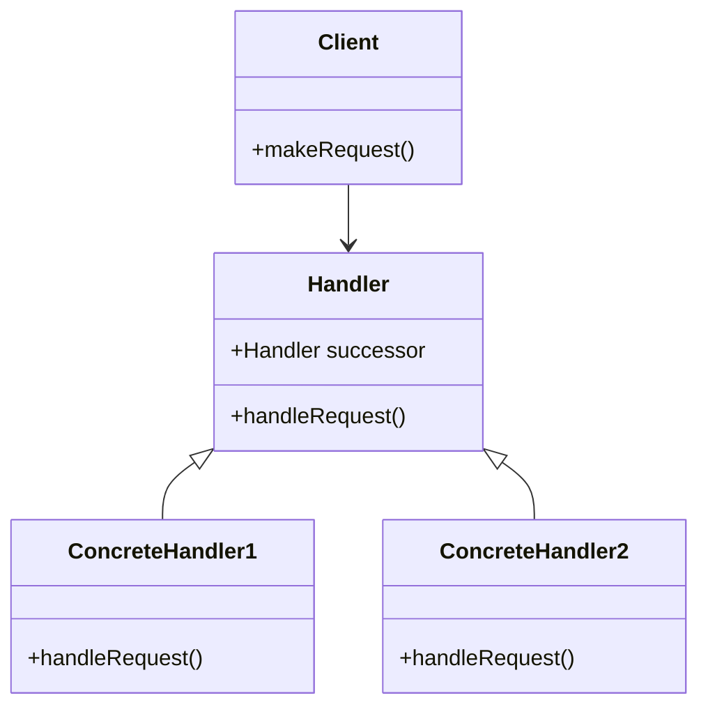

## 8.2.1 Implementing Chain of Responsibility in Java

The Chain of Responsibility pattern is a behavioral design pattern that allows an object to send a command without knowing which object will handle the request. This pattern decouples the sender and receiver by giving multiple objects a chance to handle the request. The request is passed along a chain of handlers until one of them handles it.

### Intent and Motivation

The **intent** of the Chain of Responsibility pattern is to avoid coupling the sender of a request to its receiver by allowing more than one object to handle the request. The pattern chains the receiving objects and passes the request along the chain until an object handles it.

**Motivation**: In many applications, a request may need to be processed by more than one handler. For example, in a logging framework, a log message might need to be processed by multiple loggers, each with a different responsibility (e.g., writing to a file, sending to a remote server, etc.). The Chain of Responsibility pattern provides a flexible way to handle such scenarios by allowing the request to be passed along a chain of handlers.

### Participants

1. **Handler**: Defines an interface for handling requests. It may implement a default behavior for the link in the chain.
2. **ConcreteHandler**: Handles requests it is responsible for. It can access its successor and pass the request along the chain.
3. **Client**: Initiates the request to a handler in the chain.

### Structure

The Chain of Responsibility pattern can be visualized using the following UML diagram:



**Diagram Explanation**: The `Handler` class defines an interface for handling requests and holds a reference to the next handler in the chain. `ConcreteHandler1` and `ConcreteHandler2` are implementations of the `Handler` interface, each responsible for handling specific types of requests. The `Client` initiates the request, which is passed along the chain of handlers.

### Java Code Example

Let's implement the Chain of Responsibility pattern in Java with a practical example. Suppose we are building a logging framework where log messages can be processed by multiple loggers.

#### Step 1: Define the Handler Interface

```java
abstract class Logger {
    public static int INFO = 1;
    public static int DEBUG = 2;
    public static int ERROR = 3;
    
    protected int level;
    protected Logger nextLogger;
    
    public void setNextLogger(Logger nextLogger) {
        this.nextLogger = nextLogger;
    }
    
    public void logMessage(int level, String message) {
        if (this.level <= level) {
            write(message);
        }
        if (nextLogger != null) {
            nextLogger.logMessage(level, message);
        }
    }
    
    abstract protected void write(String message);
}
```

**Explanation**: The `Logger` class is an abstract class that defines the interface for handling log messages. It has a `level` to determine whether it can handle a particular message and a `nextLogger` to pass the message along the chain.

#### Step 2: Implement Concrete Handlers

```java
class ConsoleLogger extends Logger {
    public ConsoleLogger(int level) {
        this.level = level;
    }
    
    @Override
    protected void write(String message) {
        System.out.println("Console::Logger: " + message);
    }
}

class ErrorLogger extends Logger {
    public ErrorLogger(int level) {
        this.level = level;
    }
    
    @Override
    protected void write(String message) {
        System.err.println("Error::Logger: " + message);
    }
}

class FileLogger extends Logger {
    public FileLogger(int level) {
        this.level = level;
    }
    
    @Override
    protected void write(String message) {
        System.out.println("File::Logger: " + message);
    }
}
```

**Explanation**: `ConsoleLogger`, `ErrorLogger`, and `FileLogger` are concrete implementations of the `Logger` class. Each logger handles messages of a specific level and writes them to different outputs.

#### Step 3: Configure the Chain

```java
public class ChainPatternDemo {
    private static Logger getChainOfLoggers() {
        Logger errorLogger = new ErrorLogger(Logger.ERROR);
        Logger fileLogger = new FileLogger(Logger.DEBUG);
        Logger consoleLogger = new ConsoleLogger(Logger.INFO);
        
        errorLogger.setNextLogger(fileLogger);
        fileLogger.setNextLogger(consoleLogger);
        
        return errorLogger;
    }
    
    public static void main(String[] args) {
        Logger loggerChain = getChainOfLoggers();
        
        loggerChain.logMessage(Logger.INFO, "This is an information.");
        loggerChain.logMessage(Logger.DEBUG, "This is a debug level information.");
        loggerChain.logMessage(Logger.ERROR, "This is an error information.");
    }
}
```

**Explanation**: The `ChainPatternDemo` class sets up the chain of loggers. The `getChainOfLoggers` method creates the chain, linking `ErrorLogger`, `FileLogger`, and `ConsoleLogger`. The `main` method demonstrates how a message is passed along the chain, with each logger deciding whether to process the message based on its level.

### Benefits of the Chain of Responsibility Pattern

- **Decoupling**: The pattern decouples the sender of a request from its receivers, allowing multiple objects to handle the request without the sender needing to know which object will handle it.
- **Flexibility**: New handlers can be added to the chain without modifying existing code, enhancing flexibility and maintainability.
- **Responsibility Sharing**: Multiple handlers can process the request, sharing the responsibility and potentially improving performance.

### Avoiding Coupling

The Chain of Responsibility pattern avoids coupling the sender of a request to its receiver by allowing multiple objects to handle the request. This is achieved by passing the request along a chain of handlers, each of which can decide whether to handle the request or pass it to the next handler.

### Real-World Scenarios

- **Logging Frameworks**: As demonstrated in the example, logging frameworks often use this pattern to allow log messages to be processed by multiple loggers.
- **Event Handling Systems**: In GUI applications, events can be passed along a chain of handlers, each of which can decide whether to handle the event.
- **Middleware Systems**: In web applications, middleware components can be chained together to process HTTP requests and responses.

### Related Patterns

- **[Decorator Pattern]( "Decorator Pattern")**: Both patterns involve chaining objects, but the Decorator pattern adds responsibilities to objects dynamically, while the Chain of Responsibility pattern passes requests along a chain.
- **[Command Pattern]( "Command Pattern")**: The Command pattern encapsulates a request as an object, allowing for parameterization and queuing, while the Chain of Responsibility pattern passes the request along a chain of handlers.

### Known Uses

- **Java Servlet Filters**: The Java Servlet API uses a similar pattern for chaining filters that process HTTP requests and responses.
- **Apache Commons Chain**: A library that provides a framework for implementing the Chain of Responsibility pattern in Java applications.

### Conclusion

The Chain of Responsibility pattern is a powerful tool for decoupling request senders and receivers, enhancing flexibility and maintainability in software design. By allowing multiple objects to handle a request, the pattern provides a flexible way to manage complex request-processing scenarios.

---

## Test Your Knowledge: Chain of Responsibility Pattern in Java Quiz



### What is the primary intent of the Chain of Responsibility pattern?

- [x] To decouple the sender of a request from its receiver by allowing multiple objects to handle the request.
- [ ] To encapsulate a request as an object, allowing for parameterization.
- [ ] To add responsibilities to objects dynamically.
- [ ] To provide a way to access the elements of an aggregate object sequentially.

> **Explanation:** The Chain of Responsibility pattern's primary intent is to decouple the sender of a request from its receiver by allowing multiple objects to handle the request.

### Which participant in the Chain of Responsibility pattern is responsible for initiating the request?

- [ ] Handler
- [ ] ConcreteHandler
- [x] Client
- [ ] Successor

> **Explanation:** The Client is responsible for initiating the request in the Chain of Responsibility pattern.

### In the provided Java example, which class is responsible for writing log messages to the console?

- [x] ConsoleLogger
- [ ] ErrorLogger
- [ ] FileLogger
- [ ] Logger

> **Explanation:** The ConsoleLogger class is responsible for writing log messages to the console in the provided Java example.

### How does the Chain of Responsibility pattern enhance flexibility in software design?

- [x] By allowing new handlers to be added to the chain without modifying existing code.
- [ ] By encapsulating requests as objects.
- [ ] By providing a way to access elements of an aggregate object sequentially.
- [ ] By adding responsibilities to objects dynamically.

> **Explanation:** The Chain of Responsibility pattern enhances flexibility by allowing new handlers to be added to the chain without modifying existing code.

### Which of the following is a real-world scenario where the Chain of Responsibility pattern is commonly used?

- [x] Logging frameworks
- [ ] Database connections
- [ ] User authentication
- [ ] Memory management

> **Explanation:** Logging frameworks commonly use the Chain of Responsibility pattern to allow log messages to be processed by multiple loggers.

### What is the role of the `nextLogger` in the provided Java example?

- [x] To pass the log message to the next logger in the chain if the current logger cannot handle it.
- [ ] To encapsulate the log message as an object.
- [ ] To add responsibilities to the log message dynamically.
- [ ] To provide a way to access elements of the log message sequentially.

> **Explanation:** The `nextLogger` is used to pass the log message to the next logger in the chain if the current logger cannot handle it.

### Which pattern is related to the Chain of Responsibility pattern and involves adding responsibilities to objects dynamically?

- [ ] Command Pattern
- [x] Decorator Pattern
- [ ] Singleton Pattern
- [ ] Observer Pattern

> **Explanation:** The Decorator Pattern is related to the Chain of Responsibility pattern and involves adding responsibilities to objects dynamically.

### What is the benefit of responsibility sharing in the Chain of Responsibility pattern?

- [x] It allows multiple handlers to process the request, potentially improving performance.
- [ ] It encapsulates requests as objects.
- [ ] It provides a way to access elements of an aggregate object sequentially.
- [ ] It adds responsibilities to objects dynamically.

> **Explanation:** Responsibility sharing allows multiple handlers to process the request, potentially improving performance.

### Which Java API uses a similar pattern to the Chain of Responsibility for chaining filters?

- [x] Java Servlet API
- [ ] Java Collections API
- [ ] Java Concurrency API
- [ ] Java Streams API

> **Explanation:** The Java Servlet API uses a similar pattern to the Chain of Responsibility for chaining filters.

### True or False: The Chain of Responsibility pattern allows a request to be handled by exactly one handler.

- [ ] True
- [x] False

> **Explanation:** False. The Chain of Responsibility pattern allows a request to be handled by multiple handlers, not just one.


