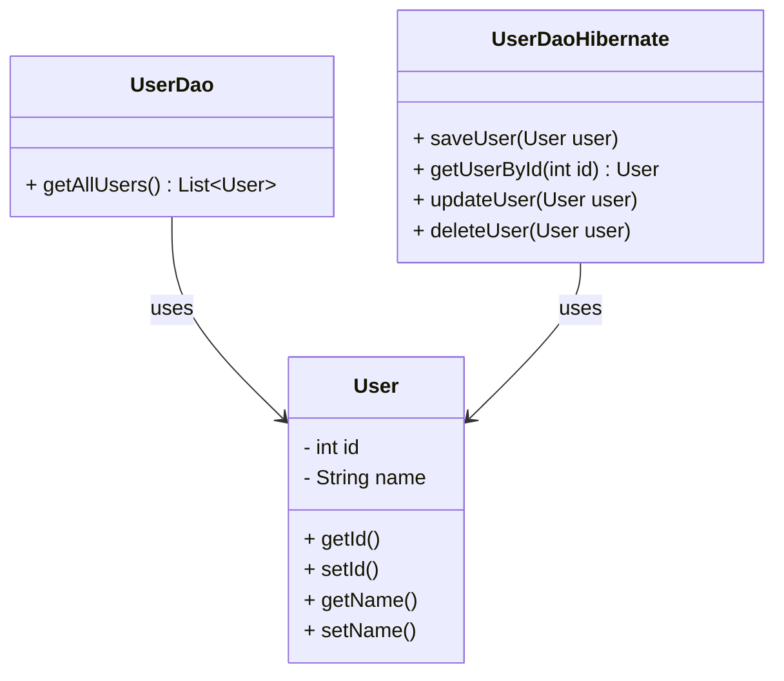

## 8.2.2 DAO with JDBC and ORM Frameworks

In this section, we delve into the implementation of the Data Access Object (DAO) pattern using JDBC templates and Object-Relational Mapping (ORM) frameworks such as Hibernate. This exploration will equip you with the knowledge to efficiently manage database operations in Java applications, balancing control and convenience.

### Introduction to JDBC

Java Database Connectivity (JDBC) is a standard Java API that allows Java programs to interact with databases. It provides a set of interfaces and classes for connecting to a database, executing SQL queries, and processing the results. JDBC serves as a low-level API, offering fine-grained control over database operations.

#### Key Components of JDBC

- **DriverManager**: Manages a list of database drivers. It matches connection requests from the application with the appropriate driver using a URL.
- **Connection**: Represents a session with a specific database. It provides methods for creating statements and managing transactions.
- **Statement**: Used to execute SQL queries against the database.
- **ResultSet**: Represents the result set of a query, allowing retrieval of data from the database.

#### Example: Basic JDBC Connection

```java
import java.sql.Connection;
import java.sql.DriverManager;
import java.sql.ResultSet;
import java.sql.Statement;

public class JDBCExample {
    public static void main(String[] args) {
        String url = "jdbc:mysql://localhost:3306/mydatabase";
        String user = "root";
        String password = "password";

        try (Connection connection = DriverManager.getConnection(url, user, password);
             Statement statement = connection.createStatement();
             ResultSet resultSet = statement.executeQuery("SELECT * FROM users")) {

            while (resultSet.next()) {
                System.out.println("User ID: " + resultSet.getInt("id"));
                System.out.println("User Name: " + resultSet.getString("name"));
            }
        } catch (Exception e) {
            e.printStackTrace();
        }
    }
}
```

### Simplifying JDBC with JdbcTemplate

JDBC, while powerful, can be verbose and error-prone due to the boilerplate code required for resource management and exception handling. This is where `JdbcTemplate`, part of the Spring Framework, comes into play. It simplifies database operations by abstracting repetitive tasks and providing a template for executing queries.

#### Benefits of Using JdbcTemplate

- **Simplified Code**: Reduces boilerplate code for opening and closing connections.
- **Exception Handling**: Converts checked SQL exceptions into unchecked exceptions.
- **Resource Management**: Automatically handles resource cleanup.

#### Example: DAO Implementation with JdbcTemplate

```java
import org.springframework.jdbc.core.JdbcTemplate;
import org.springframework.jdbc.core.RowMapper;
import org.springframework.jdbc.datasource.DriverManagerDataSource;

import java.util.List;

public class UserDao {
    private JdbcTemplate jdbcTemplate;

    public UserDao() {
        DriverManagerDataSource dataSource = new DriverManagerDataSource();
        dataSource.setDriverClassName("com.mysql.cj.jdbc.Driver");
        dataSource.setUrl("jdbc:mysql://localhost:3306/mydatabase");
        dataSource.setUsername("root");
        dataSource.setPassword("password");

        this.jdbcTemplate = new JdbcTemplate(dataSource);
    }

    public List<User> getAllUsers() {
        String sql = "SELECT * FROM users";
        return jdbcTemplate.query(sql, new UserRowMapper());
    }
}

class UserRowMapper implements RowMapper<User> {
    @Override
    public User mapRow(ResultSet rs, int rowNum) throws SQLException {
        User user = new User();
        user.setId(rs.getInt("id"));
        user.setName(rs.getString("name"));
        return user;
    }
}
```

### Introduction to ORM Frameworks

Object-Relational Mapping (ORM) frameworks, such as Hibernate, provide a higher-level abstraction for interacting with databases. They address the object-relational impedance mismatch by mapping Java objects to database tables.

#### Benefits of Using ORM Frameworks

- **Reduced Boilerplate**: Automatically generates SQL queries.
- **Object-Oriented Approach**: Allows developers to work with Java objects rather than SQL.
- **Transaction Management**: Simplifies transaction handling.

### Implementing DAOs with Hibernate

Hibernate is a popular ORM framework that facilitates the mapping of Java classes to database tables. It provides a powerful query language (HQL) and supports various fetching strategies.

#### Defining Entity Mappings

Entities in Hibernate can be defined using annotations or XML configurations. Annotations are more common due to their simplicity and ease of use.

```java
import javax.persistence.Entity;
import javax.persistence.Id;
import javax.persistence.Table;

@Entity
@Table(name = "users")
public class User {
    @Id
    private int id;
    private String name;

    // Getters and setters
}
```

#### Utilizing Hibernate's Session and Transaction Management

Hibernate's `Session` interface is the primary interface for interacting with the database. It provides methods for CRUD operations and transaction management.

```java
import org.hibernate.Session;
import org.hibernate.SessionFactory;
import org.hibernate.Transaction;
import org.hibernate.cfg.Configuration;

public class UserDaoHibernate {
    private SessionFactory sessionFactory;

    public UserDaoHibernate() {
        sessionFactory = new Configuration().configure().buildSessionFactory();
    }

    public void saveUser(User user) {
        Session session = sessionFactory.openSession();
        Transaction transaction = session.beginTransaction();
        session.save(user);
        transaction.commit();
        session.close();
    }
}
```

#### Performing CRUD Operations with Hibernate

Hibernate simplifies CRUD operations through its API, allowing developers to focus on business logic rather than SQL.

```java
public User getUserById(int id) {
    Session session = sessionFactory.openSession();
    User user = session.get(User.class, id);
    session.close();
    return user;
}

public void updateUser(User user) {
    Session session = sessionFactory.openSession();
    Transaction transaction = session.beginTransaction();
    session.update(user);
    transaction.commit();
    session.close();
}

public void deleteUser(User user) {
    Session session = sessionFactory.openSession();
    Transaction transaction = session.beginTransaction();
    session.delete(user);
    transaction.commit();
    session.close();
}
```

### Trade-offs Between JDBC and ORM Frameworks

When choosing between JDBC and ORM frameworks, consider the following trade-offs:

- **Control vs. Convenience**: JDBC offers more control over SQL execution, while ORM frameworks provide convenience through abstraction.
- **Performance**: JDBC can be more performant for complex queries, but ORM frameworks optimize common operations.
- **Learning Curve**: ORM frameworks have a steeper learning curve but offer long-term productivity gains.

### Best Practices for Choosing Data Access Technology

- **Project Requirements**: Assess the complexity of the data model and the need for fine-grained control.
- **Team Expertise**: Consider the team's familiarity with JDBC and ORM frameworks.
- **Performance Considerations**: Evaluate the performance implications of each approach.
- **Maintainability**: Choose a technology that aligns with the project's long-term maintainability goals.

### Encouraging Experimentation

Remember, this is just the beginning. As you progress, you'll build more complex and interactive applications. Keep experimenting, stay curious, and enjoy the journey!

### Visualizing DAO with JDBC and ORM Frameworks



This diagram illustrates the relationship between the `User` entity and the DAO implementations using JDBC and Hibernate.

### Knowledge Check

- Explain the role of `JdbcTemplate` in simplifying JDBC operations.
- Describe the benefits of using ORM frameworks like Hibernate.
- Discuss the trade-offs between using JDBC and ORM frameworks.

## Quiz Time!



### What is the primary role of JDBC in Java applications?

- [x] To provide a standard API for database connectivity
- [ ] To handle HTTP requests and responses
- [ ] To manage user interface components
- [ ] To perform file I/O operations

> **Explanation:** JDBC is a standard Java API that facilitates database connectivity and operations.

### Which component of JDBC is responsible for managing database drivers?

- [x] DriverManager
- [ ] Connection
- [ ] Statement
- [ ] ResultSet

> **Explanation:** DriverManager manages the list of database drivers and matches connection requests with the appropriate driver.

### What is a key benefit of using JdbcTemplate?

- [x] It reduces boilerplate code in JDBC operations
- [ ] It provides a graphical user interface
- [ ] It manages network connections
- [ ] It performs data encryption

> **Explanation:** JdbcTemplate simplifies JDBC operations by reducing boilerplate code and handling resource management.

### How does Hibernate address the object-relational impedance mismatch?

- [x] By mapping Java objects to database tables
- [ ] By providing a graphical user interface
- [ ] By managing network connections
- [ ] By performing data encryption

> **Explanation:** Hibernate maps Java objects to database tables, addressing the object-relational impedance mismatch.

### Which annotation is used to define an entity in Hibernate?

- [x] @Entity
- [ ] @Table
- [ ] @Column
- [ ] @Id

> **Explanation:** The @Entity annotation is used to define a class as an entity in Hibernate.

### What is a key advantage of using ORM frameworks?

- [x] They provide an object-oriented approach to database operations
- [ ] They offer a graphical user interface
- [ ] They manage network connections
- [ ] They perform data encryption

> **Explanation:** ORM frameworks offer an object-oriented approach to database operations, simplifying data management.

### Which method is used to begin a transaction in Hibernate?

- [x] beginTransaction()
- [ ] startTransaction()
- [ ] openTransaction()
- [ ] initiateTransaction()

> **Explanation:** The beginTransaction() method is used to start a transaction in Hibernate.

### What is a trade-off of using JDBC over ORM frameworks?

- [x] More control over SQL execution
- [ ] Easier to learn
- [ ] Higher level of abstraction
- [ ] Better performance for all operations

> **Explanation:** JDBC offers more control over SQL execution, but ORM frameworks provide a higher level of abstraction.

### Which of the following is a best practice when choosing a data access technology?

- [x] Assess the complexity of the data model
- [ ] Choose based on personal preference
- [ ] Always use JDBC for simplicity
- [ ] Always use ORM for abstraction

> **Explanation:** It's important to assess the complexity of the data model and project requirements when choosing a data access technology.

### True or False: ORM frameworks have a steeper learning curve but offer long-term productivity gains.

- [x] True
- [ ] False

> **Explanation:** ORM frameworks do have a steeper learning curve, but they can lead to productivity gains in the long run due to their abstraction and automation capabilities.


