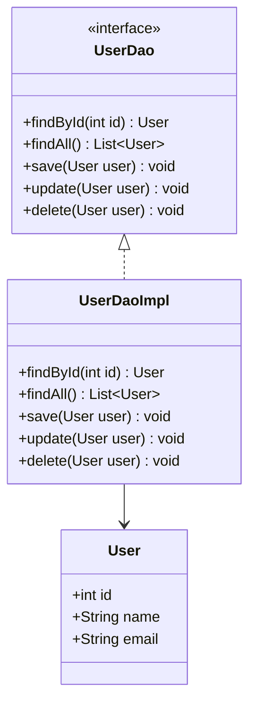

## 8.2.3 Benefits and Best Practices

The Data Access Object (DAO) pattern is a structural pattern that provides an abstract interface to some type of database or other persistence mechanism. By mapping application calls to the persistence layer, the DAO pattern provides specific data operations without exposing details of the database. This section explores the benefits of using the DAO pattern and offers best practices for its implementation in Java.

### Key Benefits of the DAO Pattern

#### 1. Decoupling Business Logic from Data Persistence

One of the primary advantages of the DAO pattern is the separation of business logic from data access logic. This decoupling allows developers to focus on the business rules and processes without being concerned with the underlying data access details. By isolating these concerns, the DAO pattern enhances the modularity and flexibility of the application.

#### 2. Improved Code Maintainability and Readability

The DAO pattern promotes cleaner code by encapsulating all data access logic in one place. This organization makes the codebase easier to navigate and understand, as developers can quickly locate and modify data access logic without affecting business logic. This separation also simplifies debugging and maintenance tasks.

#### 3. Easier Migration to Different Data Sources or Persistence Technologies

With the DAO pattern, switching from one data source to another or adopting a new persistence technology becomes more manageable. Since the data access logic is encapsulated within the DAO layer, changes to the data source or technology require minimal modifications to the rest of the application. This flexibility is particularly beneficial in environments where data sources are subject to change.

#### 4. Enhanced Ability to Unit Test Business Logic Independently

By isolating data access logic, the DAO pattern facilitates unit testing of business logic. Developers can mock DAO implementations to simulate data access operations, allowing them to test business logic without relying on an actual database. This capability leads to more robust and reliable applications, as business logic can be thoroughly tested in isolation.

### Best Practices for Implementing DAOs

#### 1. Keep DAO Interfaces Clean and Focused on Data Operations

Ensure that DAO interfaces are concise and focused solely on data operations. Avoid adding methods that do not pertain to data access, as this can lead to bloated interfaces and increased complexity. A clean interface promotes easier implementation and maintenance.

```java
public interface UserDao {
    User findById(int id);
    List<User> findAll();
    void save(User user);
    void update(User user);
    void delete(User user);
}
```

#### 2. Avoid Placing Business Logic Within DAOs

DAOs should strictly handle data access operations and not contain business logic. Mixing business logic with data access can lead to tightly coupled code that is difficult to maintain and test. Keep business logic in service classes or other appropriate layers.

#### 3. Use Consistent Naming Conventions and Method Signatures

Adopt consistent naming conventions and method signatures across DAOs to enhance readability and maintainability. This consistency helps developers understand the purpose and functionality of DAO methods at a glance.

#### 4. Implement Exception Handling Strategies

Implement robust exception handling strategies within DAOs to manage data access errors gracefully. Avoid leaking database-specific exceptions to higher layers by wrapping them in custom exceptions that provide meaningful context.

```java
public class UserDaoException extends RuntimeException {
    public UserDaoException(String message, Throwable cause) {
        super(message, cause);
    }
}
```

#### 5. Consider Using Design Patterns for DAO Instantiation

Consider using design patterns like Factory or Singleton for DAO instantiation to manage the lifecycle and dependencies of DAO objects. These patterns can help ensure that DAOs are created and managed efficiently.

```java
public class UserDaoFactory {
    private static UserDao userDao;

    public static UserDao getUserDao() {
        if (userDao == null) {
            userDao = new UserDaoImpl();
        }
        return userDao;
    }
}
```

#### 6. Handle Transactions Appropriately

Transactions can be managed within the DAO layer or through a service layer, depending on the application's architecture. Ensure that transactions are handled consistently to maintain data integrity and consistency.

```java
public void performTransaction() {
    try {
        connection.setAutoCommit(false);
        // Perform data operations
        connection.commit();
    } catch (SQLException e) {
        connection.rollback();
        throw new UserDaoException("Transaction failed", e);
    }
}
```

#### 7. Encourage Regular Code Reviews and Refactoring

Regularly review and refactor DAO code to maintain high quality and adherence to best practices. Code reviews can help identify potential issues and areas for improvement, ensuring that the data access layer remains efficient and reliable.

#### 8. Highlight the Importance of Documentation and Clear API Contracts

Provide comprehensive documentation for DAO methods, including clear API contracts that specify expected inputs, outputs, and exceptions. Well-documented DAOs facilitate easier integration and usage by other developers.

### Visualizing DAO Pattern Implementation

To better understand the DAO pattern's structure and flow, let's visualize it using a class diagram:



This diagram illustrates the relationship between the `UserDao` interface, its implementation `UserDaoImpl`, and the `User` entity. The DAO pattern encapsulates data access logic within the `UserDaoImpl` class, providing a clean interface for interacting with `User` data.

### Try It Yourself

To deepen your understanding of the DAO pattern, try modifying the code examples provided. For instance, you can:

- Implement a new DAO for a different entity, such as `ProductDao`.
- Experiment with different exception handling strategies.
- Use a Factory pattern to manage DAO instances.

### References and Links

For further reading on the DAO pattern and related topics, consider the following resources:

- [Oracle Java Tutorials](https://docs.oracle.com/javase/tutorial/)
- [Java Design Patterns](https://www.journaldev.com/1827/java-design-patterns-example-tutorial)
- [Effective Java by Joshua Bloch](https://www.oreilly.com/library/view/effective-java/9780134686097/)

### Knowledge Check

To reinforce your understanding of the DAO pattern, consider these questions:

- What are the key benefits of using the DAO pattern?
- How does the DAO pattern improve code maintainability?
- Why is it important to separate business logic from data access logic?
- What are some best practices for implementing DAOs in Java?

### Embrace the Journey

Remember, mastering design patterns like DAO is a journey. As you continue to explore and implement these patterns, you'll gain deeper insights into building robust, maintainable applications. Keep experimenting, stay curious, and enjoy the process!

## Quiz Time!



### What is a primary benefit of using the DAO pattern?

- [x] It decouples business logic from data persistence.
- [ ] It increases the complexity of the codebase.
- [ ] It tightly couples data access with business logic.
- [ ] It makes testing more difficult.

> **Explanation:** The DAO pattern decouples business logic from data persistence, allowing for cleaner and more maintainable code.

### Which of the following is a best practice for implementing DAOs?

- [x] Keep DAO interfaces clean and focused on data operations.
- [ ] Include business logic within DAOs.
- [ ] Use inconsistent naming conventions.
- [ ] Leak database-specific exceptions to higher layers.

> **Explanation:** Keeping DAO interfaces focused on data operations ensures clarity and maintainability, while avoiding business logic and leaking exceptions.

### How does the DAO pattern facilitate easier migration to different data sources?

- [x] By encapsulating data access logic within DAOs.
- [ ] By embedding data source details in business logic.
- [ ] By tightly coupling data access and business logic.
- [ ] By using hardcoded data source configurations.

> **Explanation:** The DAO pattern encapsulates data access logic, making it easier to switch data sources without affecting business logic.

### What is the role of exception handling in DAOs?

- [x] To manage data access errors gracefully.
- [ ] To expose database-specific errors to users.
- [ ] To ignore data access errors.
- [ ] To complicate the data access layer.

> **Explanation:** Exception handling in DAOs should manage errors gracefully, providing meaningful context without exposing database-specific details.

### Which design pattern can be used for DAO instantiation?

- [x] Factory
- [ ] Observer
- [ ] Decorator
- [ ] Singleton

> **Explanation:** The Factory pattern can be used to manage the creation and lifecycle of DAO instances.

### Why should business logic be kept out of DAOs?

- [x] To maintain separation of concerns and facilitate testing.
- [ ] To increase the complexity of the DAO layer.
- [ ] To make DAOs more difficult to maintain.
- [ ] To tightly couple data access and business logic.

> **Explanation:** Keeping business logic out of DAOs maintains separation of concerns, making the code easier to test and maintain.

### What is a benefit of using consistent naming conventions in DAOs?

- [x] It enhances readability and maintainability.
- [ ] It increases the complexity of the codebase.
- [ ] It makes the code harder to understand.
- [ ] It leads to inconsistent method signatures.

> **Explanation:** Consistent naming conventions enhance readability and maintainability by making the code easier to understand and navigate.

### How can transactions be handled in the DAO pattern?

- [x] Within the DAO layer or through a service layer.
- [ ] By ignoring transaction management.
- [ ] By embedding transaction logic in business methods.
- [ ] By using hardcoded transaction configurations.

> **Explanation:** Transactions can be managed within the DAO layer or through a service layer, depending on the application's architecture.

### What is the importance of documentation for DAO methods?

- [x] It facilitates easier integration and usage by other developers.
- [ ] It complicates the development process.
- [ ] It is unnecessary for experienced developers.
- [ ] It should be avoided to keep the codebase clean.

> **Explanation:** Comprehensive documentation for DAO methods facilitates easier integration and usage by providing clear API contracts.

### True or False: The DAO pattern makes it more difficult to unit test business logic.

- [ ] True
- [x] False

> **Explanation:** The DAO pattern actually makes it easier to unit test business logic by isolating data access logic, allowing for mocking and testing in isolation.


