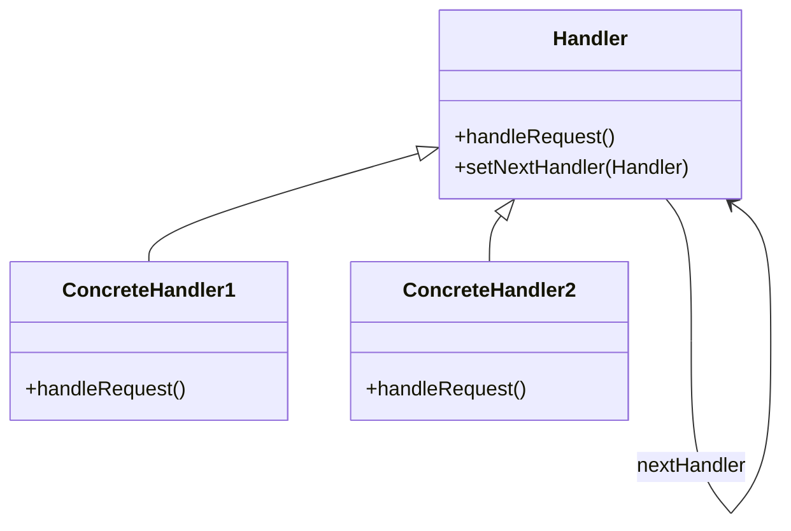

## 8.2.3 Avoiding Coupling Between Senders and Receivers

In the realm of software design, coupling refers to the degree of direct knowledge that one component has about another. High coupling can lead to systems that are difficult to maintain and extend. The Chain of Responsibility pattern is a behavioral design pattern that addresses this issue by decoupling the sender of a request from its receivers. This pattern allows multiple objects to handle the request without the sender needing to know which object will ultimately process it. This section will delve into how the Chain of Responsibility pattern achieves this decoupling, enhancing the flexibility and maintainability of Java applications.

### Understanding Coupling in Software Design

Before we explore the Chain of Responsibility pattern, it is crucial to understand the concept of coupling in software design. Coupling refers to the degree of interdependence between software modules. High coupling means that modules are closely linked, which can lead to a fragile system where changes in one module necessitate changes in others. Conversely, low coupling implies that modules are independent, allowing for easier maintenance and scalability.

### The Chain of Responsibility Pattern

The Chain of Responsibility pattern is a design pattern that allows an object to send a command without knowing which object will handle the request. This pattern is particularly useful when multiple objects can handle a request, and the handler is determined at runtime. The pattern involves a chain of handler objects, each of which can process the request or pass it along the chain.

#### Intent

- **Description**: The Chain of Responsibility pattern aims to decouple the sender of a request from its receivers by allowing multiple objects to handle the request without the sender knowing which object will ultimately process it.

#### Motivation

In many applications, a request may need to be processed by multiple handlers. For example, in a logging system, a message might be processed by different handlers based on its severity. The Chain of Responsibility pattern allows for this flexibility by decoupling the sender from the receivers.

#### Applicability

- **Guidelines**: Use the Chain of Responsibility pattern when:
  - Multiple objects can handle a request, and the handler is determined at runtime.
  - You want to issue a request to one of several objects without specifying the receiver explicitly.
  - The set of objects that can handle a request should be specified dynamically.

#### Structure



- **Caption**: The diagram illustrates the structure of the Chain of Responsibility pattern, where `Handler` is an abstract class with a method `handleRequest()`. `ConcreteHandler1` and `ConcreteHandler2` are implementations of `Handler`, each capable of handling requests or passing them to the next handler.

### Decoupling Senders and Receivers

The Chain of Responsibility pattern achieves decoupling by ensuring that the sender of a request does not need to know which handler will process it. This is accomplished through the use of an abstract handler class or interface, which defines a method for handling requests. Concrete handler classes implement this interface and decide whether to process the request or pass it along the chain.

#### Interface-Based Design

Interface-based design is crucial in achieving decoupling in the Chain of Responsibility pattern. By defining a common interface for all handlers, the sender can issue requests without knowing the specifics of the handler. This approach enhances flexibility, as new handlers can be added to the chain without modifying the sender.

#### Example: Logging System

Consider a logging system where messages can be processed by different handlers based on their severity. The Chain of Responsibility pattern allows for a flexible and maintainable design.

```java
// Handler interface
interface Logger {
    void setNext(Logger nextLogger);
    void logMessage(String message, LogLevel level);
}

// Concrete handler for error level
class ErrorLogger implements Logger {
    private Logger nextLogger;

    @Override
    public void setNext(Logger nextLogger) {
        this.nextLogger = nextLogger;
    }

    @Override
    public void logMessage(String message, LogLevel level) {
        if (level == LogLevel.ERROR) {
            System.out.println("Error Logger: " + message);
        } else if (nextLogger != null) {
            nextLogger.logMessage(message, level);
        }
    }
}

// Concrete handler for info level
class InfoLogger implements Logger {
    private Logger nextLogger;

    @Override
    public void setNext(Logger nextLogger) {
        this.nextLogger = nextLogger;
    }

    @Override
    public void logMessage(String message, LogLevel level) {
        if (level == LogLevel.INFO) {
            System.out.println("Info Logger: " + message);
        } else if (nextLogger != null) {
            nextLogger.logMessage(message, level);
        }
    }
}

// Enum for log levels
enum LogLevel {
    INFO, ERROR
}

// Client code
public class ChainOfResponsibilityDemo {
    public static void main(String[] args) {
        Logger errorLogger = new ErrorLogger();
        Logger infoLogger = new InfoLogger();

        errorLogger.setNext(infoLogger);

        errorLogger.logMessage("This is an error message.", LogLevel.ERROR);
        errorLogger.logMessage("This is an info message.", LogLevel.INFO);
    }
}
```

In this example, the `Logger` interface defines the contract for all loggers. The `ErrorLogger` and `InfoLogger` classes implement this interface and decide whether to process the message or pass it along the chain. The client code sets up the chain and issues log messages without knowing which logger will handle them.

### Benefits of Decoupling

Decoupling senders and receivers using the Chain of Responsibility pattern offers several benefits:

- **Flexibility**: New handlers can be added to the chain without modifying the sender or existing handlers.
- **Maintainability**: Changes to handlers do not affect the sender, reducing the risk of introducing bugs.
- **Reusability**: Handlers can be reused in different chains or applications.

### Real-World Scenarios

The Chain of Responsibility pattern is widely used in various applications, including:

- **Event Handling**: In GUI applications, events can be handled by different components based on their type or source.
- **Middleware**: In web applications, middleware components can process requests or responses in a chain.
- **Command Processing**: In command-line applications, commands can be processed by different handlers based on their type.

### Common Pitfalls and How to Avoid Them

While the Chain of Responsibility pattern offers many benefits, it is essential to be aware of potential pitfalls:

- **Long Chains**: Long chains can lead to performance issues, as each request must traverse the entire chain.
- **Unprocessed Requests**: Ensure that requests are eventually processed by a handler, or provide a default handler to handle unprocessed requests.

### Conclusion

The Chain of Responsibility pattern is a powerful tool for decoupling senders and receivers in Java applications. By using interface-based design, this pattern enhances flexibility and maintainability, allowing for the dynamic addition of handlers and reducing the risk of introducing bugs. By understanding and applying this pattern, developers can create robust and scalable applications that are easy to maintain and extend.

### Exercises

1. Modify the logging system example to include a `DebugLogger` that handles debug-level messages.
2. Implement a Chain of Responsibility pattern for a customer support system where requests are handled by different departments based on their type.

### Key Takeaways

- The Chain of Responsibility pattern decouples senders and receivers, enhancing flexibility and maintainability.
- Interface-based design is crucial in achieving this decoupling.
- The pattern is widely used in event handling, middleware, and command processing applications.

### Reflective Questions

- How can you apply the Chain of Responsibility pattern to your current projects?
- What are the potential challenges in implementing this pattern, and how can you overcome them?

## Test Your Knowledge: Chain of Responsibility Pattern Quiz



### What is the primary benefit of the Chain of Responsibility pattern?

- [x] It decouples the sender of a request from its receivers.
- [ ] It improves performance by processing requests faster.
- [ ] It simplifies the code by reducing the number of classes.
- [ ] It ensures that all requests are processed by a single handler.

> **Explanation:** The Chain of Responsibility pattern decouples the sender of a request from its receivers, allowing multiple handlers to process the request without the sender knowing which handler will ultimately process it.

### How does the Chain of Responsibility pattern enhance flexibility?

- [x] By allowing new handlers to be added without modifying the sender.
- [ ] By ensuring that all requests are processed in parallel.
- [ ] By reducing the number of handlers required.
- [ ] By simplifying the request processing logic.

> **Explanation:** The Chain of Responsibility pattern enhances flexibility by allowing new handlers to be added to the chain without modifying the sender or existing handlers.

### What is a common pitfall of the Chain of Responsibility pattern?

- [x] Long chains can lead to performance issues.
- [ ] It requires all requests to be processed by a single handler.
- [ ] It increases coupling between senders and receivers.
- [ ] It simplifies the code by reducing the number of classes.

> **Explanation:** A common pitfall of the Chain of Responsibility pattern is that long chains can lead to performance issues, as each request must traverse the entire chain.

### In the Chain of Responsibility pattern, what is the role of the handler interface?

- [x] It defines a common contract for all handlers.
- [ ] It processes all requests directly.
- [ ] It determines the order of handlers in the chain.
- [ ] It ensures that all requests are processed in parallel.

> **Explanation:** The handler interface defines a common contract for all handlers, allowing the sender to issue requests without knowing the specifics of the handler.

### Which of the following is a real-world scenario where the Chain of Responsibility pattern is used?

- [x] Event handling in GUI applications.
- [ ] Database transactions.
- [ ] File I/O operations.
- [ ] Memory management.

> **Explanation:** The Chain of Responsibility pattern is used in event handling in GUI applications, where events can be handled by different components based on their type or source.

### How can you ensure that all requests are eventually processed in the Chain of Responsibility pattern?

- [x] Provide a default handler to handle unprocessed requests.
- [ ] Ensure that all handlers process every request.
- [ ] Limit the number of handlers in the chain.
- [ ] Use a single handler for all requests.

> **Explanation:** To ensure that all requests are eventually processed, provide a default handler to handle unprocessed requests.

### What is a benefit of using interface-based design in the Chain of Responsibility pattern?

- [x] It allows for the dynamic addition of handlers.
- [ ] It simplifies the code by reducing the number of classes.
- [ ] It ensures that all requests are processed in parallel.
- [ ] It improves performance by processing requests faster.

> **Explanation:** Interface-based design allows for the dynamic addition of handlers, enhancing flexibility and maintainability.

### How does the Chain of Responsibility pattern improve maintainability?

- [x] Changes to handlers do not affect the sender.
- [ ] It reduces the number of handlers required.
- [ ] It ensures that all requests are processed by a single handler.
- [ ] It simplifies the request processing logic.

> **Explanation:** The Chain of Responsibility pattern improves maintainability by ensuring that changes to handlers do not affect the sender, reducing the risk of introducing bugs.

### What is a potential challenge in implementing the Chain of Responsibility pattern?

- [x] Ensuring that requests are eventually processed by a handler.
- [ ] Reducing the number of handlers required.
- [ ] Simplifying the request processing logic.
- [ ] Ensuring that all requests are processed in parallel.

> **Explanation:** A potential challenge in implementing the Chain of Responsibility pattern is ensuring that requests are eventually processed by a handler.

### True or False: The Chain of Responsibility pattern requires the sender to know the specifics of each handler.

- [x] False
- [ ] True

> **Explanation:** False. The Chain of Responsibility pattern decouples the sender from the receivers, allowing the sender to issue requests without knowing the specifics of each handler.



By understanding and applying the Chain of Responsibility pattern, developers can create robust and scalable applications that are easy to maintain and extend. This pattern is a powerful tool for decoupling senders and receivers, enhancing flexibility and maintainability in Java applications.
