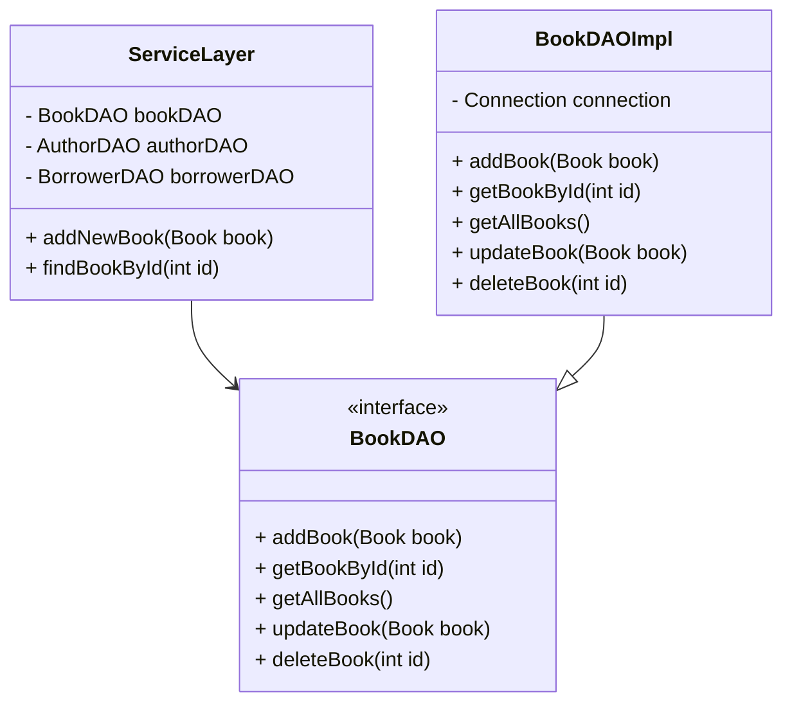

## 8.2.4 Use Cases and Examples

The Data Access Object (DAO) pattern is a structural pattern that provides an abstract interface to some type of database or other persistence mechanism. By mapping application calls to the persistence layer, DAOs provide specific data operations without exposing details of the database. This pattern is particularly useful in enterprise applications where data access logic needs to be decoupled from business logic, enhancing modularity and maintainability.

### Real-World Applications of the DAO Pattern

#### Enterprise Applications Interacting with Relational Databases

In enterprise applications, the DAO pattern is often used to interact with relational databases such as MySQL, PostgreSQL, or Oracle. These applications typically require a robust mechanism for CRUD (Create, Read, Update, Delete) operations, which DAOs can efficiently handle.

**Example Scenario**: Consider an enterprise application for managing employee records. The application needs to perform various operations such as adding new employees, updating existing records, retrieving employee details, and deleting records. Using the DAO pattern, each of these operations can be encapsulated in a separate DAO class, ensuring that the business logic remains clean and focused on the application's core functionality.

```java
// EmployeeDAO.java
public interface EmployeeDAO {
    void addEmployee(Employee employee);
    Employee getEmployeeById(int id);
    List<Employee> getAllEmployees();
    void updateEmployee(Employee employee);
    void deleteEmployee(int id);
}

// EmployeeDAOImpl.java
public class EmployeeDAOImpl implements EmployeeDAO {
    private Connection connection;

    public EmployeeDAOImpl(Connection connection) {
        this.connection = connection;
    }

    @Override
    public void addEmployee(Employee employee) {
        String query = "INSERT INTO employees (name, department, salary) VALUES (?, ?, ?)";
        try (PreparedStatement stmt = connection.prepareStatement(query)) {
            stmt.setString(1, employee.getName());
            stmt.setString(2, employee.getDepartment());
            stmt.setDouble(3, employee.getSalary());
            stmt.executeUpdate();
        } catch (SQLException e) {
            e.printStackTrace();
        }
    }

    @Override
    public Employee getEmployeeById(int id) {
        String query = "SELECT * FROM employees WHERE id = ?";
        try (PreparedStatement stmt = connection.prepareStatement(query)) {
            stmt.setInt(1, id);
            ResultSet rs = stmt.executeQuery();
            if (rs.next()) {
                return new Employee(rs.getInt("id"), rs.getString("name"), rs.getString("department"), rs.getDouble("salary"));
            }
        } catch (SQLException e) {
            e.printStackTrace();
        }
        return null;
    }

    // Implement other methods similarly...
}
```

In this example, `EmployeeDAOImpl` handles all database interactions, allowing the business logic to remain agnostic of the underlying data persistence mechanism.

#### Applications Requiring Support for Multiple Data Sources

Modern applications often need to interact with multiple data sources, such as SQL databases, NoSQL databases, and even cloud-based storage solutions. The DAO pattern provides a way to abstract these interactions, allowing the application to switch between different data sources with minimal changes to the business logic.

**Example Scenario**: An application that needs to retrieve user data from a SQL database and store analytics data in a NoSQL database can use separate DAOs for each data source. This separation allows the application to handle different data models and query languages without affecting the core logic.

```java
// SQLUserDAO.java
public class SQLUserDAO implements UserDAO {
    // SQL-specific implementation
}

// NoSQLAnalyticsDAO.java
public class NoSQLAnalyticsDAO implements AnalyticsDAO {
    // NoSQL-specific implementation
}
```

By defining interfaces such as `UserDAO` and `AnalyticsDAO`, the application can interact with different data sources through a consistent API, enhancing flexibility and scalability.

#### Systems Where Business Logic Must Remain Agnostic of Data Persistence Mechanisms

In systems where business logic must remain independent of data persistence mechanisms, DAOs serve as an intermediary layer that isolates the business logic from the database operations. This separation is crucial in maintaining a clean architecture and ensuring that changes in the data layer do not ripple through the entire application.

**Example Scenario**: In a financial application, business logic related to transaction processing should not be directly coupled with database operations. By using DAOs, the application can ensure that transaction logic is separated from the persistence logic, allowing for easier maintenance and testing.

```java
// TransactionService.java
public class TransactionService {
    private final TransactionDAO transactionDAO;

    public TransactionService(TransactionDAO transactionDAO) {
        this.transactionDAO = transactionDAO;
    }

    public void processTransaction(Transaction transaction) {
        // Business logic for processing transaction
        transactionDAO.saveTransaction(transaction);
    }
}
```

In this example, `TransactionService` handles the business logic, while `TransactionDAO` is responsible for persisting transaction data, ensuring a clear separation of concerns.

### DAOs in the Repository Layer

DAOs often fit within a repository layer, acting as the mechanism for data retrieval and storage. The repository layer serves as an abstraction over the data access logic, providing a clean API for the business logic to interact with.

**Example Scenario**: In a content management system (CMS), the repository layer can use DAOs to manage content entities such as articles, images, and videos. Each DAO handles the persistence logic for a specific entity, while the repository layer provides a unified interface for managing content.

```java
// ContentRepository.java
public class ContentRepository {
    private final ArticleDAO articleDAO;
    private final ImageDAO imageDAO;
    private final VideoDAO videoDAO;

    public ContentRepository(ArticleDAO articleDAO, ImageDAO imageDAO, VideoDAO videoDAO) {
        this.articleDAO = articleDAO;
        this.imageDAO = imageDAO;
        this.videoDAO = videoDAO;
    }

    public void saveArticle(Article article) {
        articleDAO.saveArticle(article);
    }

    public Article getArticleById(int id) {
        return articleDAO.getArticleById(id);
    }

    // Similar methods for images and videos...
}
```

By using DAOs within a repository layer, the CMS can manage different content types through a consistent interface, simplifying the business logic and enhancing maintainability.

### Enabling Unit Testing with DAOs

One of the significant advantages of using DAOs is the ability to mock data access during unit tests. By abstracting the data access logic, DAOs allow developers to test business logic without relying on a real database, making tests faster and more reliable.

**Example Scenario**: In a unit test for an order processing service, the DAO can be mocked to simulate different database states and verify the service's behavior under various conditions.

```java
// OrderServiceTest.java
public class OrderServiceTest {
    private OrderDAO orderDAOMock;
    private OrderService orderService;

    @Before
    public void setUp() {
        orderDAOMock = mock(OrderDAO.class);
        orderService = new OrderService(orderDAOMock);
    }

    @Test
    public void testProcessOrder() {
        Order order = new Order(1, "Product A", 2);
        when(orderDAOMock.saveOrder(order)).thenReturn(true);

        boolean result = orderService.processOrder(order);
        assertTrue(result);
        verify(orderDAOMock, times(1)).saveOrder(order);
    }
}
```

In this test, `orderDAOMock` is used to simulate the behavior of the `OrderDAO`, allowing the `OrderService` to be tested in isolation. This approach ensures that the business logic is thoroughly tested without the need for a database connection.

### Case Study: DAO Implementation in a Sample Application

Let's explore a case study of a DAO implementation in a sample application. Consider a library management system that needs to manage books, authors, and borrowers. The system uses a relational database to store this information, and the DAO pattern is employed to handle data access.

**Step 1: Define the DAO Interfaces**

First, define interfaces for each entity that the application needs to manage.

```java
// BookDAO.java
public interface BookDAO {
    void addBook(Book book);
    Book getBookById(int id);
    List<Book> getAllBooks();
    void updateBook(Book book);
    void deleteBook(int id);
}

// AuthorDAO.java
public interface AuthorDAO {
    void addAuthor(Author author);
    Author getAuthorById(int id);
    List<Author> getAllAuthors();
    void updateAuthor(Author author);
    void deleteAuthor(int id);
}

// BorrowerDAO.java
public interface BorrowerDAO {
    void addBorrower(Borrower borrower);
    Borrower getBorrowerById(int id);
    List<Borrower> getAllBorrowers();
    void updateBorrower(Borrower borrower);
    void deleteBorrower(int id);
}
```

**Step 2: Implement the DAO Classes**

Next, implement the DAO classes that handle the actual database operations.

```java
// BookDAOImpl.java
public class BookDAOImpl implements BookDAO {
    private Connection connection;

    public BookDAOImpl(Connection connection) {
        this.connection = connection;
    }

    @Override
    public void addBook(Book book) {
        String query = "INSERT INTO books (title, author_id, isbn) VALUES (?, ?, ?)";
        try (PreparedStatement stmt = connection.prepareStatement(query)) {
            stmt.setString(1, book.getTitle());
            stmt.setInt(2, book.getAuthorId());
            stmt.setString(3, book.getIsbn());
            stmt.executeUpdate();
        } catch (SQLException e) {
            e.printStackTrace();
        }
    }

    @Override
    public Book getBookById(int id) {
        String query = "SELECT * FROM books WHERE id = ?";
        try (PreparedStatement stmt = connection.prepareStatement(query)) {
            stmt.setInt(1, id);
            ResultSet rs = stmt.executeQuery();
            if (rs.next()) {
                return new Book(rs.getInt("id"), rs.getString("title"), rs.getInt("author_id"), rs.getString("isbn"));
            }
        } catch (SQLException e) {
            e.printStackTrace();
        }
        return null;
    }

    // Implement other methods similarly...
}
```

**Step 3: Integrate DAOs into the Application**

Finally, integrate the DAOs into the application by using them in the service layer to perform data operations.

```java
// LibraryService.java
public class LibraryService {
    private final BookDAO bookDAO;
    private final AuthorDAO authorDAO;
    private final BorrowerDAO borrowerDAO;

    public LibraryService(BookDAO bookDAO, AuthorDAO authorDAO, BorrowerDAO borrowerDAO) {
        this.bookDAO = bookDAO;
        this.authorDAO = authorDAO;
        this.borrowerDAO = borrowerDAO;
    }

    public void addNewBook(Book book) {
        bookDAO.addBook(book);
    }

    public Book findBookById(int id) {
        return bookDAO.getBookById(id);
    }

    // Similar methods for authors and borrowers...
}
```

### Encouragement to Apply DAO Pattern

As you explore the DAO pattern, consider identifying areas in your own projects where this pattern could enhance modularity and maintainability. By abstracting data access logic, you can create a more flexible and testable architecture that adapts to changing requirements and technologies.

### Visualizing DAO Pattern in a System Architecture

To better understand how DAOs fit within a system architecture, let's visualize their role in a typical application.



**Diagram Description**: This class diagram illustrates the relationship between the service layer and the DAO pattern. The `ServiceLayer` class depends on the `BookDAO` interface, which is implemented by `BookDAOImpl`. This setup allows the service layer to perform data operations without being tightly coupled to the database logic.

### Try It Yourself

To deepen your understanding of the DAO pattern, try implementing a DAO for a different entity in the library management system, such as a `Publisher`. Consider how you would handle CRUD operations and integrate the new DAO into the existing service layer. Experiment with different database technologies and observe how the DAO pattern facilitates switching between them.

### Key Takeaways

- The DAO pattern provides a clean separation between business logic and data access logic, enhancing modularity and maintainability.
- DAOs enable applications to support multiple data sources and adapt to changing persistence technologies.
- By abstracting data access, DAOs facilitate unit testing by allowing data access logic to be mocked.
- Integrating DAOs within a repository layer provides a unified interface for data operations, simplifying the business logic.

## Quiz Time!



### Which pattern provides an abstract interface to a database or other persistence mechanism?

- [x] Data Access Object (DAO) Pattern
- [ ] Singleton Pattern
- [ ] Observer Pattern
- [ ] Factory Pattern

> **Explanation:** The DAO pattern provides an abstract interface to a database or other persistence mechanism, allowing for data operations without exposing database details.


### What is a primary benefit of using the DAO pattern in enterprise applications?

- [x] It decouples business logic from data access logic.
- [ ] It ensures data is stored in a single format.
- [ ] It eliminates the need for a database.
- [ ] It automates data entry processes.

> **Explanation:** The primary benefit of the DAO pattern is that it decouples business logic from data access logic, enhancing modularity and maintainability.


### In the DAO pattern, what role does the interface play?

- [x] It defines the methods for data operations.
- [ ] It stores the data in the database.
- [ ] It handles user authentication.
- [ ] It generates reports.

> **Explanation:** The interface in the DAO pattern defines the methods for data operations, providing a contract for implementation classes.


### How does the DAO pattern facilitate unit testing?

- [x] By allowing data access logic to be mocked.
- [ ] By requiring a live database connection.
- [ ] By automating test case generation.
- [ ] By eliminating the need for tests.

> **Explanation:** The DAO pattern facilitates unit testing by allowing data access logic to be mocked, enabling tests to run without a live database connection.


### What is a common use case for the DAO pattern?

- [x] Managing CRUD operations for database entities.
- [ ] Rendering user interfaces.
- [ ] Encrypting sensitive data.
- [ ] Sending email notifications.

> **Explanation:** A common use case for the DAO pattern is managing CRUD operations for database entities, providing a structured way to interact with the database.


### Which of the following is a benefit of using DAOs within a repository layer?

- [x] It provides a unified interface for data operations.
- [ ] It increases the complexity of the application.
- [ ] It requires more code for simple operations.
- [ ] It limits the application to a single database type.

> **Explanation:** Using DAOs within a repository layer provides a unified interface for data operations, simplifying the business logic and enhancing maintainability.


### What is a key advantage of separating business logic from data access logic?

- [x] It allows for easier maintenance and testing.
- [ ] It reduces the need for a database.
- [ ] It guarantees faster application performance.
- [ ] It eliminates the need for user input validation.

> **Explanation:** Separating business logic from data access logic allows for easier maintenance and testing, as changes in one layer do not affect the other.


### How can the DAO pattern support multiple data sources?

- [x] By defining separate DAOs for each data source.
- [ ] By using a single DAO for all data sources.
- [ ] By storing all data in a single format.
- [ ] By eliminating the need for data sources.

> **Explanation:** The DAO pattern can support multiple data sources by defining separate DAOs for each data source, allowing the application to interact with different data models and query languages.


### Which of the following is a characteristic of a DAO implementation?

- [x] It encapsulates data access logic.
- [ ] It handles user interface rendering.
- [ ] It manages network connections.
- [ ] It performs data encryption.

> **Explanation:** A DAO implementation encapsulates data access logic, providing a structured way to interact with the database.


### True or False: The DAO pattern is only applicable to SQL databases.

- [ ] True
- [x] False

> **Explanation:** False. The DAO pattern is not limited to SQL databases; it can be used with various data sources, including NoSQL databases and cloud-based storage solutions.


